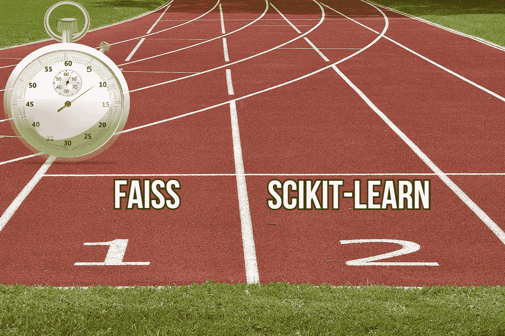
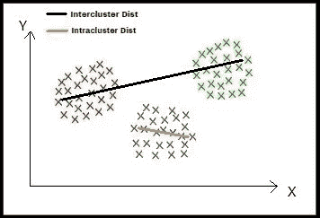
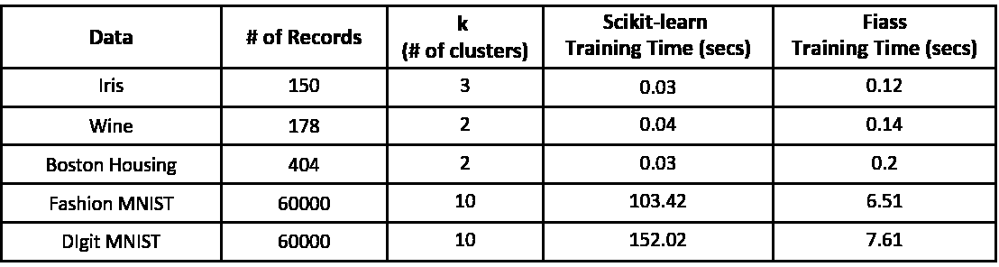

# 使用 Faiss 的 K 均值聚类速度提高了 20 倍

> 原文：<https://towardsdatascience.com/20x-times-faster-k-means-clustering-with-faiss-5e1681fa2654?source=collection_archive---------15----------------------->

## Scikit-learn 和 Faiss k-Means 实现之间的基准时间比较



图片由 [anncapictures](https://pixabay.com/users/anncapictures-1564471/?utm_source=link-attribution&amp;utm_medium=referral&amp;utm_campaign=image&amp;utm_content=2678544) 来自 [Pixabay](https://pixabay.com/?utm_source=link-attribution&amp;utm_medium=referral&amp;utm_campaign=image&amp;utm_content=2678544)

k-Means 聚类是一种基于质心的无监督聚类方法。该技术将数据点聚类成 k 个聚类或组，每个聚类或组具有几乎相等的数据点分布。每个聚类由其质心表示。

对于一组 n 个数据点，k-means 算法(也称为劳埃德算法)进行优化，以最小化簇内距离并最大化簇间距离。



(图片由作者提供)、簇间和簇内距离

> 阅读[这篇文章](/understanding-k-means-k-means-and-k-medoids-clustering-algorithms-ad9c9fbf47ca)，深入了解 k-Means、k-Means++和 k-Medoids 算法。

根据[维基百科](https://en.wikipedia.org/wiki/K-means_clustering#Complexity)，劳氏算法的运行时间为`**O(nkdi)**`，其中:

```
**n** is the number of instances in the dataset***d***is the dimensionality of the vector
**k** the number of clusters
**i** the number of iterations needed until convergence
```

Scikit-learn 软件包附带了 k-Means 聚类算法的实现，根据 scikit-learn 文档，实现 k-Means 算法的平均时间复杂度为`**O(nki)**` 。

在一般实践中，k-Means 聚类算法是最快的聚类算法之一。当涉及到集群时，大规模数据集 scikit-learn 包需要大量时间来实现算法。本文将讨论使用 Faiss 库实现 k-Means，并比较算法训练和预测的基准时间数。

# Faiss:

[Faiss](https://github.com/facebookresearch/faiss/wiki) 是由[脸书人工智能研究院](https://ai.facebook.com/)开发的开源 Python 包，用于高效的相似性搜索和密集向量的聚类。Fiass 可以为任何大小的数据集实现算法，包括那些无法放入 RAM 的数据集。Faiss 是用 C++编写的，带有完整的 Python 包装器。Faiss 还附带了评估模型性能和进一步调整模型的实现。

# Scikit-learn vs Faiss:

Scikit-learn 是一个流行的开源 Python 包，它实现了各种有监督和无监督的机器学习算法。必须需要调整两个模型的超参数来训练特定的模型。k-Means 聚类的超参数包括聚类的数量、重新开始的次数(每次都从其他初始猜测开始)和最大迭代次数。

k-Means 的核心包括搜索最近的邻居，特别是最近的质心，用于训练和预测。Faiss 提出了最近邻搜索算法的优化实现。这就是 Faiss 实现比 scikit-learn 相对更快的地方。Faiss 利用 GPU 支持和 C++实现来加快算法的实现。

## 使用 Scikit-learn 实现 Faiss:

(作者代码)

# 基准时间比较:

> 系统配置:英特尔 I7(第七代)，16GB 内存
> 
> 下面提到的所有数据集都可以从 [Kaggle](https://www.kaggle.com/) 下载。



(图片由作者提供)，用于训练 k 均值模型的基准时间比较

观察上面为各种数据集计算的时间数，scikit-learn k-Means 模型的性能优于 Faiss 的实现。对于大规模数据集，Faiss 是明显的赢家。k-Means 用 Faiss 实现几乎比 scikit-learn 的 ***快 20x 倍*** 。然而，如果使用 GPU 支持，对于大规模数据集，Faiss 的性能将进一步提高。

# 结论:

在本文中，我们讨论了使用 Faiss 包实现 k-Means 聚类算法。通过观察上面的基准时间比较，我们可以得出结论，对于大规模数据集，Faiss 的性能远远优于 scikit-learn 实现。与 scikit-learn 相比，k-Means 聚类模型的预测时间针对 Faiss 进行了优化。

> 阅读下面提到的文章，深入了解聚类算法:

*   [了解 K-Means、K-Means++和 K-Medoids 聚类算法](/understanding-k-means-k-means-and-k-medoids-clustering-algorithms-ad9c9fbf47ca)
*   [如何提高 k-Means 聚类算法的可解释性](/how-to-improve-the-interpretability-of-k-means-clustering-algorithm-3cf0fd0943ba)
*   [模糊 C 均值聚类——比 K 均值聚类好吗？](/fuzzy-c-means-clustering-is-it-better-than-k-means-clustering-448a0aba1ee7)

# 参考资料:

[1] Faiss 文档:[https://github.com/facebookresearch/faiss](https://github.com/facebookresearch/faiss)

> 感谢您的阅读