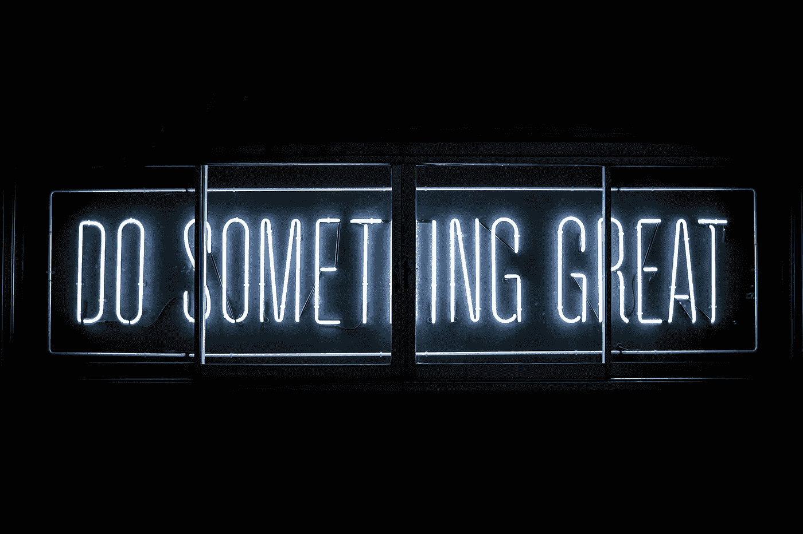

# 2021 年每位数据科学家的 21 条建议

> 原文：<https://towardsdatascience.com/21-tips-for-every-data-scientist-for-2021-3d4c28471a6c?source=collection_archive---------15----------------------->

## #19.学会如何设定期望值将对你在职业生涯中的“成功”程度产生很大影响。

克拉克·蒂布斯在 [Unsplash](https://unsplash.com/s/photos/coach?utm_source=unsplash&utm_medium=referral&utm_content=creditCopyText) 上拍摄的照片

在本文中，我将与您分享 21 条建议，这些建议是我从其他数据科学家那里学到的，也是我过去几年的亲身经历。

根据你的职业生涯有多深入，这些建议中的一些肯定会比其他的更能打动你。例如，“花些时间去发现和探索新的库和包”对于刚刚起步的人来说可能并不相关。

说到这里，让我们开始吧！

## 1.最简单的解决方案往往是最好的解决方案。

成为一名数据科学家并不意味着你必须用机器学习模型来解决每一个问题。如果一个案例中的查询足以完成工作，那就坚持下去。如果线性回归足以完成工作，就不要建立 10 层的神经网络。

一个更简单的解决方案有很多好处，包括更快的实现时间，更少的[技术债务](https://en.wikipedia.org/wiki/Technical_debt#:~:text=Technical%20debt%20(also%20known%20as,approach%20that%20would%20take%20longer.)，以及整体更容易维护。

## 2.专注地留出时间来定期发现和探索新的库和包。

坚持自己喜欢的东西很容易，但是新工具的出现是有原因的——它们的出现是为了填补现有的空白。通过花时间探索新的库和包，我发现了一些不可思议的工具，它们为我节省了大量时间。这里有几个例子:

[图片由 Gradio 拍摄(经许可)](https://www.gradio.app/hub/aliabid94/hub-titanic)

*   [**Gradio**](https://www.gradio.app/)**是一个 Python 包，它允许你用少至三行代码为你的机器学习模型构建和部署一个 web 应用。它的用途与 Streamlit 或 Flask 相同，但我发现它更快、更容易部署模型。**
*   ****Pandas Profiling** 是另一个自动进行探索性数据分析并将其合并成报告的包。当我处理较小的数据集时，我发现这非常有用。最好的部分是它只需要一行代码！**
*   **Kedro 是一个开发工作流工具，允许你创建可移植的 ML 管道。它将软件工程的最佳实践应用到您的代码中，使代码具有可重复性、模块化和良好的文档记录。**

## **3.高效并不意味着匆忙完成重要的步骤。**

**有些步骤根本不能操之过急。特别是，您应该花时间深入了解您试图解决的业务问题和您正在处理的数据。**

**在深入研究模型之前，您应该能够回答许多问题。你可以在这里查看。**

## **4.可以说，指标比模型本身更重要。**

**这一点在某种程度上与前一点联系在一起，因为你必须对你试图解决的问题有很好的理解。除了理解问题之外，还要弄清楚你试图优化什么指标，因为归根结底，机器学习是统计和优化的一个时髦词汇。**

**举个例子，我可以有一个 100%准确的模型，但是如果我试图开发一个异常检测模型，这是没有用的！**

## **5.你的工作将会和你交流的能力一样好。**

**人们会被他们不理解的事物吓倒，并倾向于回避它们。**

**您必须能够以非技术人员能够理解的方式交流技术术语和建模技术。如果你花时间建立了一个伟大的模型，你应该多花一点时间来有效地沟通，这样人们才能认可你的努力！**

## **6.学习基本面，尤其是统计学。**

**数据科学和机器学习本质上是统计学的现代版本。通过先学习统计学，在学习机器学习概念和算法时，你会轻松得多。**

***我创建了一个完整的 52 周课程，其中前 6 周专门用于统计，你可以在这里查看***。****

## ***7.了解你正在解决的问题的参数。***

***这可以用一个例子来最好地解释。***

***在我的一个项目中，我不得不开发一个模型来预测一个产品是否需要进行 RMA。最初，我认为我的输入是**所有产品**，这使得它几乎像一个异常检测问题。***

***只有在了解了业务需求以及如何使用模型之后，我才意识到我的模型的输入是所有被**发出 RMA** 的产品(客户发送了一封关于产品问题的电子邮件)。这使得数据更加平衡，节省了我很多时间。***

## ***8.不要低估 SQL 的力量。***

***SQL 是通用的数据语言——它可以说是任何类型的数据相关职业中最重要的学习技能，无论你是数据科学家、数据工程师、数据分析师还是商业分析师，不胜枚举。***

***SQL 不仅对于构建管道、提取数据和处理数据非常重要，而且现在您可以使用 SQL 查询来创建机器学习模型。 [BigQuery ML](https://cloud.google.com/bigquery-ml/docs/introduction) 允许你这样做。***

## ***9.像团队运动一样对待数据科学。***

***作为一名数据科学家，最大的好处之一就是你被赋予了很大的自主权。但是，如果你不愿意向他人寻求建议、帮助和反馈，这很容易导致失败。***

***尽管自主程度很高，但数据科学是一项团队运动。你必须接受来自几个利益相关者的建议和反馈，包括终端用户、领域专家、数据工程师等等。***

## ***10.不要浪费你的时间试图记住一切。***

***有太多的东西需要记住。另外，这是对时间的极大浪费。你最好练习如何用谷歌搜索你的问题，这样你就能得到你需要的答案。***

***此外，创建一个谷歌表来保存你经常会返回的真正有用的链接。对我来说，我喜欢包含指向备忘单、速成课程和我经常搜索的问题的链接(例如电子邮件的正则表达式代码)。***

# ***11.快速部署，快速迭代，不断获得反馈。***

***重要的是不断地与其他利益相关者交流，让他们了解你的思维过程，你对模型的任何假设，并获得反馈。否则，您可能最终得到一个不能解决当前问题的模型。***

***就我个人而言，当与利益相关者，尤其是非编码人员分享时，我使用 [**Gradio**](https://www.gradio.app/) 为我的模型的每次迭代创建 web UIs。***

***我发现 Gradio 非常有用，原因如下:***

*   ***它允许我交互式地测试模型的不同输入。***
*   ***它允许我从领域用户和领域专家(他们可能不是编码人员)那里得到反馈***
*   ***它需要 3 行代码来实现，并且可以通过公共链接轻松分发。***

## ***12.全程观察一个项目。您在创建模型的同时，也同样有责任实现模型。***

***作为一名数据科学家，您可以将自己杂乱无章的 Jupyter 笔记本交给工程团队实施的日子已经一去不复返了。如今，数据科学家更像是数据科学家砍工程师砍产品经理。***

## ***13.一切都是推销。***

***作为一名数据科学家，你总是在推销自己，无论是推销一个新想法，还是推销你已经建立的模型。类似于第 5 点，你必须能够传达来自你承担的每个想法、每个模型和每个项目的商业价值。***

## ***14.建立一个可持续的学习时间表。***

***如果你要学习，就用正确的方法。你可能听说过[遗忘曲线](https://uwaterloo.ca/campus-wellness/curve-forgetting)。简而言之，如果您希望能够保留新信息，您需要在学习数据科学和实践所学内容方面保持一致。***

***对自己诚实，制定一个你能坚持的时间表。但是一致性是关键。***

## ***15.学习如何使用 Git 和 GitHub。***

***学习软件工程最佳实践将大有裨益。版本控制尤其是最重要的实践之一，因为每个公司都使用它！***

***我会查看这两个资源:***

*   ***[Codecademy——学习 Git](https://www.codecademy.com/learn/learn-git)***
*   ***[学习 Git 分支](https://learngitbranching.js.org/)***

## ***16.边做边学。***

***通过*做*而不仅仅是*学习，你会学到更多的知识和技能。*类似于你在学校学了一个新概念后怎么做作业，需要不断地把学到的东西运用到项目中。***

***[*这里有一些让你开始的项目想法*](/12-data-science-projects-for-12-days-of-christmas-aff693f5ed2b) 。***

## ***17.随时了解发生的事情。***

***与探索新工具和库相关的一点是，跟上数据科学的新发展非常重要，这样您就可以尽可能地保持您的技能和工具是最新的。***

***我喜欢通过阅读出版物、观看 YouTube 视频和阅读公司博客来做到这一点，比如 Airbnb、优步、谷歌和脸书。***

## ***18.学会运用发散和收敛思维。***

***在数据科学中，这是一种非常有用的技术，这样你就可以确保你已经用尽了所有的选择。发散思维仅仅意味着探索一个给定问题的多个解决方案，而聚合思维意味着将你的选择缩小到一个解决方案。这在执行 EDA 和选择要使用的模型/算法时特别有用。***

****你可以在这里* *了解更多* [*。*](https://simplystatistics.org/2018/09/14/divergent-and-convergent-phases-of-data-analysis/)***

## ***19.开始职业生涯博士。***

***这是我直到我的朋友乌达拉写下它时才听说的事情。它本质上是你职业生涯的日志或日记。不像简历是给雇主看的，职业文档是给你回顾和反思的。***

***如果想了解更多，可以查看[这里](https://udaraw.com/career-docs/)！***

## ***20.学会如何设定期望值将对你在职业生涯中的“成功”程度产生很大影响。***

> ***少承诺。交付更多。***

***这对于数据科学家来说尤其重要，因为数据科学家可以根据自己的意愿花尽可能多的时间来创建模型。数据科学家可以使用 auto ML 库构建一个普通的模型，或者构建一个近乎完美的模型，但需要几个月才能完成。***

***不管你选择什么，重要的是你要管理期望，这样利益相关者才不会失望。特别是，这意味着根据时间表和模型的性能来管理期望。***

## ***21.找一个你尊敬的愿意帮助你的导师。***

***在我的职业生涯中，发生在我身上的最伟大的事情之一就是找到了一位知识渊博的导师，他也非常关心我的成功。***

***我想说，因为他，我学到了比平时多一倍的东西。***

# ***感谢阅读！***

***我希望你能从中吸取一些教训！我真的相信这些建议在我的职业生涯中对我有很大的帮助，我相信对你也会有同样的帮助。***

***一如既往，我祝你学习一切顺利:)***

*****不确定接下来该读什么？我为你挑选了另一篇文章:*****

*** [## 2021 年你应该知道的所有机器学习算法

### 最流行的机器学习模型的直观解释

towardsdatascience.com](/all-machine-learning-algorithms-you-should-know-in-2021-2e357dd494c7) 

**又一个！**

 [## 2021 年成为数据科学家的完整 52 周课程

### 连续 52 周，每周学点东西！

towardsdatascience.com](/a-complete-52-week-curriculum-to-become-a-data-scientist-in-2021-2b5fc77bd160) 

# 特伦斯·申

*   ***如果你喜欢这个，*** [***跟我上媒***](https://medium.com/@terenceshin) ***了解更多***
*   ***对通敌感兴趣？让我们连线上***[***LinkedIn***](https://www.linkedin.com/in/terenceshin/)
*   ***报名我的邮箱列表*** [***这里***](https://forms.gle/tprRyQxDC5UjhXpN6) ***！******