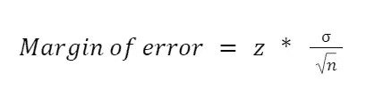
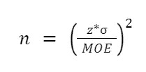
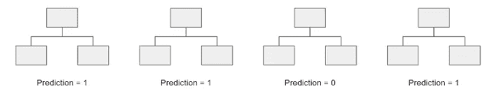
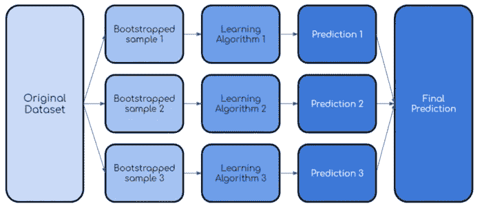
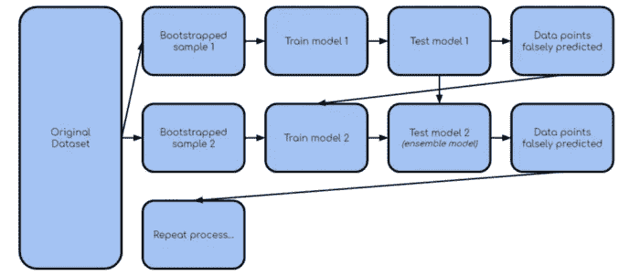

# 2022 年的 22 个新数据科学面试问题

> 原文：<https://towardsdatascience.com/22-new-data-science-interview-questions-for-2022-964c687f735b?source=collection_archive---------9----------------------->

## 来自谷歌、脸书和网飞等顶级科技公司的问题


莫里茨·克纳林格在 [Unsplash](https://unsplash.com/s/photos/2022?utm_source=unsplash&utm_medium=referral&utm_content=creditCopyText) 上的照片

# 介绍

> **请务必点击** [**订阅此处**](https://terenceshin.medium.com/membership) **千万不要错过另一篇关于数据科学指南、技巧和提示、生活经验等的文章！**

在本文中，我将与您分享 22 个新的数据科学面试问题，这些问题是在顶级科技公司中提出的，如谷歌、网飞、脸书和亚马逊。

不出所料，你会注意到大多数问题都与统计学、机器学习和案例研究有关。

就这样，我希望你喜欢它，节日快乐！:)

## 1.在什么情况下你会考虑中位数的平均值？

当分布或多或少对称时，平均值比中值更好计算，因为它使用所有数据点，所以在*完整性的意义上更好。*同样，在不存在异常值的情况下，平均值也是比中位数更好的表示方法。

## 2.平均值的标准误差是多少？


标准误差的方程式

平均值的标准误差(SE)就是样本平均值的标准偏差。它是对样本平均值与总体平均值之间差异的度量。

## 3.一部电梯四个人，一栋楼四层。每个人在不同楼层下车的概率是多少？

如果四个人都是底楼出发，还有三层，那么通过鸽洞原理，每个人在不同楼层下车的概率是 0，除非有一个人在底楼下车(不上)。

那样的话，概率是 4！/(4⁴).一般来说，这个问题可以认为是从 n=4 的多项式分布中抽取计数，离散分布参数= (1/4，1/4，1/4，1/4)。设 x0、x1、x2、x3 分别为 0 至 3 层的下车人数。且 x_i >=0，x_i 之和= 4(因为有 4 个人)。所以 Pr(x) = (n！/(x0！x1！x2！x3！)p0^x0 … p3^x3.代入适当的值，你得到 4！/(4⁴).

> **请务必点击** [**订阅此处**](https://terenceshin.medium.com/membership) **千万不要错过另一篇关于数据科学指南、技巧和提示、生活经验等的文章！**

## 4A。我有一副牌，随便拿一张。你猜对的概率是多少？

因为一副牌里有 52 张牌，所以赔率是 1/52。

## 4B。继续:那我给你两个问题，你只能问一个:a——这张牌是红色的吗 b——这张牌是 10 张黑桃吗你会问哪一张，为什么？

A.A 的赔率是，但黑桃 10 的赔率是 1.52。

## 6.解释一个非正态的概率分布以及如何应用它。

另一种分布是以λ为参数的泊松分布，它代表到达率。当您想要对给定时间范围内“到达”的单位数量的概率进行建模时，可以使用这种分布。

例如，如果您希望对工作日 9-5 点进入洗车场的汽车数量进行建模，以便估计洗车场在一个工作周内的平均收入，则可以使用泊松分布。

## 7.让不公平的硬币变得公平。

不公平硬币是指正面对反面的概率不是 50-50 的硬币。例如，它可能是 70-30 的赔率。在这种情况下，为了让硬币公平，你可以抛硬币两次，并在两个选项中的一个上下注:硬币是正面朝上然后反面朝上还是反面朝上然后正面朝上。如果两次抛硬币都是正面或反面，那么你要重新抛硬币。

## 8.如果两个预测因子高度相关，对逻辑回归中的系数有什么影响？

当两个预测值高度相关时，这被称为[多重共线性](/everything-you-need-to-know-about-multicollinearity-2f21f082d6dc)。当多重共线性存在时，会产生多种后果:

1.  第一，如果其中一个预测值只发生一点点变化，回归函数的系数将会非常敏感，换句话说，它非常不稳定。
2.  第二，系数的方差将被夸大，使得难以检测统计显著性，这意味着 F 统计量可能是显著的，但所有单个 t 统计量都不是显著的。

## 9.系数的置信区间是多少？

系数置信区间为我们提供了一个范围，每个回归系数的置信区间为 100*(1-a)%。

## 10.线性回归的误差假设是什么？

线性回归中的误差，也称为残差，假设如下:

1.  **线性假设**:误差期望值的平均值为零。
2.  **恒定方差假设**:残差具有恒定方差
3.  **独立性假设**:残差相互独立
4.  最后，残差是正态分布的。

> **请务必点击** [**订阅此处**](https://terenceshin.medium.com/membership) **千万不要错过另一篇关于数据科学指南、技巧和提示、生活经验等的文章！**

## 11.对于样本大小 n，误差幅度为 3。我们还需要多少样本才能使误差幅度达到 0.3？



获得误差幅度(MOE)的公式如上所示。可以重写该等式来求解样本大小 n:



Sub MOE = 0.3 以及相应的 z 得分和标准偏差，以获得所需的样本大小，从而实现 0.3 的 MOE。

## 12.实验结果:一组中有 5%的人点击次数更多。这样的结果好吗？

无法回答此问题，因为没有提供足够的信息。除了结果之外，结果还取决于显著性水平，这是在进行实验之前确定的。

## 13.*你注意到点击脸书活动搜索结果的用户数量每周增加 10%。你会如何调查？你怎么决定这是好事还是坏事？*

因为这个问题可以用很多方法来回答，而且坦率地说可能要花很长时间来回答，所以我将解释我认为要触及的两个要点。但即使在触及这两点之前，在实际的面试中，你也应该调查并问更多的问题，试图从面试官那里获得更多的信息。例如，“这种增长持续了多长时间？”或者“在此之前有什么重大事件发生吗？”

一旦你提出了你的问题，你应该有一个系统的方法来调查这 10%的增长。在咨询中，有一种叫做**互斥集体穷举(MECE)框架**的东西，你可以用它来组织你的想法，彻底解决问题。

第二件要考虑的事情是定义什么是“好事”和“坏事”。“好”是指更多的参与度还是其他？在给出最终答案之前，请确保您对这些进行了定义。

*查看* [*本文*](https://riczh106.medium.com/interview-prep-1-facebook-event-clicks-increased-by-10-how-would-you-investigate-50d4266793e4) *查看示例答案。*

## 14.*事件团队希望提升事件的排名，以便它们在搜索中显示得更靠前。你如何判断这是不是一个好主意？*

您可以执行 A/B 测试，以查看该变量是否会导致指定主要指标的显著差异。在这种情况下，主要指标可能是点击事件的用户数量*。*

> **请务必点击** [**订阅此处**](https://terenceshin.medium.com/membership) **千万不要错过另一篇关于数据科学指南、技巧和提示、生活经验等的文章！**

## 15.如何用 Python 写一个 t-test？

使用 scipy 库，您可以编写以下代码:

```
import pandas as pd
import scipy.stats as statsstats.ttest_ind(df['result'][df['category'] == 'control'],
                df['result'][df['category'] == 'treatment'])
```

同样，[如果您想从头开始编写 t-test，请参见这里的](https://machinelearningmastery.com/how-to-code-the-students-t-test-from-scratch-in-python/)。

## 16.*给你一天的大样本量和显著的测试结果，你会结束实验吗？*

这最终取决于在构建实验时收集的样本大小是否等于或大于预定的所需样本大小。如果它不是很大，那么早点结束这个实验会导致声称有意义，而实际上没有任何真正的意义。这就是所谓的*重复显著性检验错误。*

## 17.解释随机森林，讨论其利弊



作者创建的图像

本质上，随机森林算法是一种集成学习算法，它通过使用多个决策树而不是一个决策树来进行预测。通过这样做，它能够基于“多数获胜”系统做出决策，将每棵决策树视为一个独立的投票者。

这样做的好处是，它比决策树更准确，因为它不容易出现一棵树本身会出现的错误。因此，它也使它更少偏差，并减少模型的可变性。

这种模型的缺点是，它不能直观地理解模型如何得到输出，使它看起来像一个“黑盒”模型。

## 18.为什么 L1 可以把重量缩小到 0，而 L2 不行？

由于 L2 最小化了重量的平方，它更关心减少大重量而不是小重量。这意味着它很少专注于将小权重推到零。

另一方面，L1 在减少大的或小的权重之间没有偏好，因为它最小化了权重绝对值的总和。所以不管是把一个权重从 1000 往下推 999 还是 1 往下推 0 都是一样的。

## 19.装袋和助推有什么区别？

**装袋**是用自举样本对同一模型进行多次迭代训练的过程。



作者创建的图像

**Boosting** 是 bagging 的更高级版本，其中每个模型都是按顺序构建的，迭代前一个模型，并从以前的错误中学习。



作者创建的图像

## 20.AUC 是用来做什么的？

AUC 或曲线下面积是一种评估指标，用于评估分类器区分不同类别的能力，越高越好。

## 21.你会如何向一个非技术人员解释 p 值？

本质上，p 值告诉我们一个给定结果可能偶然发生的概率。例如，p 值为 0.05 相当于说“我们在 5%的时间里会偶然看到这种情况”。

## 22.与对称的正态钟形相比，右偏斜和左偏斜分布的平均值和中值在哪里？

对于对称的正态分布，平均值等于中位数。

对于右偏斜，平均值大于中值。

对于左偏斜，平均值小于中值。

# 感谢阅读！

> ***务必*** [***订阅此处***](https://terenceshin.medium.com/membership) ***千万不要错过另一篇关于数据科学指南、诀窍和技巧、生活经验等的文章！***

不确定接下来要读什么？我为你挑选了另一篇文章:

</all-machine-learning-algorithms-you-should-know-in-2022-db5b4ccdf32f>  

**还有一个:**

</the-10-best-data-visualizations-of-2021-fec4c5cf6cdb>  

## -特伦斯·申

*   ***如果您喜欢这个，*** [***订阅我的媒介***](https://terenceshin.medium.com/membership) ***获取独家内容！***
*   ***同样，你也可以*** [***关注我上媒***](https://medium.com/@terenceshin)
*   [***报名我的个人简讯***](https://terenceshin.substack.com/embed)
*   ***跟我上***[***LinkedIn***](https://www.linkedin.com/in/terenceshin/)***其他内容***