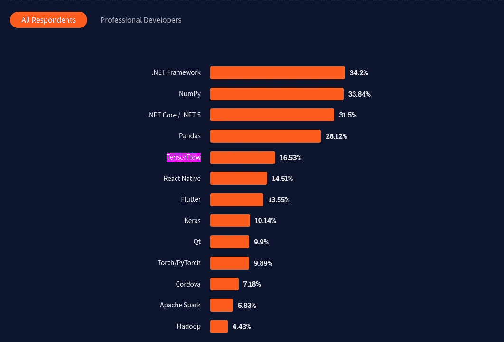
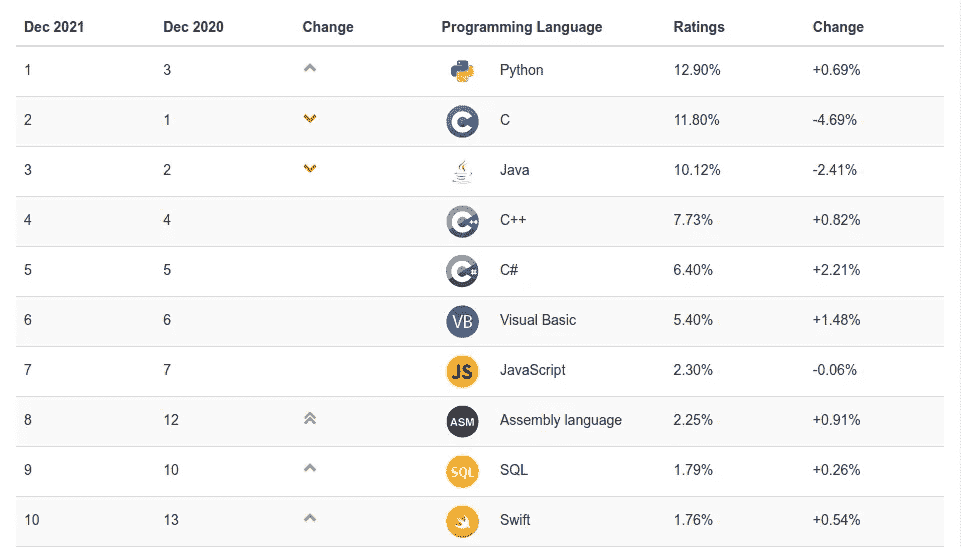
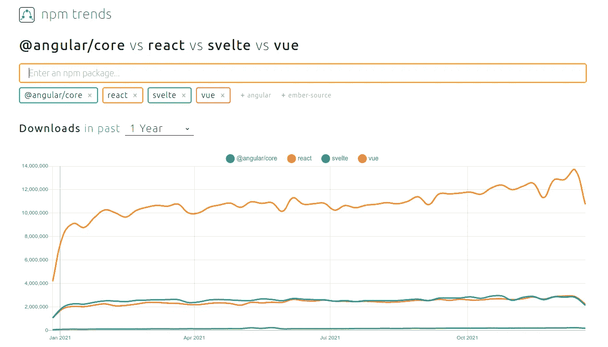
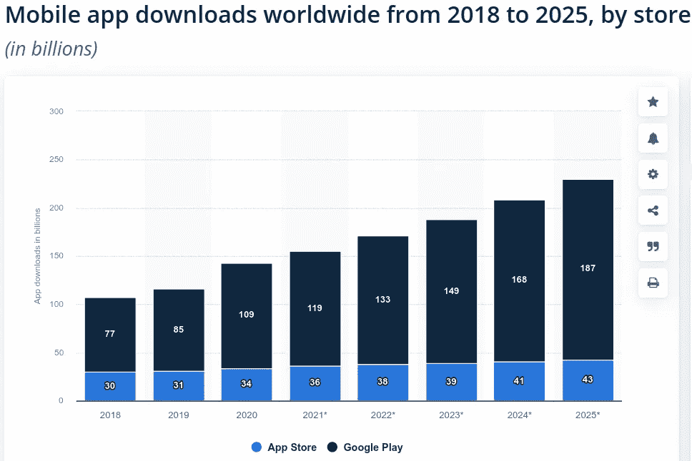

# 关于 2022 年软件发展趋势的 22 个预测

> 原文：<https://towardsdatascience.com/22-predictions-about-the-software-development-trends-in-2022-fcc82c263788?source=collection_archive---------0----------------------->

## 云、容器、编程、数据库、人工智能、机器学习、DevOps、软件架构、软件开发、Web、App、批处理、流式、低代码、无代码、API

照片由 [Unsplash](https://unsplash.com/@heyerlein?utm_source=unsplash&utm_medium=referral&utm_content=creditCopyText) 上的 [h heyerlein](https://unsplash.com/@heyerlein?utm_source=unsplash&utm_medium=referral&utm_content=creditCopyText) 拍摄

再过几天，我们就要告别 2021 年，迎来新的一年: **2022** 。在灾难性的疫情袭击 2020 年之后，2021 年是人类恢复和反击的一年。由于技术进步，各国能够大规模接种疫苗。对于软件开发和 IT 行业来说，2021 年是不出所料的重要一年。

2022 年，冠状病毒突变和高科技疫苗研究之间将出现一场进化军备竞赛。对于软件开发行业来说，当前的数字化趋势将随着许多变化、创新和现有技术的新用途而继续。

预测未来是一项具有挑战性的任务。像过去两年一样，我在这里预测 2022 年软件发展趋势中最重要的趋势。

# 1.集中式基础架构:云优先是新的标准

就像西方世界中取代当地商店的少数巨型大型超市一样，公共云将继续取代区域数据中心。在未来几年，公共云也将成为企业、政府和创业公司的首选基础设施。公共云现在是数字创新的温床，这一趋势将在 2022 年继续。公共云在安全民主化、区块链以及以可访问的方式为客户带来许多创新方面也发挥着重要作用。

Gartner 预测 2022 年公共云收入将增长 16%:

 [## Gartner 表示，云将成为新数字体验的核心

### Gartner 分析师 Milind Govekar 在本周的#GartnerSYM EMEA 会议上表示，没有业务…

www.gartner.com](https://www.gartner.com/en/newsroom/press-releases/2021-11-10-gartner-says-cloud-will-be-the-centerpiece-of-new-digital-experiences) 

所以，如果你是一家数字公司的决策者，是时候认真对待云了。如果你是一名工程师，可以通过创建免费账户或参加 MOOC 课程来开始学习云计算。

# 2.分散式基础设施:边缘云

与我们希望将存储、计算能力和 AI/ML 放在一个中心位置(可用性区域)的公共云不同，边缘计算将存储、计算能力和 AI/ML 带到了客户附近。低延迟场景(游戏)、较差的网络带宽(离岸站点)、无网络、监管要求、实时用例(联网车辆)、智能和强大的设备(物联网)是需要边缘计算的场景。

随着 **5G、Web 3.0** 和其他技术创新的兴起，边缘计算将在 2022 年及以后继续被广泛采用。此外，零售商将在未来几年大规模采用边缘计算。

像 AWS、Azure 和 GCP 这样的公共云提供商也通过提供许多边缘计算服务而处于领先地位: [**AWS 雪族**](https://aws.amazon.com/snow/) ， [**AWS 物联网 Greengrass**](https://aws.amazon.com/greengrass/) **，**[**Azure Stack Edge**](https://azure.microsoft.com/en-us/products/azure-stack/edge/)**，**[**Azure Edge Zone**](https://azure.microsoft.com/en-us/solutions/low-latency-edge-computing/#edge-zones)**，** [**Google 分布式云**](https://cloud.google.com/distributed-cloud)

一项新的举措， [**状态的边缘**](https://stateoftheedge.com/) ，是为了规范边缘计算。

# 3.公共云:多云将获得更多动力

采用公共云的一个主要问题是供应商锁定。一旦您将基础架构、存储和计算转移到公共云提供商，您就被供应商锁定了。许多企业试图明智地使用多个供应商来避免供应商锁定。不幸的是，它只锁定了有多个供应商的企业，而不是一个供应商。如果您无法在另一个公共云中使用一个公共云(例如，CosmosDB、AWS S3、BigTable ),将始终存在供应商锁定。

幸运的是，提供与广泛的公共云服务 API 兼容的服务是一个相反的趋势。 **MinIO** (与 S3 兼容) **Aviatrix** (云原生网络) **Volterra** (分布式云服务) **LightOS** (云原生存储)是致力于提供云中立性的众多服务中的一部分。

此外，谷歌正在努力将他们的流行服务(大查询)引入其他公共云(AWS，Azure)。

# 4.容器:Kubernetes 将进入后台，而 Docker 将反弹

集装箱化是现代信息产业的关键技术。Kubernetes 在普及和民主化集装箱化方面发挥了巨大作用。由于巨大的努力、精心的设计和实施，Kubernetes 现在是一项坚如磐石的技术。它扮演的角色与 Linux 在服务器领域扮演的角色相同。由于其高瞻远瞩的设计(操作、体积)，Kubernetes 可以在许多用例中使用，而不会引入突破性的变化。

随着 Kubernetes 的成熟，未来几年 Kubernetes 的吸引力将会减少。不要误解我，Kubernetes 将是现代软件开发的引擎。但是我们将会看到更多关于 Kubernetes 的新的采用和使用案例，而 Kubernetes 本身由于其成熟性将会缓慢移动。

像 Kubernetes 一样，码头工人也在集装箱化中发挥了举足轻重的作用。不幸的是，该公司在其鼎盛时期努力将 Docker 货币化。Docker 最近宣布了从 2022 年开始的新订阅模式:

 [## Docker 订阅概述

### 2021 年 8 月 31 日，我们宣布对产品订阅进行更新和扩展，以提高工作效率…

docs.docker.com](https://docs.docker.com/subscription/) 

其定价模式实惠。考虑到它对现代云原生开发的贡献，我祝愿 Docker 的新订阅模式取得成功。

# 5.网络安全:每个人都会认真对待安全问题

对于初创公司或中型公司来说，网络安全就像房间里的大象。他们可以看到网络安全的需求，但由于缺乏资源而无法正确实施。只有大型企业才能负担得起专门的安全团队。

公共云供应商最显著的优势之一是他们实现了网络安全的民主化。现在，利用公共云服务，初创公司或中型公司可以轻松实现高度安全的应用。

公共云安全的一个缺点是，如果它受到损害，那么数百万公司将受到影响。2021 年，公共云存在一些引人注目的安全漏洞:

 [## 微软 Azure 云漏洞是“你能想象的最糟糕的”

### 微软 Azure Cosmos DB 数据库产品中的一个缺陷让 3300 多名 Azure 客户无法完成…

www.theverge.com](https://www.theverge.com/2021/8/27/22644161/microsoft-azure-database-vulnerabilty-chaosdb) 

2022 年，公有云和 Linux 在安全方面会更加努力。

关于安全性的另一个问题是当前的开源开发模型。一个开发人员经常在业余时间开发一个重要的核心模块/库。不幸的是，如果这个模块/库被破坏，那么世界上几乎所有的公司都会受到影响。log4j 漏洞就是这样一个备受关注的问题，它将影响全球近一半的 IT 公司:

 [## 为什么你们 IT 人这么惨？Log4j2itis

### 除了节日祝酒辞，你是否听到服务器房间里传来尖叫声和呻吟声？您的 IT 人员是否悲痛欲绝…

www.computerworld.com](https://www.computerworld.com/article/3645709/why-are-your-it-people-so-miserable-log4j2itis.html) 

大公司是时候重新思考当前的开源模式了，在这种模式下，开发者在没有任何经济利益和支持的情况下维护一个核心软件。

# 6.区块链:终于，生命开始于加密货币之外

区块链经常与加密货币联系在一起。每次出现关于加密货币的伪造，区块链技术都会受到批评。**区块链(分布式账本)**是 21 世纪最具颠覆性的技术之一。加密货币是其最知名的用例，但区块链不仅仅是加密货币。区块链可以改变我们行业的很多领域，影响我们的日常生活。

2021 年，我们已经看到了区块链的一个新的非常受欢迎的用例:NFT(不可替代的令牌)。目前，NFT 主要用于数字艺术。2022 年，我们将看到 NFT 将用于其他用例。

人们现在开始认真对待区块链，2022 年区块链技术会有一笔巨大的支出:

 [## 到 2022 年，区块链解决方案将增长 75 %: IDC

### 国际数据公司发布了其全球半年度区块链支出指南的新更新，其中它…

www.investopedia.com](https://www.investopedia.com/news/blockchain-solutions-grow-75-through-2022-idc/) 

区块链经常被诟病大量消耗能源。许多区块链公司现在正计划从高能耗的“工作证明”模式转向节能的“利益证明”模式。Etherium 是一种流行且广泛使用的区块链，将于 2022 年转向绿色“利益证明”模式:

 [## 以太坊将如何在 2022 年转型

### 随着 2021 年接近尾声，2022 年有望成为合并之年，我想更深入地探讨五个…

www.coindesk.com](https://www.coindesk.com/layer2/2021/12/29/how-ethereum-will-be-transformed-in-2022/) 

# 7.机器学习:自动化和无代码人工智能将使机器学习民主化

机器学习(ML)是另一项近年来获得巨大成功和采用的颠覆性技术。然而，根据其需求，机器学习专家大量短缺。此外，许多公司希望以有限的方式采用机器学习，而不雇佣全职、昂贵的机器学习专家。

**AutoML** (自动机器学习)是在没有机器学习专家的情况下，以有限的方式自动使用机器学习的新举措。对于大多数用例，你需要一个机器学习专家。但是对于某些用例，你可以使用 AutoML 来增强机器学习专家，或者在没有任何机器学习专家的情况下使用 AutoML。在某种意义上，它类似于低代码/无代码计划。AutoML 在 2021 年获得了巨大的牵引力。

在 2022 年，我们将看到 AutoML 的更多采用和创新，因为 AutoML 有着广阔的市场前景:

 [## P&S 情报称，到 2030 年，汽车市场收入将超过 148.308 亿美元

### 纽约 2021 年 12 月 6 日电/美通社/--从 2020 年的 3.462 亿美元开始，自动化机器学习市场预计…

www.prnewswire.com](https://www.prnewswire.com/news-releases/automl-market-revenue-to-surpass-14-830-8-million-by-2030--says-ps-intelligence-301437697.html) 

AutoML 是更大的**无代码人工智能**趋势的一个子集。2022 年，无代码人工智能也将迎来普及和采用的高潮。

# 8.人工智能:狭义人工智能将被广泛采用

与机器学习一样，深度学习(AI)是另一项颠覆性技术，在过去十年中获得了大量采用和快速增长。在 2022 年及以后，人工智能将继续看到更多的采用、资助和创新。

人工智能的圣杯之一是寻找“一般智能”，人工智能可以像人类一样聪明(或更聪明)。我们离实现普遍智能还很远。但人工智能将更多地用于“N **arrow 人工智能”**中，人工智能代理将在特定(狭窄)领域协助/增强人类。2022 年，我们将在许多**非关键用例(如呼叫中心、IT)** 中看到更多狭义人工智能的采用，其中人工智能代理将使用狭义人工智能来协助人类。

# 9.深度学习库:张量流将继续统治

有许多人工智能库，但有两个脱颖而出:谷歌的 TensorFlow 和脸书的 PyTorch。

TensorFlow 在 2.0 版本中进行了自我改进，引入了动态图形、python 友好性和许多其他变化。它还提供 **Tensorflow.js** 在浏览器中使用 AI 库。Tensorflow 的另一项创新是 **Tensorflow Lite** ，它提供在移动和网络上部署 Tensorflow。Tensorflow 还发布了 **Tensorflow Extended (TFX)，这是一个用于部署生产 ML 管道的**端到端平台。

PyTorch 是另一个占主导地位的 AI 库，它将动态图和 Python 作为一等公民引入。它对开发人员也更友好。它还发布了 PyTorch Mobile 来在 Android/iOS 设备上使用 PyTorch。它通过 **PyTorch Profiler** 调试大规模人工智能模型，为开发者提供了更多的友好性。

TensorFlow 仍然是最受欢迎的 AI 库:

来源:[堆栈溢出开发者调查，2021 年](https://insights.stackoverflow.com/survey/2021#most-popular-technologies-misc-tech)

2022 年，Tensorflow 将继续成为占主导地位的人工智能库，因为它具有更好的可视化和大规模采用。

# 10.数据库:多模式和多用途数据库正在兴起

在过去几年中，我们看到了使用适合特定用例的特殊数据库的趋势:

*   **RDBMS** 用于结构化数据的事务用例
*   **宽列数据库**用于低延迟的分布式数据库
*   **分布式缓存的键值存储**
*   **图形数据库**用于极端关系数据
*   **文档数据库**用于半结构化数据的交易用例
*   **搜索引擎**用于全文和高级搜索(例如基于位置的搜索)。
*   **分布式 SQL** 用于具有事务保证的低延迟分布式数据库。
*   **用于数据仓库和数据分析的 OLAP 数据库**

你可以看看我的帖子，找到适合你用例的数据库:

 [## 2021 年将使用的 10 大数据库

### MySQL，Oracle，PostgreSQL，微软 SQL Server，MongoDB，Redis，Elasticsearch，Cassandra，MariaDB，IBM Db2

towardsdatascience.com](/top-10-databases-to-use-in-2021-d7e6a85402ba) 

这种方法的一个缺点是，我们经常需要一个应用程序有多个数据库。有一个新的趋势，每个数据库将提供不止一个模型，并服务于不止一个用例。 **PostgreSQL** (多模型) **Azure CosmosDB** (多模型多用途) **SingleStore** (OLAP 和 OLTP)就是这些数据库的前身。同样在 2022 年，我们将看到提供多模型和多用途的其他数据库。

# 11.数据密集型计算:Spark vs .公共云服务

**Apache Spark** 几乎已经取代 Hadoop 生态系统成为默认的数据密集型计算框架。Spark 还使用相同的 API 提供接近实时的流处理。

近年来， **Apache Beam** 获得了很大的关注，因为它提供了一个统一的编程模型来定义和执行数据处理管道:批处理和流。Google 的云数据流是一个强大的服务，实现了 Apache Beam。另外，Azure 和 AWS 提供批处理服务。

如果你想成为云不可知论者，你应该使用 Spark 或者云数据流(GCP)。

# 12.实时流媒体:这是 Flink 对公共云服务

虽然近实时流足以满足 90%的使用案例，但在一些使用案例(欺诈检测、异常检测、基于规则的警报、实时数据的即席分析)中，您将需要实时流。

在实时流媒体方面，Apache Flink 无疑是市场的领导者。它还支持 Apache Beam API，并提供厂商中立的解决方案来处理实时流数据。

如果你想避免供应商锁定，你应该在公共云特定技术上使用 Flink。此外，Flink 比公共云供应商提供的类似服务更强大。

# 13.现代智能可观测性

几年前，可观察性只对大型企业至关重要。然而，随着云原生开发和微服务架构的快速兴起，可观测性对于现代软件开发至关重要。除了传统的可观察性(日志记录、监控、跟踪)，我们还需要 Kubernetes 集群的遥测和拓扑数据。此外，我们将看到使用人工智能和时间序列数据库来开发智能可观测性平台的趋势。智能的云原生可观测性将在 2022 年及以后继续增长。

# 14.快速应用程序开发:低代码/无代码(LCNC)将继续蓬勃发展

低代码/无代码(LCNC)计划旨在降低在没有开发人员(或少量开发人员)的情况下开发 Web/移动应用程序的障碍。在未来几年，我们仍然需要开发人员来开发应用程序。但是也有许多低代码/无代码框架/工具可以显著加快应用程序开发的用例。

同样在 2022 年，我们将看到越来越多的 LCNC 用例:

*   web/移动应用程序开发
*   网站和登录页面
*   使用对话流的智能聊天机器人
*   电子商务
*   机器学习
*   人工智能(视频、音频、图像)
*   工作流程管理
*   使用 RPA 的流程自动化

# 15.软件架构:企业的微服务和微前端

我们目前有三个后端应用程序开发的选项:(模块化)整体、微服务和无服务器。它们都有自己的优点和缺点，在特定的用例中表现出色，而在其他用例中则表现不佳。微服务支持应用程序开发，其中多个团队在特定的应用程序上工作。此外，微服务非常适合云原生开发，因为较高的运营成本可以卸载到代码复杂性较低的云上。因此，对于企业而言，微服务将是 2022 年的主流架构。

如果你想了解设计微服务架构的最佳实践，你可以阅读我的博客:

 [## 微服务架构及其 10 个最重要的设计模式

### 微服务架构、每个微服务的数据库、事件源、CQRS、Saga、BFF、API 网关、扼杀者、电路…

towardsdatascience.com](/microservice-architecture-and-its-10-most-important-design-patterns-824952d7fa41) 

我们目前有两种前端应用程序开发的选择:整体式和微型前端。我们经常低估前端应用程序的复杂性，因为大多数架构师来自后端开发。但是前端独石和后端独石一样糟糕。因此，对于企业前端开发，微前端将是 2022 年的首选架构。好消息是所有流行的 JavaScript 前端框架都支持微前端。

# 16.软件开发:人工智能将协助开发者和质量保证

我认为人工智能是人类的助手或助手:人工智能可以帮助单调乏味、可预测、重复、困难的任务，人类可以专注于更发人深省的智能任务。在软件开发中，我们还必须做许多枯燥、可预测和重复的任务。AI 可以使用 **GPT-3 和其他 NLP 库**来自动化这些任务。人工智能已经被用于自动化测试。

几个人工智能驱动的助手也可以自动为开发者生成源代码: **Tabnine，GitHub Copilot，codata**。尽管它们处于协助软件开发的早期阶段，还不太成熟，但我预计这些人工智能驱动的代码助手将在 2022 年成熟，这样我们就可以更快地开发和交付。

# 17.编程(主流):Python 将引领潮流

近年来，我们经历了作为通用编程语言的 **Python** 的快速崛起。在流行的编程语言排名网站 TIOBE 中，最后 Python 独占鳌头，是目前排名第一的编程语言:

来源: [TIOBE](https://www.tiobe.com/tiobe-index/)

对于吉多·范·罗苏姆和其他 Python 语言设计者来说，开发一种编程语言作为业余爱好项目来降低编程门槛是一个了不起的成就。Python 是简洁的、解释的、动态的、简洁的、简单的、强大的。但是 Python 的 USP 在于它的简单性和较低的准入门槛。Python 是数据科学和数据工程领域的头号编程语言。但在许多其他领域，它是排名第二或第三的编程语言。

2022 年，Python 将继续占据主导地位，因为许多新的开发人员将加入，他们可能会从 Python 开始。在选择编程语言之前，还是值得看一看这个领域。以下是我对编程语言的建议:

*   **Web 开发** : JavaScript、TypeScript
*   **后端开发** : Java，Golang，JavaScript，TypeScript
*   **安卓开发**:科特林
*   **iOS 开发** : Swift
*   **系统编程** : C、C++、Rust、Golang
*   **数据科学/数据工程** : Python

然而，如果你是一个学习新编程语言的新开发人员，你可以从 Python 开始。

# 18.编程(企业):Java 反击

很长一段时间，Java 是无可争议的头号编程语言。它是解释型的、中等复杂程度的、多线程的、垃圾收集的、功能强大的编程语言。此外，JVM 是久经考验的、强大的、成熟的，并且是业界最好的进程虚拟机之一。Java 非常适合大型、单一的企业应用程序。

不幸的是，随着微服务和无服务器的兴起，Java 是不利的，因为 JVM 似乎太大(内存占用高)和慢(启动时间慢)。另外，在现代基于容器的开发中，容器的资源是有限的。因此，人们开始在云原生开发中使用像 Node.js、Golang 这样敏捷、小巧、更快的语言。

最后，Java 社区开始提供带有 GraalVM 的现代版 Java。它是一个 JDK 发行版，提供 **AOT** 编译、**多语言**编程。此外，它直接编译成本机代码，非常适合云原生开发**(低内存占用，首次启动时间)**。此外，Java 17 最终引入了许多现代特性(例如，模式匹配)，这使得 Java 对开发人员很有吸引力。

凭借其严格和无与伦比的向后兼容性，GraalVM，最新变化，Java 将成为 2022 年企业软件开发的头号编程语言。

# 19.客户端 Web 框架:企业的反应和角度

在现代 Web 应用程序开发中，基于 JavaScript/TypeScript 的框架规则和趋势将在 2022 年继续。有许多基于 JavaScript/TypeScript 的 web 框架，但是有两个框架脱颖而出。其中一个是来自脸书的反应。另一个是谷歌的 **Angular** (Angular 2+)。React 是这两个框架中最受欢迎的、非个性化的、创新的、灵活的、SEO 友好的框架。另一方面，Angular 是一个固执己见的、端到端的、模块化的、安全的框架，具有严格的约定优先于配置。Angular 也是一个“包含电池”的框架，用于开发具有强大 CLI 的企业级 Web 应用程序。

来源: [NPM 趋势](https://www.npmtrends.com/@angular/core-vs-react-vs-vue-vs-svelte)

同样在 2022 年，React 和 Angular 将继续引领网络发展。尽管 Vue.js 是最受欢迎的框架，但由于安全问题和过于依赖一个人:尤雨溪，它不会在业界被广泛采用。

# 20.服务器端框架(Java):微服务和无服务器应用的本地框架

Spring MVC/Spring Boot 是 Java 中最主流的服务器端框架。如前所述，Spring 使用常规的 OpenJDK，慢慢失去了在云原生 Java 开发中的魅力。来自 Redhat 的 Quarkus 是云原生开发的头号框架，因为它使用了 **GraalVM** 而不是传统的 OpenJDK。因此，Quarkus 开发的应用程序更小，启动时间更快，更适合基于容器的开发。

最后，Spring 已经声明了 **Spring Native** ，它将使用 GraalVM 进行云原生开发:

 [## 宣布春季原生测试版！

### 今天，经过一年半的工作，我很高兴地宣布，我们将推出 Spring Native 的测试版…

spring.io](https://spring.io/blog/2021/03/11/announcing-spring-native-beta) 

它仍处于试验阶段，将与 Spring 6 一起发布(2022 年 10 月)。Spring Native 的一个优点是，您可以将您的 Spring MVC 项目转换为 Spring Native 项目，而无需任何/很少的代码重写。

所以，如果你在 2022 年开发云原生 Java 应用，考虑使用 Java 原生框架之一。然而，对于单一的 Java 开发，您仍然可以使用基于传统(OpenJDK)的框架(例如，Spring MVC)。

# 21.应用开发:原生应用提供更大的灵活性

2022 年，手机用户数量将继续增长，应用程序下载数量也将增长。2022 年，预计将有 1710 亿个应用程序被下载。移动应用开发是当今软件开发的一个巨大市场。

来源:[统计局](https://www.statista.com/statistics/330695/number-of-smartphone-users-worldwide/)

目前，开发移动应用程序有四种方式:原生应用程序开发、跨平台应用程序开发、混合应用程序开发和基于云的应用程序。

**其中使用最多的是原生 App 开发和跨平台 App 开发**。虽然本地应用程序开发是最昂贵的(就时间/资源而言)，但它提供了最大的灵活性。通常，企业更喜欢原生应用开发的灵活性。

跨平台应用程序开发提供了在 iOS/Android 上使用几乎相同代码的可能性。它是创业公司的首选，他们喜欢跨平台 App 开发的维护成本更低的开发速度和灵活性更小的代价。

2022 年，原生应用开发将占据主导地位，因为跨平台应用开发不如原生应用开发灵活。

# 22.API 技术:REST、gRPC 和 GraphQL 将共存

现代软件开发通常是 API 驱动的开发。客户端应用程序(Web、移动)通过 API 调用与后端应用程序通信。此外，后端应用程序通过 API 调用相互通信。服务之间的通信是软件开发行业的一个旧范式，有许多技术可以满足这一需求。但是其中有三个脱颖而出: **REST、gRPC 和 GraphQL。**

**REST** 是其中最古老的技术，开发于 2000 年。它使用万维网和 HTTP 技术进行客户机-服务器通信。它是最成熟、应用最广泛的。

Google 基于旧的 RPC(远程过程调用)技术创建了 gRPC 作为服务器到服务器的通信 API。这里，每个请求都被构造成一个函数调用。与使用文本格式(例如 JSON、XML)传递消息的 REST 不同，gRPC 使用基于协议缓冲区的二进制格式。因此，对于服务到服务的通信，gRPC 比 REST 更高效、更快。

如果数据结构很复杂，那么 Web 客户端到服务器的通信会有很多往返。为了缓解这个问题，脸书在 2015 年开发了 **GraphQL** API。在 GraphQL 中，每个客户端可以为特定用例定义数据结构的形状，并在一次行程中获取所有数据。

正如我们从上面看到的，所有三种 API 技术(REST、gRPC、GraphQL)都有它们擅长的用例，而边角用例并没有那么好。2022 年，开发者和公司也将根据他们的用例使用三者之一。

# 类似文章

 [## 每个开发人员都应该遵循的 20 个惊人的 GitHub 库

### 一个 GitHub 库集合，用于提高您的开发技能和促进您的职业发展

towardsdatascience.com](/20-amazing-github-repositories-every-developer-should-follow-d8ce4c728351)  [## 微服务架构及其 10 个最重要的设计模式

### 微服务架构、每个微服务的数据库、事件源、CQRS、Saga、BFF、API 网关、扼杀者、电路…

towardsdatascience.com](/microservice-architecture-and-its-10-most-important-design-patterns-824952d7fa41)  [## 2021 年将使用的 10 大数据库

### MySQL，Oracle，PostgreSQL，微软 SQL Server，MongoDB，Redis，Elasticsearch，Cassandra，MariaDB，IBM Db2

towardsdatascience.com](/top-10-databases-to-use-in-2021-d7e6a85402ba)