# 熊猫数据框架子集的 23 种有效方法

> 原文：<https://towardsdatascience.com/23-efficient-ways-of-subsetting-a-pandas-dataframe-6264b8000a77?source=collection_archive---------2----------------------->

## **选择**、**切片**、**标引**和**过滤**


照片由 [Hans-Peter Gauster](https://unsplash.com/@sloppyperfectionist?utm_source=unsplash&utm_medium=referral&utm_content=creditCopyText) 在 [Unsplash](https://unsplash.com/?utm_source=unsplash&utm_medium=referral&utm_content=creditCopyText) 上拍摄

在[第 1 部分](https://medium.com/codex/10-efficient-ways-for-inspecting-a-pandas-dataframe-object-3f66563e2f2)和[第 2 部分](https://medium.com/codex/9-efficient-ways-for-describing-and-summarizing-a-pandas-dataframe-316234f46e6)中，我们学习了如何检查、描述和总结熊猫数据帧。今天，我们将学习如何提取熊猫数据帧的子集。这非常有用，因为我们经常想对数据子集执行操作。有许多不同的方法对熊猫数据框架进行分组。您可能需要选择包含所有行的特定列。有时，您希望选择包含所有列的特定行，或选择符合特定标准的行和列等。

所有不同的子集化方式可分为 4 类:**选择**、**切片**、**索引**和**过滤**。

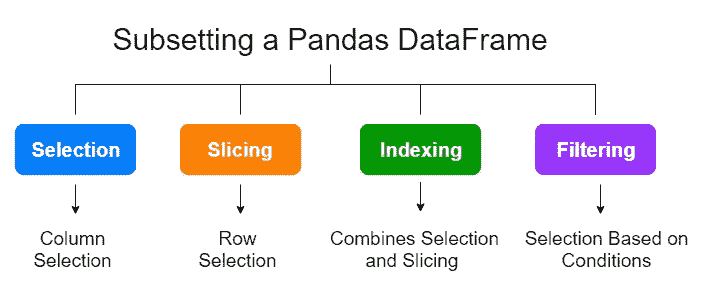

(作者图片)

当您继续阅读本文时，您将了解这些类别之间的差异。

在讨论数据框的任何子集方法之前，值得区分*熊猫系列对象*和*熊猫数据框对象*。

# 熊猫系列和数据框架对象

***系列*** 和 ***数据框*** 是大熊猫的两种主要数据结构。简单地说，一个 ***系列*** *s* 类似于单个数据列，而一个 ***数据框*** 类似于有行和列的表格。请看下图:

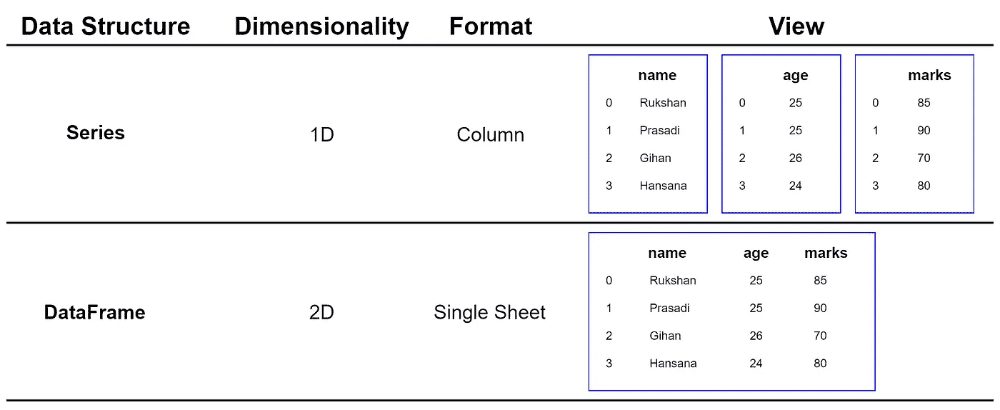

(作者图片)

如你所见，一个 ***系列*** 是一维的，一个 ***数据框*** 是二维的。如果我们把两个或多个 ***系列对象*** 组合在一起，就可以得到一个 ***数据框对象*** 。让我们看看 ***系列*** 物体的实际视图。

```
import numpy as np
import pandas as pddata = np.array([85, 90, 70, 80])
series = pd.Series(data=data, 
                   name="marks")
print(series)
```

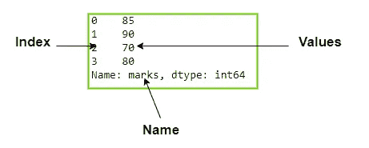

(作者图片)

一个 ***序列*** 由两部分组成:**一维数据值**和**索引**。索引为每个数据值提供了有意义的标签。用户可以使用该索引来选择值。默认情况下，索引从 0 开始。

让我们来看看一个 ***DataFrame*** 对象的实际视图。

```
import numpy as np
import pandas as pddata = np.array([[25, 85],
                 [25, 90],
                 [26, 70],
                 [24, 80]])dataframe = pd.DataFrame(data=data, 
                         columns=["age", "marks"])
print(dataframe)
```

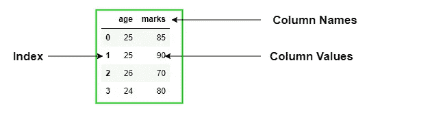

(图片由作者提供)

一个 ***数据帧*** 由三部分组成:**二维数据值**、**行索引**和**列索引**。这些索引为行和列提供了有意义的标签。用户可以使用这些索引来选择行和列。默认情况下，索引从 0 开始。

现在，我们讨论给熊猫数据帧设置子集的不同方法。出于解释的目的，我将使用**“葡萄酒数据集”**。这是其中的一部分。

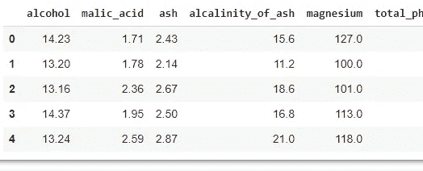

葡萄酒数据集的一部分

# **选择**

当我们抓取整个列时，它被称为 ***选择*** 。所选列包含所有行。

## 方法 1:使用列名选择单个列

我们可以使用列名选择 Pandas 数据帧中的一列。如果数据帧被称为 ***df*** ，一般语法为:

```
df['column_name']
# Or
df.column_name # Only for single column selection
```

输出是一个单列的熊猫系列！

```
# Load some data
import pandas as pd
from sklearn.datasets import load_wine
wine = load_wine()
df = pd.DataFrame(data=wine.data,
                  columns=wine.feature_names)# Select the 'alcohol column'
print(df['alcohol'])
print(type(df['alcohol']))
```

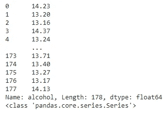

(图片由作者提供)

## 方法 2:使用列名选择多个列

我们可以使用列名选择熊猫数据帧的多列。我们可以在列表中定义列名:

```
['column_1', 'column_2', ...]
```

然后，我们可以将这个列表包含到 **df[]** 中。一般语法是:

```
df[['column_1', 'column_2', ...]]
```

这一次，输出的是一个熊猫数据帧！

```
df[['alcohol', 'ash', 'hue']]
```

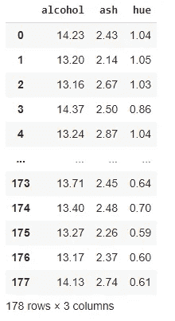

(图片由作者提供)

## 方法 3:使用。loc 属性

使用**可以获得与方法 1 相同的结果。loc** 属性，通过标签(列名)选择熊猫数据*。*

```
df.loc[:, 'alcohol']
```

## 方法 4:使用。loc 属性

使用**可以获得与方法 2 相同的结果。loc** 属性，通过标签(列名)选择熊猫数据*。*

```
df.loc[:, ['alcohol', 'ash', 'hue']]
```

**的一般语法。loc** 属性为:

```
df.loc['row_label', 'column_label']
```

如果有多个标签，应该在列表中指定它们:

```
df.loc[['row_1', 'row_2'], 
       ['column_1', 'column_2']]
```

如果我们想选择所有的行或列，可以使用:symbol。**最重要的一点。loc** 属性是通过标签选择熊猫数据*。*

## 方法 5:使用。iloc 属性

使用**可以获得与方法 1 相同的结果。iloc** 属性，通过位置(列索引)选择熊猫数据*。*

```
df.iloc[:, 0]
```

*酒精*变量在位置 0(第一个变量)。

## 方法 6:使用。iloc 属性

使用**可以获得与方法 2 相同的结果。iloc** 属性，通过位置(列索引)选择熊猫数据*。*

```
df.iloc[:, [0, 2, 10]]
```

**的一般语法。iloc** 的属性是:

```
df.iloc['row_index', 'column_index']
```

如果有多个标签，应该在列表中指定它们:

```
df.iloc[['row_index_1', 'row_index_2'], 
       ['column_index_1', 'column_index_2']]
```

如果我们想选择所有的行或列，可以用 **:** 符号来完成。**最重要的一点。iloc** 属性是它使用数字索引通过位置选择熊猫数据*。*

## 方法 7:使用。iloc 属性(简单的方法)

我们可以选择 *df* 的前 5 列如下:

```
df.iloc[:, [0, 1, 2, 3, 4]]
```

我们也可以用下面的简单方法来获得同样的结果。

```
df.iloc[:, 0:5]
```

要使用此功能，立柱应连续放置*。0:5 范围包括 0(第一列)，不包括 5(第六列)，并选择该范围内的每一列。*

## *方法 8:选择最后一列*

*在许多情况下，选择最后一列通常很有用。有两种方法:*

*首先，我们可以使用**来计算数据帧中的列数。形状**属性。*

```
*df.shape
# Output: (178, 13)*
```

*最后一列是可以通过索引 12 访问的第 13 列。通过使用**。iloc** ，*

```
*df.iloc[:, 12]*
```

*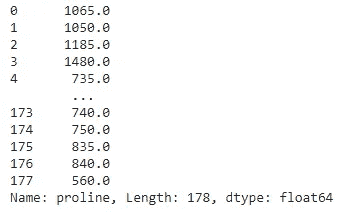*

*葡萄酒数据集的最后一列(图片由作者提供)*

*第二种方法简单得多。这里，我们不需要知道数据框中的列数。*

```
*df.iloc[:, -1]*
```

***-1** 表示最后一列。*

# *限幅*

*当我们想从数据帧中提取某些行时，就称之为 ***切片*** 。提取的行称为*切片* ，包含所有列。*

## *方法 9:使用。iloc 属性*

*提取单行的最简单方法是使用**中的行索引。iloc** 属性。一般语法是:*

```
*df.iloc[row_index]*
```

*输出是包含行值的 Pandas 系列。*

```
*df.iloc[0]*
```

*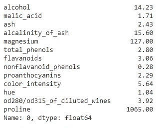*

*(图片由作者提供)*

*外观有点混乱，因为输出是一个熊猫系列。如果您希望它本身作为一行，只需使用列表中的索引值，如下所示:*

```
*df.iloc[[0]]*
```

*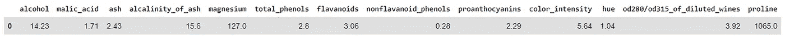*

*(图片由作者提供)*

*这是一个熊猫数据框，包含 1 行和所有的列！*

## *方法 10:使用。iloc 属性*

*我们可以使用 Pandas 数据帧的行索引来提取其中的多行。我们在列表中包含行索引:*

```
*[row_index_1, row_index_2, ...]*
```

*然后我们把这个列表包含在 **df.iloc[]** 里面。*

```
*df.iloc[[row_index_1, row_index_2, ...]]*
```

*输出是一个熊猫数据帧。*

```
*df.iloc[[0, 25, 100]]*
```

*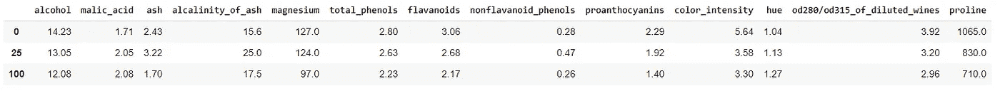*

*(图片由作者提供)*

## *方法 11:选择最后几行*

*负索引从底部开始计算行数。*

```
*df.iloc[[-1, -2, -3, -4, -5]]*
```

*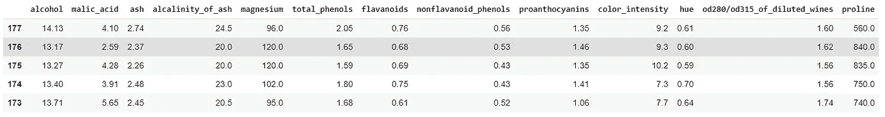*

*(图片由作者提供)*

# *索引*

*当我们将列选择和行切片结合起来时，称为 ***索引*** 。在这里，我们可以使用**。锁定**和**。熊猫数据帧的属性。***

## *方法 12:使用。iloc 属性*

*如果我们指定单行和单列，那么交集就是一个值！*

```
*df.iloc[0, 0]*
```

*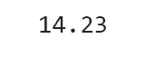*

*(图片由作者提供)*

*请记住，我们不能在**中使用列名或行名。iloc[]** 。只能使用索引号。*

## *方法 13:使用。loc 属性*

*这里我们可以在**中使用行或列名。loc[]** 。还要记住，在我们的数据中，行标签与行索引相同。下面的代码给出了与方法 12 相同的结果。*

```
*df.loc[0, 'alcohol']*
```

## *方法 14:使用。iloc 属性*

*一般语法是:*

```
*df.iloc[[row_index_1, row_index_2, ...],
        [column_index_1, column_index_2, ...]]*
```

*输出是一个熊猫数据帧。*

```
*df.iloc[[0, 5, 100], [0, 3, 7]]*
```

*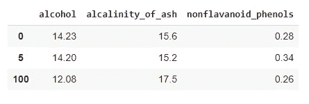*

*(图片由作者提供)*

## *方法 15:使用。loc 属性*

*一般语法是:*

```
*df.loc[[row_name, row_name_2, ...],
        [column_name_1, column_name_2, ...]]*
```

*输出是一个熊猫数据帧。*

```
*df.loc[[0, 5, 100], ['alcohol', 'ash', 'hue']]*
```

*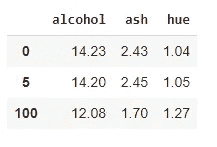*

*(图片由作者提供)*

*这里我们可以在**中使用行或列名。loc[]** 。还要记住，在我们的数据中，行名与行索引相同。*

## *方法 16:使用。loc 和。iloc 属性(简单的方法)*

*这可以很容易地用 **:** 符号来完成。为此，行和列应连续定位*。**

```
**df.iloc[0:6, 0:5]**
```

**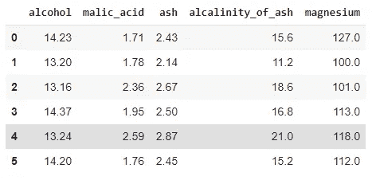**

**(图片由作者提供)**

**另一个例子是:**

```
**df.loc[0:6, ['alcohol', 'ash']]**
```

**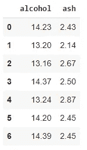**

**(图片由作者提供)**

# **过滤**

**当我们根据特定的标准或条件选择行和列时，称为*。我们也可以将上面讨论的方法与此结合。***

## ***方法 17:基于单一标准对所有列进行筛选***

***让我们把我们的数据子集当**酒精> 14.3** 时。在这里，我们选择所有的列当**酒精> 14.3** 时。***

```
***df['alcohol'] > 14.3***
```

***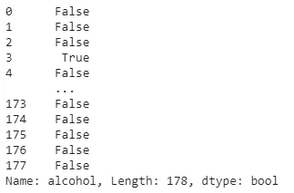***

***(图片由作者提供)***

***这是一个熊猫系列的布尔数据类型。我们可以使用这个系列来获得所需的数据子集。***

```
***df[df['alcohol'] > 14.3]***
```

***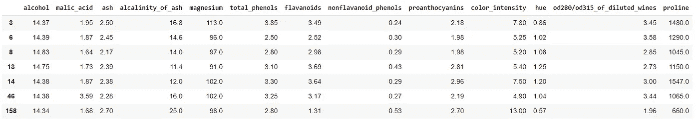***

***(图片由作者提供)***

## ***方法 18:基于具有几列的单一标准进行过滤***

***让我们把我们的数据子集当**酒精> 14.3** 时。这一次，当**酒精> 14.3** 时，我们只选择 3 列。为此，我们可以将上述过滤技术与**相结合。loc[]** 。***

```
***df.loc[df['alcohol'] > 14.3, 
      ['alcohol', 'ash', 'hue']]***
```

***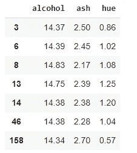***

***(图片由作者提供)***

## ***方法 19:使用 AND 运算符基于两个标准进行筛选(同一列)***

***当**酒精>为 14.3，酒精<为 14.6** 时，让我们对数据进行子集化。这里，我们使用两个条件，并用**和**操作符将它们组合起来。每个条件都应该用括号括起来。***

```
***df[(df['alcohol'] > 14.3) & (df['alcohol'] < 14.6)]***
```

***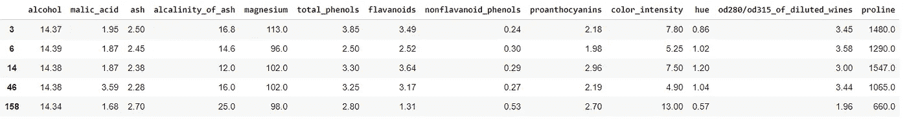***

***(图片由作者提供)***

## ***方法 20:使用 between()方法基于两个标准进行过滤***

***使用 **between()** 方法可以实现方法 19 中讨论的类似类型的过滤。***

```
***df[df['alcohol'].between(14.3, 14.6)]***
```

***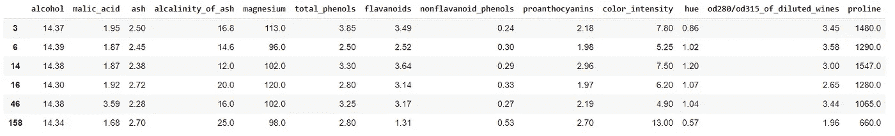***

***(图片由作者提供)***

***这里，输出有一点不同，因为默认情况下，()方法中的**包含了下界(14.3)和上界(14.6)的值。然而，如果我们不想要包含选择，我们可以通过 *inclusive=False* 。*****

```
**df[df['alcohol'].between(14.3, 14.6,
                         inclusive=False)]**
```

**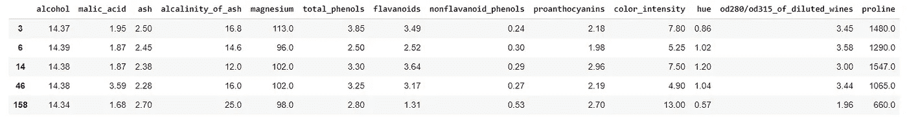**

**(图片由作者提供)**

**该子集与方法 19 中获得的子集完全相同。**

## **方法 21:使用 AND 运算符基于两个标准进行筛选(不同的列)**

**这里，这两个条件是使用两个不同的列生成的:**酒精**和**色调**。**

```
**df[(df['alcohol'] > 14.3) & (df['hue'] > 1.0)]**
```

**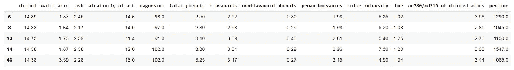**

**(图片由作者提供)**

## **方法 22:使用 OR 运算符基于两个标准进行筛选**

**当我们使用**和**运算符时，过滤发生在考虑*和*两个条件都为真的情况下。如果我们希望*至少有一个*条件为真，我们可以使用**或**操作符。**

```
**df[(df['alcohol'] > 14.5) | (df['hue'] > 1.4)]**
```

**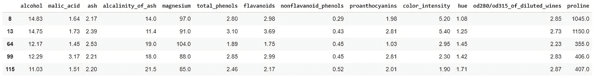**

**(图片由作者提供)**

## **方法 23:基于最小值和最大值进行过滤**

**让我们根据*酒精*变量的最小值和最大值对数据进行分组。首先，我们得到最小值和最大值的指数:**

```
**df['alcohol'].idxmin() # Min value index
df['alcohol'].idxmax() # Max value index**
```

**然后我们用**。iloc[]** 。**

```
**df.iloc[[df['alcohol'].idxmin(),
         df['alcohol'].idxmax()]]**
```

**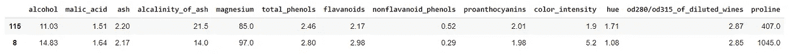**

**(图片由作者提供)**

# **摘要**

**这些并不是熊猫数据帧子集的唯一方式。还有很多。对于复杂的子集，我们可以结合多种方法。这篇文章帮助你熟悉子集化语法。另外，您现在已经熟悉了术语**选择**、**切片**、**索引**和**过滤**。另外，请记住**。iloc** 需要整数值( **i** 为整数)，而**需要整数值。loc** 需要标签值。**

**今天的帖子到此结束。我的读者可以通过下面的链接注册成为会员，以获得我写的每个故事的全部信息，我将收到你的一部分会员费。**

****报名链接:**[https://rukshanpramoditha.medium.com/membership](https://rukshanpramoditha.medium.com/membership)**

**非常感谢你一直以来的支持！下一个故事再见。祝大家学习愉快！**

**特别要感谢 Unsplash 上的**汉斯-彼得·高斯特**、为我提供了这篇文章的漂亮封面图片。**

**[鲁克山普拉莫迪塔](https://medium.com/u/f90a3bb1d400?source=post_page-----6264b8000a77--------------------------------)
**2021–06–04****