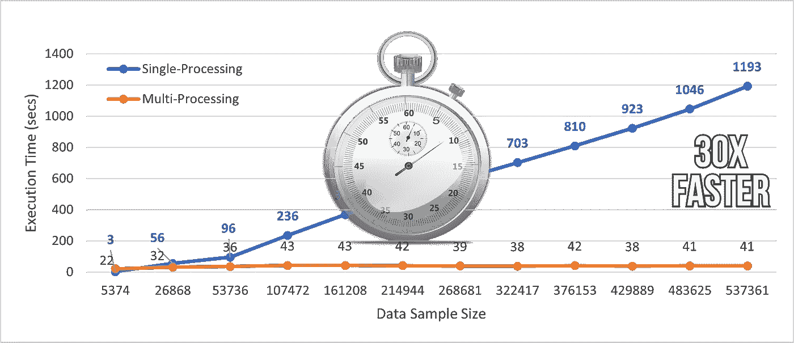
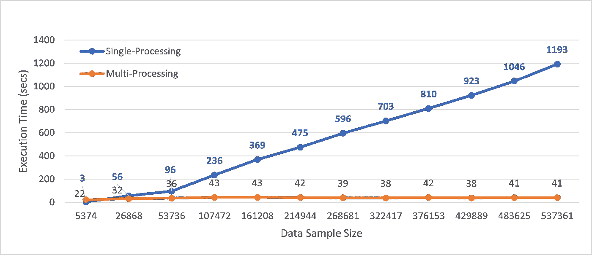
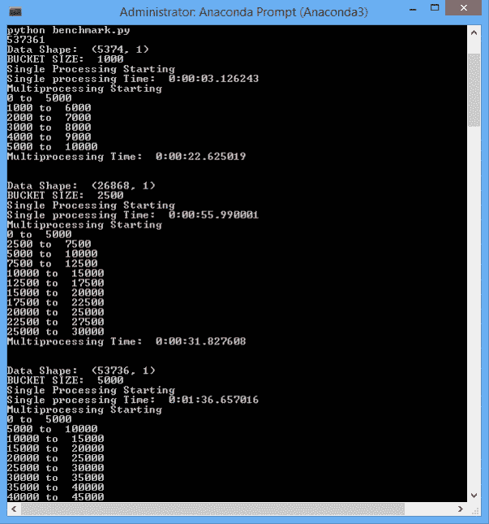

# 用几行代码将 Python 函数的执行速度提高了 30 倍

> 原文：<https://towardsdatascience.com/25x-times-faster-python-function-execution-in-a-few-lines-of-code-4c82bdd0f64c?source=collection_archive---------5----------------------->

## Python 中多重处理的基本指南

(图片由作者提供)

Python 是一种流行的编程语言，也是数据科学社区中最受欢迎的语言。与其他流行的编程语言相比，Python 速度慢主要是因为它的动态特性和多功能性。Python 代码在运行时被解释，而不是在编译时被编译成本机代码。

C 语言的执行时间比 Python 代码快 10 到 100 倍。但是，如果比较开发时间，Python 比 C 语言要快。对于数据科学案例研究，开发时间比运行时性能更重要。Python 更受数据科学家和数据分析师的青睐，因为它提供了大量的 API、框架和包，但是在优化执行方面，它却失败得很惨。

在本文中，我们将讨论如何使用多处理模块并行执行自定义 Python 函数，并进一步比较运行时时间数。

# 入门—多重处理:

考虑具有单个处理器的 CPU，如果它同时被分配多个任务，它必须连续地中断每个任务并切换到单个任务以保持所有进程继续。对于多核处理器来说，CPU 可以在不同的 CPU 内核中同时执行多个任务，这个概念被称为并行处理。

## 为什么重要？

数据争论、特征工程和数据探索是数据科学模型开发流程中的重要元素。在输入机器学习模型之前，需要对原始数据进行设计和处理。对于小规模数据集，执行在几秒钟内完成，但对于大规模数据集，这将成为一项繁琐的任务。

并行处理是提高 Python 程序性能的有效方法。Python 有一个多处理模块，让我们能够在 CPU 的不同内核上并行执行程序。

# 实施:

我们将使用来自**多重处理**模块的`**Pool**`类，帮助并行执行针对多个输入值的函数。这个概念被称为数据并行，这是`**Pool**`类的主要目标。

> 我将使用从 [Kaggle](https://www.kaggle.com/) 下载的 [Quora 问题对相似性数据集](https://www.kaggle.com/c/quora-question-pairs)来进一步演示该模块。

上述数据集包含在 Quora 平台上提问的文本问题。我将在一个 Python 函数上执行多处理模块，该函数通过删除停用词、删除 HTML 标签、删除标点符号、词干等来处理文本数据。

`**preprocess()**`是执行上述文本处理步骤的函数。

> 找到托管在我的 GitHub 上的函数**预处理()** 的[代码片段。](https://gist.github.com/satkr7/7d66e00bc2db9742a6c77cbf206af3f9)

现在，让我们使用来自`**multiprocessing**`模块的`**Pool**`类为数据集的不同块并行执行函数。数据集的每个块都将被并行处理。

数据集有 537，361 条记录或文本问题需要处理。对于大小为 50，000 的存储桶，数据集被分成 11 个较小的数据块，这些数据块可以并行处理，以加快程序的执行时间。

# 基准测试:

经常会出现这样的问题，使用多处理模块后执行速度有多快。我比较了实现数据并行性和一次对整个数据集执行`**preprocess()**`函数后的基准执行时间。

> 性能记录在一个系统上，该系统配有 **RAM: 64GB** 和 **10 个 CPU 内核**。

(图片由作者提供)，多处理和单处理的执行时间基准测试

从上面的图中，我们可以观察到 Python 函数的并行处理将执行速度提高了近 **30x** 倍。

> 你可以在我的 [GitHub](https://gist.github.com/satkr7/1087afdd4291638122186f5741564dd9) 中找到用来记录基准数的 [Python 文件](https://gist.github.com/satkr7/1087afdd4291638122186f5741564dd9)。

(GIF by Author)，执行 Python 文件计算基准数

# 结论:

在本文中，我们讨论了 Python 中多重处理模块的实现，它可以用来加速 Python 函数的执行。通过添加几行多处理代码，对于具有 537k 个实例的数据集，执行时间几乎快了 30 倍。

对于处理大型数据集，建议使用并行处理，因为它可以节省大量时间并加快工作流程。

参考我关于加速 Python 工作流的其他文章:

*   [4 个可以并行处理现有熊猫生态系统的库](/4-libraries-that-can-parallelize-the-existing-pandas-ecosystem-f46e5a257809)
*   [熊猫数据帧迭代速度快 400 倍](/400x-time-faster-pandas-data-frame-iteration-16fb47871a0a)
*   [为大型数据集优化熊猫的内存使用](/optimize-pandas-memory-usage-while-reading-large-datasets-1b047c762c9b)
*   带 PyPolars 的熊猫速度快 3 倍

# 参考资料:

[1]多处理文档:[https://docs.python.org/3/library/multiprocessing.html](https://docs.python.org/3/library/multiprocessing.html)

*喜欢这篇文章吗？成为* [*中等会员*](https://satyam-kumar.medium.com/membership) *继续无限制学习。如果你使用下面的链接，我会收到你的一小部分会员费，不需要你额外付费。*

<https://satyam-kumar.medium.com/membership>  

> 感谢您的阅读