# 3.3 关于决定使用多个数据表是否是一个好主意的争论

> 原文：<https://towardsdatascience.com/3-3-arguments-on-deciding-if-using-multiple-date-tables-is-a-good-idea-5b1788c426a6?source=collection_archive---------11----------------------->

## 通常，在我们的表格模型中有一个数据表。但有时，多个日期表可能是个好主意。让我们分析一下如何决定做这件事的正确方法。


照片由 [Unsplash](https://unsplash.com?utm_source=medium&utm_medium=referral) 上的[延斯·勒列](https://unsplash.com/@madebyjens?utm_source=medium&utm_medium=referral)拍摄

前一段时间，我写了一篇关于用扩展的数据表增强报告的文章。你可以在这里找到这篇文章:[用扩展的数据表](/3-ways-to-improve-your-reporting-with-an-expanded-date-table-2d983d76cced)改进你的报告的 3 种方法。

从那以后，我与客户和同事讨论了为什么我在 Power BI 或 Analysis Services 的表格模型中需要不止一个日期表。

当我们试图决定是要只有一个日期表还是要有多个日期表时，有三个主题需要考虑:

1.  可用性
2.  更简单的 DAX 代码
3.  简化模型

让我们看看这三个主题。

但首先，我们需要了解“问题”。

# 问题是

让我们看一个例子，其中我们有多个日期的事务:

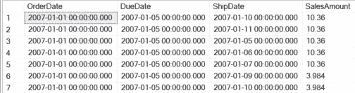

图 1 —具有多个日期的交易表

在上图中，我们看到有多个日期的交易。

现在，我们希望能够根据三个日期中的每一个创建报告。

我们可以创建一个简单的模型，就像这样:

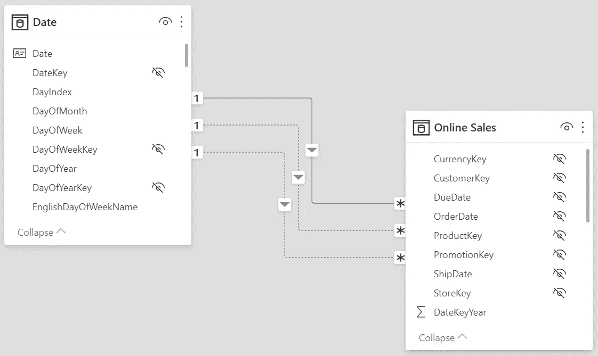

图 2 —带有一个数据表的简单数据模型

活动关系将 OrderDate 列链接到 Date 列。

或者，我们可以构建另一个数据模型，为在线销售表中的每个日期列创建一个日期表:

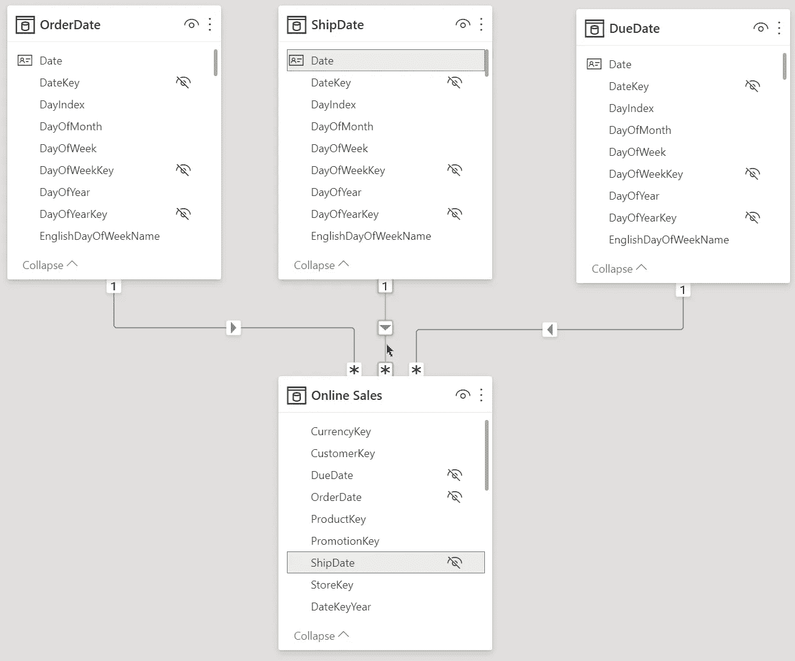

图 3 —每个日期列有一个数据表的数据模型

第一种更简单的模型是常见的模型。这个简单的模型对大多数用例都有帮助。

无论如何，有三个数据表的模型可能会更有帮助。

让我们深入探讨上面提到的决定哪种模式更好的三个论点。

# 可用性

可用性是不客观的，它取决于用户的品味，用户会使用数据模型。

当您开发 Power BI 模型以创建 Power BI 报告时，您可以遵循自己喜欢的方式。

但是当你开发一个数据模型时，其他用户也应该使用它，那么你也需要考虑他们的用户技能、习惯和对数据模型的理解。

共享数据模型可以通过 Power BI 服务或 Analysis Services 数据模型中的共享数据集来实现。

我想向您展示数据模型的哪些部分会影响可用性:

*   措施的复杂性
*   计算组
*   对目的的理解

# 措施的复杂性

当我有多个数据表时，我可以创建简单的度量。我可以对模型中的任何日期表使用这些度量。

我可以使用这个简单的 DAX 方法来衡量任何日期表的销售额:

```
Online Sales = SUMX(‘Online Sales’, [UnitPrice]*[SalesQuantity])
```

而对于只有一个日期表和多个关系的情况，我需要使用 USERELATIONSHIP()函数为一个非活动关系实现相同的功能。

根据到期日计算销售额的 DAX 度量值:

```
Online Sales by Due Date =
CALCULATE(
    SUMX(‘Online Sales’, [UnitPrice]*[SalesQuantity])
    ,USERELATIONSHIP(‘Online Sales’[DueDate],’Date’[Date])
    )
```

但是，当您有多个日期表时，您可以对所有日期表使用第一个简单的在线销售度量，而无需添加更多的度量。

此外，当用户可以选择他想要使用的日期表时，他可以这样做，这是透明的。

另一方面，用户将无法比较同一图表中基于不同日期轴的数字:

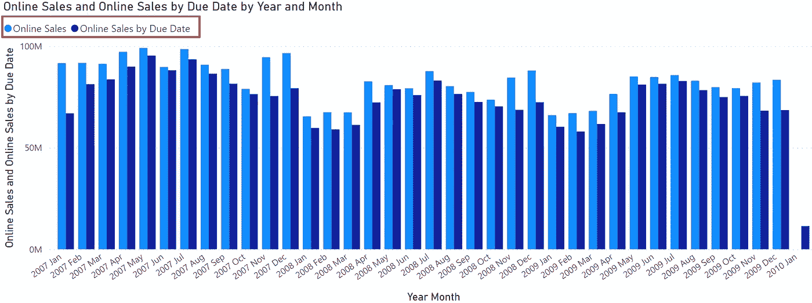

图 4 —比较两个测量的数据

但是，一旦我们需要时间智能度量，我们就必须创建相同数量的度量。

# 计算组

我们可以使用计算组来简化我们的模型。我们可以使用这个特性来避免不同度量中的冗余逻辑。

您可以在 SQLBI 文章[介绍计算组— SQLBI](https://www.sqlbi.com/articles/introducing-calculation-groups/) 中阅读有关计算组的更多信息

不幸的是，当使用一个或多个日期表时没有区别。例如，在创建时间智能度量时，您必须为每个日期轴开发不同的计算组。无论您使用一个还是多个日期表格。

计算组不会帮助您决定选择哪条路线。

# 对目的的理解

相应地命名您的措施至关重要。

正如您在下图中看到的，我为每个度量添加了一个后缀来定义目的:

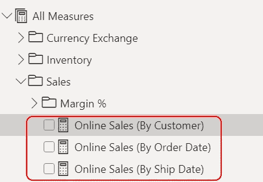

图 5 —有目的地测量

最好独立于您使用一个或多个日期表的决定来完成这项工作。

你必须记住，你的用户需要你的帮助来理解你的模型中每个对象的用途。

因此，如果您相应地命名您的日期表，会有所帮助，如上图所示(图 2 和图 3)。

# 更简单的 DAX 代码


[钳工](https://unsplash.com/@benchaccounting?utm_source=medium&utm_medium=referral)在 [Unsplash](https://unsplash.com?utm_source=medium&utm_medium=referral) 上拍照

在上一节中，我们已经看到，当我们使用一个日期表时，如果要确保根据特定的日期轴计算销售额，我们需要编写更多的代码。

当我们编写时间智能度量时也是如此。

不是小节数的问题。不管我们的决定如何，我们总是需要开发相同数量的时间智能度量。

但是，当我们有一个中央数据表时，我们必须为每个时间智能度量添加一个 USERELATIONSHIP()。

用一个日期表按到期日衡量上一年:

```
Online Sales PY (Due Date) =
VAR SalesAmountPY =
    CALCULATE(
        SUMX(‘Online Sales’, [UnitPrice]*[SalesQuantity])
        ,SAMEPERIODLASTYEAR(‘Date’[Date])
        ,USERELATIONSHIP(‘Online Sales’[DueDate], ‘Date’[Date])
        )RETURN
    SalesAmountPY
```

相比之下，当我们有一个专用的到期日表时，看下面的 DAX 代码，根据到期日计算前一年:

```
Online Sales PY (Due Date) =
VAR SalesAmountPY =
    CALCULATE(
        SUMX(‘Online Sales’, [UnitPrice]*[SalesQuantity])
        ,SAMEPERIODLASTYEAR(‘Due Date’[Date])
        )RETURN
    SalesAmountPY
```

这个解决方案更容易编写和阅读。

有时，多个日期表有助于解决只有一个日期表时很难解决的问题。

在我的文章[中，我描述了一个问题，我需要使用两个日期轴对我的数据应用两个不同的日期过滤器。](/a-dax-drama-in-3-acts-with-two-time-dimensions-aa65abbf5f41)

我不知道上面文章中解释的问题能否用一个单独的数据表来解决。
即使这个问题可以解决，解决方案也会非常复杂，难以理解。

您需要仔细考虑需求，并相应地决定是只能使用一个日期表，还是需要多个日期表。

# 简化模型

在数据模型中使用一个数据表最明显的原因是为了简化数据模型。

下图显示了带有一个日期表的数据模型:

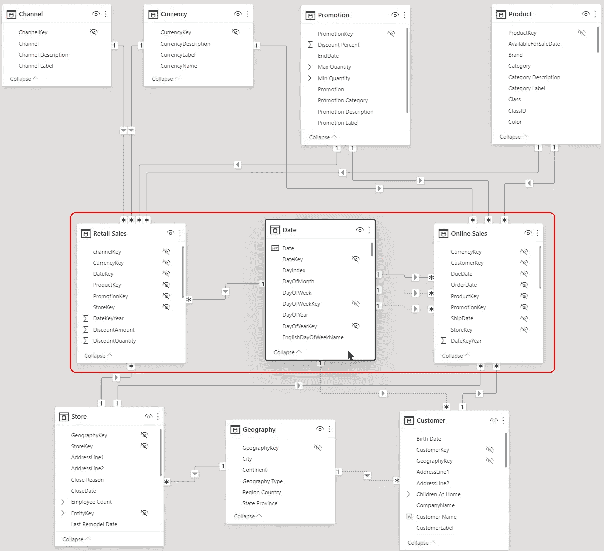

图 6 —带有一个数据表的数据模型

现在比较同一个数据模型，但是有多个数据表:

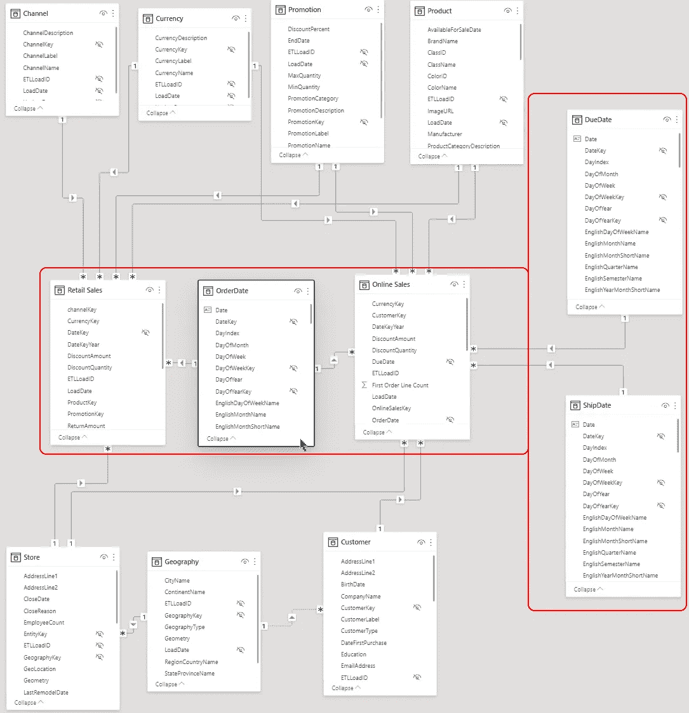

图 7 —具有多个数据表的数据模型

你看第二个更大，看起来更复杂。

但是，当您仔细观察第一个数据模型时，可以看到从在线销售表到日期表的三种关系。在外行看来，这三种关系看起来也很复杂。

在这一点上，这是你的决定，哪个数据模型看起来更容易理解，或者哪个是更复杂的数据模型。

# 结合两种解决方案

有时，需求会发生冲突，您不能坚持使用一种方法。

在这种情况下，您可以创建一个将两种方法结合在一起的模型:

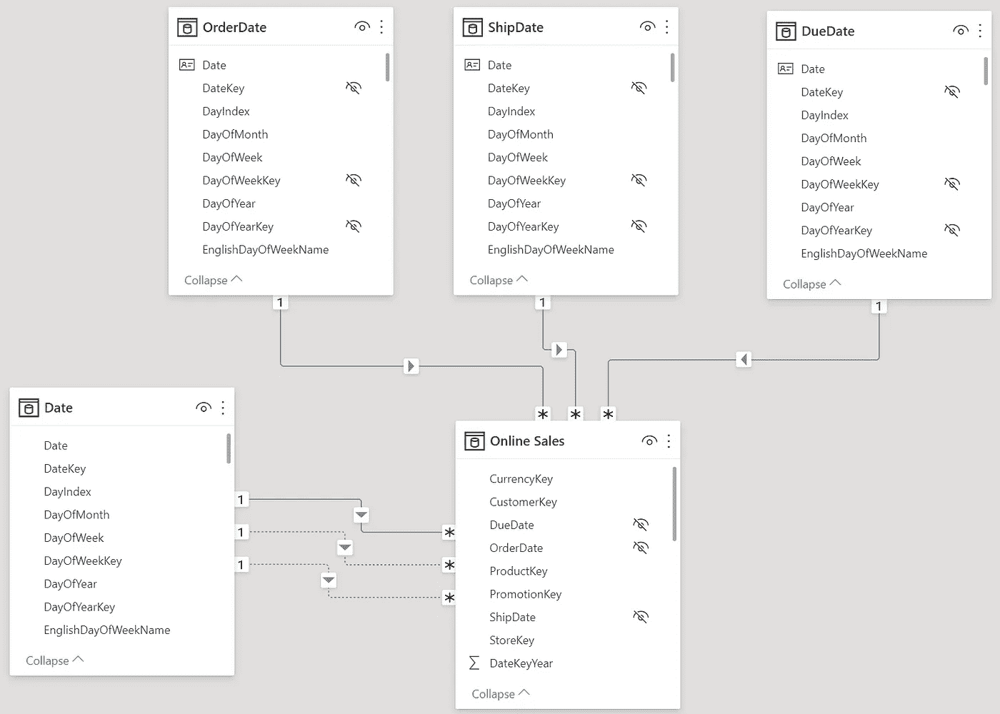

图 8 —组合数据模型

现在您有了所有的可能性，并且您可以在您的模型中使用这两种方法的优点。

但是代价是增加了复杂性和用户使用错误数据表的危险。

假设您使用 Ship Date 表创建时间智能度量。
但是，当用户在这个模型上创建一个报表，并将数据表添加到报表中时，该度量将不再有效。

然后，您需要向您的度量添加检查，以找出报告中使用了哪个日期表。

# 示例 1 —带检查的动态 PY 测量

这里有一个如何做到这一点的例子:

```
Sales PY (by Ship Date) =
    VAR IsShipDate = ISFILTERED(‘ShipDate’)RETURN
    IF( IsShipDate
        ,CALCULATE([Sum Online Sales]
        ,SAMEPERIODLASTYEAR(‘ShipDate’[Date])
        )
        ,CALCULATE([Sum Online Sales]
            ,SAMEPERIODLASTYEAR(‘Date’[Date])
            ,USERELATIONSHIP(‘Online Sales’[ShipDate], ‘Date’[Date])
        )
    )
```

# 示例 2 —带有基本测量的动态 PY 测量

或者，可以使用 SWITCH()函数创建一个更复杂的检查，将所有的数据表合并到一个度量中。

这里是确定使用哪个日期表的基本度量:

```
Get used Date table =
SWITCH (
    TRUE
        ,ISFILTERED(‘OrderDate’), 1
        ,ISFILTERED(‘ShipDate’), 2
        ,ISFILTERED(‘DueDate’), 3
        ,0
    )
```

然后，您可以在所有其他度量中使用此基本度量，如下所示:

```
Sum Online Sales PY (Dynamic) =
SWITCH([Get used Date table]
    , 1
    ,CALCULATE([Sum Online Sales]
        ,SAMEPERIODLASTYEAR(‘OrderDate’[Date])
    )
    , 2
    ,CALCULATE([Sum Online Sales]
        ,SAMEPERIODLASTYEAR(‘ShipDate’[Date])
    )
    , 3
    ,CALCULATE([Sum Online Sales]
        ,SAMEPERIODLASTYEAR(‘DueDate’[Date])
    )
    ,CALCULATE([Sum Online Sales]
        ,SAMEPERIODLASTYEAR(‘Date’[Date])
    ))
```

当我们将这样的逻辑添加到度量中时，我们还必须考虑性能。

我用 Power BI 中的示例 1 创建了一个矩阵，并使用 Power BI Desktop 中的性能分析器将这个矩阵的查询复制到 DAX Studio。我使用了服务器计时特性来收集计时信息。

然后，我立即执行带有 on Measure 的查询，以获得有意义的度量。

作为基线，让我们使用简单的销售额合计:

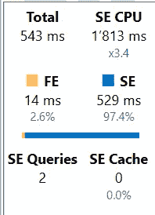

图 9 —基线测量(发货日期表)

现在，用 ShipDate 日期表来度量 PY 的时间:

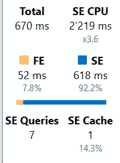

图 10——用装运日期表测量 PY

现在，使用 Measure 进行测量，该测量检查正在使用哪个日期表:

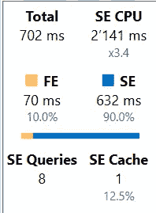

图 11——使用数据表检查的 PY 测量

为了进行比较，这里使用了相同的度量，但是这次使用了日期表，该表需要 USERELATIONSHIP()函数:

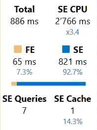

图 13——使用数据表检查和用户关系测量 PY

这里所有的计时都在一个表中:

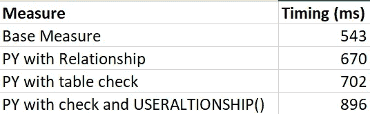

图 12 —计时表

如您所见，使用在线销售和发货日期表之间的关系只多花了 127 毫秒的时间。

对已用日期表的检查只需要额外的 30 毫秒。这是非常少的时间，您不需要考虑它。

但是与使用关系相比，使用 USERELATIONSHIP()函数需要 200 毫秒以上。

当然，这些值取决于您的模型的几个因素，您需要执行您的测量以获得适当的性能差异。

# 结论

这个问题的答案是“我应该使用一个日期表还是需要多个日期表？”是:

*视情况而定*


由[莎伦·麦卡琴](https://unsplash.com/@sharonmccutcheon?utm_source=medium&utm_medium=referral)在 [Unsplash](https://unsplash.com?utm_source=medium&utm_medium=referral) 上拍摄的照片

您必须评估报告需求和用户的能力。

我的建议是:

*   从一个单独的日期表格开始，除非你知道你需要专用的日期表格。
*   一旦你有了理由，就换成专用的日期表

到目前为止，这种方法对我来说非常有效。

但是，为什么我用“3.3 关于决定使用多个数据表是否是一个好主意的论点”作为这篇文章的标题呢？

我使用了三个主要论点:

1.  可用性
2.  更简单的 DAX 代码
3.  简化模型

但是在可用性内部，我进一步提到了三个原因:

*   措施的复杂性
*   计算组
*   对目的的理解

因此，3.3 个参数。