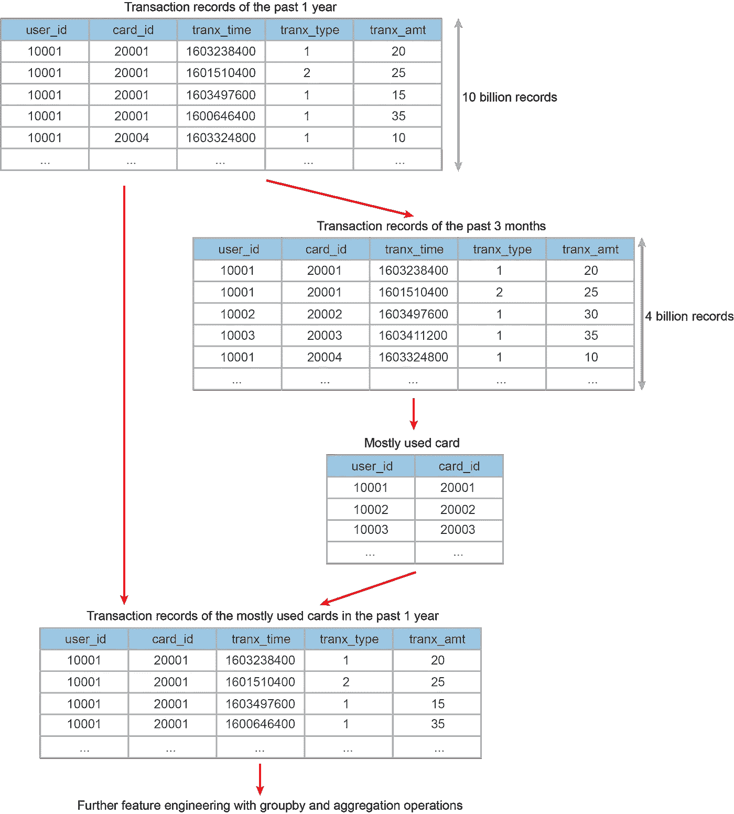

# 3.基于大数据帧的 Spark 性能优化实例研究

> 原文：<https://towardsdatascience.com/3-a-case-study-of-spark-performance-optimization-on-large-dataframes-8fa06fa6e0ff?source=collection_archive---------28----------------------->

## 火花性能优化探索

## 关于如何优化 Spark 性能的详细案例研究，涉及数十亿条记录

由 [NASA](https://unsplash.com/@nasa?utm_source=medium&utm_medium=referral) 在 [Unsplash](https://unsplash.com?utm_source=medium&utm_medium=referral) 上拍摄的照片

欢迎回来！这是探索 Spark 性能优化系列的第三部分。在前两篇文章中，我们讨论了 Spark 的特性以及如何使用 Yarn web UI 进行代码性能检查。在这第三篇文章中，我们将继续详细讨论一个性能优化案例。

这篇文章将涵盖:

1.  虚拟数据集简介
2.  识别和解决数据偏斜问题
3.  识别和解决长沿袭路径问题
4.  其他一些小的改进

## 1.虚拟数据帧简介

在这个应用程序中，我们有一个大的数据框架:一个交易记录表，包含所有用户在过去一年中的信用卡交易(大约 100 亿条记录)。从这个庞大的交易记录表开始，我们首先要找到每个用户在过去 3 个月中最常使用的信用卡。然后，我们希望获得这张最常用的信用卡过去 1 年的交易记录，以便进行进一步的功能工程开发。

该任务分为两步:

1.  过滤完整的交易记录表以获取过去 3 个月的交易记录。应用`groupBy`和`aggregation`方法获取每个用户最常用的信用卡。
2.  将最常用的信用卡表与完整的交易记录表连接起来。

数据结构和工作流程

## 2.数据偏斜度

**2.1 数据偏斜问题的识别**

第一个问题是运行时间长。正如我们在上一篇文章中所讨论的，yarn web UI 是探测 spark 性能问题的一个非常有用的工具。因此，我在运行任务时检查了 yarn web UI，发现了长运行时间的一个潜在原因。有多个阶段由 200 个分区组成，虽然 199 个分区很快就完成了，但总有一个分区需要很长时间才能完成。由于这一个拖动分区，舞台必须等到最后一个分区完成。

然后我需要找到这个阶段对应的代码部分。Spark 安排阶段的方式是基于洗牌操作。如果某个操作导致分区洗牌，则安排一个新阶段。在我以前的经验中，有 200 个分区的阶段应该对应于`map-reduce`操作中的`reduce`部分。因为我没有传入参数来指定并行级别，所以默认分区将是 200。因此，具有 200 个分区的阶段对应于 groupby/aggregation 操作或 join 操作。

有了瓶颈阶段的线索后，我开始探查潜在的性能瓶颈代码。获取最常用的信用卡包括 groupby/aggregation 操作，获取使用最常用信用卡的过去 1 年的交易包括 join 操作。因此，我首先检查了 groupby/aggregation 操作。如果 1 年事务表是倾斜的，那么 groupby/aggregation 操作可能会受到不平衡工作负载的影响。

对于 1 年的事务表，我统计了每个 user_id 的事务记录，结果是 1/10 的事务有 NULL user_id。这是 reduce 操作期间工作负载严重不平衡的原因。因为这 10 亿条记录将被拉到同一个工作节点进行聚合，而其他 199 个工作节点的工作负载要少得多。这种不平衡的工作负载会损害 Spark 的并行计算能力。

**2.2 解决数据偏斜问题**

问题在于数据的偏斜。有多种方法可以缓解或解决这个问题。一种方法是通过手动传递大于 200 的并行度参数来增加并行度。另一种方法是引入盐析过程，通过随机地给关键字添加前缀。然而，这两种方法只能帮助缓解数据偏斜问题，解决该问题的最佳方法是在业务逻辑保持完整的情况下丢弃极度集中的键。在我的应用程序中，NULL user_id 是由于以前的复制错误造成的，删除 NULL user_id 记录不会影响 1 年交易记录的完整性。因此，我的解决方案是过滤掉空的 user_id 记录。

## 3.漫长的传承路径

在解决了数据偏斜问题后，不再有 1 个分区占用了非常长的运行时间的阶段。然而，整个任务仍然需要相当长的运行时间。检查 Spark DAG，我发现没有可重用的内存，并且沿袭路径很长。长沿袭路径可能有问题，因为早期阶段中的一个分区失败将导致后续阶段的长链的重新计算。因此，添加适当的检查点有助于缩短漫长的沿袭路径并缩短运行时间。

在我的应用程序中，获取最常用的信用卡需要很长的运行时间，因为它涉及到混洗大数据帧和使用 windows 函数。此操作花费了很长时间，占用了大量内存。因此，我决定在生成最常用的信用卡表之后添加一个检查点。通过添加一个检查点，最常用的信用卡表被写入 HDFS，复制机制从 spark 转移到 HDFS。通过切割长血统路径，后面的阶段也运行得更快。

## 4.其他小的改进

除了两大优化之外，还有一些小的改进:

1.  当连接大数据帧和小数据帧时，广播小数据帧以避免混排连接。Shuffle join 一直是 Spark 性能的主要瓶颈，因为它涉及跨分区移动数据。但是，如果连接操作涉及一个大数据帧和一个小数据帧，就可以很容易地避免混洗连接。通过广播小数据帧，工作节点在每个分区上执行内存连接，而不需要打乱大数据帧。
2.  正确使用过滤器。如果可能的话，在进行混洗操作之前，请始终使用合适的过滤器，因为过滤器有助于减小数据帧的大小，从而有助于提高性能。

## 摘要

这篇文章涵盖了一个涉及大型数据框架的特征工程优化案例。为了探究这个问题，yarn web UI 是一个很好的助手，因为它有助于发现潜在的性能瓶颈。那么这篇文章将介绍两个主要的和两个次要的性能改进:

1.  检查并解决数据偏斜问题。
2.  添加检查点以切断漫长的沿袭路径。
3.  连接大数据帧和小数据帧时正确使用广播。
4.  正确使用过滤器有助于在洗牌操作中减小数据帧的大小。