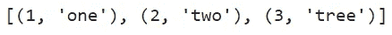
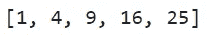
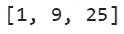
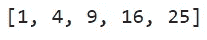
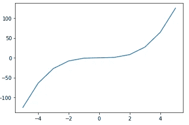
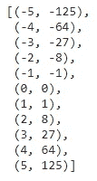

# Python 列表中的 3 个高级操作及示例

> 原文：<https://towardsdatascience.com/3-advanced-operations-in-python-lists-with-examples-eecdcdc6d4e0?source=collection_archive---------21----------------------->

## 合并、列表理解和附加元素


克里斯·劳顿在 [Unsplash](https://unsplash.com/?utm_source=unsplash&utm_medium=referral&utm_content=creditCopyText) 上的照片

**列表**是 Python 中内置的数据类型之一。它用于存储多个 Python 对象(integer、float、string 等。)在单个变量中。这些元素放在一对方括号内。

```
list_1 = [1, 0, 10] # A list of integers
list_2 = [5.3, 10.0, 7.5] # A list of floats
list_3 = ['A', 'I', 'Help', 'Thanks'] # A list of strings
list_4 = [1, 5.3, 'A'] # A list of mixed Python objects!
```

# Python 列表中一些有趣的事实

*   列表中的单个元素可以通过使用**从零开始的索引**来选择(零表示第一个元素)。
*   列表是可变的。在创建列表后，我们可以添加或删除项目，或者更改列表中某个元素的值。
*   不同数据类型的元素可以包含在同一个列表中。
*   **list()** 构造函数可以用来创建一个新的列表。
*   可以通过使用 list()构造函数中的 **range()** 函数来创建后续整数的列表。

# Python 列表中的一些高级操作

Python 列表中有很多操作。这里将重点介绍**合并**、**列表理解**和**追加元素**。

## 1.用 zip()函数合并列表

函数的作用是:从两个列表中提取相应的元素，将两个列表合并成一个新列表。结果是一个 zip 对象。我们可以将该对象放在 **list()** 构造函数中，以显示新的元组列表。

```
list_1 = [1, 2, 3]
list_2 = ['one', 'two', 'tree']list(zip(list_1, list_2))
```



(图片由作者提供)

我们也可以合并两个**不同长度**的列表。在这种情况下，新列表的创建有利于最短的列表。

```
list_1 = [1, 2, 3, 4, 5] # 5 elements
list_2 = ['one', 'two', 'tree'] # Only 3 elementslist(zip(list_1, list_2))
```


(图片由作者提供)

## 2.列表理解

列表理解是一种单行代码技术，用于通过迭代列表中的元素来构建新列表。新列表是以原始列表元素满足特定表达式或条件或两者的方式创建的。

语法是:

```
[<expression> for <variable> in <list>]
```

假设我们有下面的列表。

```
new_list = [1, 2, 3, 4, 5]
```

现在，我们要创建一个新的列表，包含上面列表中所有元素的平方值*。为此，我们可以使用列表理解。*

```
*[x**2 for x in new_list]*
```

**

*(图片由作者提供)*

*列表理解还可以包含一个**条件**。在这种情况下，语法是:*

```
*[<expression> for <variable> in <list> if <condition>]*
```

*现在，我们要创建一个新的列表，它包含原始列表中被选中的 元素的 ***的平方值(例如奇数)。为此，我们可以使用列表理解和一个条件。****

```
*[x**2 for x in new_list if x % 2 == 1]*
```

**

*(图片由作者提供)*

## *3.追加元素*

*前面的两个操作没有修改对其执行操作的原始列表。但是，append elements 是一个直接修改原始列表的就地操作。该操作将元素添加到列表的末尾。这可以通过使用列表对象的 **append()方法**来完成。*

*通常，我们创建一个**空列表**，然后根据需要添加元素。上述平方值问题也可以通过使用这种方法来解决。*

```
*a = [] # Empty listfor i in new_list:
  sq = i**2
  a.append(sq)a*
```

**

*(图片由作者提供)*

*在创建时， **a** 是一个空列表。现在， **a** 已经被修改并包含 5 个元素，这意味着附加操作已经完成。*

*当您希望存储计算值以供以后打印时，追加操作非常有用。举个例子，*

```
*x = [-5, -4, -3, -2, -1, 0, 1, 2, 3, 4, 5]
y = []for i in x:
  ex = i**3
  y.append(ex)import matplotlib.pyplot as plt
plt.plot(x, y)*
```

**

*(图片由作者提供)*

*使用合并操作可以看到坐标！*

```
*coordinates = list(zip(x, y))
coordinates*
```

**

*(图片由作者提供)*

# *结论*

*Python 列表非常有用，因为我们只用一两行代码就可以用它们执行一些高级操作。Python 列表的一个很好的替代品是 NumPy 数组，特别是当我们考虑性能的时候。执行时，NumPy 数组比 Python 列表快得多。然而，我们可以很容易地使用 Python 列表创建 NumPy 数组或将列表转换成数组。Python 列表是一种内置的数据类型。它与 Python 中的其他数据类型和库紧密相关。*

*我的读者可以通过下面的链接注册成为会员，以获得我写的每个故事的全部信息，我将收到你的一部分会员费。*

***报名链接:**[https://rukshanpramoditha.medium.com/membership](https://rukshanpramoditha.medium.com/membership)*

*非常感谢你一直以来的支持！下一个故事再见。祝大家学习愉快！*

*特别感谢 Unsplash 上的 **Chris Lawton** ，为我提供了这篇文章的封面图片。*

*[鲁克山·普拉莫迪塔](https://medium.com/u/f90a3bb1d400?source=post_page-----eecdcdc6d4e0--------------------------------)
**2021–08–28***