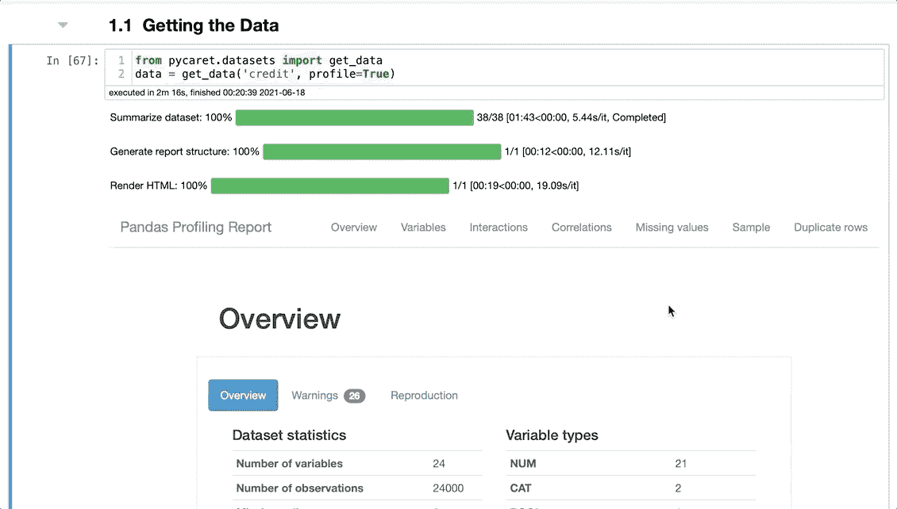
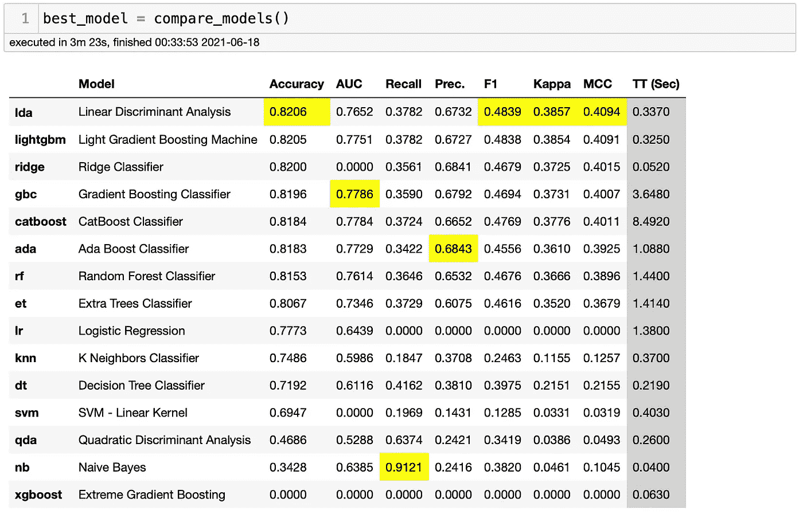
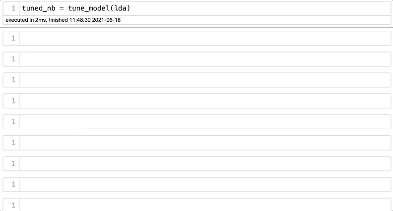
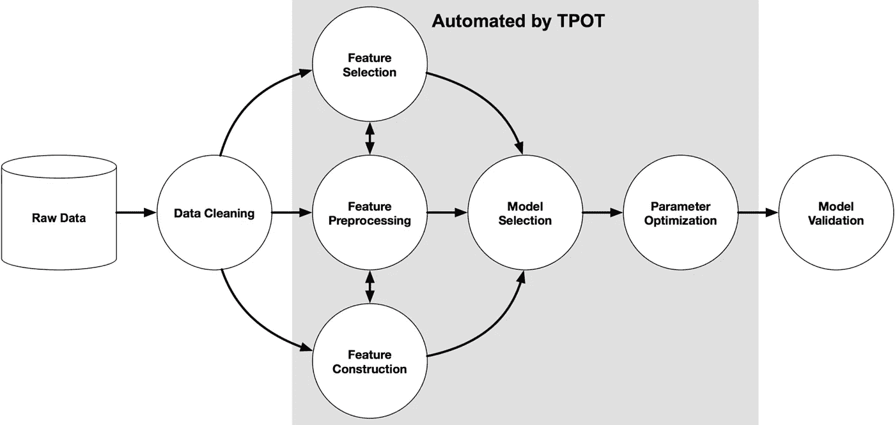
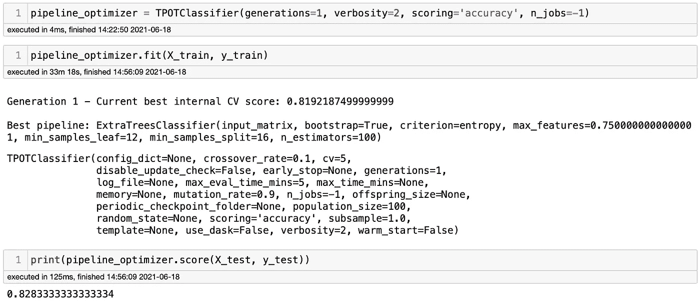
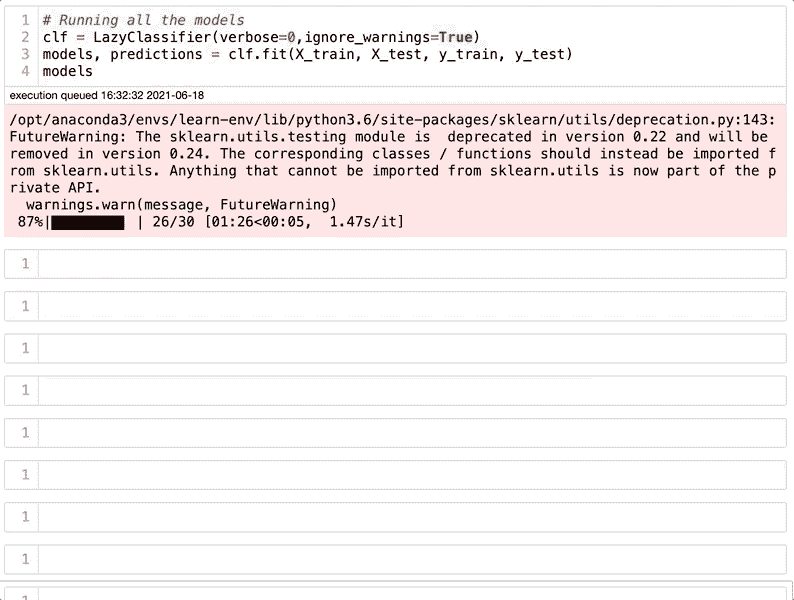
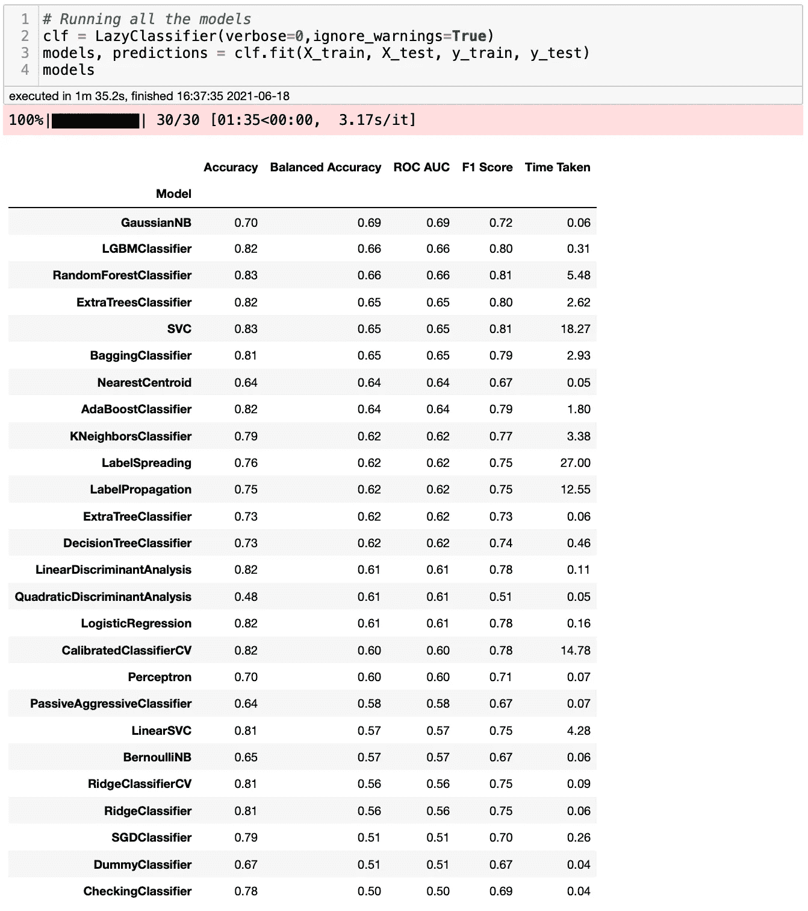
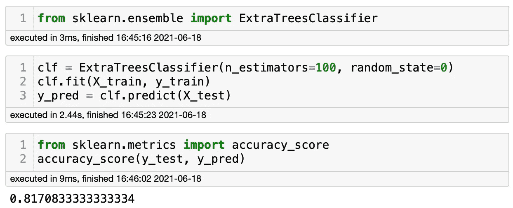

# 你应该知道的 3 个低代码 Python 库

> 原文：<https://towardsdatascience.com/3-amazing-low-code-machine-learning-libraries-that-you-should-know-about-a66895c0cc08?source=collection_archive---------14----------------------->

## 机器学习

## 以下哪一个是机器学习的最佳低代码库？


卡罗琳娜·格拉博斯卡拍摄的图片。来源: [Pexels](https://www.pexels.com/photo/student-doing-home-assignments-on-laptop-while-sitting-in-park-4497809/)

我在 Medium 上的一些最受欢迎的博客是关于图书馆的，我认为你应该试试。在这篇博客中，我将关注低代码机器学习库。事实是，许多数据科学家认为低代码库是捷径，应该避免。恐怕我不得不反对！我认为低代码库应该包含在我们的管道中，以帮助我们在不浪费时间的情况下做出重要的决定。

例如，假设您刚开始一个项目，不知道要开始测试哪个模型。您可以从那些您认为效果不错的模型开始，在您运行了几个模型之后，您可以决定您想要超调哪些模型。不利的一面是，您只能使用自己熟悉的模型，而且设置所有这些模型会花费很多时间。另一种选择是使用低代码库，同时运行几十个模型，选择最好的一个，尝试复制它，然后调用它。哪个对你来说听起来更聪明？

幸运的是，我们有许多用于机器学习的低代码库，今天我将介绍我最喜欢的三个。这个博客的目的是介绍一些库，这样你就可以自己尝试了。你可以在[这个笔记本](https://github.com/ismael-araujo/Testing-Libraries/tree/main/Low%20Code%20Machine%20Learning%20Libraries)里找到我用的代码。因此，我将不涉及微小的细节。让我们开始吧。

# PyCaret

最流行的用于机器学习的低代码库之一是 PyCaret。Medium 上有很多关于它的博客，包括我几周前写的一篇，你可以在这里找到它。以下是 PyCaret [网站](https://pycaret.org)对此的评论:

> PyCaret 是一个用 Python 编写的开源、**低代码**机器学习库，允许您在自己选择的笔记本环境中，在几分钟内从准备数据到部署模型。

顺便说一下，PyCaret 是这个博客中最好的图书馆网站，也是我见过的最好的网站之一。他们有详细的教程展示这个库必须提供的所有功能。现在，让我们看看如何使用 PyCaret。

首先，我们需要安装 PyCaret。为此，您可以在终端中键入`pip install pycaret[full]`。代码的完整部分包括所有的依赖项。为了安全起见，强烈建议您使用不同的环境。然后，我们需要一个数据集。PyCaret 内置了多个库。我不会一一赘述，但如果你想了解更多，你可以查看[这个博客](http://By the way, PyCaret has, by far, the best website among the libraries in this blog and one of the best that I have ever seen. They have detailed tutorials showing all the functions that this library has to provide. Now, let’s see how to use PyCaret.)。PyCaret 非常酷的一点是它附带了 QuickDA。这使得我们的数据集更容易理解。如果你想了解更多关于 QuickDA 的知识，你可以看看这个博客:[用这个库](/save-hours-of-work-doing-a-complete-eda-with-a-few-lines-of-code-45de2e60f257)用几行代码做一个完整的 EDA 节省了几个小时的工作。

```
**# Importing the dataset**
from pycaret.datasets import get_data
data = get_data('credit', profile=True)
```



作者图片

现在，让我们跳过所有的数据处理部分，直接进入建模。PyCaret 的网站上有多个数据预处理的例子，我强烈推荐你[去看看](https://github.com/pycaret/pycaret/blob/master/tutorials/Binary%20Classification%20Tutorial%20Level%20Beginner%20-%20%20CLF101.ipynb)。然而，关于 PyCaret 最酷的部分是，我们将用一行代码运行许多模型并对每个模型进行评分。

要运行所有的模型，需要输入`best_model = compare_models()`，就这样。此功能将训练库中的所有模型，并使用交叉验证对它们进行评分，以进行指标验证。现在你可能会问:在这一行代码中，数据集在哪里？我不知道，但是如果你发现了，请让我知道。让我们看看结果。



作者图片

正如我们在上面看到的，我们只用一行代码就运行了 15 个模型。里面甚至还有一个 XGBoost。看起来没用，但我们还有十四个其他模型要分析。所有这些模型都是在 3 分 23 秒内完成的。好吧，如果我们关注这个项目的准确性得分，线性判别分析是最好的模型。通常，我会使用 F1 分数，但为了演示的目的，我会使用准确性。现在，我们能超调这个模型吗？答案是肯定的，而且就像运行所有这些模型一样简单。



作者图片

我们走吧。精度从 0.8206 到 0.8213。有些人会说这可以忽略不计，但是请记住，您只需输入 20 个字符就可以获得这种改进。当我们谈论 PyCaret 时，还有更多的内容需要讨论。这是一个介绍，我强烈建议你检查他们的网站，并尝试它。

# TPOT

TPOT 是一个自动化的机器学习库。它的目标是自动化机器学习项目中最繁琐的部分，如特征预处理、特征选择、模型选择等。这就像有人为你工作。下图展示了 TPOT 过程。



一个机器学习管道的例子。来源: [TPOT 文件](http://epistasislab.github.io/tpot/)

以下是其网站对此的评论:

> TPOT 旨在成为一个助手，通过探索你可能从未考虑过的管道配置，给你提供如何解决特定机器学习问题的想法，然后将微调留给更受约束的参数调整技术，如网格搜索。

与 PyCaret 不同，TPOT 不是在几秒钟内跑完的。相反，需要几分钟(取决于您的数据集，可能需要几个小时)才能得到最佳结果。它们的默认设置是 100 代，种群大小为 100。如果我在我的 2019 款英特尔 MacBook Pro 上运行，需要几个小时或几天。因此，出于演示目的，我将只运行一个生成。结果，我会得到一个管道。它可能不是最好的，但可能有很好的精度。要安装 TPOT，你需要在你的终端键入`pip install tpot`。记得使用不同的环境。

我将使用我在 PyCaret 演示中使用的相同数据集。我们需要为 TPOT 训练一个测试集，就像使用 scikit-learn 一样。

```
**# Creating X and y variables**
X = data.drop(columns=['default])
y = data['default'] **# Train test split**
X_train, X_test, y_train, y_test = train_test_split(X, y, test_size=.2, random_state = 42)
```

好了，现在我们有了我们需要的一切。现在让我们运行一些管道。首先，我们需要导入将要使用的包。由于这是一个分类项目，我们将导入 TPOT 的分类包。

```
**from** tpot **import** TPOTClassifier
```

然后，我将设置管道优化器。有几十个参数可供选择。TPOT 有很好的文档，你可以很容易地找到每个参数的解释。我用的是最基础的，但是强烈推荐你找更好的参数。

```
**# Setting the model up**
pipeline_optimizer = TPOTClassifier(generations=1, verbosity=2, scoring='f1', n_jobs=-1)**# Fitting the model** pipeline_optimizer.fit(X_train, y_train)
```



作者图片

等了 33 分钟后(！)，TPOT 返回了上面的结果。我们可以看到，他们展示了模型和参数，如果你想复制它，就可以得到那个结果。如我们所见，使用树外分类器，最佳模型的精确度为 0.8283。它非常接近我们用 PyCaret 得到的结果。PyCaret 还运行了一个树外分类器。然而，TPOT 能够超调参数并获得更好的结果。

# 懒惰预测

LazyPredict 是一个低代码库，用两行代码运行几十个模型。它不如更受欢迎的同类产品强大。然而，LazyPredict 能够在几秒钟内返回基线模型！它并没有优化模型。但是，您可以使用 scikit-learn 轻松复制这些模型。

我已经写了一些关于 LazyPredict 的博客，我不打算再谈论这个神奇的库了。然而，这是一个关于机器学习的博客，我不能跳过 LazyPredict。你可以在这里找到我的博客[，在这里](/how-to-run-30-machine-learning-models-with-2-lines-of-code-d0f94a537e52)找到[，在这里](/how-to-run-40-regression-models-with-a-few-lines-of-code-5a24186de7d)找到[。](/3-awesome-python-libraries-that-you-should-know-about-e2485e6e1cbe)

现在，让我演示一下它是如何工作的。你可以在你的终端中输入`pip install lazypredict`来安装它，然后你就可以开始了。我将使用用于 PyCaret 和 TPOT 的相同数据集，以便我们可以比较结果。让我们首先导入将要使用的包。

```
**# Importing the packages that we will use**
import lazypredict
from lazypredict.Supervised import LazyClassifier
```

现在，让我们运行 30 个模型！LazyPredict 与 scikit-learn 非常相似。我们需要将模型添加到变量中，并使其适合我们的训练和测试数据集

```
**# Running all the models**
clf = LazyClassifier(verbose=0,ignore_warnings=True)
models, predictions = clf.fit(X_train, X_test, y_train, y_test)
models
```



作者图片

我们走吧！让我们仔细看看结果。



作者图片

我们得到了一些奇妙的结果，它们与我们用 PyCaret 和 TPOT 得到的结果非常相似。看起来 RandomForest 和 SVC 比我们看到的 PyCaret 和 TPOT 等更复杂的库得到了更好的结果。还记得我说过我们可以使用 scikit-learn 轻松复制这些结果吗？为什么我们不这样做，这样我们就可以看到结果是否相似？让我们使用 ExtraTree 分类器模型来检查一下。

```
**# Importing ExtraTreeClassifier**
from sklearn.ensemble import ExtraTreesClassifier**# Fitting and predicting model**
clf = ExtraTreesClassifier(n_estimators=100, random_state=0)
clf.fit(X_train, y_train)
y_pred = clf.predict(X_test)**# Checking score**
from sklearn.metrics import accuracy_score
accuracy_score(y_test, y_pred)
```



作者图片

LazyPredict 返回 0.82 分，scikit-learn 返回 0.817 分。那是非常接近的。我对 LazyPredict 的出色表现感到惊讶。你明白我为什么要把 LazyPredict 写进这个博客吗？

# 结论

PyCaret、TPOT 和 LazyPredict 是每个数据科学家都应该知道的三个优秀的库。虽然它们不能取代数据科学家的工作，但它们可以节省我们的工作时间。我不会使用他们的结果作为最终模型，但我总是在我的管道中包括至少一个。它们都易于使用，并且包含完整的文档。

我强烈建议你自己尝试一下，发现我在这篇博客中没有提到的特性。如果你了解到任何很酷的功能，请告诉我。你知道我应该在我的下一个模型中包括任何其他机器学习库吗？

**你可能也会喜欢…**

[*5 个你不知道但应该知道的 Python 库*](/5-python-libraries-that-you-dont-know-but-you-should-fd6f810773a7) [*4 个你应该知道的很酷的 Python 库*](/4-cool-python-libraries-that-you-should-know-about-bea9619e481c)[*3 个你应该知道的很牛逼的 Python 库*](/3-awesome-python-libraries-that-you-should-know-about-e2485e6e1cbe)