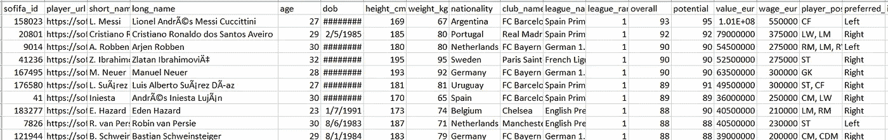
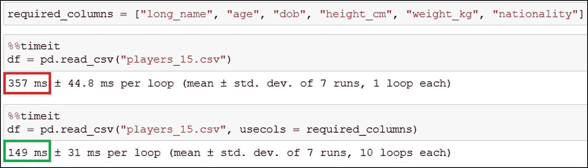
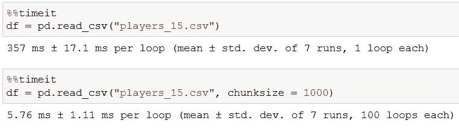
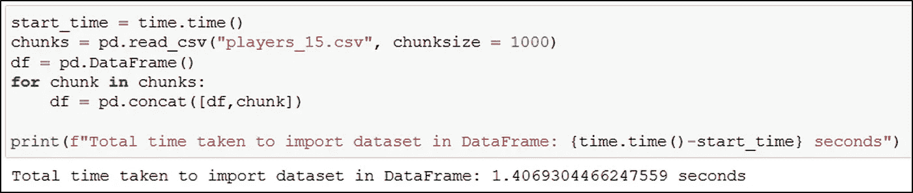
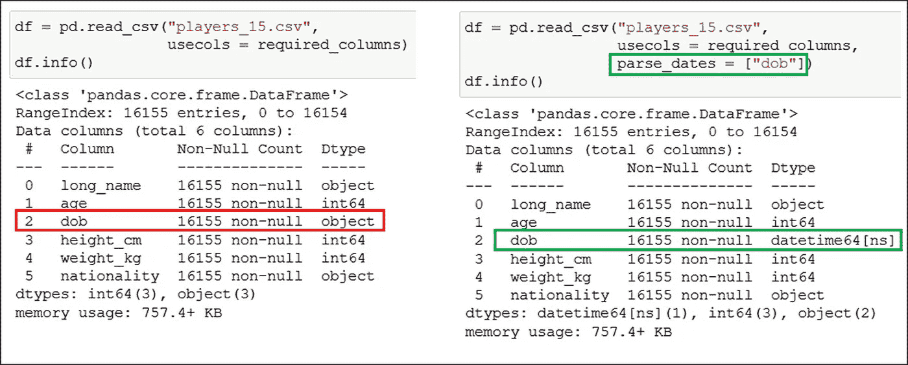
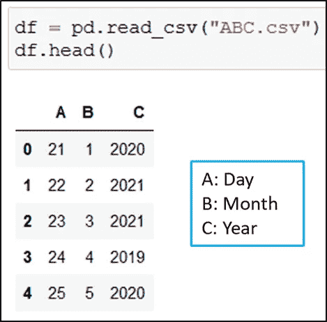
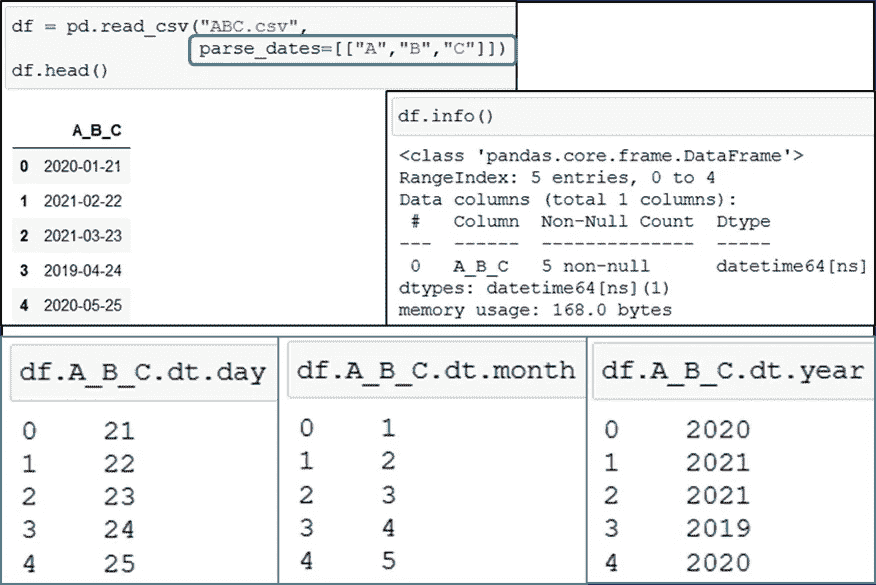

# 用 Python 有效读取 CSV 数据的 3(半)个强大技巧

> 原文：<https://towardsdatascience.com/3-and-half-powerful-tricks-to-effectively-read-csv-data-in-python-c4699a4f9d07?source=collection_archive---------33----------------------->

## 编程；编排

## 熊猫大师 read_csv()参数轻松提升您的分析能力

照片由[内容 Pixie](https://unsplash.com/@contentpixie?utm_source=unsplash&utm_medium=referral&utm_content=creditCopyText) 在 [Unsplash](https://unsplash.com/?utm_source=unsplash&utm_medium=referral&utm_content=creditCopyText) 上拍摄

**将逗号分隔值(csv)文件读入 DataFrame！**

数据分析的第一步是将数据导入 Python pandas 数据框架。然后探索和清理它。

在将数据加载到 DataFrame 中时，可以使用一些技巧来减少工作量。

在这 3 分钟里，你将掌握 3 种有效使用`**pandas.read_csv()**`的方法。💡

为了演示，我使用了来自 [Kaggle](https://www.kaggle.com/stefanoleone992/fifa-21-complete-player-dataset) 的 [**FIFA 2021 数据集**](https://github.com/17rsuraj/data-curious/blob/master/TowardsDataScience/players_15.csv) 。先睹为快的数据集在这里。

FIFA 2021 数据集|作者图片

我们来探讨一下，如何使用`pandas.read_csv()`有效地导入这个文件。

# 1.用途

`pandas.read_csv()`中的参数`usecols`对于仅加载 csv 数据集中的特定列非常有用。

下面是有无`usecols`的情况下`read_csv()`所用时间的直接对比

pandas.read_csv() usecols |作者图片

正在导入*。csv* 文件到熊猫数据帧使用`usecols`是⚡️ ***2.4X*** ⚡️比导入整个数据集快。

与其导入整个数据集然后删除不必要的列，不如只加载所需的数据。

# 2.组块大小

加载大型数据集的有效方法是将其加载到小部分中，即块中。💡

大型数据集的大小为千兆字节，行数超过数十万，通常需要很长时间才能加载到 Pandas 数据帧中。

熊猫 read_csv() chunksize |作者图片

直接比较显示使用`chunksize`比普通的数据导入要快得多。

但是，有一个条件！！！ ⚠️

在`pandas.read_csv()`中包含参数`chunksize`返回一个`TextFileReader`对象进行迭代。♻️

熊猫 read_csv() chunksize |图片 bu 作者

然后您需要使用`**pandas.concat()**`将所有的块放在一起，形成一个完整的数据帧。这可以如下进行，

连接熊猫数据帧|作者图片中的所有块

这无疑使得分块加载数据比直接读取整个数据集要慢，但在加载高达数十 GB 的文件时却很有效。

# 3.解析日期

通常，包含日期-时间数据的列作为对象或字符串导入。然后我们需要手动改变它的数据类型。

使用参数`parse_dates`来指出哪些列包含`read_csv()`本身的日期时间数据是个好主意。

pandas.read_csv() parse_dates |作者图片

🚩当多个列包含日期时间数据时，只需将所有列名作为列表传递给`parse_dates`。

# 3(半):用单独的日-月-年列制作一个日期列

当日期数据分布在多个列中时，也可以将它们组合在一起，形成一个包含日期值的列。

Pandas.read_csv() |作者图片

将列名作为 list 传递给`parse_dates`以生成一个包含日期值的列。

pandas.read_csv() parse_dates |作者图片

🚩组合这些列形成日期列的默认顺序是`**year-month-day**`。

*总结一下，*

掌握这些技巧，并明智地使用它们，可以减少数据清理中的工作，使数据分析更快。

与分块导入数据类似，您可以分块学习数据科学技能，Medium 是最适合的地方。

您可以通过下面我的推荐链接获得对 [***媒体***](https://medium.com/@17.rsuraj/membership) 的完全访问权限，并阅读由我&成千上万的其他人分享的如此惊人的内容。当你加入我的链接，我会得到你的会员费的一小部分作为支持，没有任何费用给你。

<https://medium.com/@17.rsuraj/membership>  

随时加入我的 [***邮箱列表***](https://medium.com/subscribe/@17.rsuraj) 保持更新！

感谢您阅读并投入您宝贵的时间！