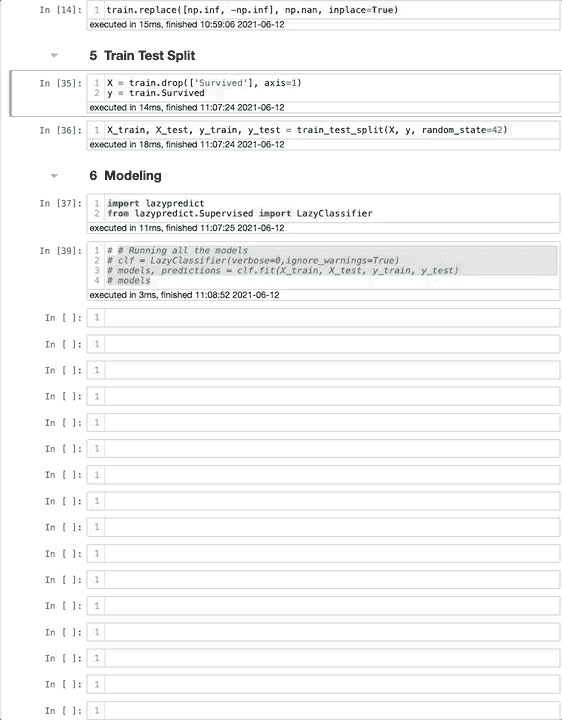
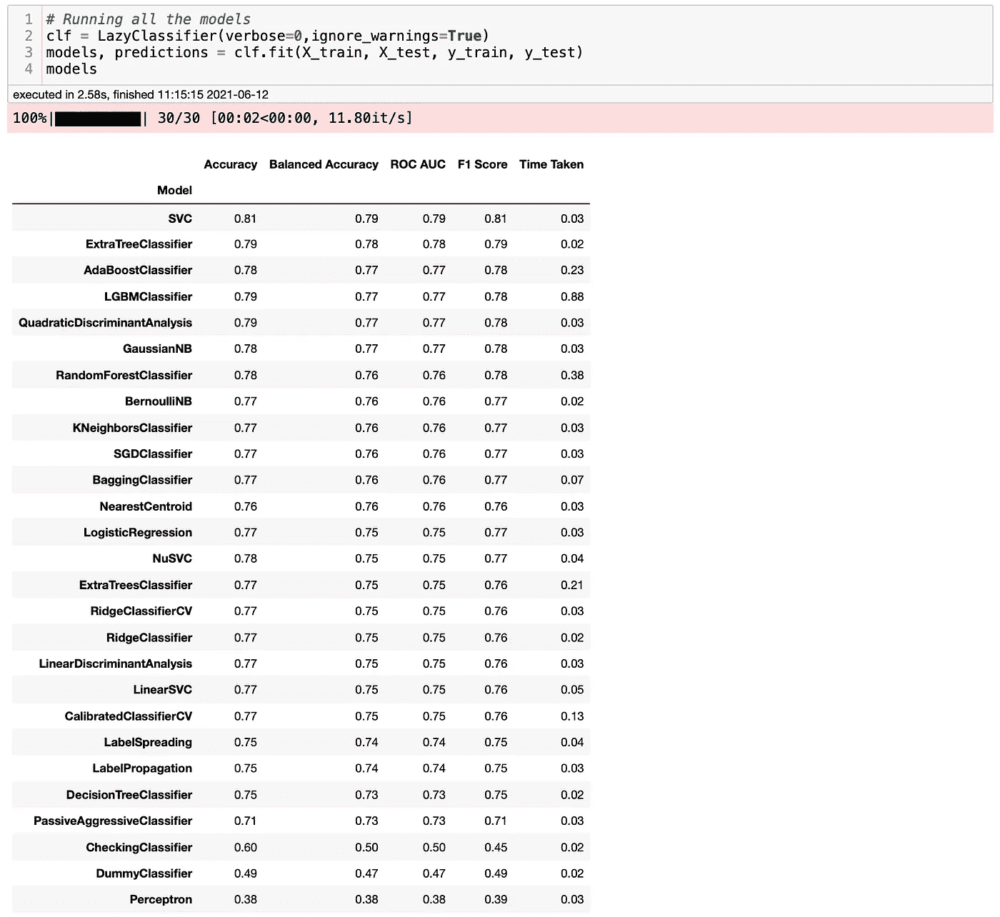
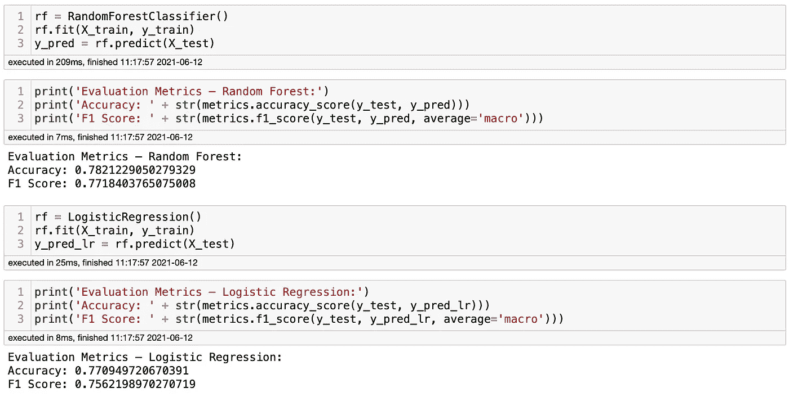
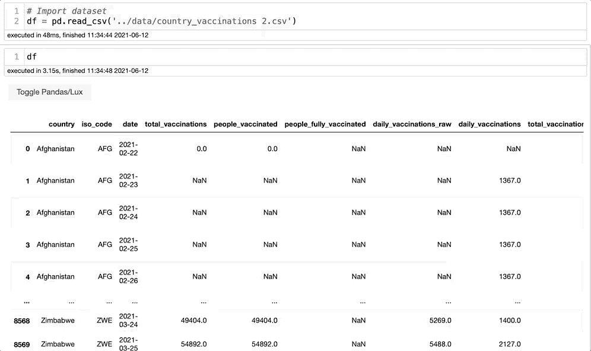
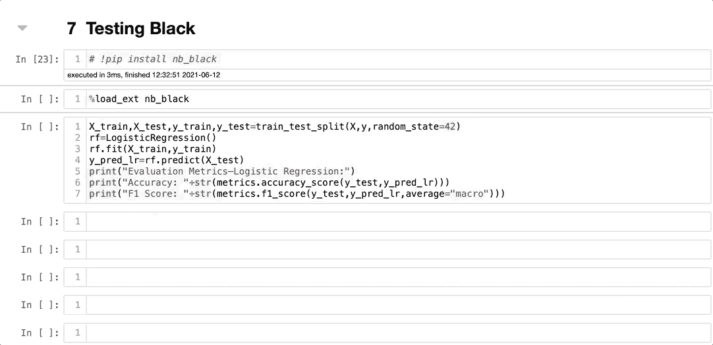
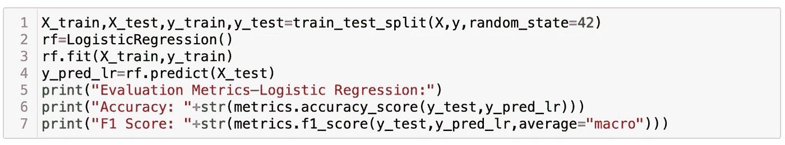
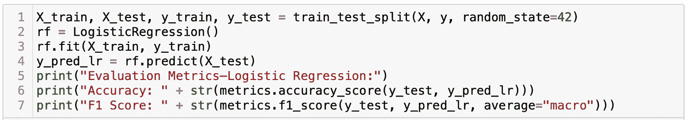
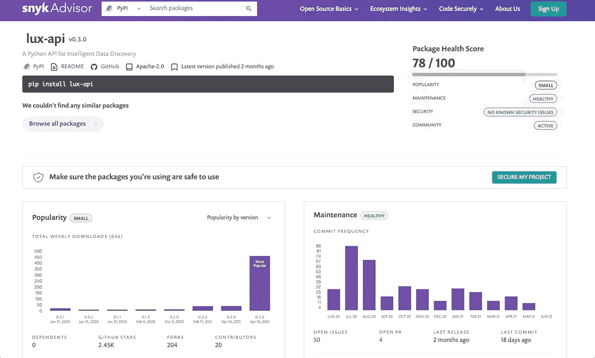

# 你应该知道的 3 个很棒的 Python 库

> 原文：<https://towardsdatascience.com/3-awesome-python-libraries-that-you-should-know-about-e2485e6e1cbe?source=collection_archive---------4----------------------->

## 大蟒

## 发现三个很酷的库，以及为什么你应该马上尝试它们


克里斯蒂娜·莫里路拍摄的图片。来源: [Pexels](https://www.pexels.com/photo/python-book-1181671/)

前几天我发表了一篇关于 [5 个你不知道，但应该](/5-python-libraries-that-you-dont-know-but-you-should-fd6f810773a7)的 Python 库的博客。那个博客在不到一周的时间里有数万次浏览。因此，我决定写第二部分，介绍一些您应该尝试的很酷的库。

Python 是计算领域最流行的语言之一。其中一个主要原因是，它包含了数百个开源库，可以让我们的生活变得更加轻松。人们关注更受欢迎(也更可靠)的库。然而，其他不太知名的图书馆可以节省你的宝贵时间。也就是说，让我们看看一些很酷的图书馆，如果你不知道，你会错过的。哦，最后我会有奖金推荐的。

# 懒惰预测

LazyPredict 是我今天榜单上的最爱。我过去写过关于它的博客，我永远也看不够。LazyPredict 是一个低代码机器学习库，允许您用两行代码运行多达 40 个基线模型。是因为效果出奇的好。

最酷的部分是它使用 Sklearn，允许你获得模型，看看什么最适合你，并像你通常做的那样进行 hypertune。要安装，你可以在你的终端输入`pip install lazypredict`，你就可以开始了。下图将展示如何同时运行 30 个模型。在这个演示中，我使用了泰坦尼克号数据集。

```
**# Importing the packages that we will use**
import lazypredict
from lazypredict.Supervised import LazyClassifier**# Running all the models**
clf = LazyClassifier(verbose=0,ignore_warnings=True)
models, predictions = clf.fit(X_train, X_test, y_train, y_test)
models
```



作者图片

此时，您可能会想:刚刚发生了什么？嗯，我做了一个训练测试分割，就像我通常会做的那样，然后我导入了 LazyPredict，建立了迭代，并检查了模型。运行所有这些模型不到 3 秒钟！最后，LazyPredict 返回一个带有一些指标的 DataFrame，比如准确性、ROC AUC 和 F1-Score。这是最后一部分的样子。



作者图片

好得难以置信，对吧？怎么才能知道这些结果是正确的呢？因为 LazyPredict 使用 scikit-learn，我们可以在运行我们的模型时测试它。让我们看看我们得到了什么。



他者形象

答对了。如果您将上面的结果与我们用 LazyPredict 得到的结果进行比较，您会发现结果非常相似。如果您不知道哪些模型最适合您的项目，LazyPredict 会非常方便。但是，我不推荐你的最终模型使用 LazyPredict。

LazyPredict 有所帮助，但不能取代数据科学家的工作。如果你想了解更多关于 LazyPredict 的内容，你可以在我的博客中找到关于它的 [**这里**](/how-to-run-30-machine-learning-models-with-2-lines-of-code-d0f94a537e52) 和 [**这里**](/how-to-run-40-regression-models-with-a-few-lines-of-code-5a24186de7d) 。如果你是西班牙语使用者，你可以在这里 找到西班牙语版 [**。**](https://planetachatbot.com/ejecutar-30-modelos-aprendizaje-automatico-lineas-codigo/)

# **勒克斯**

Lux 是另一个可以节省你很多时间的库。简而言之，Lux 是一个低代码库，它允许我们通过一次点击创建数据可视化来进行快速简单的数据探索。最酷的部分是 Lux 决定向您的数据集推荐什么可视化，而无需您做出决定。你可以在你的终端中输入`pip install lux-api`来安装它。让我们检查一个快速演示。



作者图片

就这么简单。你点击一下，瞧，你有你的结果。对于这个数据集，Lux 返回了相关性、分布、发生率和时间序列的可视化结果。如果你想检查特定的功能，你也可以很容易地做到这一点。为此，您可以键入`dataframe**.intent(**column_1, column_2**)**` **。我强烈建议你尝试一下。如果你想了解更多关于 Lux 的信息，你可以在这里找到我的博客。这是我最受欢迎的博客之一，试用者的反馈非常积极。**

# **黑色**

Black 是一个代码格式化程序，可以让你的代码看起来更好。这不是一个库，而是一个方便的扩展。大多数情况下，Python 不关心代码中的空格。然而，当您在一行代码中同时输入 140 个字符时，很难理解会发生什么。这不是最佳实践，有些人并不关心它。

另一种情况是当你从其他人那里得到代码时，很难理解发生了什么。布莱克是来帮忙的。老实说，我不使用黑色，因为我试图编写干净、易读的代码。然而，当我需要审查某人的代码时，我需要在 90%的情况下使用黑色。

要安装，可以输入`pip install nb_black`，应该就可以了。要使用它，你只需要输入一次`%load_ext nb_black`，每运行一个单元格，Black 就会自动格式化你的代码。让我们用一个我从 LazyPredict 部分得到的例子来探究一下。代码没有空格。然而，当我运行单元格时，Black 会自动添加空格，使代码看起来更好。



作者图片

你能看出区别吗？让我们仔细看看。

**运行单元前:**



作者图片

**运行单元后:**



作者图片

如果您能看到不同之处，您就理解了这种最佳实践的重要性，并且会很乐意将这种扩展用于其他人的代码。如果你看不出区别…好吧，那你应该马上开始用黑色！

我的看法是代码看起来好多了！很容易阅读和理解正在发生的事情。这是一个小演示。然而，对于更多的扩展代码，这有很大的不同。

# 额外小费

在写这篇博客的时候，我想检查一下图书馆是否还在接收更新。我通常会单独查找每个库的最新版本是什么，以及它是否与我拥有的版本相匹配。听起来工作量很大。让我惊讶的是，我发现了一个解决这个问题的网站，我不得不分享一下。

Snyk 开源顾问帮助我们搜索库，检查它们的版本，它们的受欢迎程度，保持更新，它们的 README 页面，并发现类似的库。它与 PyPI 一起工作。因此，您可以同时检查 PyPI。都在一个好看的网站。



作者图片

它看起来很好，我不得不把它放在这里。我最喜欢的一些特性是包健康评分和维护。为什么我以前没发现这个？

分析 Lux 的页面，我们可以看到它正在定期快速更新，其最流行的版本是 0.3.0。多酷啊。


作者图片

# 结论

我们的时间是宝贵的，我们应该充分利用它。这些 Python 库可以方便您的下一个项目，我强烈建议您尝试一下。这样，您就可以将宝贵的时间投入到其他任务中，比如 hypertunning 您的模型。这些图书馆都不应该取代专业人员。

它们应该被视为改进我们工作的一种方式。我不建议你只依赖这些库，而是把它们作为一个附加组件。感谢阅读，并让我知道什么图书馆不在这个列表中。下次我可能会写一写。编码快乐！

**你可能也会喜欢…**

[*5 个你不知道的 Python 库，但应该知道的*](/5-python-libraries-that-you-dont-know-but-you-should-fd6f810773a7) [*4 个你应该知道的很酷的 Python 库*](/4-cool-python-libraries-that-you-should-know-about-bea9619e481c)[*3 个你应该知道的低代码 Python 库*](/3-amazing-low-code-machine-learning-libraries-that-you-should-know-about-a66895c0cc08)