# 每个分析师的工具箱里都应该有 3 个 Ggplot 图表

> 原文：<https://towardsdatascience.com/3-basic-visualisations-that-should-be-in-every-analysts-toolbox-and-how-to-enhance-them-4ecb0d251e7?source=collection_archive---------34----------------------->

## 充分利用 ggplot2 中的颜色、形状和轴来增强 3 个基本图表；+r 中数据分析师的最佳实践。

作为分析师，我们的工作是从我们组织拥有的数据中获得洞察力。通常这来自上面的一个*问题*和我们的工作是决定用好的数据可视化(也就是图表)来回答这些问题的最佳方式。在我作为数据分析师工作一周年之际，我回顾了我收到的常见请求，以及我为回应这些请求而设计的图表。

本文接下来的内容是*“如何指导”*(1)完成分析的逻辑，以及(2)在 r 中构建相应的可视化。最后，我分享了在编写这些图表时的最佳实践，以提高您的代码在响应这些常见请求时的*寿命*。我希望这些对您作为数据分析师的工作有用！


**使用以下三个图表增强您的数据分析工具箱。** *照片由* [*苏珊·霍尔特·辛普森*](https://unsplash.com/@shs521?utm_source=medium&utm_medium=referral)*[*拍下*](https://unsplash.com?utm_source=medium&utm_medium=referral)*

# *每位分析师都会被问到的 3 个问题:*

> ***1。**“随着时间的推移，X 组之间 Y 的组成是如何变化的？”→参见**三维图***
> 
> ***2。**“有什么重大变化吗？”→参见**复合棒+点图***
> 
> ***3。**“一段时间以来的趋势是什么？”→参见**增强型同比图***

*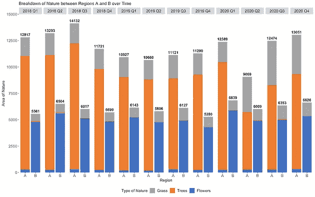****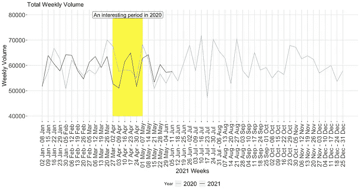*

*每个分析请求的相应可视化。下面我们将通过一步一步的指导来制作这些图表！*

## *在开始之前*

*   *虚拟数据用于以下示例，**，即所有数据都是虚构的**，任何与现实的相似之处纯属巧合。*
*   *R 中的`tidyverse`包带有方便的管道操作符`(%>%)`，这使得数据准备快速，代码简洁。因此，对于下面的图表，我们将需要这两个包:*

```
*## import packages in R
library(ggplot2)
library(tidyverse) # for data preparation*
```

# ****分析 1:用簇状堆积条形图展示 3 个维度****

*考虑以下场景*

*   *有两个区域:A 和 B*
*   *每个地区有 3 类植物:草、花和树*
*   *每个季度都会测量植物群的数量:从 2018 年 Q1 到 2020 年第四季度*

*有三个维度，`region`、`category`和`time`。我们可以使用堆积条形图的聚类来可视化每个维度的趋势。*

*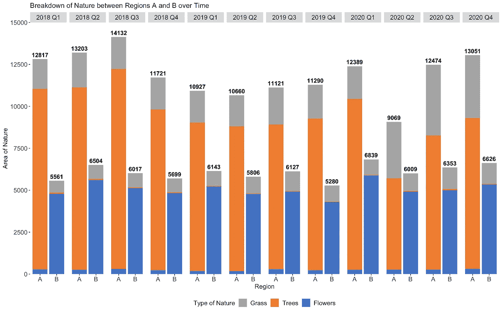*

*三维图表*

## *步骤 1:数据准备—透视数据集*

**

***数据集**:虚拟数据*

*您的数据可能看起来像左边的表 dummy_data。`dummy_data`还没有准备好输入到 ggplot 代码中，我们首先必须首先使“区域”成为数据集中的一列，而不是 A 和 B 分开。这在 R 中用`gather`函数很容易做到。*

```
*dummy_data_long <- gather(dummy_data, # existing dataset
                          `Region`, # give a name for the keys
                          count, # give a name for the values
                          A:B, # columns to get the keys
                          factor_key = TRUE) # store keys as factors## add a 'total' column, will be used for label on top of bars
dummy_data_long_w_total <- dummy_data_long %>% 
  group_by(quarter, Region) %>%
  mutate(Total = sum(count))*
```

*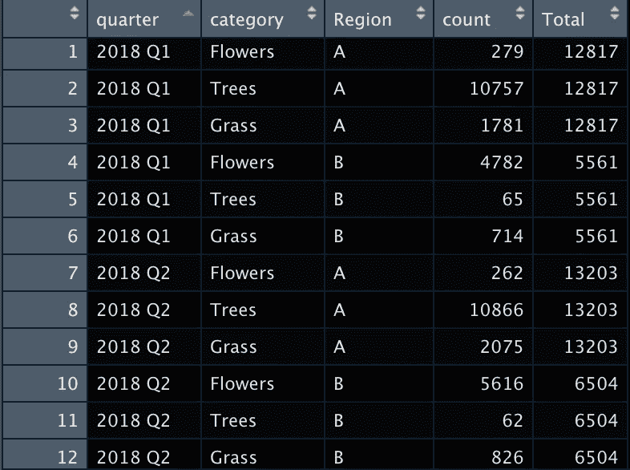*

***数据集:**虚拟 _ 数据 _ 长 _ 宽 _ 总*

## *步骤 2:创建堆积条形图——比较每个区域的类别*

*使用`geom_bar`创建 ggplot 中的条形图。只需在`geom_bar()`中指定`position = 'stack'`即可启用堆叠功能。*

*然后，通过使用`aes`中的`fill`参数，ggplot 知道根据`category`字段给条形图加阴影。因为我们已经指定了`position = stack`，每个`category`的条将被堆叠而不是并排放置。*

```
*# geom_bar() for bar chartsstacked_bar <- geom_bar(data = dummy_data_long_w_total,
                        aes(y = count, x = `Region`, 
                            fill = factor(category,
                             levels = c('Grass','Trees','Flowers')) 
                        ),
                        stat='identity',
                        position = 'stack') # STACKING DONE HEREfill_colours_category <- scale_fill_manual(values = 
                      c('Trees' = "#ed7d31", # excel orange 
                      'Flowers' = "#4472c4", # excel blue
                      'Grass' = "#a5a5a5")) # excel grey*
```

## ***第三步:对堆积条形图进行聚类***

*ggplot 允许我们将各种`geom`组件“添加”在一起，因此为了创建最终的图表，我们可以将上面创建的`stacked_bar`添加到其他格式行，这就是我们将如何实现聚类效果。*

*下面代码中的函数`facet_grid()`告诉绘图为我们的时间变量`quarter`创建一个堆积条形图。*

```
*ggplot() +
  stacked_bar + 
  fill_colours_category +
  facet_grid(~quarter) +  # CLUSTERING DONE HERE
  scale_y_continuous(breaks = seq(0,15000, by=2500),
                     limits = c(0,15000),
                     expand = c(0,0)) +
  labs(y = 'Area of Nature',
       x = 'Region',
       title = 'Breakdown of Nature between 
                Regions A and B over Time',
       fill = 'Type of Nature' )+
  bar_total_labels + ## see below for this code 
  chart_1_theme ## a theme() ob*
```

*只要你有一个`variable_to_cluster_by`，通过用你的图表替换`stacked_bar`并在末尾添加`facet_grid()`，你可以很容易地用任何其他图表(如折线图)复制这种聚类效果。*

**【额外】我还在剧情末尾加了一个* `*bar_total_labels*` *和* `*chart_1_theme*` *，格式化了剧情的审美。* `*bar_total_labels*` *是一个* `*geom_text*` *对象，而* `*chart_1_theme*` *是一个* `[*theme*](https://ggplot2.tidyverse.org/reference/theme.html)` *对象，你可以自定义(如果你想复制上面的主题，见代码结束)。**

```
**# the labels in the chart
bar_total_labels <- geom_text(data = dummy_data_long_w_total,
 aes(label = ceiling(Total),
 y = Total, x = `Region`,
 fontface = 2),
 size = 4,
 vjust = -0.5)**
```

> ****TLDR；绘制三维图表
> -*-**-*R 的*-`*gather*`-*函数对数据准备很有用
> -使用*-`*facet_grid*`-*为您的图表添加第三维**

# *分析 2:混合不同的几何图形来标记随时间的显著变化*

*考虑以下场景:*

*   *你的公司销售一些产品，电话，电视，笔记本电脑等。每周都会收集售出的数量。*
*   *您想要确定最近一周每种产品的销售量是否有显著变化。*

*一个*全面的数据可视化*将解决以下 3 个问题
(1)当前的销售量是多少
(2)以前销售量的基准
(3)是否有重大变化。*

*下面的图表用**颜色和几何图形**来解决这些问题。*

*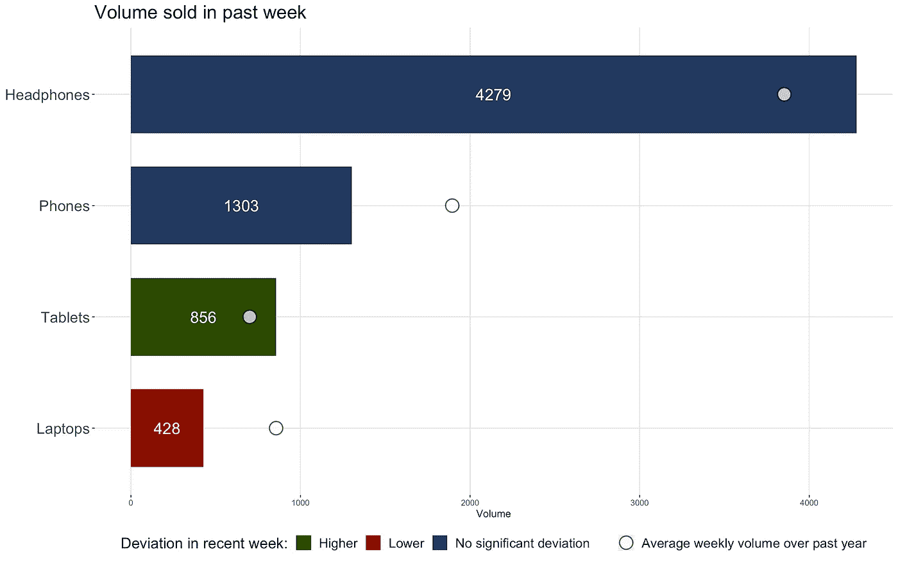*

*利用点和棒线来充分利用一个图表。*

## *步骤 1:数据准备—标出重大变更*

*你如何定义“重大”实际上取决于你自己的经营环境，没有正确的答案。对于这个例子，我认为显著是指一年中与`weekly average`的偏差超过 2 `standard deviations (sd)`，以使每周的交易量波动均匀。*

*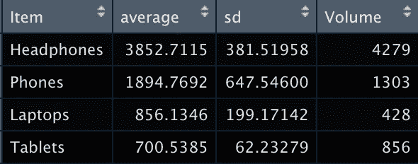*

***dummy_data_2:** 起始数据集。您需要首先计算这些字段。*

*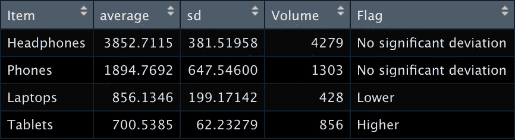*

***dummy _ data _ 2 _ flaged:**使用 tidyverse 轻松计算偏差。*

```
*dummy_data_2_flagged <- dummy_data_2 %>% 
  mutate(
Flag = case_when(
Volume > average+2*sd ~ 'Higher',    
Volume < average-2*sd ~ 'Lower',                   
 T                    ~ 
'No significant deviation'))*
```

*使用`tidyverse`中的`mutate`和`case_when`功能，轻松计算每个产品的偏差。*

## ***第二步:用条形的颜色标出偏差***

*与图表 1 类似，我们使用`geom_bar()`来创建条形图。为了用变量`Flag`给条着色，我们在`aes`下指定了`fill = Flag`。与图表 1 不同，我们没有指定一个`position`，因此条形没有堆叠。*

> **提示:我已经设置了* `*y = reorder(Item, Volume)*` *，所以条块按照* `*Volume*` *降序排列。**

```
*# standard ggplot bar chartrecent_volume_bars <- geom_bar(aes(y = reorder(Item, Volume), 
                                   x = Volume,
                                   fill = Flag),
                               stat = 'identity',
                               width = 0.7) ## set colours for the bars based on deviationflag_colours = c('Higher' = '#2c4b01',
                 'Lower' = '#8b0000',
                 'No significant deviation' = '#23395d')fill_colours_flag <- scale_fill_manual(values = flag_colours)*
```

**【额外】在条形上添加标签，显示最近一周的成交量**

```
**label_on_bars <- geom_text(aes(label = Volume,
                               y = reorder(Item, Volume),
                               x = Volume),
                           position = position_stack(vjust=0.5),
                           color = 'white', size=6)**
```

## ***第三步:用不同的几何图形表示平均周成交量***

*使用`geom_point`，我们创建一个反映平均值的点图。这给了读者一个很好的偏差比较点！*

```
*average_point <- geom_point(aes(y = reorder(Item, Volume),
                                x = average),
                            stat = 'identity', 
                            size = 6, alpha = 0.7,
                            fill = 'white', stroke = 1,
                            shape = 21)*
```

## ***步骤 4:为点添加图例***

*现在我们的图表上有多个元素，我们需要一种方法来解释图表上的点是什么意思。*

*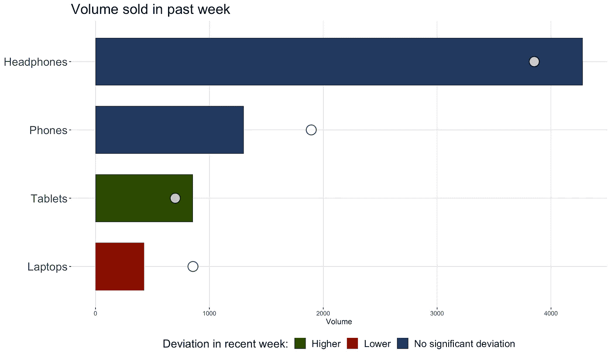*

*从第 2 步开始，在条形美学(`aes`)下指定`fill = Flag`会创建一个相应的图例来解释每种颜色的含义。但是对于我的点，我实际上不希望任何点的颜色不同。因此，我没有分配一个字段`colour`，这将使点的颜色因字段而异，而是将我想要显示的文本作为图例标题。因此，在步骤 3 的`aes`下添加`colour = “Average weekly volume over past year"`会产生以下图例:*

**

*图表显示了 geom_point 的图例，以向读者表明该点与条形有何不同。即使任何轴上的点都没有区别，也是如此。*

*由于我们将`colour`参数用于此“非预期”目的，因此需要进行几次“清理”:*

*   *使用`scale_colour_manual(values = c(‘black’))`为圆指定所需的颜色*

**

*在 labs 下指定 colour = NULL，以避免显示单词 colour*

*   *在最终图表中的`labs()`下指定`colour = NULL`，这样“颜色”一词就不会显示出来。*

```
*# Add all the elements together 
ggplot(dummy_data_2_flagged)+
  recent_volume_bars +
  fill_colours_flag +
  label_on_bars + 
  average_point + 
  scale_colour_manual(values = c('black'))+
  theme_deviation_chart +             # define theme() as you like 
  labs(title = paste('Volume sold in past week'),
       fill = "Deviation in recent week:",
       colour= NULL)* 
```

****【给感兴趣的读者】*** *你可能会奇怪为什么专门要用* `*colour*` *而不是其他的美学比如*`*fill*`*`*size*`*`*shape*`*`*alpha*`*等等。*****

****我们可以用* `*fill*` *审美代替* `*colour*` *，指定* `*scale_fill_manual(values = c('white')*` *。然而* `*fill*` *已经在我们的酒吧中使用，表示会干扰“清理”的偏差。我已经尝试使用* `*shape*` *和* `*size*` *但无法成功“清理”，很想听听是否有人对此有解决方案！****

> ******TLDR；复合条形图和点数图*** *-***利用 ggplot 中的不同元素用一个图表讲述更多内容
> -通过使用几何图形的美感在 ggplot 中添加几何图形的图例。*****

# ****分析三:增强同比图****

****同比图表是任何分析师工具箱中的主要工具，因为它能够反映最近的趋势和季节性。在 ggplot 中，基本的同比图表非常直观。通过在 geom_line 中指定一个“组”变量，我们立即得到下面的图。****

****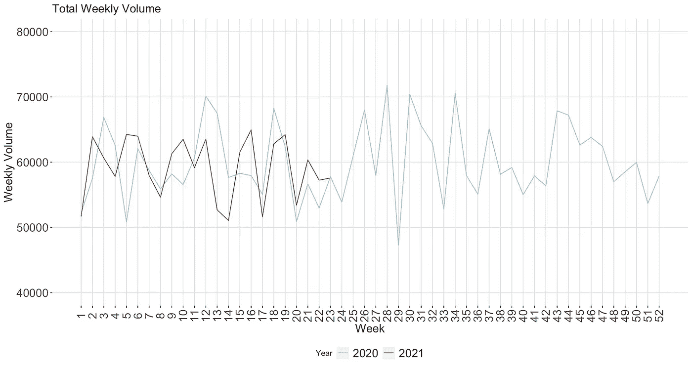****

****ggplot 中的基本同比图…可以改进****

****但是通过一点点处理和 ggplot 的元素，我们可以通过:
(1)将日期周期添加到 x 轴和****

****(2)遮蔽感兴趣的时间段。****

## ****步骤 1:数据准备-格式化 2021 年每周的日期范围****

****一年中的星期并不是最直观的，所以添加 2021 年每周的日期范围将让读者更好地了解一段时间内的趋势。为此，我们将在 R 中创建一个 dataframe，将 2021 年的每周映射到一个日期范围。在本例中，一周从星期六开始，到星期五结束。****

```
****# create a column for each date in 2021 
dates2021 <- as.data.frame(x=seq(as.Date("2021-01-01"), as.Date("2021-12-31"), by="days"))
colnames(dates2021) <- 'Date'first_sat_2021 <- as.Date('2021-01-02') # date to start year# Match each date to a week of 2021 (1 - 52) 
weeks_2021 <- dates2021 %>% 
  mutate(Week = floor(as.numeric(difftime(Date, first_sat_2021, units = "weeks")))+1,
         Year = 2021) %>%
  filter(Week > 0)****
```

****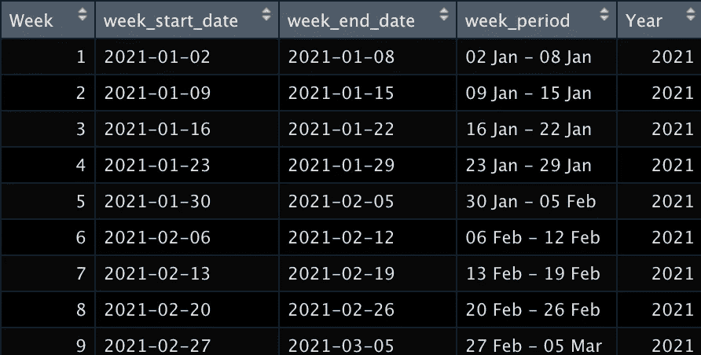****

****周 _ 周期 _2021****

****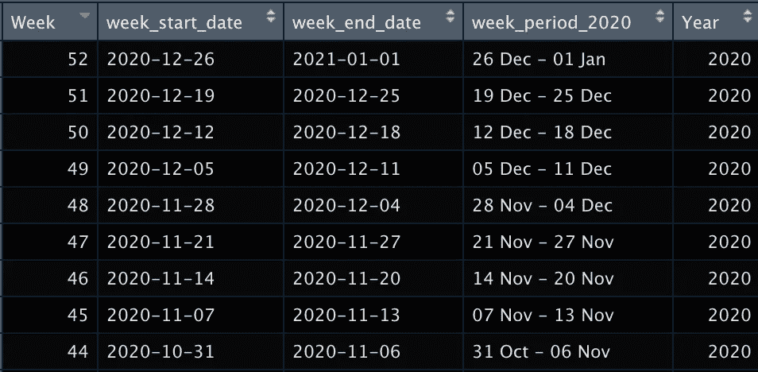****

****重复上面的代码，为 2020 年做同样的事情****

****将每个日期与一周匹配后，使用`group_by`功能为一年中的每一周格式化一个**日期范围**。****

```
****week_periods_2021 <- weeks_2021 %>% 
  group_by(Week) %>% 
  summarise(
week_start_date = first(Date),
week_end_date = last(Date)) %>% 
  mutate(
week_period = paste(
format(as.Date(
week_start_date),"%d %b"),
                                                   format(as.Date(week_end_date), "%d %b"),                      
sep = " - "),
                        Year = 2021)****
```

## ****步骤 2:数据准备——获取每周的数量****

****假设你有每天*卖出的产品数量*，我们可以使用 R 的`group_by`和`summarise`很容易地得到每周卖出的*数量。*****

```
****# Dataset with 2 cols: Date & Volume
dummy_data_vol <- read_csv('<YOUR DATASET>') %>%
  mutate(Date = as.Date(Date, format="%d/%m/%Y")) # Date to week mapping 
weeks_2020_2021 <- rbind(weeks_2020, weeks_2021)# Join the date to week mapping to your raw data, and calculate volume each week
volume_each_week <- dummy_data_vol %>%
  right_join(weeks_2020_2021, by = "Date") %>% 
  group_by(Year, Week) %>% 
  summarise(volume = sum(Volume)) %>% 
  ungroup() %>%
  mutate(Year = as.factor(Year))****
```

****上面的代码将给出前 3 列。将此与步骤 1 中格式化的日期范围连接，以添加第 4 列。****

****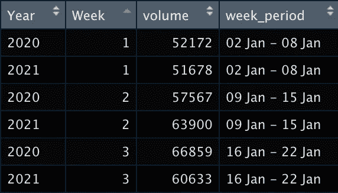****

****data frame:volume _ each _ week _ dates，用于绘图****

```
****# Add the 2021 date ranges to each week 
volume_each_week_dates <- volume_each_week %>% 
  left_join(week_periods_2021) %>% 
  mutate(week_period = as.Date(week_period))****
```

## ******步骤 3:使用分组变量为每年绘制一条线******

****如上所述，使用`geom_line()`中的`group`变量来指定你想要绘制多行的字段。对于同比地块，此字段将为`Year`。此外，`colour = Year`被指定为不同的线条颜色。你也可以指定`linetype = Year`来区分线条的形状(如虚线、点线、粗体)。****

```
****y_min = 40000
y_max = 80000basic_plot <- ggplot(volume_each_week_dates)+
  geom_line(aes(x = Week, y = volume,
                group = Year, colour = Year)) +
  scale_color_manual(values = c('2020' = "#95C8D8",
                                '2021' = "salmon4"))+
  labs(title = paste('Total Weekly Volume'),
       y = 'Weekly Volume',
       x = '2021 Weeks')+
  ylim(y_min, y_max) + 
  scale_x_continuous(breaks = volume_each_week_dates$Week,
                     labels = volume_each_week_dates$week_period,
                     guide = guide_axis(check.overlap=TRUE))+
  theme_trend_chart****
```

****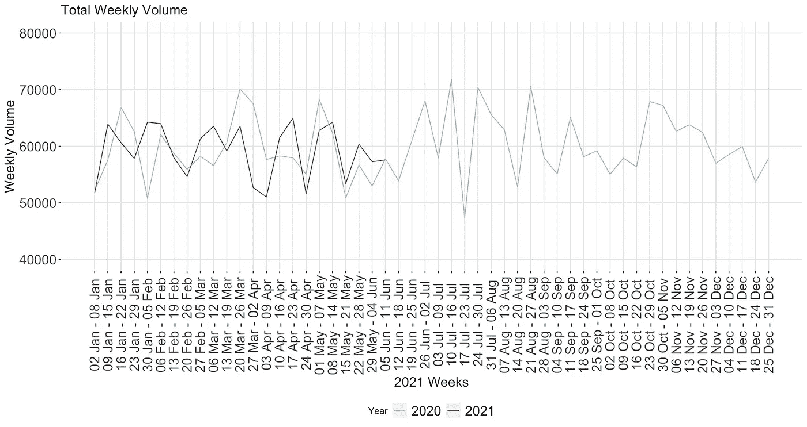****

****带日期范围的同比图****

****在`scale_x_continuous`下，指定在步骤 1 到`labels`中创建的日期范围，我们在左边得到相应的 x 轴。日期比第 1- 52 周更能让读者更直观地理解情节！****

## ******步骤 4:在图表中突出显示感兴趣的时间段******

****最后，为了增强基本线图，我们可以在 ggplot 中添加一个阴影矩形和相应的标签，以反映有趣的时间段，从而吸引读者的注意。用 ggplot 的附加结构也很容易做到这一点。****

****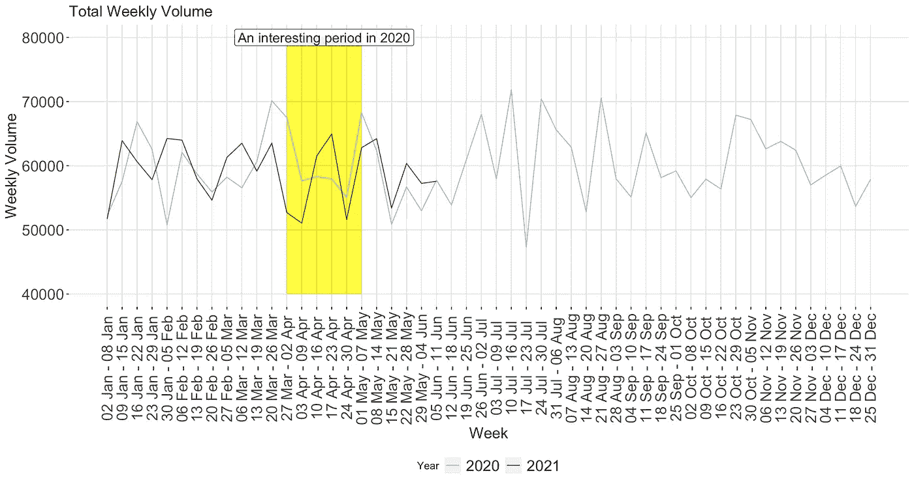****

****增强型同比图表****

```
****## use dataset in step 1 to find the weeks of interest interesting_period_start = 13
interesting_period_end = 18## shaded rectangle
shaded_area <- geom_rect(
  aes(
    xmin = interesting_period_start,
    xmax = interesting_period_end,
    ymin = y_min,
    ymax = y_max
  ),
  fill = 'yellow',
  alpha = 0.01,
  color = NA
)## text label
shaded_area_label <- annotate(geom = 'label',
                 x = (interesting_period_start + interesting_period_end)/2, y = y_max, 
                 label = 'An interesting period in 2020',
                 size = 5, angle = 0,
                 fill = 'white', alpha = 0.8)## add this to the basic plot above
basic_plot + shaded_area + shaded_area_label## note: for bolder lines, add shaded_area before geom_line()**** 
```

> *******TLDR:增强您的同比绘图*** *-在您的图表中为每个时间段创建日期范围
> -使用* `*geom_rect()*` *ggplot 对象添加阴影区域*****

# ****增强 R 中的数据分析和可视化的主要收获****

1.  ****使用`facet_grid()`功能向图表添加第三维****
2.  ****在 ggplot 中混合不同的几何图形，用你的可视化表达更多；并利用`aes`参数为几何图形添加一个图例****
3.  ****对轴和标签进行一些数据预处理可以使你的可视化更具可读性****

# ****超越 viz —数据分析师的最佳实践****

****除了创建可视化之外，我发现花一些时间来确保代码的可读性是有用和值得的。当必须重现分析时，这将保持您自己和您的团队的理智。以下是提示的非详尽列表:****

1.  ******将图表开始时的** `**theme()**` **定义为变量**。主题指定了图表的美感，如背景、网格线和大小。在代码的开头将`theme()`定义为一个变量，比如`my_theme <- theme(<your input>)`，然后将`my_theme`添加到每个图表中。如果您需要进行更改，尤其是如果您在一个报表中有多个图表，这将有助于提高代码的可读性和适应性。(我的每个图表的主题在下面的附件中。)****
2.  ****给你的代码加注释，并适当缩进。最后一条似乎很明显，但当试图匆忙做出分析时，有时会被遗忘。但是在这种情况下，一点点就足够了，当您需要重新查看代码时，您会感谢自己的！在 R 中，`#`用于注释代码。您可以使用至少 4 个标签在 RStudio 中创建可折叠的部分:
    `# This will create a collapsable section #####`****
3.  ****保存图表时在文件名中添加日期。当您必须定期运行报告时，这有助于防止覆盖现有图表。如果代码在 2021 年 6 月 15 日运行，下面的代码将把一个名为`your_chart`的 ggplot 对象保存到 R 中的`folder_path`下。****

```
****today <- as.character(Sys.Date(), “%y%m%d”)
plot.width = 35
plot.height = 15ggsave(filename = paste0("name_your_chart", today, ".jpeg"),
       plot = your_chart, path = folder_path,
       width = plot.width, height = plot.height, units = "cm")##[Extra] You can even code the date into folder_path so that a new folder is created each time you have to generate the charts! ##folder_path <-paste0(“~/Desktop/”, today)
if(!dir.exists(folder_path)){dir.create(folder_path)}****
```

****就这些了，谢谢你的阅读和关注！我希望这些图表和概念也能在你作为数据分析师的旅程中派上用场。数据科学社区的开放和共享是我最喜欢的事情之一，所以如果你有任何建议或更好的方法来编码这些图表，请在下面留下评论。快乐分析！****

## ****附件:各图表主题代码****

```
****chart_1_theme <- theme(
  panel.grid = element_blank(),
  panel.background = element_blank(),
  axis.title.y = element_text(size=12),
  axis.title.x = element_text(size = 12),
  legend.position = 'bottom',
  legend.title = element_text(size = 12),
  legend.text = element_text(size = 12),
  axis.text.x = element_text(size = 12),
  axis.text.y = element_text(size = 12),
  strip.text.x = element_text(size = 12)
)theme_deviation_chart = theme(
  axis.title.y = element_blank(),
  plot.title=element_text(size=20),
  plot.subtitle = element_text(size=16),
  axis.text.y = element_text(size = 16),
  legend.position = 'bottom',
  legend.title=element_text(size=16),
  panel.background = element_rect(fill="white", colour ="white"),
  panel.grid.major = element_line(size=0.5, linetype = "solid", colour="gray90"),
  legend.text = element_text(size=14)
)theme_trend_chart <- theme(
  axis.text.x = element_text(size = text_size, vjust=0.5, angle=90),
  axis.text.y = element_text(size = text_size),
  axis.title = element_text(size = text_size),
  axis.title.x = element_text(size = text_size),
  axis.ticks.y = element_line(linetype = "solid"),
  axis.ticks.x = element_line(linetype="solid"),
  plot.title=element_text(size=text_size),
  plot.subtitle =element_text(size=10),
  panel.background = element_rect(fill="white", colour ="white"),
  panel.grid.major = element_line(size=0.5, linetype = "solid", colour="gray90"),
  legend.text = element_text(size=text_size),
  legend.position = 'bottom')****
```