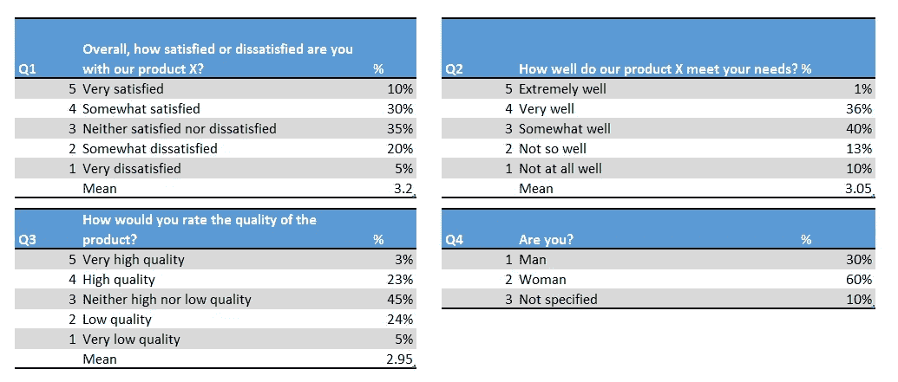
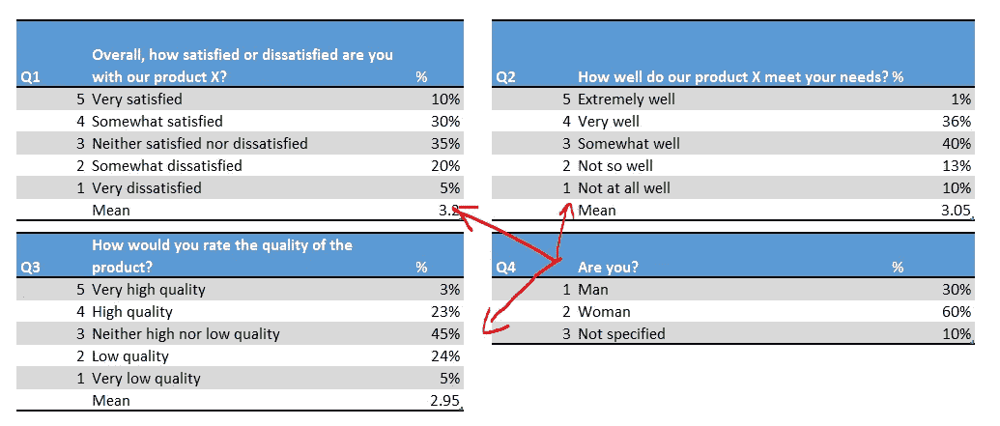
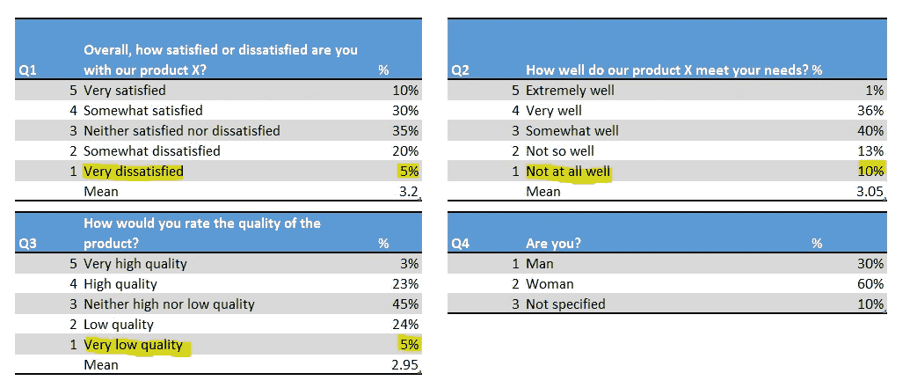

# 市场研究分析的 3 个基础

> 原文：<https://towardsdatascience.com/3-basics-for-market-research-analysis-6ee5ee528a01?source=collection_archive---------24----------------------->

## 市场调研数据可以欺骗你。学习如何使用它。

图片由 Unsplash 上的 [You X Ventures](https://unsplash.com/@youxventures) 提供

市场研究数据对任何商业决策都至关重要。然而，知道如何分析它是非常重要的。

业务需要推动创新和增长的见解和建议。

**你看到的杯子是半空的还是半满的？**这个问题是对如何阅读市场调研数据的隐喻。它可能有用，但具有欺骗性。

# **实例数据及分析**

Ivona Fikejzlova 提供

这里我们有一个关于产品 x 的消费者满意度调查的结果。我们邀请了 100 名受访者参加，并向他们发送了一份在线问卷。

一旦我们得到了数据，我们就把它交给一个分析师团队。以下是他们得出的见解:

## 积极的分析师

我们做得很好！我们 40%的顾客对产品满意。77%的人回答说这满足了他们的需求。其质量得到了 26%的高度赞赏。

我们需要确保我们保持产品原样，以确保交付的一致性和对产品的总体满意度。

## 消极分析师

我们需要做出改变来保持竞争力！业务正在发生变化。四分之一的消费者对产品表示不满。

问题是它不能像过去那样满足他们的需求。最重要的是，可悲的是，产品 X 没有达到它的质量要求。

几乎三分之一的受访者对其质量持负面评价。我假设年轻人对品质的要求比较少。

因此，我们需要测试产品并将其与市场标准进行比较。然后我们应该瞄准年轻顾客。

## 普通分析师

总的来说，我们正以平均水平着陆。我们的消费者认为该产品一般。它在满足需求和质量方面得分一般。

但是，达到平均水平是可靠和令人满意的。样本中女性多于男性。

## 谁是对的？

我提出三点意见。他们都处理过数据，所以他们肯定是对的。但是，请耐心等待。

没有人是对的。

除非有一份清晰的简报，否则分析师无法做出有意义的分析。简介应包含业务背景、目的和问题。我们没有给我们的分析师任何东西。因此，他们的数据洞察力因其分析风格而异。

此外，他们中的两个没有与整个数据一起工作。他们没有对性别问题发表任何评论。

消极的分析师得出了关于年龄的结论，而这个结论在调查中并没有被问到。

所以，这些推荐是没用的。我们不能带着假设工作，我们需要数据和专业知识。当然，有时候专家的意见就足够了。但总的来说，我们从数据中获得的洞察力越多越好。

# 3 市场研究的基础

这不是火箭科学。它必须以数据为基础，回答商业问题。让我们简单地讨论一下内部和外部的数据和分析。

## 1.案情摘要

任何分析都需要摘要。您拥有大量非结构化数据。你不知道该拿它怎么办。

商业问题可以引导你度过难关。背景和假设一样重要。恰当地做简报，见解就会准确无误。它们将是具体的和可操作的。

你需要与分析师讨论，找出你的数据库、在线工具、CRM 中有什么，以及你需要得到什么。良好的简介包含:

*   背景 —发生了什么事？为什么重要？
*   **商业问题**——顾客满意吗？他们喜欢或不喜欢什么？为什么我们在这个市场销售的产品越来越少？
*   **可用数据**(内部销售数据、广告数据等。)，或数据要求(消费者细分、市场表现、经济因素等)。)
*   **输出格式**(表格、演示文稿、算法、新活动等)
*   **时间线** —我们什么时候需要分析？

## 2.内部与外部数据

数据无处不在。它存在于你的内部数据库、绩效报告或社交网络中。您不必收集额外的数据，尽管有时这是明智的。

所以，首先，要明白自己已经有哪些数据。然后，想想还有什么更好的。获取数据可以是免费的，但也很昂贵。

市场研究是关于了解你的客户和市场。不可避免的是，你需要时不时地让顾客参与进来。Y

你既可以进行定性研究，也可以进行定量研究，就像我在示例数据集中展示的那样。顾客的意见很重要。

一个好的策略是收集关键指标并围绕它们进行分析。你可以综合运用各种数据来了解全貌。如果您需要进行调查，请确保您涵盖了所有领域。

每个问题都很重要。它可以帮助你指导未来关于产品开发或商业战略的决策。问卷的传统格式是从一般领域到具体领域，最后是回答者信息。

## 3.分析

数据很惊人。你可以在逻辑上将它们结合起来，并在趋势之间建立联系。

通过操纵数据、创建模型和编程交互式仪表板，您可以做很多事情。看的时候，有一些基本的东西要记住。

让我们回到关于产品 x 的表格。我对性别的影响感兴趣。我会把答案分成女人、男人和未指明的。

这样的话，我们可以看看是否有什么有趣的方向。例如，男人更关注质量，女人更关注可用性，等等。**关于地点、性别或年龄的数据对于消费者细分和分析来说是非常宝贵的**。

Ivona Fikejzlova 提供

市场调研数据分析的一条黄金法则是公平公正。指出积极的事情和可能的问题是很重要的。我们越早发现危险信号，就能越好地做出反应。

因此，请注意微小的数字，它们可能会对企业构成威胁。

Ivona Fikejzlova 提供

在这个例子中，我们看到了一些消极因素。人数不多——100 人中只有 5 或 10 人。

尽管如此，我们不应该低估他们。我们从实践中知道，5 个愤怒的顾客的评论可能胜过 20 个积极的评论。

所以，如果有机会，我们应该一直深入挖掘，去理解那些微小的数字。可能没什么大不了的，但是万无一失总比后悔好。

最后，但同样重要的是**讲故事的力量**。数据是干巴巴的。我们有无尽的报告。

平均值、平均数、百分比。听起来很无聊。你的分析可以让他们活起来。

驱动决策的不是数据本身，而是业务环境中的解释。

现在回到我的三个分析师和他们的分析。你最喜欢哪一个？

我要说，负面分析师做得相当好。他没有显示任何数据。他的演示不需要它们。然而，他可以制造一种紧迫感，让我们知道必须开发 x 产品。

市场调研正是如此。**我们讲述故事，描述消费者的类型和他们的决定。因此，不要试图解释数据，而要试图解释行为。跟随客户的产品之旅。**

# 最终想法

市场调研数据是一个百宝箱。当你打开它，你看到这么多珠宝。这是压倒性的。

但是正确的方法是用它来回答你的商业问题。这是一个支持你发展活动的过程。

在任何情况下，一定要提供一个简短的。所以，你的分析团队不会发狂。确保他们遵循基本规则(例如，客户特征或微小的报警数字)。你的数据会告诉你一个故事。现在是遵循它的时候了。

附注:你应该会收到我的邮件。 [***在这里做*** *！*](https://ivonahirschi.medium.com/subscribe) *如果你自己喜欢体验媒介，可以考虑通过注册会员 *来支持我和其他成千上万的作家* [**。每月只需 5 美元。**](https://ivonahirschi.medium.com/membership)*