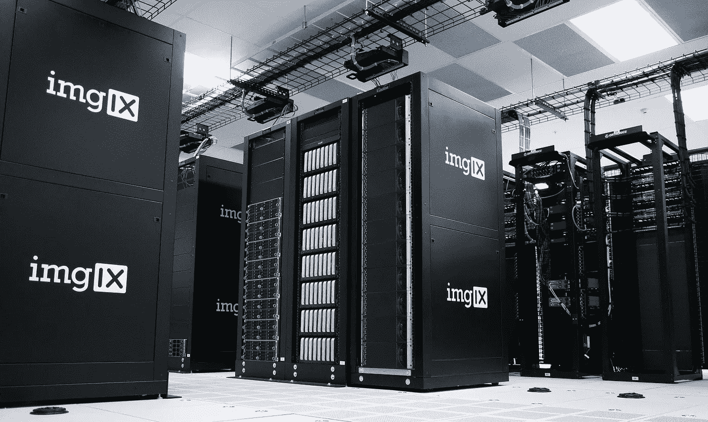

# 作为一名大数据工程师，我希望早些知道 3 个惨痛的教训

> 原文：<https://towardsdatascience.com/3-bitter-lessons-i-wish-i-knew-earlier-as-a-big-data-engineer-e2956bcc7b29?source=collection_archive---------25----------------------->

## 数据工程的注意事项


在 [Unsplash](https://unsplash.com/?utm_source=unsplash&utm_medium=referral&utm_content=creditCopyText) 上拍摄的 [ThisisEngineering RAEng](https://unsplash.com/@thisisengineering?utm_source=unsplash&utm_medium=referral&utm_content=creditCopyText)

D 数据已经成为每个行业的重要资产。从医疗保健到电子商务，从零售到汽车。这一趋势导致数据工作者人数过剩。他们的职责是从原始的、未经处理的数据中提取最多的信息。

在这些职业中，数据工程师为了减轻其他人的工作而弄脏自己的手。他们的职责是设计和维护可靠、稳定和容错的数据管道。数据管道由许多阶段组成:数据接收、数据转换和数据存储。在这些阶段中的每一个阶段，工程系统都必须按照其预期目的工作。数据工程师的工作是结合业务和技术需求来设计这样一个系统。

数据工程师可能不是 21 世纪最性感的工作。但它是科技公司的核心专业人员之一。对于有抱负的初级数据工程师来说，事情一开始可能会令人生畏。在处理大量数据时，存在许多技术问题。这些各种各样的障碍会使没有经验的工程师气馁。随着经验的积累，事情会变得更好，所以我会列出我在[大数据之旅](/my-way-to-big-data-engineering-9f681dc6e140)中学到的一些经验。对于那些期待征服数据世界的人，请系好安全带！

# **了解你的 SQL**

不管你喜不喜欢，人们倾向于用老式的方法做事。*没坏就别修。在技术世界里也是一样，新的并不总是更好。*

1979 年，Oracle 推出了第一个商用 SQL 关系数据库管理系统(RDBMS)。近半个世纪过去了，大部分时间公司仍然选择 RDBMS。

尽管这里和那里有一些关于 SQL 有多糟糕的争论，特别是关于它的冗长和不一致性。然而，它仍然是最流行的查询语言。根据 2021 年 DB-Engines 的 [RDBMS 排名](https://db-engines.com/en/ranking/relational+dbms)，第一名仍然属于 Oracle SQL，其次是 MySQL 和 MSSQL。

在新的大数据时代，相关数据仍然以结构化的方式进行组织。结构化语法是检索信息的最快和最有效的方法。

*   最流行的数据存储引擎 Hadoop 文件系统(HDFS)采用基于 SQL 的引擎，如 [Hive](https://www.tutorialspoint.com/hive/hiveql_select_where.htm) 或 [Presto](https://prestodb.io/) 来执行[特定查询](https://www.infoworld.com/article/2683729/10-ways-to-query-hadoop-with-sql.html)。
*   与一些认为 SQL [对于大数据](https://searchdatamanagement.techtarget.com/blog/The-Wondrous-World-of-Data/Big-Data-Myth-3-Big-Data-is-Too-Big-for-SQL)不够扩展的观点相反，一个精心制作的完整系统可以使用 SQL 处理大量数据[。数据量高达几十万千兆字节的公司仍然使用 SQL。](https://www.linkedin.com/pulse/what-do-you-mean-sql-cant-big-data-rick-van-der-lans/)
*   数据分析师分析数据以最终确定他们的决策过程。他们只能在分析工具的帮助下做到这一点，比如 Vertica、Tableau 和 Power BI。你猜怎么着？这些工具大部分使用 SQL。


卢克·皮特斯在 [Unsplash](https://unsplash.com/?utm_source=unsplash&utm_medium=referral&utm_content=creditCopyText) 上拍摄的照片

年轻的数据工程师，就像我过去的自己，经常忽视 SQL 用法的重要性。我一点也不知道，我的 SQL 中的一个小的优化可以导致显著的性能提升。一个小而巧妙的行为可以增强最终用户的体验。

[](/how-to-build-a-scalable-big-data-analytics-pipeline-7de18f8be848) [## 如何构建可扩展的大数据分析管道

### 大规模建立端到端系统

towardsdatascience.com](/how-to-build-a-scalable-big-data-analytics-pipeline-7de18f8be848) 

如今，许多大数据工具都带有预先优化的软件包。这使得 SQL 查询成为优化的唯一场所。掌握一个人的 SQL 并不总是简单的。归结起来就是理解系统的本质。我们组织数据的方式、所需的输出和查询执行条件。

```
***To-Do List***- [Learning SQL: Master SQL Fundamentals](https://www.amazon.com/Learning-SQL-Master-Fundamentals/dp/0596520832)
- [Data Analyst with SQL Server](https://www.datacamp.com/tracks/data-analyst-with-sql-server)
- [How to Learn SQL](https://www.datacamp.com/community/blog/how-to-learn-sql)
```

# **商业知识为王**

有抱负的毕业生申请成为数据工程师，希望满足技术先决条件。但是[职位描述](https://www.glassdoor.com/Job-Descriptions/Data-Engineer.htm)对商业知识只字未提。

*   您对 MapReduce 作业在 Hadoop 环境中的工作方式了如指掌。但是你知道什么是 [A/B 测试](https://www.abtasty.com/ab-testing/)吗？什么是 [ROI](https://www.investopedia.com/terms/r/returnoninvestment.asp) ？
*   您熟悉 MSSQL 系统中的表索引。但是你听说过 [CPC，CPM，或者 CTR](https://adacado.com/blog/ad-tech-glossary/) 吗？

实际上，我必须在日常工作中了解这些术语。它们在我工作的地方很具体，但在你的下一份理想工作中，你可能不得不当场学习全新的定义。

我有一个梦想。总有一天，有人会在数据工程师开始工作前教给他们所有的商业知识。没有适当的入职培训，事情可能会变成一场噩梦。我很幸运地参加了关于我的公司如何运作的简短信息会议。但是我很难理解我的非技术同事。


照片由[莱昂](https://unsplash.com/@myleon?utm_source=unsplash&utm_medium=referral&utm_content=creditCopyText)在 [Unsplash](https://unsplash.com/?utm_source=unsplash&utm_medium=referral&utm_content=creditCopyText) 上拍摄

没有商业知识，数据工程师将在一个充满黑暗的房间里工作。为了使他的工作更加清晰，数据工程师必须揭示业务需求的原因、方式和内容。

*   **为什么？**公司利用数据做出商业决策。但是要做到这一点，利益相关者必须回答为什么我们需要这个决定。为什么把每个人都放在同一条船上。经理、项目负责人、设计师、分析师，最后是数据工程师。目标基于事实和真相将船驶向正确的方向。
*   **如何？**一旦目的地确定，我们必须选择技术来导航全体船员。我们应该使用新技术吗？现有的东西够用吗？数据工程师承认他们必须使用工具来满足为什么。
*   **什么？**最后的答案是确定实际工作。我们已经看到了为什么和如何，现在放下什么就更清楚了。数据工程师构建数据管道，评估输入数据，验证输出数据。但不应该就此止步。我们必须重复这个过程来验证我们是否回答了为什么。

由于招聘过程的原因，数据工程师申请人经常忽视商业知识。没有人评估他们如何看待公司业务，或者他们对特定业务术语的熟悉程度。我们都可以在工作中学习，但这不应该发生。我们应该尽快解决这些问题，甚至在上班的第一天之前。它决定了我们一天结束时的表现。

```
**To-Do List**- [57 Marketing Terms You Need to Know](https://blog.influenceandco.com/50-marketing-terms-you-need-to-know)
- [91 Startup Terms Every Entrepreneur Should Know](https://visionxpartners.com/startup-terms/)
- [8 Ways to Gain Business Knowledge quickly](https://enterpriseleague.com/blog/business-knowledge/)
```

# **节省一个千兆字节等于赚了一个千兆字节**

数据是新的资产，存储现在是货币。我们选择如何存储数据会影响业务成果。数据工程师比任何人都认识到数据存储的价值。

> 因为我们想储存多少就储存多少，但这并不意味着我们应该这样做

根据这张[信息图](https://info.nasuni.com/hubfs/Nasuni.com-assets/Infographics/Hidden-Cost-of-Storage-Infographic.pdf)，2014 年的一份资料称，每年存储 1TB 数据的平均成本为 3351 美元。如今，便宜而可靠的云服务，如亚马逊 S3，每月每 GB 只需 0.02 美元。就存储容量而言，这是一个巨大的差异。



照片由 [imgix](https://unsplash.com/@imgix?utm_source=unsplash&utm_medium=referral&utm_content=creditCopyText) 在 [Unsplash](https://unsplash.com/?utm_source=unsplash&utm_medium=referral&utm_content=creditCopyText) 上拍摄

引擎存储器越来越适合处理大量数据。但是因为我们可以存储尽可能多的数据，这并不意味着我们应该这样做。即使存储层可以扩展，应用程序堆栈也赶不上庞大的数据量。

在数据存储方面，年轻的数据工程师需要谨慎行事。对于数据工程师来说，这听起来可能是一个乏味且不酷的任务，但从长远来看，它实际上为我们节省了金钱和精力。

从经济角度来说，存储的冗余数据越少，需要的空间就越少。然后是更有效的使用和廉价的数据契约。就环境而言，它减少了来自拥挤不堪的数据中心的碳足迹。

[数据存储管理](https://www.cio.com/article/2382585/14-things-you-need-to-know-about-data-storage-management.html)是一个复杂而微妙的课题。这是每个人的责任，涉及到企业的每一个角落。对于数据工程师来说，在处理数据时要记住一些想法。体贴地对待数据存储，不要使用超过你所需要的，给别人留有空间。