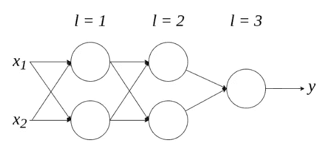
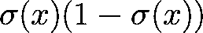
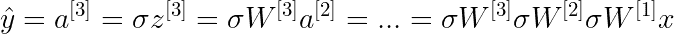
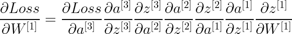
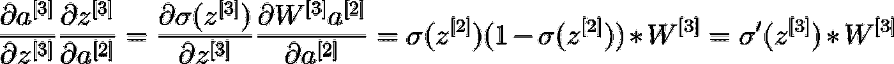
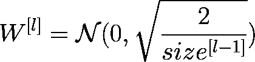
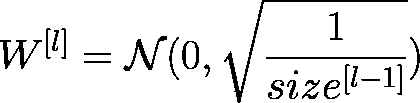

# 神经网络初始化的 3 个常见问题

> 原文：<https://towardsdatascience.com/3-common-problems-with-neural-network-initialisation-5e6cacfcd8e6?source=collection_archive---------12----------------------->


肖恩·奥尔登多夫在 [Unsplash](https://unsplash.com?utm_source=medium&utm_medium=referral) 上拍摄的照片

## 有哪些影响？我们如何避免它们？

常见的机器学习建模过程经历(1)权重初始化，(2)正向传播，(3)损失(或成本)计算，(4)反向传播，以及(5)使用优化算法的权重更新。虽然权重初始化通常就像一行代码一样简单，但人们往往容易忽略权重初始化有多精细，以及它对最终模型性能的影响有多大。

在这篇博客中，我们将研究神经网络初始化中的一些常见问题，它们相应的影响，更重要的是我们如何检测和避免它们。

```
**# one-liner weight initialisation for tensorflow**tf.keras.initializers.RandomUniform(minval=-0.05, maxval=0.05, seed=None)
```

## 零初始化—对称问题

*   **为什么会这样:**神经网络的初始化权值都为零
*   **结果:**神经网络将成为**线性模型**

神经网络之所以善于在数据中找出复杂的模式，部分原因是由于其**非线性**。通过将所有权重设置为零的相同值，反向传播中的所有偏导数对于每个神经元都是相同的。虽然这不会破坏算法，但是这将停止任何学习，因为同一层中的所有神经元将在迭代中具有相同的权重，即**所有神经元将学习相同的参数**。如果线性神经网络很好地服务于您的问题，它在内存和计算资源方面可能是过度的。你应该选择线性回归。另一方面，如果潜在的问题不是线性的，那么线性神经网络**不够健壮或准确**。

**减轻消失渐变的方法有:**

*   只需避免将所有权重初始化为零

## 太小的初始化-消失梯度

*   **为什么会这样:**神经网络的初始化权重太小
*   **结果:**过早收敛
*   **症状:**模型性能在训练过程中提升非常缓慢。训练过程也可能很早就停止。

如果神经元的初始权重相对于输入太小，当我们向后传播时，隐藏层的**梯度将呈指数减少。或者你也可以说，在层层叠叠中消失。为了更好地理解这一点，让我们假设我们有一个三层完全连接的神经网络，其中每一层都有一个零偏置的 sigmoid 激活函数:**



三层全连接神经网络—来源:图片由作者提供

如果我们快速回忆 sigmoid 函数及其导数的样子，我们可以看到，当 x=0 时，sigmoid 函数的导数(即梯度)的最大值是 2.5。


Sigmoid 函数和导数—来源:[Sigmoid 函数的导数](/derivative-of-the-sigmoid-function-536880cf918e)



sigmoid 函数的导数以其自身的形式存在——来源:图片由作者提供

当使用梯度下降来训练模型时，我们将使用反向传播来更新整个神经网络的权重，方法是对每层的权重取损失值的偏导数。为了得到上面网络的偏导数，我们需要首先知道它的数学表达式。假如

*   **a** 代表激活功能的输出，
*   **σ** 代表 sigmoid 函数(即我们的激活函数)，
*   **z** 代表一层神经元的输出，
*   **W** 代表每层的重量

上述神经网络可以表示如下:



使用 sigmoid 激活函数对上述内容进行数学表示——来源:图片由作者提供

并且用于更新第一层中的权重的偏导数看起来如下:



用于更新第一层权重的渐变—来源:作者图片

如果你觉得这看起来像一连串的呕吐，那么恭喜你，你已经掌握了它的要点！一种直观的理解方式是:因为如果所有权重都相对较小(例如 0.005)，偏导数根据链式法则相乘，那么当我们向后传播时，sigmoid 的梯度将变得越来越小。

由于梯度将用于调整每个层的权重，早期层的权重将几乎不会由于消失的梯度而改变。并且当权重变得稳定时，训练过程将结束，即模型不能从数据中学习任何其他东西。但是，模型还没有收敛；它只是遭受一个消失的梯度！

**减轻消失渐变的方法有:**

*   LSTM 可以用它的门解决渐变消失的问题
*   使用激活函数，如 ReLu 或 leaky ReLu，它们都不容易消失梯度
*   减少层数
*   将权重随机初始化为足够大的期望值

## 过大的初始化—爆炸梯度

*   **何时发生:**神经网络的初始化权重过大
*   **结果:**损失值将在最小值附近振荡，但无法收敛
*   **症状:**由于模型的不稳定性，每次更新时损失值都会有较大的变化。损失值也可能达到 NaN。

相反，当权重太大时，**梯度(偏导数)将指数增加，因为我们向后传播**以更新权重。或者你也可以说，通过层爆炸。结果，权重在迭代之间剧烈变化，导致模型不稳定。训练过程的不稳定性也将使模型更难收敛到全局最优，而是围绕全局最优振荡。



早前偏导数链的一部分—来源:作者图片

即使 sigmoid 具有 0.25 的小最大梯度，我们也可以看到，如果神经网络的所有权重都大于 4，那么导数链的所有单独部分都将变得大于 1，因此导致爆炸梯度。同样，由于偏导数链会更长，来自早期层的权重比后期层的权重遭受更多。

**避免爆炸渐变的方法可以:**

*   限制渐变大小的渐变剪辑
*   使用像 ReLu 或 leaky ReLu 这样激活函数，它们都不太容易爆发梯度
*   用足够小的期望值随机初始化权重
*   减少层数

## 初始化方法的荣誉提名

随着深度学习模型越来越复杂，消失梯度和爆炸梯度的问题只会更加明显。**初始化权重的一般经验法则是(1)使其随机，(2)每层具有稳定的方差，以及(3)潜在地使分布对称。**在此基础上，已经有很多优秀的工作致力于权重初始化，旨在更好和**更快地收敛，减少梯度问题**。这里有两种更常见的初始化方法，你可能会发现它们对构建你自己的深度学习模型很有用:

*   **He 初始化**[**(He et al . 2015)**](https://arxiv.org/abs/1502.01852)**:**这更适合初始化 ReLu 和漏 ReLu 激活函数的权重。



他初始化-来源:作者图片

*   **Xavier 初始化** [**(Glorot 等人，2010)**](http://proceedings.mlr.press/v9/glorot10a/glorot10a.pdf) **:** 这更适合初始化 tanh 激活函数的权重



Xavier 初始化——来源:作者图片

## 结论

这是这个博客的内容。我们已经涵盖了对称问题，消失梯度，爆炸梯度，如何检测它们，以及如何避免它们。我们还简要地提到了 He 和 Xavier 初始化，它们分别更适合 ReLu 和 tanh。

希望你觉得这个博客有用！如果我错过了什么，或者如果你有任何问题，请随时回复或 pm。如果你想了解更多关于 Python、数据科学或机器学习的知识，你可能想看看这些帖子:

*   [谷歌的 RFA:近似变形金刚中的 Softmax 注意力机制](/google-deepminds-rfa-approximating-softmax-attention-mechanism-in-transformers-d685345bbc18)
*   [TensorFlow:用 GPU 将 NumPy 加速 10000 倍以上](https://pub.towardsai.net/tensorflow-accelerate-numpy-with-gpus-964e9087fdab)
*   [改进数据科学工作流程的 7 种简单方法](/7-easy-ways-for-improving-your-data-science-workflow-b2da81ea3b2)
*   熊猫数据帧上的高效条件逻辑
*   [常见 Python 数据结构的内存效率](/memory-efficiency-of-common-python-data-structures-88f0f720421)
*   [与 Python 并行](/parallelism-with-python-part-1-196f0458ca14)
*   [数据科学的基本 Jupyter 扩展设置](/cookiecutter-plugin-for-jupyter-easily-organise-your-data-science-environment-a56f83140f72)
*   [Python 中高效的根搜索算法](/mastering-root-searching-algorithms-in-python-7120c335a2a8)

如果你想了解更多关于如何将机器学习应用于交易和投资的信息，这里有一些你可能感兴趣的帖子:

*   [Python 中交易策略优化的遗传算法](https://pub.towardsai.net/genetic-algorithm-for-trading-strategy-optimization-in-python-614eb660990d)
*   [遗传算法——停止过度拟合交易策略](https://medium.com/towards-artificial-intelligence/genetic-algorithm-stop-overfitting-trading-strategies-5df671d5cde1)
*   [人工神经网络选股推荐系统](https://pub.towardsai.net/ann-recommendation-system-for-stock-selection-c9751a3a0520)

[](https://www.linkedin.com/in/louis-chan-b55b9287/) [## Louis Chan-FTI Consulting | LinkedIn 数据科学总监

### 雄心勃勃的，好奇的和有创造力的个人，对分支知识和知识之间的相互联系有强烈的信念

www.linkedin.com](https://www.linkedin.com/in/louis-chan-b55b9287/)