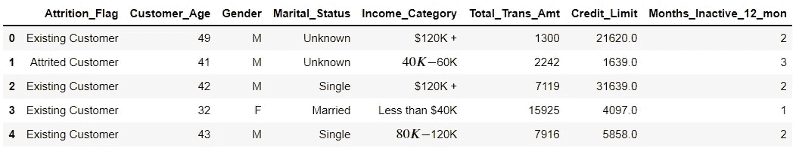
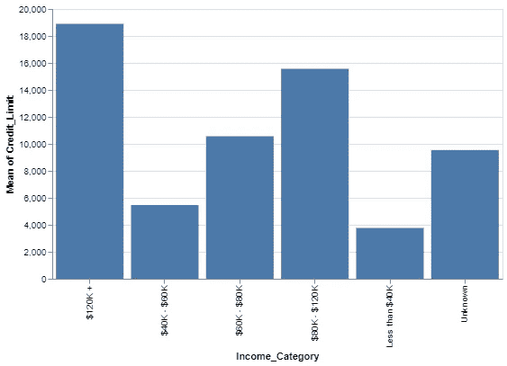
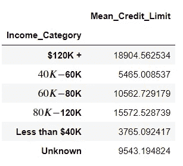
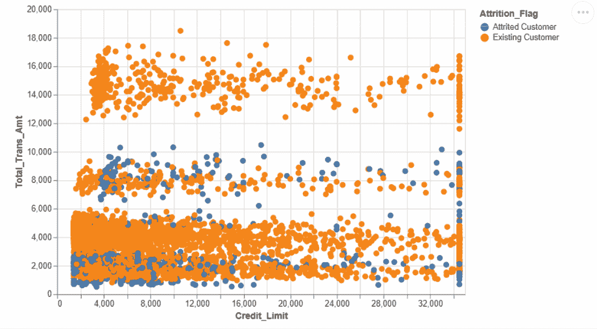

# Python Altair 的 3 个很酷的特性

> 原文：<https://towardsdatascience.com/3-cool-features-of-python-altair-deb3f432cc11?source=collection_archive---------15----------------------->

## 它不仅仅是一个数据可视化库


照片由[萨曼塔·加德斯](https://unsplash.com/@srosinger3997?utm_source=unsplash&utm_medium=referral&utm_content=creditCopyText)在 [Unsplash](https://unsplash.com/s/photos/simple?utm_source=unsplash&utm_medium=referral&utm_content=creditCopyText) 拍摄

数据可视化是数据科学不可或缺的一部分。它加速了许多任务，例如探索数据、交付结果、讲故事等等。幸运的是，Python 有很好的数据可视化库。

Altair 是一个用于 Python 的声明式统计可视化库。它提供了几个功能来执行数据分析，同时创建惊人的可视化。

在本文中，我们将介绍 Altair 的 3 个特性，它们有可能提高您的效率。

和其他软件工具和软件包一样，最好的学习方法是通过实践。因此，我将尝试用例子来解释这些特性。我们将在知识共享许可下使用 Kaggle 上的客户流失数据集。请随意下载并跟随。

Altair 可以通过 pip 轻松安装，如下所示:

```
pip install altair#if you are using jupyter notebook
!pip install altair
```

让我们导入库并将数据集读入 Pandas 数据框。

```
import pandas as pd
import altair as altchurn = pd.read_csv("Data\\BankChurners.csv")
```

我们将只使用原始数据集中的一些列。我们还需要最多 5000 个观察值(即行)才能使用 Altair。下面的代码片段执行必要的过滤操作。

```
features = [
    "Attrition_Flag",
    "Customer_Age",
    "Gender",
    "Marital_Status",
    "Income_Category",
    "Total_Trans_Amt",
    "Credit_Limit",
    "Months_Inactive_12_mon"
]churn = churn[features].sample(n=5000, ignore_index=True)churn.head()
```



(图片由作者提供)

我们现在可以开始探索 Altair 的酷功能了。

## 1.数据聚合

Altair 允许在创建可视化时聚合数据。它为我们节省了一些通常由数据分析和操作库(如 Pandas)完成的操作。

例如，我们可以创建一个柱状图，展示每个收入类别的平均信用限额。

```
(alt.
  Chart(churn).
  mark_bar().
  encode(x='Income_Category', y='mean(Credit_Limit):Q').
  properties(height=300, width=400))
```



(图片由作者提供)

我们在 encode 函数中传递给 y 参数的内容执行与 Pandas 的`groupby`函数相同的操作。

```
churn.groupby(["Income_Category"]).agg(
   Mean_Credit_Limit = ("Credit_Limit","mean")
)
```



(图片由作者提供)

## 2.过滤

Altair 还提供了过滤数据的功能，以便我们可以创建更集中或更具体的图。有几个谓词被传递给了`transform_filter`函数。每个谓词应用不同的过滤方法。

例如，其中一个谓词允许基于值列表过滤行。下面的代码创建一个条形图，显示由`oneOf`参数指定的列表中给出的每种婚姻状况的平均信用额度。

```
(alt.
  Chart(churn).
  mark_bar(width=50).
  encode(x='Marital_Status', y='mean(Credit_Limit):Q').
  transform_filter(
      alt.FieldOneOfPredicate(
          field="Marital_Status",
          oneOf=["Single","Married","Divorced"])).
  properties(height=300, width=500))
```


(图片由作者提供)

您可能已经注意到，第二个图中的条形比第一个图中的条形窄。可以使用`mark_bar`功能的宽度参数调整条的宽度。

## 3.动态过滤

我们也可以用 Altair 实现动态过滤。它允许使用共享过滤器将多个图绑定在一起。

我们首先创建一个捕捉用户交互的选择对象。顾名思义，它用于选择可视化上的值。选择对象可以连接到图例或另一个图。

换句话说，我们使用选择对象在一个绘图或图例上指定一个条件。然后，基于此选择过滤值。

举个例子会更清楚。

```
selection = alt.selection_multi(
   fields=['Attrition_Flag'], bind='legend'
)alt.Chart(churn).mark_circle(size=50).encode(
   x='Credit_Limit',
   y='Total_Trans_Amt',
   color="Attrition_Flag",
   opacity=alt.condition(selection, alt.value(1), alt.value(0.1))
).properties(
   height=350, width=500
).add_selection(
   selection
)
```

这段代码片段的作用如下:

*   它使用损耗标志列创建一个选择对象。它必然与传说有关。
*   然后，它创建一个信用限额和总交易金额列的散点图。这些点根据损耗标志列进行着色。
*   “不透明度”参数用于根据选择调整点的不透明度。
*   属性功能修改绘图的大小。
*   最后一步是将选择对象绑定到这个可视化对象。

结果如下:



(作者 GIF)

## 结论

在数据转换和过滤方面，Altair 是一个强大的数据可视化库。它简化了许多典型的数据操作任务。在本文中，我们介绍了 3 个很酷的特性，它们让我们能够在可视化中集成数据操作。

最后但同样重要的是，如果你还不是[中级会员](https://sonery.medium.com/membership)并打算成为其中一员，我恳请你使用以下链接。我将从你的会员费中收取一部分，不增加你的额外费用。

[](https://sonery.medium.com/membership) [## 通过我的推荐链接加入 Medium—Soner yld RM

### 作为一个媒体会员，你的会员费的一部分会给你阅读的作家，你可以完全接触到每一个故事…

sonery.medium.com](https://sonery.medium.com/membership) 

感谢您的阅读。如果您有任何反馈，请告诉我。