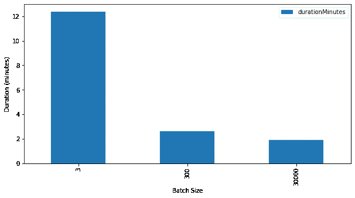

# 3 种数据支持的方法可以显著加快 MySQL 批量插入的速度

> 原文：<https://towardsdatascience.com/3-data-backed-ways-to-significantly-speed-up-your-mysql-bulk-inserts-28e20b42d51e?source=collection_archive---------10----------------------->

## 看看数据是如何说明优化 MySQL 批量插入的最佳方法的。

[粘土银行](https://unsplash.com/@claybanks?utm_source=medium&utm_medium=referral)在 [Unsplash](https://unsplash.com?utm_source=medium&utm_medium=referral) 拍摄的照片

在数据科学项目中，数据管道中常见的最后一步是将结果保存到数据库中(例如 MySQL)。这种数据管道的结果通常很大，因此优化对数据库的写入对于实现可接受的管道延迟非常重要。

我对许多 MySQL 批量插入设置进行了基准测试和分析，以深入了解真正重要的因素是什么，从而显著提高这类工作负载的速度。在本文中，我将分享它们，以便您可以节省研究时间，并立即开始实施正确的设置。感兴趣吗？请继续阅读。

# 1.推迟建立索引

索引对插入极其不利。在上图中，`index=EARLY`在任何插入完成之前创建索引，而`index=LATE`在所有插入完成之后创建索引。我们可以看到:

1.  随着输入大小变大，插入到索引为**的表中不会像没有索引的表那样伸缩**。
2.  **输入大小为 5000 万行时，两者相差 1 小时**。

该图还表明，带有索引的表具有非线性延迟增长。随着时间的推移，写入带索引的表会变慢吗？

哦，是的，它是。输入越大，写入速度越慢。与没有索引的表相比，写速率是一致的。

# 2.并发插入

通过向没有索引的表并发插入，您可以**从批量插入中减少 50%的延迟**。

从上图中，我们还看到了 index 的另一个缺点:**对带有 index 的表进行并发插入没有任何优势，甚至会恶化延迟**。

**并发插入比负载数据好得多**。考虑到 MySQL reference 中的签注负载数据，这听起来令人难以置信，但事实就是如此。

公平地说，与单线程插入相比，加载数据仍然要快得多。但是，它没有 4 个并发插入快。

# 3.使用较大的批量和适当的提交频率

批处理是使用扩展插件(`insert into table values (1, 2), (3, 4)`)。影响？高达 **83%的延迟降低**！

现在，我们来谈谈**提交**操作。当您请求数据库提交时，数据库将执行日志刷新到磁盘，这将“正式”地将数据保存在数据库中。

理想情况下，我们只提交一次:在工作负载结束时。然而，这并不总是可行的。考虑一下:如果您有如此多的数据，以至于您的批量插入需要 6 个小时才能运行，那么在这 6 个小时中，您不能总是保证数据库连接是稳定的。一旦它断开，你失去了整个进程，需要从头开始。因此，更实用的方法是每隔几行提交一次。

由于日志刷新操作很慢，因此提交次数越少，总体工作负载越快，对吗？

令人惊讶的是，没有。更频繁的提交比不太频繁的提交稍微快一些。但是，如果我们将批处理大小从 30，000 行调降至 300 行，这种趋势就不成立，如下图所示。

要点是在执行提交之前有一个理想的行数(或者更准确地说，字节数)。

# 4.额外好处:使用自动递增主键

我收到的一个提示是，自动递增主键比没有主键要快。但是说真的，到底快了多少？

回答:一点也不多，但仍然是最快的。

最慢的设置是当主键以无序的方式随数据一起提供时。即便如此，情况也没有明显恶化。

虽然这有点道理，但在数据中提供主键意味着向数据库发送更多的字节。一旦有了数百万行，每行的额外小字节就会堆积起来。

# 结论

在本文中，我们学习了 3 种方法，它们可以最大限度地降低批量插入工作负载的延迟。它们是:

1.  推迟建立索引
2.  并发插入
3.  使用较大的批量和适当的提交频率