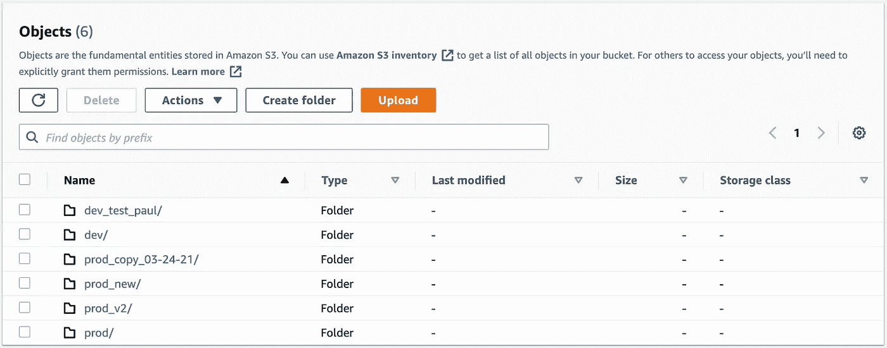
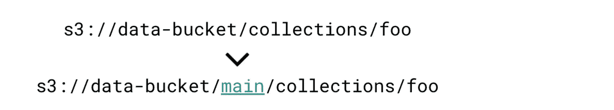

# 要避免的 3 个数据湖反模式

> 原文：<https://towardsdatascience.com/3-data-lake-anti-patterns-to-avoid-9be741f1d866?source=collection_archive---------18----------------------->

## 摆脱这些令人烦恼的习惯，开始掌握数据湖的旅程


由[阿里·兹比布](https://unsplash.com/@alizbib?utm_source=unsplash&utm_medium=referral&utm_content=creditCopyText)在 [Unsplash](/s/photos/data-lake?utm_source=unsplash&utm_medium=referral&utm_content=creditCopyText) 上拍摄的照片

# 介绍

[数据湖](https://lakefs.io/data-lakes/)提供了诱人的性能提升，这是其高采用率的主要原因。尽管有时技术性能的承诺会掩盖不愉快的开发体验。

这很麻烦，因为我相信在证明技术或范例的价值时，开发人员的体验同样重要，如果不是更重要的话。

当创建和维护像数据湖这样的复杂系统时，不友好的用户工作流和界面会降低生产力，就像一个应用程序有太多的技术债务或糟糕的文档一样。

# 反模式#1

## 您经常点击 S3(或类似的)存储控制台

具有数据湖的不友好工作流的一个症状是在湖的存储服务选择上花费太多时间。

在我职业生涯早期的一个案例中，这是一个 S3 数据湖，有一天我意识到在 AWS 控制台上查看分区中存在的文件数量或某个表的数据存储在哪个路径下所花费的时间是不健康的。

相比之下，没有人会进入数据库内部查看表存储在 B 树的什么位置。

**缓解策略:** 在您的数据湖中不可避免地会出现问题。有一天，一个供应商在发送数据文件时会遇到问题。有人会意外地多次重新运行不应运行的摄取作业。

在调试此类问题(或在某些情况下，误报警)的过程中，通过检查文件的`last_modified_date`或检查当前分区中的行数来扮演侦探并调查所发生事件的证据将是有用的。

我的建议是让这个过程变得更友好，有两点:

1.  **维护一个内部调试手册**文档页面，指定出现的问题，并详细说明识别和解决这些问题所采取的步骤。这有助于防止知识在团队中囤积，避免每个可怜的 it 人员不得不自己找出解决问题的最佳方法。
2.  当常见的调试模式出现时——比如文件检查的数量——开发一种方法来**在内部表格或仪表板中自动报告这些指标**。下一次出现问题时，您应该有一个单一窗格视图，可以快速显示您的湖泊最近的行为。

这些做法的目标是防止您需要检查存储控制台中的大多数问题。当你这样做的时候，让它成为一个简单，快速，有针对性的调查。

# 反模式#2

## 您通过物理复制文件来创建同一数据集的多个版本



每个目录包含同一个数据集的几乎完全相同的副本。

如果您打开对象存储的控制台，看到这样的目录结构，我会立即知道您是一个数据湖爱好者。

我知道，因为物理复制文件是一个乏味的过程，招致不必要的成本。这是一个随着数据规模而增长的问题。

如果您可以编写一个 shell 命令并获得相同的效果，而不是复制文件，会怎么样呢？

```
> lakectl branch create <branch uri>
```

这是如何工作的？

幸运的是，通过在您的 lake 上连接一个 git-for-data 工具，这个问题已经基本解决了。

通过利用关于 lake 中文件及其内容的元数据，分支或提交集合等熟悉的操作成为可能。当您拥有这些操作时，对数据湖进行迭代和试验会更快、更安全。



虚拟添加到 s3 集合的分支的视觉效果。

要了解更多信息，请查看开源项目 [lakeFS](https://github.com/treeverse/lakeFS) 及其[文档](https://docs.lakefs.io/)页面！

# 反模式#3

## 您有基于文件路径模式的复杂数据处理逻辑

就像 Eve 站在苹果树前一样，您可能会对对象的 filepath 字符串使用逻辑来决定它在数据湖中的命运。

不要这样做！

如果您使用了上面例子中的代码，是的，您已经设法编写了一个函数来处理将不同的数据集移动到数据湖中适当的位置。

然而，你实际上所做的是增加你的数据处理代码的圈复杂度，并使它的维护复杂化。

每当添加一个新的数据源时，您都必须考虑它在哪里着陆的含义，以及基于这个集中的功能，它将在哪里结束。对一个数据集的任何更改都需要了解是否会对其他数据集产生意想不到的影响。

**改做什么:**

解决方案很简单-使用单独的方法来处理湖泊中的每个数据集。对于简单的操作，如将文件从一个 S3 键复制到另一个键，在这些方法中仍然应该使用公共的帮助函数。

明确地说，文件路径字符串上的一些逻辑是不可避免的。但是要小心嵌套逻辑，尽可能使代码清晰易读。

# 包扎

在本文中，我们讨论了为什么这是一个令人不安的迹象，如果你是:

1.  点击存储控制台以调试每个问题。
2.  在数据湖中物理复制文件。
3.  在处理代码时过度依赖文件路径名。

避免这些反模式并遵循最佳实践应该有助于轻松维护您的数据湖！

*注:本文为* [*原载于 lakeFS 博客*](https://lakefs.io/data-lake-anti-patterns-to-avoid/) *。*