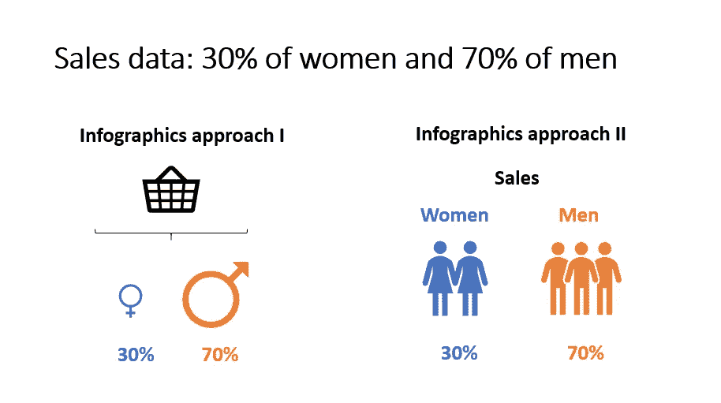
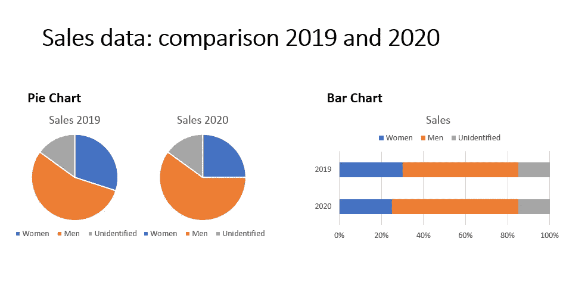
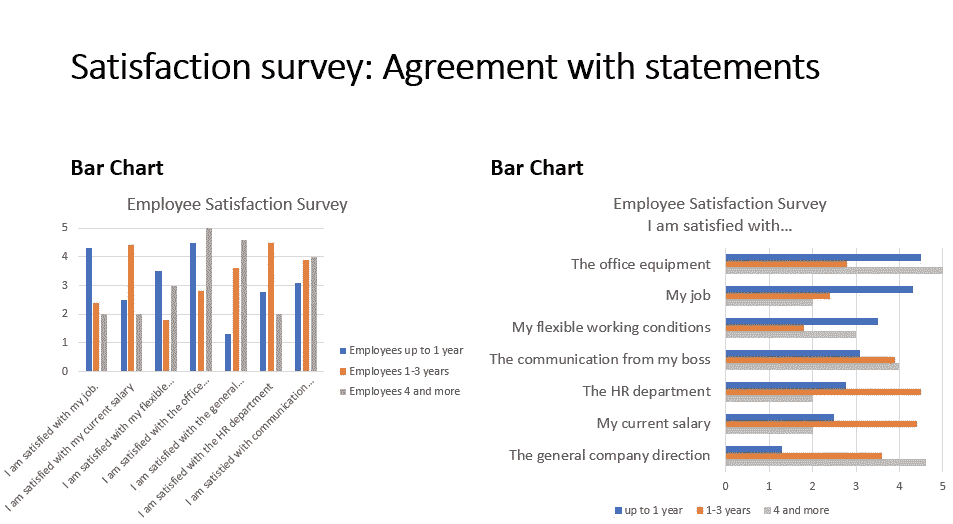

# 3 数据可视化错误以及如何避免它们

> 原文：<https://towardsdatascience.com/3-data-visualisation-mistakes-and-how-to-avoid-them-bb0e0625380d?source=collection_archive---------39----------------------->

## 数据可视化应该讲述一个故事，而不是分散或混淆你的观众

由 Charles Deluvio 在 Unsplash 上拍摄的图像

数据可视化是一门独立的学科。正好大家不喜欢看数据表。他们更喜欢丰富多彩的故事。数字只是数字，但它们的解释才是最重要的。因此，可视化有助于理解趋势、分布和数据模式。

可视化赋予数据生命。它将数字答案转化为可操作的建议。这些支持最重要的商业决策。然而，信息可以以许多不同的方式可视化。

这是一项创造性的工作。但是太多的创造力正在偏离它的目标。我不得不经常和那些想让数据变得“漂亮”的制图同事们争吵。

他们的创意太抽象，不足以支持实际的解释。经验法则是，如果你做数据可视化，第一眼就应该清楚你在展示什么。

做一个可视化专家，不要犯这些错误。

# **1。太有创意还是太简单**

我们有一些销售数据要在演示中展示。该数据是关于有多少女性和多少男性购买该产品。我们有 30%的女性和 70%的男性。这里有两个解决方案。哪个更好？

Ivona Fikejzlova 提供

销售分布是一条简单的信息。这就是为什么我们可以使用信息图表的方法。第一种情况是抽象的，使用性别图标和篮子。作者还增加了男性的标志，以加强我们有更多的男人的信息。

然而，它需要观众的一些心理活动来解释它。为了避免误解，我们应该避免太有创造性或太抽象。

第二种解决方案更符合字面意思。它显示图标、数字和文本。在我们看来，这本书在这种情况下更好。

尽管如此，你不必想象所有的事情。你有时可以在标题中加入一句没有任何视觉线索的关于数据的句子:“销售数据:30%的女性和 70%的男性。”

# 2.饼图已死

我们现在有 2019 年和 2020 年之间的销售数据对比。数据显示了性别分布。这里有两个解决方案。哪个更好？

Ivona Fikejzlova 提供

饼图是您在媒体或工作中看到的基本图表之一。在我看来，我们应该停止使用它。

馅饼应该作为甜点保存，而不是数据可视化。如果我们有一个馅饼，它仍然是很好的。但是如果我们有更多的饼图在一起，它们很难阅读和比较它们的值。

当我们需要比较达到 100%的数据时，使用条形图会好得多。乍一看，差异非常明显。另一个优点是条形图比饼图占用更少的空间，并且很容易更新。你只要再加一排或科拉姆。

# 3.条形图智慧

这次我们有来自员工满意度调查的数据。我们有一个矩阵问题，有陈述和一定程度的一致。我们希望显示所有陈述，并根据员工任期比较它们的平均值。这里有两个解决方案。

哪个更好？

Ivona Fikejzlova 提供

条形图是另一种经典的数据可视化。但是，通常还有改进的空间。第一个看起来还可以，但还可以更好。x 轴不容易阅读，因为语句太长。

图例在右边。这是不合逻辑的，因为人们从左向右阅读。最后，数据没有以任何方式分类。

第二种更好。由于我们在标题中包含了关键句子，所以语句被缩短了。这些数据是根据一个类别整理出来的，即最新的雇员。

所以，总的来说，阅读和从数据中获取想法更容易。

# 最终数据可视化思想

**数据可视化在你讲故事的过程中扮演着重要的角色。**

它应该加强你的观点，而不是分散观众的注意力或导致混乱。所以，永远要想好你想说什么，怎么说。

少即是多！尽量让数据美观，但要保持易读。

因此，要小心信息图的抽象，尽量避免饼图，尽可能简化条形图。即使没有你的口头陈述，你的图表和可视化也应该是可以理解的。

想象一下，你的演讲流传开来，你所有的同事都能理解吗？如果答案是肯定的，你做得很好！如果答案是否定的，那么是时候减少创造性，增加高质量的图表了。

*附:在你的收件箱里获取更多的提示。* [***在这里做那个*** *！*](https://ivonahirschi.medium.com/subscribe) *如果你喜欢自己体验媒介，可以考虑通过注册会员 *来支持我和其他成千上万的作家* [**。你每月只花 5 美元。**](https://ivonahirschi.medium.com/membership)*