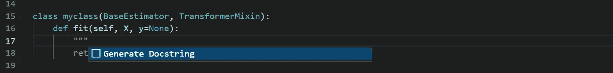
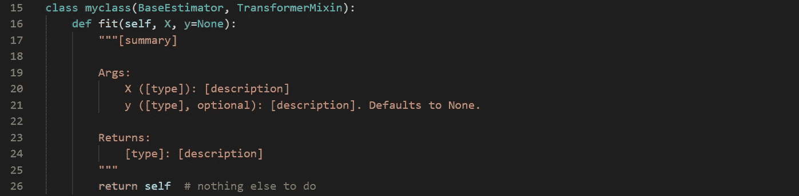
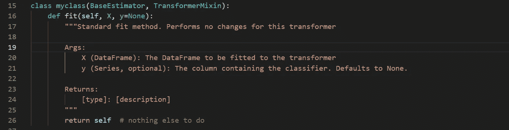
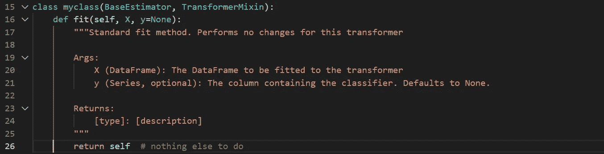
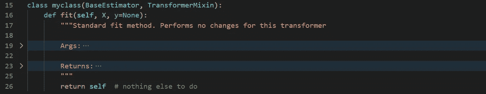
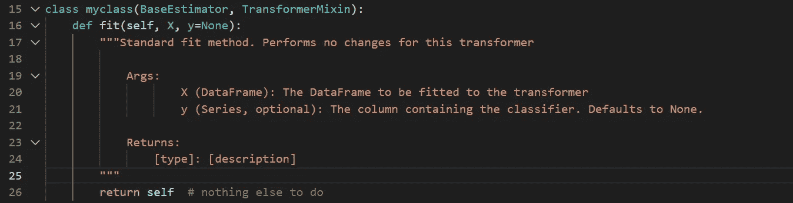
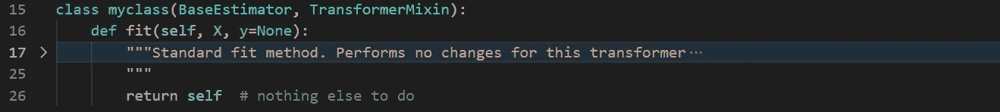
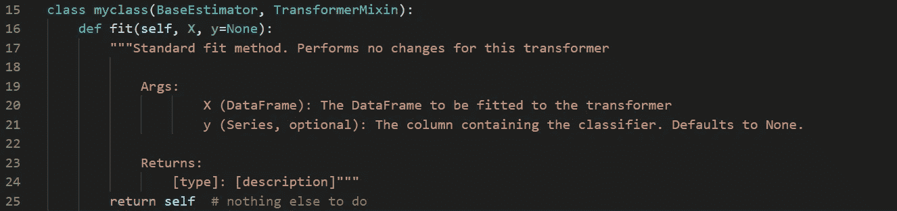
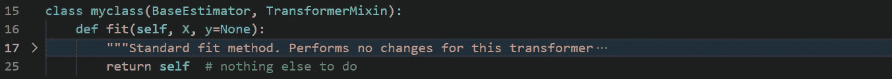

# 在 VSCode 中折叠文档字符串的 3 个简单步骤

> 原文：<https://towardsdatascience.com/3-easy-steps-to-folding-docstrings-in-vscode-fbb64573611b?source=collection_archive---------6----------------------->

## 如何在不弄乱源代码或降低可读性的情况下向 VSCode 数据科学项目添加文档

穆罕默德·拉赫马尼在 [Unsplash](https://unsplash.com/s/photos/folding-code?utm_source=unsplash&utm_medium=referral&utm_content=creditCopyText) 上的照片

## 背景

使用 VSCode 的程序员应该将“文档字符串”添加到他们的项目中，当他们在 VSCode 中将鼠标悬停在该代码上或在 Jupyter 笔记本中按下 Shift-Tab 时，这些项目会为代码的用户生成文档以供阅读。

程序员也可以使用扩展来自动生成文档字符串骨架以节省时间，例如，优秀的 Python 文档字符串生成器可以在这里获得—【https://marketplace.visualstudio.com/items? itemName = njp Werner . autodocstring。

然而，文档字符串占据了大量的垂直空间，当你添加一些时，它们会使实际的代码可读性更差，更难理解。

我自己也有过这样的经历，我想要两全其美——既生成有用的描述性文档，又不降低可读性，但是当我在网上搜索时，似乎无法做到这一点—[https://github.com/microsoft/vscode/issues/37052](https://github.com/microsoft/vscode/issues/37052)

我毫不气馁，根据我读过的文章寻找解决这个问题的方法，果然，这个问题很容易解决，你可以一边吃蛋糕一边编码！

## 问题是

如果您安装了 Python Docstring Generator 扩展，您只需在代码中的正确位置键入 3 个双引号，就会为您创建框架 Docstring-

**步骤 1 —键入 3 个双引号**

作者图片

**步骤 2 —生成文档字符串**

作者图片

**步骤 3 —用详细信息改写默认值**

作者图片

我们现在有了一个构造良好的 docstring，它将在 VSCode 或 Jupyter 笔记本中向我们代码的用户显示，但是当我们在一个中等大小的模块中添加了许多 docstring 时，它开始看起来混乱并且难以阅读。

## 解决方案

**步骤 1 —折叠参数并返回**

第一步是认识到自动生成的 docstring 确实有一些有限的折叠功能。

如果您将鼠标悬停在代码行号和代码本身之间的空白上，您会看到许多向下的 v 形符号，它们指示当前折叠的位置，您会看到 Args 和 Returns 可以被折叠并折叠起来-

作者图片

作者图片

这是一个小小的改进，但是文档仍然很大，在这一点上，你已经达到了在线建议的阶段，例如在[https://github.com/microsoft/vscode/issues/37052](https://github.com/microsoft/vscode/issues/37052)中——说文档字符串的折叠还没有实现，但是可以实现……

**第二步——折叠整个文档串**

诀窍的关键是实现 VSCode docstring 折叠通过缩进工作，所以如果您手动重新安排 docstring 生成器生成的 docstring 来缩进参数和返回，您现在可以折叠、折叠和隐藏您的文档-

作者图片

作者图片

这就好多了，但是它仍然占用了 2 行，而 1 行要整洁得多。

**第三步——把它简化成一行**

最后一个技巧是将结束的 3 个双引号包含到折叠中。要做到这一点，只需用一个额外的制表符缩进它们，或者将它们移到文档注释的最后一部分，我觉得这样更整洁

作者图片

作者图片

代码现在有一个完整的 docstring，它将在 VSCode 或 Jupyter 笔记本中正确显示，该 docstring 已被折叠并收起，因此不会使代码变得杂乱，除非程序员希望单击向下的 v 形图标重新完整显示它。

## 结论

我们已经看到了 Docstring 如何为将在 VSCode 或 Jupyter 笔记本中显示给代码消费者的代码提供文档，以及 Python Docstring 生成器如何自动生成存根。

然而，这些文档字符串不能被折叠和收起，会很快弄乱代码，使其可读性更差，更难维护。

在线建议似乎表明在 VSCode 中不能折叠、收缩和隐藏 docstrings，但实际上有 3 个简单的步骤可以做到这一点。

实现这些步骤使我们能够同时拥有我们的编码蛋糕(文档)和吃掉它(可读性)!

# 感谢您的阅读！

如果你喜欢读这篇文章，为什么不看看我在 https://grahamharrison-86487.medium.com/的其他文章呢？

此外，我很乐意听到您对这篇文章、我的任何其他文章或任何与数据科学和数据分析相关的内容的看法。

如果你想联系我讨论这些话题，请在 LinkedIn 上找我—[https://www.linkedin.com/in/grahamharrison1](https://www.linkedin.com/in/grahamharrison1)或者发电子邮件到[ghar rison @ Lincoln college . AC . uk](mailto:GHarrison@lincolncollege.ac.uk)。