# 熊猫中交叉表的 3 种简单方法

> 原文：<https://towardsdatascience.com/3-easy-ways-to-crosstab-in-pandas-4123383bfbf2?source=collection_archive---------8----------------------->

## 提高数据处理技能的实用技巧

交叉制表是检验两个或更多分类变量*或离散变量*之间关系的简单而有效的方法。在本帖中，我们将看看在熊猫身上创建交叉表格的三种简单而有用的方法。


由[马腾·德克斯](https://unsplash.com/@maartendeckers?utm_source=medium&utm_medium=referral)在 [Unsplash](https://unsplash.com?utm_source=medium&utm_medium=referral) 上拍摄的照片

# 0.数据📦

在本文中，我们将使用 *seaborn 的技巧*数据集。

```
import pandas as pd # *This post uses pandas v1.3.0.*
from seaborn import load_dataset# Import data
df = load_dataset("tips")
df.head()
```

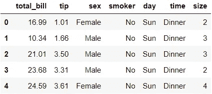

关于这个数据集(包括数据字典)的细节可以在这里找到[(这个源实际上是针对 R 的，但是它看起来是指同一个底层数据集)。数据描述引用如下，以便快速访问:](https://vincentarelbundock.github.io/Rdatasets/doc/reshape2/tips.html)

> 一名服务员记录了他在一家餐馆工作几个月期间收到的每一笔小费的信息

让我们来看看数据框的摘要:

```
df.info()
```

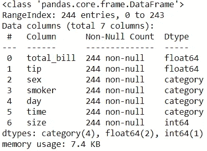

有 244 个记录和 7 个变量(4 个分类变量和 3 个数值变量)。没有缺失值。

# 📍 1.使用交叉表()

第一种方法是使用`crosstab()`。这个函数使得计算总数和百分比变得非常容易。

## 📘 1.1.计数和百分比

让我们统计一下*时间*和*日期*的类别:

```
pd.crosstab(df['time'], df['day'])
```

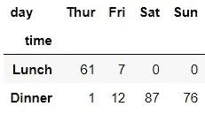

从这个表中，我们可以看到这个数据集中没有周末午餐时间的记录。这可能暗示我们，要么记录的服务员在周末午餐时间不工作，要么餐馆在周末午餐时间不营业。

通过调整以下参数，可以使用`crosstab()`轻松地转换为百分比或相加总计:
✅️ ️ `normalize='columns'`:转换为列%
✅️ ️ `normalize='index'`:转换为行%
✅️ ️ `normalize='all'`或️ `normalize=True`:转换为表%
✅️ ️ `margins=True`:相加总计(总计的类型取决于`normalize`参数)

让我们看一个例子:

```
pd.crosstab(df['time'], df['day'], normalize='index', margins=True)
```


行总计在这里不会提供太多的值，因为每个行总计只会显示 1，所以 pandas 很聪明，在这个例子中只显示列总计。如果您正在使用 Python，尝试调整到不同的`normalize`和`margins`组合，并注意表格是如何变化的。

## 📙 1.2.聚合数值

除了按类别获取计数和百分比，我们还可以按类别查看数值变量的值。例如，我们可以通过*日*和*时*得到中位数*小费*，如下所示:

```
pd.crosstab(df['time'], df['day'], df['tip'], aggfunc='median')
```

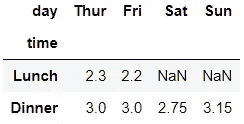

我们还可以在行和列中包含多个变量:

```
pd.crosstab([df['sex'], df['smoker']], 
            [df['time'], df['day']], 
            df['tip'], aggfunc='median')
```

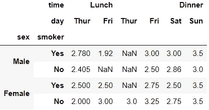

要获得多个聚合，我们可以在一个列表中传递它们:

```
pd.crosstab(df['time'], df['day'], df['tip'], 
            aggfunc=['median', 'mean'])
```

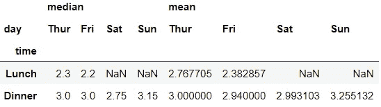

`crosstab()`的一个缺点是，每次我们指定一个有点重复的变量时，我们都需要引用数据帧的名称。

# 📍 2.使用 pivot_table()

下一个函数(或方法)是`pivot_table()`。当按类别聚合数字变量时，这种方法非常灵活。

## 📘 2.1.计数和百分比

让我们用`pivot_table()`重新创建上一节的第一个交叉表:

```
pd.pivot_table(df, 'tip', 'time', 'day', aggfunc='count')
```

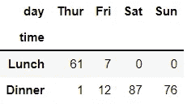

也可以使用 DataFrame 方法编写此查询:

```
df.pivot_table('tip', 'time', 'day', aggfunc='count')
```

我们可以用`margins=True`得到行、列和表格的总数:

```
df.pivot_table('tip', 'time', 'day', aggfunc='count', margins=True)
```

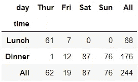

与`crosstab()`不同，我们需要第三个变量:*提示*来获取计数，并且没有一个简单的选项来获取百分比。但是我们不必在每次引用变量时重复输入数据帧名称。

## 📙 2.2.聚合数值

让我们看一下从上一节中获取相同的三个表的语法:

```
df.pivot_table('tip', 'time', 'day', aggfunc='median')
```

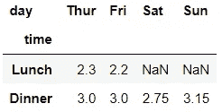

```
df.pivot_table('tip', ['sex', 'smoker'], ['time', 'day'], 
               aggfunc='median')
```

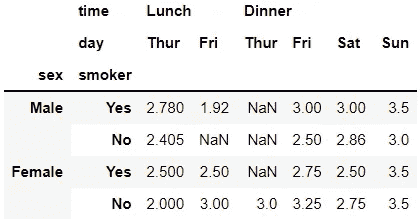

```
df.pivot_table('tip', 'time', 'day', aggfunc=['median', 'mean'])
```

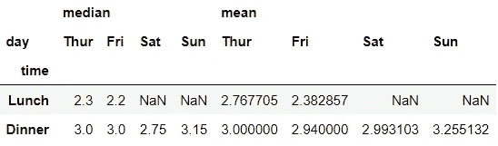

另外，我们可以用`pivot_table()`看多个数值变量。这在目前的`crosstab()`中是不可能的。我们可以按如下类别聚合多个数字列:

```
df.pivot_table(['tip', 'total_bill'], 'time', 'day', 
               aggfunc='median')
```

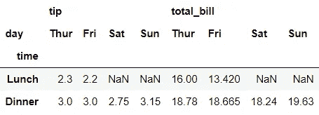

如果我们不指定 values 参数，它将使用 DataFrame 中的所有数字列。

```
df.pivot_table(index='time', columns='day', aggfunc='median')
```

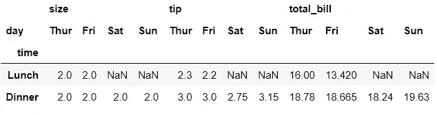

因为没有提供第一个参数:values，所以我们不能再按位置传递参数。所以这一次，我们必须指定每个参数。

# 📍 3.使用 groupby() + unstack()

这种方法非常类似于 SQL 或 R (tidyverse)等语言中的聚合方式。因此，这可能是最常见的获取交叉列表的方法。

## 📘 3.1.计数和百分比

通过这种方法，我们可以得到*时间*和*日期*的计数，如下所示:

```
df.groupby(['time', 'day']).size().unstack()
```

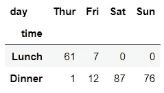

获得总数或转换成百分比需要额外的数据操作，因为我们不再像前两节那样使用专门的函数。

## 📙 3.2.聚合数值

为了在中位数*提示*上得到相同的表格，我们使用:

```
df.groupby(['time', 'day'])['tip'].median().unstack()
```

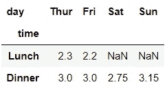

```
df.groupby(['sex', 'smoker', 'time', 'day'])['tip']\
  .median().unstack(['time', 'day'])
```

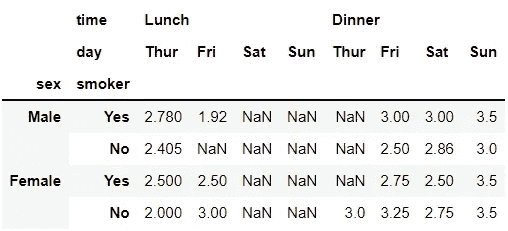

此方法显示每个类别组合。结果，现在显示了周末午餐的空列，输出不如以前清晰。

我们还可以使用多个聚合函数:

```
df.groupby(['time', 'day'])['tip'].agg(['median', 'mean']).unstack()
```

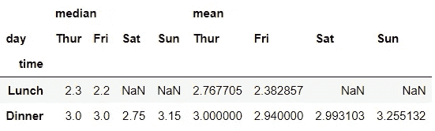

类似于`pivot_table()`，我们也可以看多个数值变量:

```
df.groupby(['time', 'day'])[['tip', 'total_bill']].median()\
  .unstack()
```

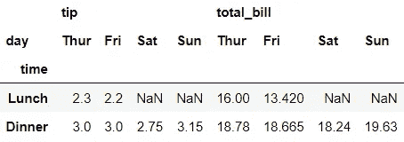

与`pivot_table()`相比，通过*时间*和*天*用`groupby()`和`unstack()`更容易得到所有数值变量的统计:

```
df.groupby(['time', 'day']).median().unstack()
```

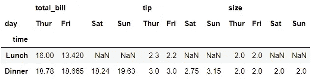

这就把它带到了这篇帖子的结尾！虽然这三种方法有相似之处，但对于某些任务，其中一种方法可以提供比其他方法更好的解决方案。希望您在下一个数据操作任务中能够熟练地使用它们！


塞缪尔·布林格森在 [Unsplash](https://unsplash.com?utm_source=medium&utm_medium=referral) 上拍摄的照片

*您想访问更多这样的内容吗？媒体会员可以无限制地访问媒体上的任何文章。如果您使用* [*我的推荐链接*](https://zluvsand.medium.com/membership)*成为会员，您的一部分会费将直接用于支持我。*

感谢您阅读这篇文章。如果你感兴趣，这里有我关于熊猫的一些其他帖子的链接:
◼️️ [在熊猫中编写 5 个常见的 SQL 查询](/writing-5-common-sql-queries-in-pandas-90b52f17ad76?source=your_stories_page-------------------------------------)
◼️️ [在熊猫中编写高级 SQL 查询](/writing-advanced-sql-queries-in-pandas-1dc494a17afe?source=your_stories_page-------------------------------------)
◼️️ [给熊猫用户的 5 个提示](/5-tips-for-pandas-users-e73681d16d17?source=your_stories_page-------------------------------------)
◼️️ [在熊猫中进行数据聚合的 5 个提示](/5-tips-for-data-aggregation-in-pandas-7eaa8476dc75?source=your_stories_page-------------------------------------)
◼️️ [如何在熊猫数据框架中转换变量](/transforming-variables-in-a-pandas-dataframe-bce2c6ef91a1?source=your_stories_page-------------------------------------)
◼️️ [3 个简单方法](https://medium.com/p/5b2cbe73d60e/edit)

再见🏃 💨