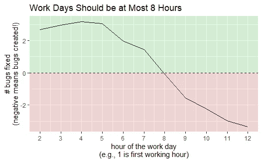

# 3 个简单的方法让你的情节更好

> 原文：<https://towardsdatascience.com/3-easy-ways-to-make-your-plots-better-d94147059470?source=collection_archive---------40----------------------->

## 强调外卖！

艾萨克·史密斯在 [Unsplash](https://unsplash.com?utm_source=medium&utm_medium=referral) 上拍摄的照片

图表通常是传达数据驱动的建议的最佳方式。视觉元素比文字更简单地吸引注意力并阐明复杂的想法:“一张图片胜过千言万语。”

但是并不是所有的图表都是一样的。**图表应该传达外卖没有*任何*画外音**。这篇文章列出了三个简单的技巧，让你的图表更有效。

## **示例-生产力水平与每周工作小时数**

在 Jeff 和 J.J. Sutherland 的《Scrum:用一半的时间做两倍的工作的艺术》中，他们讨论了发现每周工作超过 40 小时的团队比每周工作少于 40 小时的团队完成得更少的研究(事实上，Henry Ford 在 1929 年测量了这一点并实施了 40 小时工作周！[https://www . history . com/this-day-in-history/Ford-factory-workers-get-40 hour-week](https://www.history.com/this-day-in-history/ford-factory-workers-get-40-hour-week))。这是反直觉的。你可能会认为团队每周工作时间越长，回报越少，但是当他们投入更多的时间时，肯定会继续完成更多的工作。然而，这项研究表明，在 40 小时左右，你开始得到负回报！这是一个有趣的观点，可以用图表来说明。

让我们使用一家技术公司的模拟数据集，该数据集显示“小时”(工作日的哪个小时)。例如，1 =一天的第一个工作小时)和“生产率”(团队在一天中的每个小时修复的错误的平均数量)。我们将从显示关系的 ggplot2 图表开始。

不清楚的图表

现在问问你自己，如果除了图表之外没有任何背景，你能理解这个图表试图说明什么吗？大概不会。这就是第一个提示的来源。

## **提示 1——让标题成为外卖**

总是让你的图表标题成为你希望读者从中得出的结论。这完成了两件事。

1.  它清楚地强调了你的图表的要点
2.  它迫使你思考为什么你首先要展示这个图表。

回到我们的例子，建议每天最多工作 8 小时(因为每天超过 8 小时，产生的错误比修复的更多)。让我们把它作为标题。此外，考虑到这一点，更容易想到对图表的其他改进:0 处的水平线表明每天工作 8 小时后继续工作是有成本的，而不是利益+红色和绿色阴影来强调坏的和好的区域。

题目中强调的外卖。标题使用 labs()，阴影使用 annotate()。

这样更好，但是如果没有解释，你仍然不能理解它的意思，这就引出了我们的第二个技巧。

## **提示# 2——始终要清楚地绘制轴和图例**

上面的图表没有很好的坐标:不清楚“生产率”的衡量标准和“工作时间”指的是什么。我们还可以清理 x 轴，使它显示更清晰的数字，这将使键值(8)更容易阅读。

更清晰更干净的轴。轴标题使用 labs()，分隔符使用 scale_x_continuous()。

干净多了，但是趋势穿过 0 线的关键点仍然可以强调更多。

## **提示 3——在图表区域使用标注来突出关键点**

我们可以通过直接在图表中使用大标注来突出关键点，使要点更加清晰。

标注强调关键点。这些也可以像所有之前的编辑一样添加到 ggplot2 代码([https://ggplot2-book.org/annotations.html](https://ggplot2-book.org/annotations.html))中。然而，我发现将图表复制并粘贴到 google slides 之类的东西中，然后为这些标注添加文本框和箭头，通常会更快、更有影响力。

## **总结**

用你的图表把目标放在首位。首先，弄清楚你想传达的是什么信息。然后，尽你所能让这个信息清晰。

**图表应该传达一个外卖，没有任何*画外音。***

1.  标题应该传达要点
2.  轴和图例应该足够清晰易懂，以消除配音的需要
3.  标注强调图表区域中的其他关键点

## 附录

这是用来制作图表的代码

其中`df`是一个简单的数据集:

