# 重塑熊猫数据框架的 3 种简单方法

> 原文：<https://towardsdatascience.com/3-easy-ways-to-reshape-pandas-dataframe-5b2cbe73d60e?source=collection_archive---------11----------------------->

## 提高你的数据操作技能

数据有不同的形状和大小。作为处理数据的专业人员，我们经常需要将数据改造成更适合手头任务的形式。在本帖中，我们将看看重塑数据帧的 3 种简单方法。


迈克尔·泽兹奇在 [Unsplash](https://unsplash.com?utm_source=medium&utm_medium=referral) 上拍摄的照片

# 📍 1.使用 melt()将宽格式转换为长格式

让我们从导入库和加载示例范围的数据集开始:

```
import numpy as np
import pandas as pd
from seaborn import load_dataset# Load sample data
wide = load_dataset('penguins')\
        .drop(columns=['sex', 'island', 'culmen_length_mm'])\
        .sample(n=3, random_state=1).sort_index()\
        .reset_index().rename(columns={'index': 'id'})
wide
```

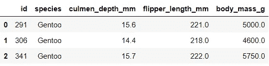

我们可以用如下的`stack()`将数据整形为长格式:

```
long = wide.set_index('id').stack().to_frame().reset_index()\
           .rename(columns={'level_1': 'variable', 0: 'value'})
long
```

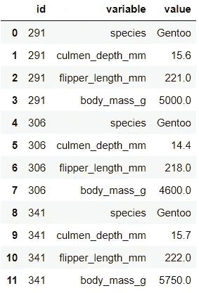

它完成了工作，但这相当冗长，也不太优雅。幸运的是，使用`melt()`将数据转换成长格式变得很容易:

```
long = wide.melt(id_vars='id')
long
```

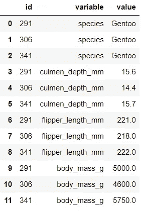

瞧啊。很简单，不是吗？值得注意的是，`wide.melt(id_vars=’id’)`也可以写成`pd.melt(wide, id_vars='id')`。

应用我们所学的知识来巩固我们的知识总是很重要的。我最喜欢的`melt()`的实际应用之一，你可能也会发现它很有用，那就是用它来格式化相关矩阵。虽然我们在*宽*中只有三个记录，但为了说明这个想法，让我们做一个相关表:

```
corr = wide.drop(columns='id').corr()
corr
```

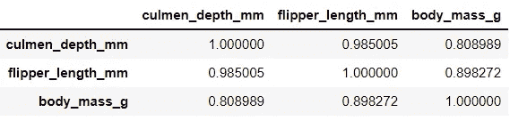

这种格式很有用，因为我们可以将矩阵转换成热图来显示相关性。但如果你想深入细节，找到相关性高于某个阈值的变量，通常矩阵或热图是不够的。将矩阵转换成长格式会使这项任务变得容易得多:

```
corr.reset_index().melt(id_vars='index')
```

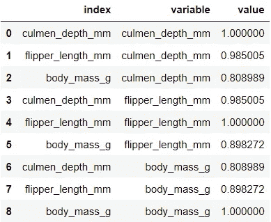

现在，有了这些长数据，我们可以很容易地通过“值”进行过滤，找到所需值之间的相关性。我们将进一步格式化数据，并过滤 0.9 和 1 之间的相关性:

```
corr.reset_index().melt(id_vars='index')\
    .rename(columns={'index': 'variable1', 
                     'variable': 'variable2', 
                     'value': 'correlation'})\
    .sort_values('correlation', ascending=False)\
    .query('correlation.between(.9,1, inclusive=False)', 
           engine='python') # workaround of [this bug](https://github.com/pandas-dev/pandas/issues/34251)
```


你甚至可以删除重复的相关性。当您拥有包含许多数字要素的大型数据集时，这种相关格式尤其有用。

# 📍 2.使用 pivot()将长格式转换为宽格式

另一方面，有时数据是长格式的，我们需要把它改造成宽数据。现在让我们做与之前相反的事情。与上一节类似，我们将从`unstack()`开始转换:

```
long.set_index(['id', 'variable']).unstack()
```

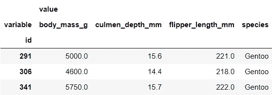

使用如下的`pivot()`可以完成相同的转换:

```
long.pivot(index='id', columns='variable', values='value')
```

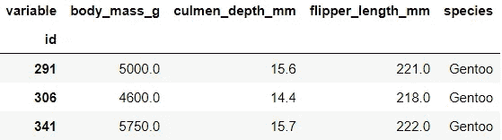

这不一定更简洁，但与`unstack()`相比，可能更容易使用。到现在为止，你可能已经注意到`melt()`对于`pivot()`就像`stack()`对于`unstack()`一样。

将数据整形为宽格式的一个可能的实际应用是，如果您的数据是实体-属性-值(也称为 EAV)格式，如下所示:

```
eav = pd.DataFrame({'entity': np.repeat([10,25,37, 49], 2),
                    'attribute': ['name', 'age']*4,
                    'value': ['Anna', 30, 'Jane', 40, 
                              'John', 20, 'Jim', 50]})
eav
```

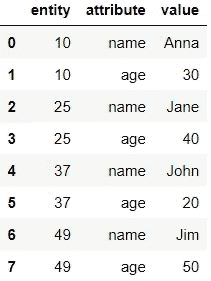

使用`pivot()`可以将数据重新格式化为每行代表一个实体(例如客户)的格式:

```
eav.pivot(index='entity', columns='attribute', values='value')
```

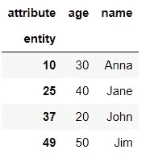

下次你知道如何重塑一个长数据！

# 📍 3.用 wide_to_long()将宽格式转换为长格式

我们学习了如何用`melt()`从长变宽。但是使用`wide_to_long()`功能，在某些情况下，整形比`melt()`更容易。这里有一个例子:

```
pop = pd.DataFrame({'country':['Monaco', 'Liechtenstein', 
                               'San Marino'],         
                   'population_2016' : [38070, 37658, 33504],
                   'population_2017' : [38392, 37800, 33671],
                   'population_2018' : [38682, 37910, 33785]})
pop
```

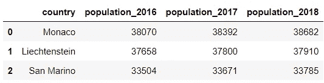

使用`melt()`，我们可以重塑数据并将其格式化如下:

```
new = pop.melt(id_vars='country')\
         .rename(columns={'variable': 'year', 
                          'value': 'population'})
new['year'] = new['year'].str.replace('population_', '')
new
```

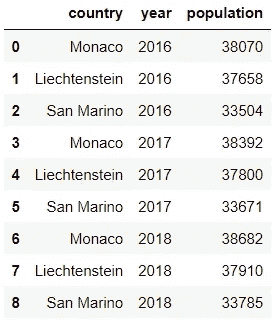

使用`wide_to_long()`，获得相同的输出要简单得多:

```
pd.wide_to_long(pop, stubnames='population', i='country', j='year', 
                sep='_').reset_index()
```

使用该函数时，最好理解这三个主要术语:存根名称(`stubnames`)、后缀和分隔符(`sep`)。虽然这些术语可能是不言自明的，但一个示例可以澄清它们:*人口*是存根名称， *2017* 是后缀，_ 是分隔符。后缀的新列名传递给参数`j`，唯一标识符列名传递给参数`i`。如果没有`reset_index()`，输出将如下所示，其中唯一标识符和后缀列位于索引中:

```
pd.wide_to_long(pop, stubnames='population', i='country', j='year', 
                sep='_')
```

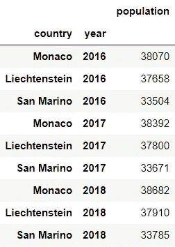

默认情况下，后缀被设置为数值。因此，这在我们之前的例子中运行良好。但是对于这样的数据，它可能不起作用:

```
iris = load_dataset('iris').head()
iris
```

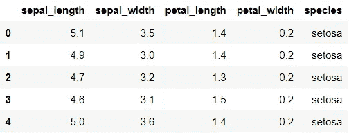

这一次，有两个存根名称:萼片和花瓣。在整形时，我们会将两者以列表形式传递给`stubnames`。后缀(即长度和宽度)不再是数字，因此我们需要在`suffix`参数中使用[正则表达式](https://docs.python.org/3/library/re.html)指定该模式。

```
pd.wide_to_long(iris.reset_index(), stubnames=['sepal', 'petal'], 
                i='index', j='Measurement', sep='_', suffix='\D+')
```

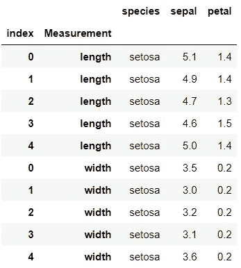

希望这两个例子已经说明了`wide_to_long()`在正确的设置下是多么有用。

瞧啊。这是重塑熊猫数据的三种简单方法！如果你想了解更多，这里有他们的官方文档:`[pd.melt()](https://pandas.pydata.org/pandas-docs/stable/reference/api/pandas.melt.html)`、`[pd.pivot()](https://pandas.pydata.org/docs/reference/api/pandas.DataFrame.pivot.html)`和`[pd.wide_to_long()](https://pandas.pydata.org/docs/reference/api/pandas.wide_to_long.html)`。


照片由[迈克尔·泽兹奇](https://unsplash.com/@lazycreekimages?utm_source=medium&utm_medium=referral)在 [Unsplash](https://unsplash.com?utm_source=medium&utm_medium=referral) 拍摄

*您想访问更多这样的内容吗？媒体会员可以无限制地访问媒体上的任何文章。如果您使用* [*我的推荐链接*](https://zluvsand.medium.com/membership) ，*成为会员，您的一部分会费将直接用于支持我。*

感谢您阅读这篇文章。如果你感兴趣，这里有我关于熊猫的一些其他帖子的链接:
◼️️ [在熊猫中编写 5 个常见的 SQL 查询](/writing-5-common-sql-queries-in-pandas-90b52f17ad76?source=your_stories_page-------------------------------------)
◼️️ [在熊猫中编写高级 SQL 查询](/writing-advanced-sql-queries-in-pandas-1dc494a17afe?source=your_stories_page-------------------------------------)
◼️️ [给熊猫用户的 5 个提示](/5-tips-for-pandas-users-e73681d16d17?source=your_stories_page-------------------------------------)
◼️️ [关于熊猫中数据聚合的 5 个提示](/5-tips-for-data-aggregation-in-pandas-7eaa8476dc75?source=your_stories_page-------------------------------------)
◼️️ [如何在熊猫数据框架中转换变量](/transforming-variables-in-a-pandas-dataframe-bce2c6ef91a1?source=your_stories_page-------------------------------------)

再见🏃 💨