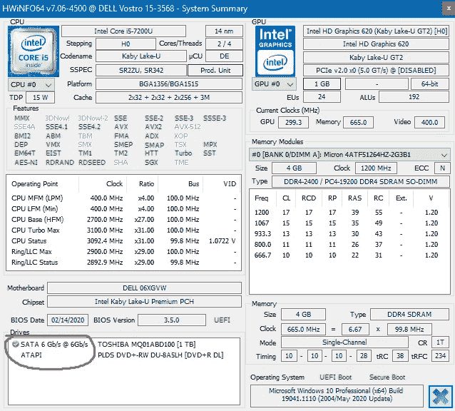
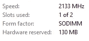
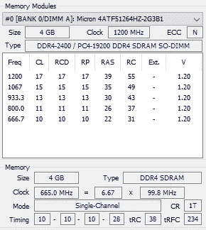
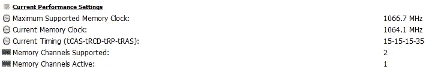

# 3 种有效的方法，让您的笔记本电脑性能提高 10 倍，同时节省资金

> 原文：<https://towardsdatascience.com/3-effective-methods-to-increase-the-performance-of-your-laptop-by-10x-while-saving-money-5db0a3d86123?source=collection_archive---------40----------------------->

## 赋予您的笔记本电脑新的生命

照片由 [XPS](https://unsplash.com/@xps?utm_source=unsplash&utm_medium=referral&utm_content=creditCopyText) 在 [Unsplash](https://unsplash.com/?utm_source=unsplash&utm_medium=referral&utm_content=creditCopyText) 上拍摄

慢速笔记本电脑？放心吧！的确，你的笔记本电脑在工作几年后可能会变慢。然而，有一些可靠的方法可以显著提高笔记本电脑的速度。与购买一台全新的笔记本电脑相比，你不需要投入大量资金来尝试这些方法。然而，实施这些方法后，您将获得与全新产品几乎相同的性能。在你去购买一台全新的笔记本电脑之前，我建议你试试这些方法，这样可以节省很多钱！

**更新(2021–08–16):**观看下面的视频，看看我的经济型和入门级笔记本电脑在我实施了这里描述的 3 种方法后，如何仅用 47 秒就启动并启动所有这些应用程序。

(视频由作者创作)

# 从固态硬盘启动

如果你的笔记本电脑从硬盘启动，你的笔记本电脑会非常慢。硬盘有活动部件，读写数据需要大量时间。在使用硬盘时，您肯定经历过某种滞后和性能问题。相比之下，SSD(固态硬盘)没有移动部件，并根据您使用的 SSD 类型，为您提供显著的性能提升(10 倍至 15 倍)。有两种方法可以将固态硬盘安装到笔记本电脑上:

*   **用 SSD 替换硬盘** —当笔记本电脑主板上没有单独的 SSD 插槽时，应该使用这种方法。
*   **只安装 SSD** —当笔记本电脑主板上有单独的 SSD 插槽时，可以使用此方法。

## 用 SSD 更换硬盘

为了获得更好的性能，首先确保您的笔记本电脑主板有一个 **SATA 6 Gbps** 端口，您当前的硬盘通过该端口连接到笔记本电脑。低于 6 Gb/s 端口的速度，您不能指望固态硬盘有多高的性能。要检查这些信息，您可以使用 [hwinfo 免费软件](https://www.hwinfo.com/download/)，该软件可免费用于非商业用途。访问网页并从本地(美国)服务器下载。然后运行安装程序并安装程序。使用默认设置运行已安装的程序。它将开始分析你的系统硬件。完成后，单击“摘要”选项卡。

由 **hwinfo** 给出的我的系统硬件信息(作者截图)

我用了 4 年的笔记本电脑有一个 6 Gbps 的 SATA 端口。如果我把硬盘换成固态硬盘并从它启动，我可以获得更好的性能。

最重要的是，你应该买一个 2.5 英寸的**固态硬盘**来取代硬盘。一个 m.2 外形的 SSD 是不能用你的硬盘代替的！

2.5 英寸固态硬盘(作者提供图片)

安装 SSD 后，需要将操作系统、系统驱动程序和其他程序重新安装到新的 SSD 中。因此，我强烈建议您备份您的数据、软件产品密钥和其他有用的帐户信息，以避免任何可能的损失。

## 正在安装固态硬盘

如果你的笔记本电脑主板有一个单独的固态硬盘插槽，你可以很容易地安装一个固态硬盘。这一次，你需要一个 m.2 外形的 **SSD。笔记本电脑主板上的 m.2 插槽可以是:**

*   PCIe 第二代
*   PCIe 第三代(NVMe)

如果你的主板支持 NVMe，选择比传统的第二代固态硬盘快得多的 NVMe 固态硬盘。

在这种方法中，您需要将操作系统和其他程序迁移/全新安装到 SSD，并在 UEFI (BIOS)设置中将其设置为引导驱动器。您也可以保留初始硬盘来存储您的文件。它将作为一个普通的闪存驱动器。我建议您全新安装**操作系统，而不是迁移操作系统，以获得最佳性能。**

另外很重要的一点是，添加新的 SSD 后，需要手动初始化才能在系统中看到。从控制面板打开磁盘管理窗口，如果你打算安装新版本的 Windows，用 **GPT 分区方式**初始化你的新 SSD。

## 从固态硬盘启动的优势

*   更快的启动
*   无延迟体验
*   快速打开程序
*   节省电池
*   减少噪音

# 添加另一个 RAM 棒来启用双通道模式(如果可能)

最好**有两个闸板杆**而不是只有一个总闸板杆。一些主板和处理器支持双通道模式，以实现更快的内存访问。

**任务管理器**给出的内存信息(作者截图)

**hwinfo** 给出的内存信息(作者截图)

由 **hwinfo** 给出的当前内存设置(作者截图)

如果你打算添加另一个内存棒，首先确保你的笔记本电脑主板有一个额外的内存插槽。然后考虑**内存类型**，这对于避免兼容性问题非常重要。我的情况是 DDR4 SODIMM。我的笔记本电脑支持两个内存通道！然而，现在只有一个通道是活动的。这是因为我只有一个 RAM 棒。如果我安装另一个 RAM 棒，我可以在双通道模式下运行。

使用有些现代的主板，实际上可以在双通道模式下运行两种不同的内存。但是内存类型应该是一样的。您可以安装两个相同内存类型的 RAM 棒，但品牌、时钟速度和大小不同。两个记忆棒都将在双通道模式下运行，但主板和系统 BIOS 会改变时钟速度，以匹配两个 ram 的时钟速度。举个例子，

*   目前，你有一个 2933 MHz 时钟速度的内存。你安装一个 3200 兆赫的记忆棒。在这种情况下，不会有性能损失。两者都将工作在 2933 MHz，这是初始时钟速度。
*   目前，你有一个 3200 MHz 时钟速度的内存。你安装一个 2933 兆赫的记忆棒。在这种情况下，会有少量的性能损失。两者都将工作在 2933 MHz，这不是初始时钟速度。

也可以放一个时钟速度高于主板支持速度的 RAM 棒。但是，您无法获得 RAM stick 标签上指定的速度。

为了避免任何性能损失，最好放置一个时钟速度与当前安装的相同或更高的 RAM 棒。

增加更多的内存会提高系统的性能，但不如从 SSD 启动的性能高。

## 添加更多内存的好处

*   改善多任务处理
*   快速打开程序
*   双通道模式可加快内存访问速度

# 执行 Windows 的全新安装

如果您当前的 Windows 操作系统有恶意软件、垃圾文件和其他类型的问题，会大大降低您系统的性能，这是强制性的。全新安装将消除所有这些问题。全新安装意味着通过删除所有分区来擦除整个磁盘或驱动器，并执行全新的 Windows 安装。这将删除系统上的所有程序、驱动程序和数据。因此，在全新安装后，您需要重新安装系统驱动程序和其他第三方软件。您需要在任务开始前备份所有数据。

要执行 Windows 的全新安装，需要从微软官网下载 Windows ISO 文件。它是免费下载的。可以通过 [Windows media creation tool](https://www.microsoft.com/en-us/software-download/windows10) 下载。下载后，您需要从 ISO 文件创建一个可引导的 USB。为此，您可以使用 [**Rufus**](https://rufus.ie/en/) 及其默认设置。我建议您保留默认设置，以避免任何潜在的问题。Windows media creation tool 也有一个从 ISO 文件制作可引导 USB 的选项。如果您愿意，可以使用该选项。如果你想在将来创建多个可启动的 USB 驱动器，只需下载 ISO 文件并使用前面解释的 Refus。

大部分笔记本电脑都是吸着制造公司激活的窗口。在这种情况下，安装程序不会在新的 Windows 安装过程中要求您输入产品密钥。它会自动从系统固件中获取。

## 全新安装的优势

*   删除病毒
*   删除垃圾文件
*   删除有害程序
*   获取最新的操作系统和其他软件
*   解决软件的兼容性问题

# 执行这些升级需要花费多少钱？

可能是新笔记本电脑价格的 1/10 左右。你需要购买一个额外的固态硬盘和内存棒。我建议你按照上面的顺序来执行上面的方法。这些方法将大大提高你的笔记本电脑的性能，同时节省你的钱！

最后一件事。这些是一般说明。要获得特定于您的笔记本电脑的详细信息，我建议您参考设备手册或网站支持。

**你试过这些方法，需要一些技术支持吗？**请在评论区告诉我。我会尽我所能帮助你。

感谢阅读！

下次见，祝大家学习愉快！

特别感谢 Unsplash 上的 **XPS** ，**为我提供了这篇文章的漂亮封面图片。**

[鲁克山普拉莫迪塔](https://medium.com/u/f90a3bb1d400?source=post_page-----5db0a3d86123--------------------------------)
**2021–08–09**