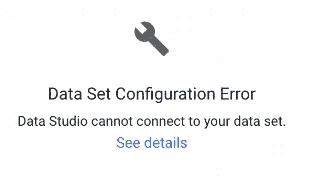
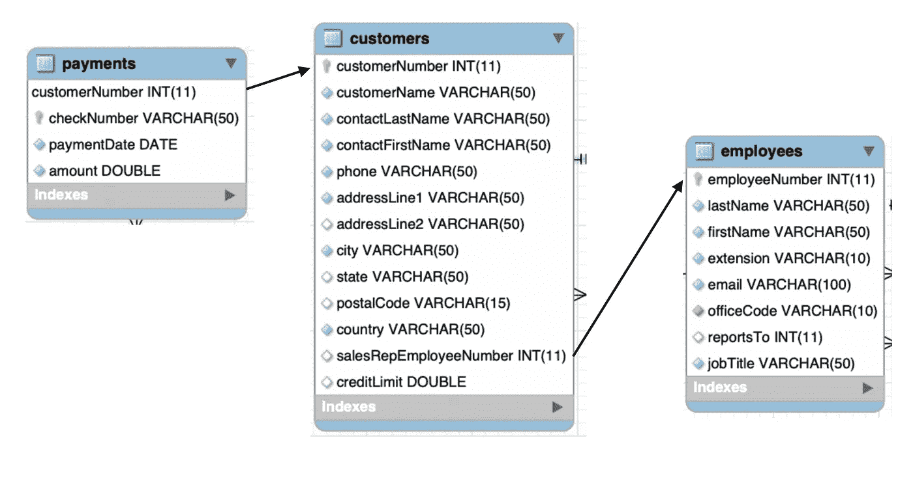
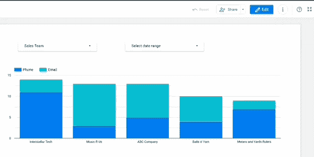
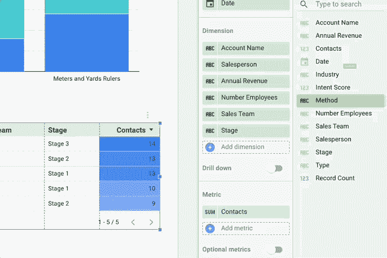

# 开始使用 Google Data Studio 的 3 个基本技巧

> 原文：<https://towardsdatascience.com/3-essential-tips-to-start-using-google-data-studio-93334a403d11?source=collection_archive---------12----------------------->


路易斯·维拉斯米尔在 [Unsplash](https://unsplash.com/s/photos/tasks?utm_source=unsplash&utm_medium=referral&utm_content=creditCopyText) 上的照片

任何称职的数据科学家都知道，数据可视化是他们向不太懂数字的受众传达具有挑战性的复杂想法的最佳工具。在业务环境中，您会发现自己的任务是尽快创建可读性强、有吸引力的报告，因此您需要一个易于使用、有效的工具，老实说，它可以为您完成大部分艰巨的工作。如果你还没有去过 Google Data Studio，你应该去看看。[我最近写了一篇博文](/google-data-studio-for-beginners-99355e9df809)，讨论为什么这个新的免费平台值得你花时间，如果你还需要说服的话，你可以在这里看看。

也就是说，如果没有正确的提示和技巧，您可能会发现自己对迟钝的错误代码和可怕的死亡痛苦感到沮丧。我知道我花了几个月的时间处理数据源，才找到了我的最佳状态，并能够立即为我的整个团队创建漂亮的交互式仪表板，所以希望有了这些提示，你会比我更快地到达那里。



我讨厌这东西

# **1。如何将熊猫的数据加载到 GDS**


照片由[翻滚 926](https://unsplash.com/@billow926?utm_source=unsplash&utm_medium=referral&utm_content=creditCopyText) 上的 [Unsplash](https://unsplash.com/s/photos/pandas?utm_source=unsplash&utm_medium=referral&utm_content=creditCopyText)

好吧，每当我用一个新的程序进行数据操作时，我想知道的第一件事就是如何上传我的熊猫数据帧，这样我就可以完全控制我的绘图功能和合并。将数据源加载到 GDS 时，您有多种选择，大多数默认设置都可以正常工作。如果你有一个谷歌分析账户，你可以上传大量的网络流量数据，尽管实时处理和过滤可能比冰风暴中的糖蜜还慢。只要您有正确的凭证和正确的查询，您还可以连接 SQL 数据库。

也就是说，出于几个原因，我最喜欢的数据源将永远是 Google Sheets。1)对于较小的数据集(100k 行或更少),连接速度可以接受；2)Google Sheets 有大量关于函数和数据操作的文档，可以转移到 Google Data Studio；3)Python 3 有一个方便的包，名为 *gspread* ,包含了将 google sheet 导入 Jupyter 笔记本或将 dataframe 上传到工作簿所需的所有方法。[这篇文章](https://www.analyticsvidhya.com/blog/2020/07/read-and-update-google-spreadsheets-with-python/)是我构建基本 Google Sheet 脚本时的圣经。您与您的开发者帐户共享的任何表单都可以通过 *gspread* 访问。下面是我用来将谷歌表单导入熊猫的函数:

```
def open_google_sheet(wookbookname,sheet_num=0):‘’’Requests a Google sheet saved as ‘workbookname’ using credentials for developer email.Credentials for Google API are stored in /Users/#########/.config/gspread/service_account.jsonsheetname = The name of the Google sheet file as seen on Google. Entered as a string.sheet_num = The sheet number for the Google Sheet. Defaults to 0 if no entry.Parameters — — — — — workbookname: The name of the Google Sheet that you intend to opensheet_num: The number of the sheet in the Google Sheet you intend to open (numbering begins at 0)Returns — — — -DataFrame: A DataFrame of the information contained in the Google Sheet‘’’scope = [‘https://spreadsheets.google.com/feeds',‘https://www.googleapis.com/auth/drive']credentials = ServiceAccountCredentials.from_json_keyfile_name(‘/Users/######/.config/gspread/service_account.json’, scope)#If credentials change, must change json file.gc = gspread.authorize(credentials)wks = gc.open(f”{workbookname}”).get_worksheet(sheet_num)data = wks.get_all_values()headers = data.pop(0)df = pd.DataFrame(data, columns=headers)return df
```

这是我的代码，用来更新你选择的 Google 表单(空白或其他)。它将自动匹配单元格的更新值，因此我建议抽查重复值，或者在点击此函数的“运行”之前删除单元格值:

```
def update_sheet(df, workbookname, sheet_num=0):'''Updates the sheet in question by adding the requested dataframe to the end of it.You can choose which sheet number as well as which Google Sheet. There will be a result output if there are no errorsParameters----------df:    (DataFrame) - a DataFrame without any null values, sets, dictionaries, or lists contained in its rowsworkbookname:    (str) - name of the Google Sheet that is connected to the ##########@gmail.com email addresssheet_num:    (int) - the index of the sheet. Index begins at 0.Returns-------Updates the Google sheet in questions. Prints a json update to state the update was successful'''scope = ['https://spreadsheets.google.com/feeds','https://www.googleapis.com/auth/drive']credentials = ServiceAccountCredentials.from_json_keyfile_name('/Users/#####/.config/gspread/service_account.json', scope)#If credentials change, must change json file.gc = gspread.authorize(credentials)wks = gc.open(f"{workbookname}").get_worksheet(sheet_num)result = wks.update([df.columns.values.tolist()] + df.values.tolist())return result
```

在你不顾一切地乱丢谷歌工作簿之前，给你一些忠告。第一， *gspread* 包不喜欢 NaN 值。如果您的数据帧中有任何 NaNs，该函数将抛出一个错误。它也不能处理 iterables，所以如果您的任何数据包含列表，您将希望在上传它们之前解包它们。或者，您可以将列表转换为字符串，然后在 Google Data Studio 中将它们转换为新的数据类型，但这是经销商的选择。

第二，虽然 Google Sheets *给人的感觉是*无限大，但事实并非如此。工作簿最多可以支持 500 万个单元格，这听起来很不错，直到您有一个 12 万行 50 列的数据集。另外，请记住，这个限制是工作簿的**，而不是工作表**的**，这意味着如果您有一个大规模数据集，您可能应该将它作为数据源上传到一个干净的工作簿中。**

但是有了这些函数，您现在可以创建从 python 环境到 GDS 可视化的数据管道了！不仅如此，许多主要软件公司都支持 Google Sheets 插件，以进一步自动化您的管道(Salesforce one 非常出色)。

# 2.知道 GDS 的局限性，不要指望技术支持


照片由 [krakenimages](https://unsplash.com/@krakenimages?utm_source=unsplash&utm_medium=referral&utm_content=creditCopyText) 在 [Unsplash](https://unsplash.com/s/photos/mistake?utm_source=unsplash&utm_medium=referral&utm_content=creditCopyText) 上拍摄

我之前提到过，但知道这一点非常重要:Google Data Studio 的优势在于它能够创建复杂的可视化效果，可以与团队进行交互和共享。而且，即使它有一些非常基本的操作能力，它也不是一个数据操作工具。据我所知，GDS 读取数据很像一个 SQL 查询，并为主动 groupby 函数提供默认聚合。如果它在一列中发现冲突的数据类型(假设一个日期列的值等于字符串‘N/A’)，它将在使用该列的任何图表或表格中抛出一个错误。

然而，Data Studio 最大的弱点是合并限制。首先，令人惊奇的是，你可以将两个以完全不同的方法交付给 GDS 的数据源连接在一起。假设您有一个客户列表、一个包含付款金额的交易列表和一个销售产品的员工列表。在 SQL 或 Pandas 中，我们知道可以很容易地用两个不同的主键连接这些表，例如:



有人从 SQL 实践中认识到这一点吗？

使用 GDS，虽然可以组合多个数据集，但是每个表中的*必须存在相同的连接键。这正是我用 Pandas connection 教程作为这篇技巧的序言的原因，因为我经常在 python 脚本或 Jupyter 笔记本中混合数据，并在将预处理的数据集上传到 Google Data Studio 之前对行应用复杂的函数。*

最后，如果你卡住了，你应该谷歌答案，但不要指望很快找到一个明确的答案。提交票证以获得支持时，我遇到了挑战。如果没有 Google 360 的企业许可证——它的年费高达 15 万美元以上——最好的技术支持就是把你带到论坛上去，那里的问题有时比答案还多。也就是说，功能每天都在增加，所以今天可能是一个 bug，明天可能就消失了。

哦，如果一些疯狂的事情开始发生，只要刷新数据。GDS 有时会变得…困惑。



# **3。列和度量的区别**

这最后一个技巧将很快成为自己的博文，但是我想在开始之前给你提个醒。加载数据源后，您必须始终检查数据配置。Google 的优秀人员会尽最大努力将您的电子表格转换成干净、高效的数据类型，但是您会有错误和离群值，这会弄糟一切。这里有一个快速清单:

## **A)确保数据类型正确**

这似乎是显而易见的，但很重要。我遇到的两个经典问题是，当 GDS 认为数字列是文本列时，可能是由于不兼容的数据或谷歌表单的奇怪格式。

## **B)在数据集级别创建函数，而不是在报表级别**

Google Data Studio 拥有 Google Sheets 几乎所有的主要功能(说真的，Excel，因为如果它没有坏，就不要修复它！)，因此您可以使用 Google library 中的许多方法和函数来进行一些巧妙的数据操作。我最喜欢的一个方法是用 hyperlink()函数将文本转换成超链接。请记住，当您在报表上使用函数时，您可以选择添加一个函数来创建一个新的“指标”，也称为聚合列。虽然在两个不同的位置创建这些函数的过程基本上是相同的，但是如果在数据源级别创建，您将为每个报表提供对该列的相同访问权限。如果您在报表级别上这样做，您将只在特定的图表或表格中应用它，类似于 lambda 函数的工作方式。

## **3)指标是应用了聚合的列**

这一部分对我来说不是直观的，但对你来说可能是。GDS 最强大的地方之一是它能够毫不费力地动态分组数据点。例如，如果您正在构建一个包含产品名称列和记录计数指标的表，GDS 将汇总包含该产品的每一行。如果你用产品价格来衡量呢？它很可能会将各个价格相加。您总是可以在报告或数据集级别上控制这些聚合，这很好，因为将一个列转换为指标就像将其放入指标类别一样简单。对于数字列，它将默认为 sum 聚合，但是您可以从大量的聚合选项列表中进行选择。对于文本列，您只能选择 count 或 count distinct，这两者都是必要时记录计数的可靠替代。



有一件事可能会让您犯错误，那就是，为了混合度量和列，您必须首先将列转换成度量。与几乎所有其他事情一样，您可以在报表或数据集级别上这样做。将列转换为指标的最简单方法是在公式级别应用聚合。例如:我有一个以美元为单位的销售列，我有一个记录计数指标。如果我想找到每行的平均销售额，我可以通过应用 AVG()函数或在公式中很容易地将销售额列转换为指标，您可以执行以下操作:SUM(price)/Record Count。由于记录计数已经是一个指标(蓝色表示指标，绿色表示列)，它已经应用了一个聚合。

你可以对你的数据进行大量的计算，这将有助于你根据需要进行切片、切块和分析。希望这些提示和技巧能在你遇到困难时指引你。如果您开始得到数据错误，有一大堆事情要检查，但是我的建议是确保您的列配置与列的值兼容。例如，日期列可能有一个值的格式与其他值不同。如果有疑问，请重新加载数据集，看看更改是否会自行修复。

我希望这有助于您开始使用市场上最好的、最用户友好的可视化工具之一。如果你想让我接下来谈一些具体的话题，请告诉我。我计划深入研究过滤(我最喜欢的交互特性)和 GDS 各种图表类型的最佳实践。


蒂姆·莫斯霍尔德在 [Unsplash](https://unsplash.com/s/photos/have-fun!?utm_source=unsplash&utm_medium=referral&utm_content=creditCopyText) 上的照片

祝数据工作愉快！