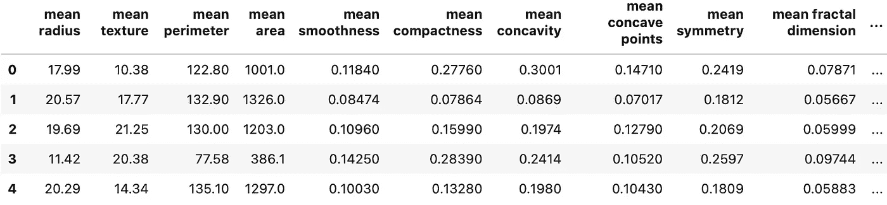
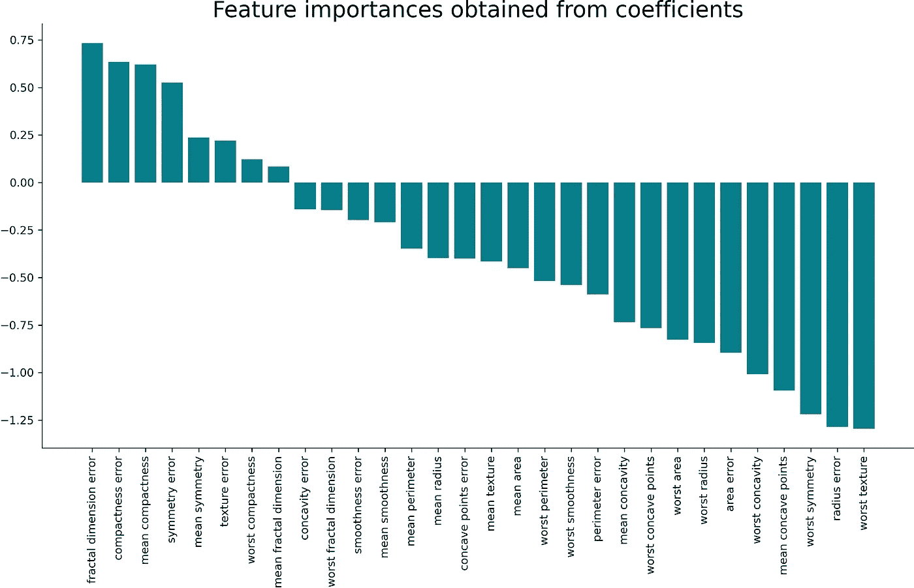
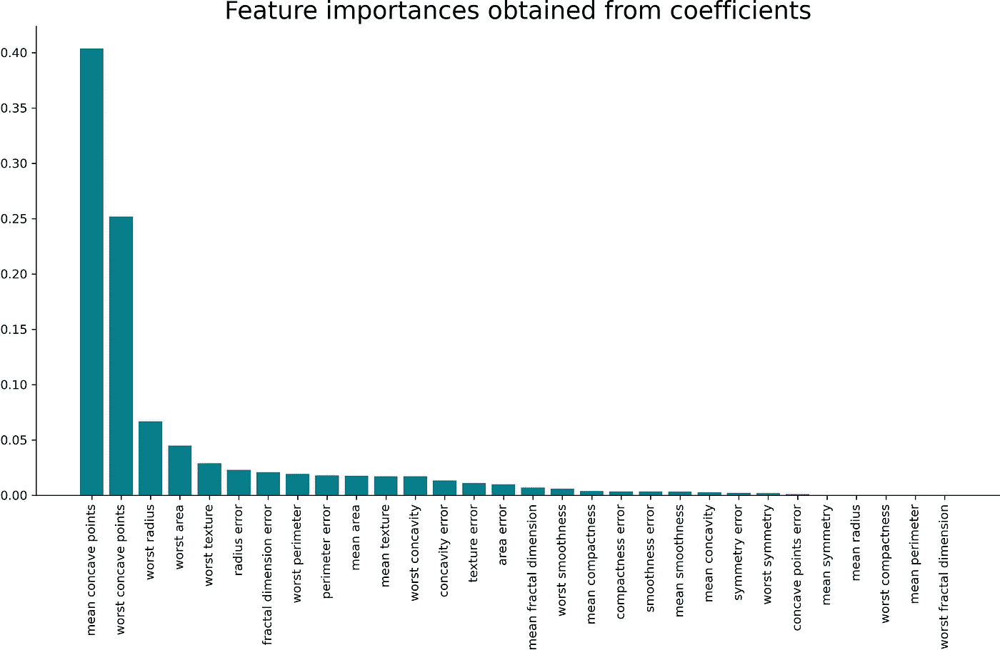
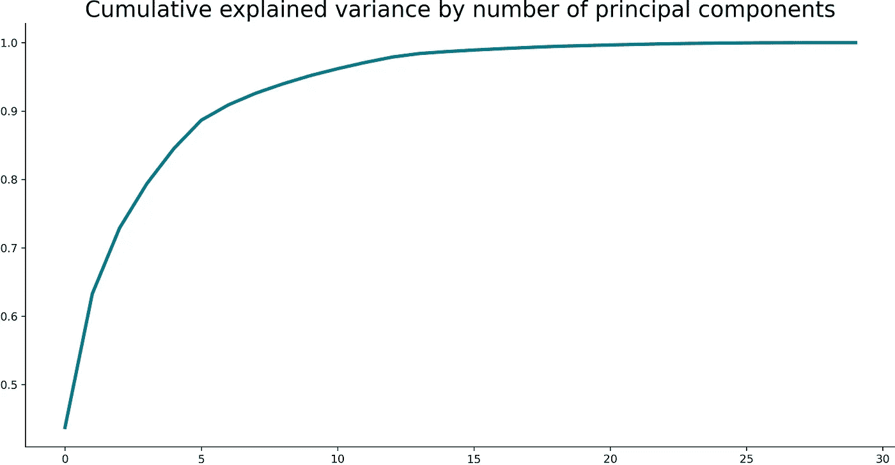
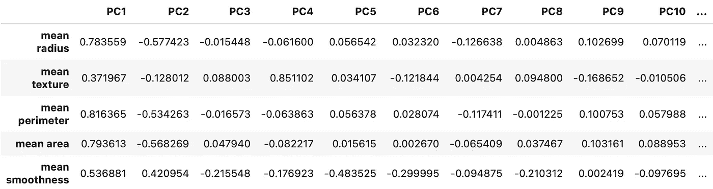
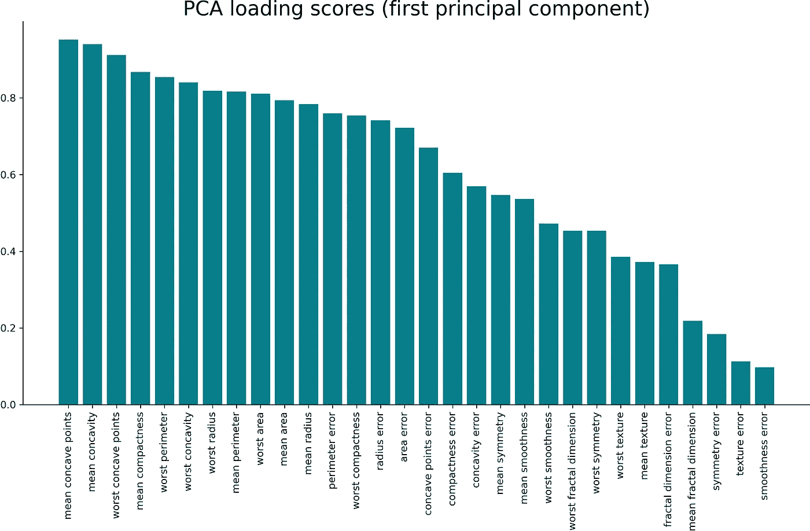

# Python 中计算要素重要性的 3 种基本方法

> 原文：<https://towardsdatascience.com/3-essential-ways-to-calculate-feature-importance-in-python-2f9149592155?source=collection_archive---------1----------------------->

## 任何有抱负的数据科学家都必须知道的

由[安东宁·杜阿利亚](https://unsplash.com/@fr0k3?utm_source=unsplash&utm_medium=referral&utm_content=creditCopyText)在 [Unsplash](https://unsplash.com/?utm_source=unsplash&utm_medium=referral&utm_content=creditCopyText) 上拍摄

如何在数据集中找到最重要的要素？有大量的技术，本文将教你三种任何数据科学家都应该知道的技术。

阅读后，您将知道如何用 Python 计算特性重要性，只需几行代码。您还将学习这些技术的先决条件——这对它们正常工作至关重要。

你可以点击下载这篇文章的笔记本[。](https://github.com/daradecic/BDS-articles/blob/main/002_Feature_Importance_Techniques_Python.ipynb)

这篇文章的结构如下:

*   数据集加载和准备
*   方法#1 —从系数中获取重要性
*   方法#2 —从基于树的模型中获取重要性
*   方法#3 —从 PCA 加载分数获得重要性
*   结论

# 数据集加载和准备

让我们在这里花尽可能少的时间。您将使用内置于 Scikit-Learn 中的*乳腺癌*数据集。您还需要 Numpy、Pandas 和 Matplotlib 来进行各种分析和可视化。

以下代码片段向您展示了如何导入库和加载数据集:

数据集现在不是最方便的格式。大部分时间您将使用 Pandas 数据框，因此让我们快速将其转换为一个数据框。以下代码片段将预测值和目标变量连接成一个数据框:

调用`head()`会产生以下输出:

图片 1-乳腺癌数据集的头部(图片由作者提供)

简而言之，有 30 个预测因子和一个目标变量。所有的值都是数字，没有丢失的值。唯一明显的问题是规模。只需查看一下*平均面积*和*平均平滑度*栏，差异非常大，这可能会导致模型质量不佳。

在解决扩展问题之前，您还需要执行训练/测试分割。

以下代码片段向您展示了如何使用`StandardScaler`类进行训练/测试分割和缩放预测器:

这就是你开始获得特性重要性所需要的一切。让我们接下来做那件事。

# 方法#1 —从系数中获取重要性

检查特性重要性的最简单的方法可能是检查模型的系数。例如，线性回归和逻辑回归都可以归结为一个方程，其中的系数(重要性)被分配给每个输入值。

简而言之，如果分配的系数是一个大(负或正)数，它对预测有一些影响。相反，如果系数为零，对预测没有任何影响。

简单的逻辑，但让我们来测试一下。我们有一个分类数据集，所以**逻辑回归**是一个合适的算法。模型拟合后，系数存储在`coef_`属性中。

以下代码片段为逻辑回归模型定型，创建一个数据框，其中存储了属性及其各自的系数，并按系数降序对该数据框进行排序:

那很容易，不是吗？接下来让我们直观地检查一下系数。以下代码片段根据系数制作了一个条形图:

下面是相应的可视化:

图片 2-作为逻辑回归系数的特征重要性(图片由作者提供)

这就是这个简单技术的全部内容。一个要点是，系数越大(正向和负向)，它对预测的影响就越大。

# 方法#2 —从基于树的模型中获取重要性

在训练完任何基于树的模型之后，您将可以访问`feature_importances_`属性。这是获得特性重要性的最快方法之一。

下面的代码片段向您展示了如何在训练数据上导入和拟合`XGBClassifier`模型。重要性的获取方式与之前类似——存储到数据框中，然后按重要性排序:

您可以通过绘制条形图来直观地检查重要性。下面是制作一个的方法:

相应的可视化如下所示:

图 3-从基于树的模型中获得的特征重要性(图片由作者提供)

如前所述，以这种方式获得重要性并不费力，但是结果可能会有点偏差。这种方法的趋势是夸大连续特征或高基数分类变量的重要性[1]。确保先做好适当的准备和转换，然后就可以开始了。

# 方法#3 —从 PCA 加载分数获得重要性

主成分分析(PCA)是一种极好的降维技术，也可以用来确定特征的重要性。

PCA 不会像前两种技术那样直接显示最重要的特征。相反，它将返回 N 个主成分，其中 N 等于原始要素的数量。

如果你对 PCA 有点生疏，在本文末尾有一个完整的从头开始的指南。

首先，让我们将 PCA 与我们的缩放数据相匹配，看看会发生什么。以下代码片段就是这样做的，并且还绘制了累计解释方差的折线图:

下面是相应的可视化:

图 4——PCA 累积解释方差(作者图片)

但是这意味着什么呢？这意味着您可以用前五个主成分解释源数据集中大约 90%的差异。同样，如果您不知道这意味着什么，请参考从头开始指南。

你现在可以开始处理 **PCA 加载**。这些仅仅是原始变量线性组合的系数，从这些原始变量中构造出主成分[2]。您可以使用加载来寻找实际变量和主成分之间的相关性。

如果主成分和原始变量之间有很强的相关性，这意味着这个特征很重要——用最简单的话来说。

下面是用 Python 计算加载分数的片段:

相应的数据框如下所示:

图 PCA 加载分数的标题(图片由作者提供)

第一主成分是至关重要的。这只是一个单一的特征，但它解释了数据集中超过 60%的差异。从*图 5 中可以看出，*它和平均半径特征之间的相关系数几乎是 0.8——这被认为是强正相关。

让我们将所有输入特征和第一主成分之间的相关性可视化。以下是完整的代码片段(包括可视化):

相应的可视化如下所示:

图 6 —第一个主成分的 PCA 加载分数(作者图片)

这就是你如何“黑掉”PCA，将其用作特征重要性算法。让我们在下一部分总结一下。

# 结论

现在你知道了——你可以用三种技术来找出什么是重要的。当然，还有许多其他的，您可以在本文的*了解更多*部分找到其中的一些。

这三个应该很适合你做任何机器学习任务。只是要确保先做好适当的清洁、探索和准备。

感谢阅读。

*喜欢这篇文章吗？成为* [*中等会员*](https://medium.com/@radecicdario/membership) *继续无限制学习。如果你使用下面的链接，我会收到你的一部分会员费，不需要你额外付费。*

<https://medium.com/@radecicdario/membership>  

## 了解更多信息

*   [2021 年学习数据科学的前 5 本书](/top-5-books-to-learn-data-science-in-2020-f43153851f14)
*   [Python 中从头开始的主成分分析](/principal-component-analysis-pca-from-scratch-in-python-7f3e2a540c51)
*   [Python 中的特征选择——递归特征消除](/feature-selection-in-python-recursive-feature-elimination-19f1c39b8d15)
*   [Python-IV 和 WoE 中的属性相关性分析](/attribute-relevance-analysis-in-python-iv-and-woe-b5651443fc04)

# 参考

[1][https://towards data science . com/explaining-feature-importance-by-example-of-a-random-forest-d 9166011959 e](/explaining-feature-importance-by-example-of-a-random-forest-d9166011959e)
【2】[https://scentellegher . github . io/machine-learning/2020/01/27/PCA-loadings-sk learn . html](https://scentellegher.github.io/machine-learning/2020/01/27/pca-loadings-sklearn.html)

*原载于 2021 年 1 月 14 日 https://betterdatascience.com**[*。*](https://betterdatascience.com/feature-importance-python/)*