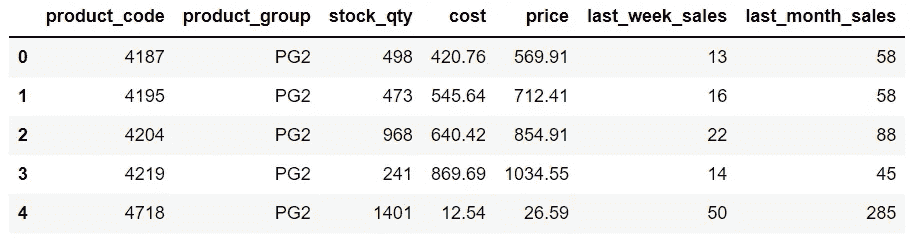
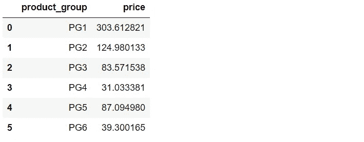
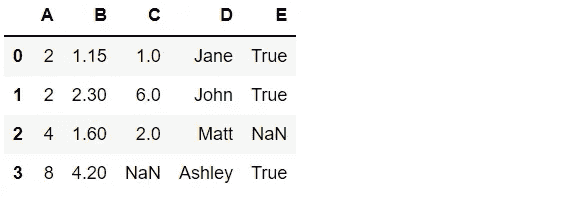
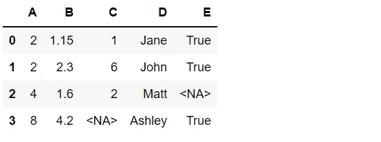

# 更有效地使用 Python 熊猫的 3 个例子

> 原文：<https://towardsdatascience.com/3-examples-for-using-python-pandas-more-efficiently-8173873c0bc6?source=collection_archive---------13----------------------->

## 学习新工具的最好方法是通过实践。


布雷特·乔丹在 [Unsplash](https://unsplash.com/s/photos/practice?utm_source=unsplash&utm_medium=referral&utm_content=creditCopyText) 上拍摄的照片

Pandas 是数据科学生态系统中使用最广泛的 Python 库之一。它有许多功能和方法来执行有效和快速的数据分析和操作。

在这篇文章中，我们将通过 3 个例子来展示如何用熊猫做一些特定的操作。

练习的首要要求是数据。我准备了一个销售数据集，你可以从我的 GitHub 页面上的这个[库](https://github.com/SonerYldrm/datasets)下载。请随意使用它并跟随它。

让我们从导入 Pandas 并把数据集读入数据框开始。

```
import pandas as pdsales = pd.read_csv("sales.csv")sales.head()
```



销售数据框的前 5 行(图片由作者提供)

# 示例 1

熊猫最常用的功能之一是`groupby`。它基本上允许根据一列中的不同类别计算聚合值。

例如，我们可以计算每个产品组的平均产品价格，如下所示:

```
sales.groupby("product_group", as_index=False)["price"].mean()
```



(图片由作者提供)

有几个聚合函数可以和`groupby`一起使用，比如`min`、`max`、`mean`、`count`等等。这里我想展示的是，我们可以用 lambda 函数扩展`groupby`的功能。

数据框包含每种产品的价格和成本。假设我们想找出每个产品组中产品的平均利润。一种方法是创建一个包含利润信息的列，然后对其应用`mean`函数。如果您不喜欢创建新列，可以通过应用 lambda 函数来完成此操作，如下所示。

```
sales.groupby("product_group").apply(
   lambda x: (x["price"] - x["cost"]).mean()
)product_group
PG1    98.071795
PG2    42.973467
PG3    26.299231
PG4    13.141605
PG5    18.657765
PG6    15.200864
dtype: float64
```

# 示例 2

数据框中的重复行可能会导致严重的问题。我们所做的分析是不正确的，因此我们需要确保数据框中没有重复的行。

我们如何定义重复行取决于数据集。在我们的例子中，具有相同产品代码的两行被认为是重复的。在某些情况下，两行需要在所有列中具有相同的值才能成为重复行。

在处理重复行时，`duplicated`和`drop_duplicates`函数非常方便。

我们可以在产品代码列中找到重复条目的数量，如下所示。

```
sales.duplicated(subset='product_code').sum()47
```

如果产品代码重复，函数`duplicated`返回 true。通过应用`sum`函数，我们得到了重复产品代码的总数。

如果我们认为两行是重复的，如果它们具有相同的产品代码和产品组，那么我们将这些列作为列表传递给 subset 参数。

`drop_duplicated`函数从数据框中删除重复的行。

```
sales_new = sales.drop_duplicates(subset="product_code", keep="first")sales_new.duplicated(subset="product_code").sum()
0
```

`keep`参数用于确定数据帧中保留哪一个重复行。

对于`duplicated`和`drop_duplicates`函数，如果我们想要基于所有列评估行，我们不应该使用`subset`参数。

# 示例 3

我们并不总是有数字数据。它有不同的数据类型，如整数、浮点、字符串、对象、日期时间等等。为了执行高效准确的操作，使用适当的数据类型非常重要。

有些函数和方法只适用于某些数据类型。因此，在执行任何分析之前，我们应该转换存储不正确的列的数据类型。

假设我们有以下数据框。



df(作者图片)

```
df.dtypes
A      int64
B    float64
C    float64
D     object
E     object
dtype: object
```

列 C 似乎有整数，但由于 NaN 值，数据类型是 float。类似地，列 E 以对象数据类型存储，但它应该是布尔型的。

我们可以使用`astype`函数分别改变每一列的数据类型。然而，还有一个更有效的选项，那就是`convert_dtypes`功能。它将列转换为可能的最佳数据类型。

```
df_new = df.convert_dtypes()df_new.dtypes
A      Int64
B    Float64
C      Int64
D     string
E    boolean
dtype: object
```



(图片由作者提供)

# 结论

学习熊猫或任何其他软件工具的最好方法是通过练习。你的手越脏，你就越会利用熊猫。

当您开始处理需要更多清理和预处理的真实数据集时，您会更好地欣赏熊猫的功能和效率。

感谢您的阅读。如果您有任何反馈，请告诉我。