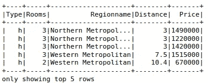
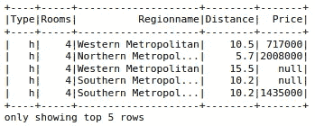
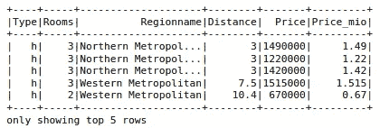
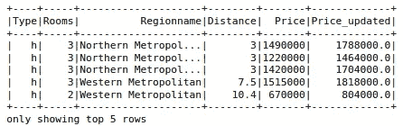
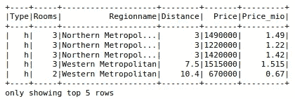
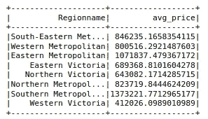

# 展示 PySpark 无限灵活性的 3 个示例

> 原文：<https://towardsdatascience.com/3-examples-that-show-the-unlimited-flexibility-of-pyspark-319ab22d5a?source=collection_archive---------18----------------------->

## Python 和 SQL 的结合，但比两者都简单


Genessa panainite 在 [Unsplash](https://unsplash.com/s/photos/spark?utm_source=unsplash&utm_medium=referral&utm_content=creditCopyText) 上拍摄的照片

Spark 是一个用于大规模数据处理的分析引擎。它让您可以将数据和计算分散到集群上，从而实现显著的性能提升。

收集、传输和存储数据比以往任何时候都更容易。因此，当我们处理现实生活中的问题时，需要处理大量的数据。因此，像 Spark 这样的分布式引擎在这种情况下变得必不可少。

PySpark 是 Spark 的 Python API。它给我们带来了 Python 语法的简单性，因此我们可以轻松地处理和分析大量数据。PySpark 的 SQL 模块更进一步，为我们提供了类似 SQL 的操作。

我在这里想说的是 PySpark 是一个非常高效的工具，具有易于使用和直观的语法。使 PySpark 成为如此简单的工具的一个重要因素是它提供的灵活性。

无论您习惯使用 Pandas 还是 SQL，学习 PySpark 都不会有困难。在本文中，我们将介绍 3 种常见的数据操作，展示其灵活性。

我们首先需要创建一个 SparkSession，作为 Spark SQL 的入口点。

```
from pyspark.sql import SparkSessionspark = SparkSession.builder.getOrCreate()
```

让我们通过读取 csv 文件来创建一个 spark 数据帧。我们将使用 Kaggle 上的墨尔本房产[数据集](https://www.kaggle.com/anthonypino/melbourne-housing-market)。

```
file_path = "/home/sparkuser/Downloads/melb_housing.csv"
df = spark.read.csv(file_path, header=True)
```

## 1.选择列的子集

我们可能不需要数据集中的所有列。有些列可能是多余的，或者不适用于特定的任务。

PySpark 提供了多种选择列子集的方法。第一个是选择方法。

```
df1 = df.select("Type", "Rooms", "Regionname", "Distance", "Price")
df1.show(5)
```



(图片由作者提供)

我们也可以用类似熊猫的语法做同样的操作。

```
df2 = df["Type", "Rooms", "Regionname", "Distance", "Price"]
df2.show(5)
```


(图片由作者提供)

两种方法都可以。确保使用正确类型的括号。select 方法使用括号(“()”)，而另一个方法使用方括号(“[]”)。

## 2.筛选行

数据分析和操作中的一个常见操作是根据条件过滤观察值(即行)。我们将讨论 3 种不同的过滤方法。

第一个是过滤方法。

```
from pyspark.sql import functions as Fdf_sub = df2.filter(F.col("Rooms") == 4)
```

col 函数用于选择房间列，因此我们只选择有 4 个房间的房子。

就像前面的例子一样，我们可以用类似熊猫的语法做同样的操作。

```
df_sub = df2[df2.Rooms == 4]
```

最后但同样重要的是，可以使用 where 方法。它类似于 SQL 中的 where 子句。

```
df_sub = df2.where("Rooms = 4")df_sub.show(5)
```



(图片由作者提供)

我不认为我们可以声明一个方法比其他方法简单。这里的重点是强调使用 PySpark 进行操作的多种方式。它不会强迫你去适应一种特定的做事方式。与此相反，PySpark 符合你的口味。

## 3.创建新列

数据预处理通常涉及一些列操作。常见的操作之一是基于现有的列创建一个新的列。

让我们来看看在 PySpark 中创建新列的两种不同方法。我们将创建一个以百万为单位显示房价的列。因此，我们可以通过将价格列除以 100 万来实现它。

第一个选项是使用 withColumn 方法。

```
df2_new = df2.withColumn("Price_mio", F.col("Price") / 1000000)
df2_new.show(5)
```



(图片由作者提供)

第一个参数是新列的名称。第二部分包含计算值的操作。在第二部分中，我们不局限于简单的操作。事实上，PySpark 在创建新列时提供了很大的灵活性。

考虑这样一种情况，我们需要根据不同列中的值来更新价格。例如，我们可能想提高 h 类房屋的价格，其他房屋的价格将保持不变。

我们可以使用 withColumn 方法和 when 函数来执行此任务，如下所示。

```
df2_new = df2.withColumn(
   "Price_updated", 
   F.when(F.col("Type") == "h", F.col("Price") * 1.2).\
   otherwise(F.col("Price")))df2_new.show(5)
```



(图片由作者提供)

上面的代码告诉 PySpark 当类型为 h 时将价格列相乘，否则保持价格不变。

创建列的第二个选项是使用 SQL 查询。我们首先需要将数据框注册为临时表。

```
df2.registerTempTable("df2_table")
```

我们现在可以使用的就像一个 SQL 表。为了创建带有新列的数据框，我们可以编写如下 SQL 查询。

```
df2_updated = spark.sql(
     "select *, Price / 1000000 as Price_mio from df2_table"
)
df2_updated.show(5)
```



(图片由作者提供)

我们可以像查询 SQL 表一样查询临时表(df2_table)。例如，我们可以计算每个地区的平均房屋数量如下。

```
spark.sql(
    """
    select Regionname, avg(Price) as avg_price 
    from df2_table 
    group by Regionname
    """
).show()
```



(图片由作者提供)

## 结论

我们所做的例子清楚地展示了 PySpark 的灵活性。无论您是 Python 用户还是 SQL 用户，您都会找到使用 PySpark 的舒适方式。

PySpark 语法有点像 Python 和 SQL 的结合，但我认为它比两者都简单。

需要注意的是，Spark 针对大规模数据进行了优化。因此，在处理小规模数据时，您可能看不到任何性能提升。事实上，在处理小数据集时，Pandas 可能会比 PySpark 表现得更好。

感谢您的阅读。如果您有任何反馈，请告诉我。