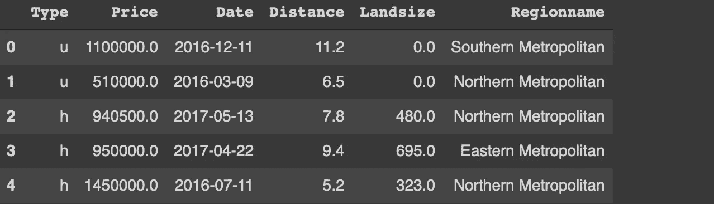
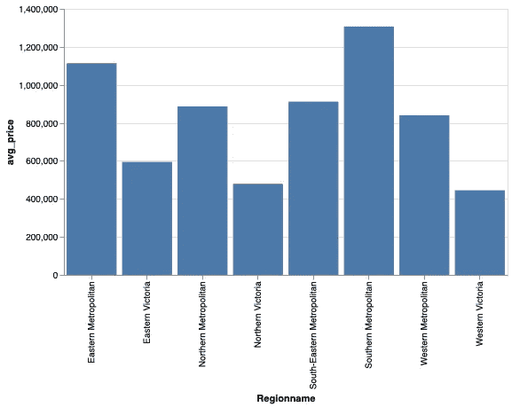
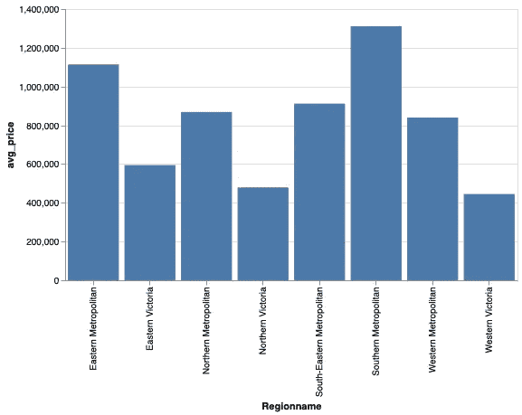
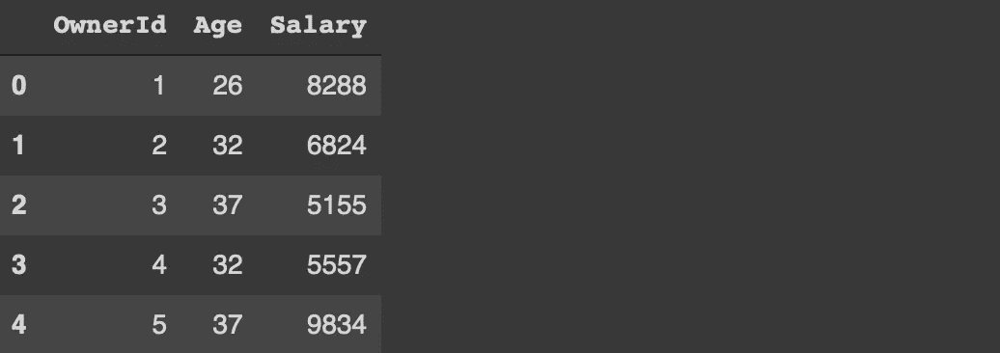
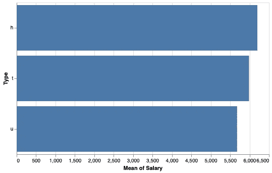

# 3 个例子展示 Python Altair 不仅仅是一个数据可视化库

> 原文：<https://towardsdatascience.com/3-examples-to-show-python-altair-is-more-than-a-data-visualization-library-700e37cbf95b?source=collection_archive---------12----------------------->

## 一个完整的数据探索工具


由 Unsplash 上的 [Sigmund](https://unsplash.com/@sigmund?utm_source=unsplash&utm_medium=referral&utm_content=creditCopyText) 拍摄的照片

Altair 是 Python 的统计数据可视化库。它为创建静态和交互式可视化提供了简单易懂的语法。

我最喜欢 Altair 的是数据转换和过滤功能。它提供了灵活多样的方法来转换和过滤数据，同时创建数据可视化。

在这个意义上，Altair 也可以被认为是一个数据分析工具。我们将讨论 3 个例子，展示 Altair 如何加快探索性数据分析过程。

我们将使用 Kaggle 上的墨尔本房屋[数据集](https://www.kaggle.com/dansbecker/melbourne-housing-snapshot)中的一个小样本作为例子。我们首先导入库并读取数据集。

```
import numpy as np
import pandas as pd
import altair as altcols = ['Type','Price','Distance','Date','Landsize','Regionname']melb = pd.read_csv(
   "/content/melb_data.csv", usecols = cols, parse_dates = ['Date']
).sample(n=1000).reset_index(drop=True)melb.head()
```



(图片由作者提供)

## 示例 1

我们将创建一个条形图，显示每个地区的平均房价。一种选择是使用 Pandas 的函数计算平均值，然后绘制结果。

然而，我们可以使用 Altair 一次完成所有任务。

```
alt.Chart(melb).mark_bar().encode(
   x = 'Regionname', y = 'avg_price:Q'
).transform_aggregate(
   avg_price = 'mean(Price)', groupby = ['Regionname']
).properties(
   height = 300, width = 500
)
```

语法以顶级图表对象开始，后跟绘图类型。encode 函数用于指定在传递给 Chart 对象的 dataframe 中绘制什么。

您可能已经注意到，y 编码不是数据帧中的一列。它是在下一步中使用 transform_aggregate 函数计算的聚合列。y 编码中的“Q”字母代表定量。

属性功能用于调整可视化的属性。下面是上面的代码生成的图。



(图片由作者提供)

## 示例 2

距离栏表示房子到中央商业区的距离。假设我们想要为距离超过 3 英里的房屋创建前面示例中的地块。

我们可以通过在代码中实现 transform_filter 函数来轻松完成这项任务。

```
alt.Chart(
  melb, height=300, width=500
).mark_bar().encode(
  x = 'Regionname', y = 'avg_price:Q'
).transform_filter(
  alt.FieldGTPredicate(field='Distance', gt=3)
).transform_aggregate(
  avg_price = 'mean(Price)',groupby = ['Regionname']
)
```

FieldGTPredicate 处理“大于”条件。Altair 还为“等于”、“小于”、“范围”等其他条件提供了谓词。

在前面的例子中，我们使用了 properties 函数来调整大小。在本例中，相同的操作在 chart 对象内部完成。

这是过滤值的条形图。



(图片由作者提供)

## 示例 3

这个例子包括一个查找操作，类似于 Pandas 的合并功能。

假设我们有另一个数据帧，其中包含一些关于这些房屋所有者的信息。

```
melb['OwnerId'] = np.arange(1,1001)df = pd.DataFrame({
  'OwnerId': melb['OwnerId'],
  'Age': np.random.randint(20, 40, size=1000),
  'Salary': np.random.randint(5000, 10000, size=1000)
})df.head()
```



(图片由作者提供)

我们在原始数据框架中添加了一个 id 列，并创建了一个新的包含客户的 id、年龄和工资信息的数据框架。

我们想绘制每种房屋类型的业主平均工资。我们可以使用 Pandas 函数合并数据帧，并根据房屋类型对数据点(即行)进行分组，然后计算平均值。

另一种选择是使用 Altair 的查找转换，如下所示:

```
alt.Chart(
  df, height=300, width=500
).mark_bar().encode(
  x = 'mean(Salary):Q', y = 'Type:O'
).transform_lookup(
  lookup='OwnerId',
  from_=alt.LookupData(data=melb, key='OwnerId', fields=['Type'])
)
```

lookup 参数是指用于合并的列。下面是生成的图:



(图片由作者提供)

## 结论

我们已经做了 3 个例子来演示 Altair 的转换和过滤功能。关于这些操作，Altair 也是一个数据分析和操作工具。

当然，熊猫对于这样的行动要强大得多。然而，能够在创建可视化的同时执行基本的数据争论操作为 Altair 增加了重要的价值。

我们只做了条形图的例子，但是转换特性可以适当地扩展到任何其他的图。

感谢您的阅读。如果您有任何反馈，请告诉我。