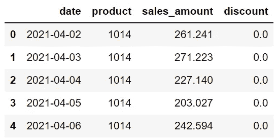
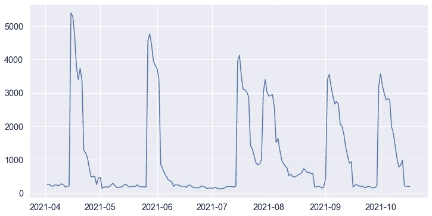
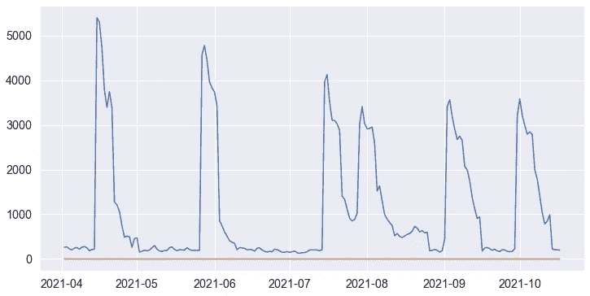
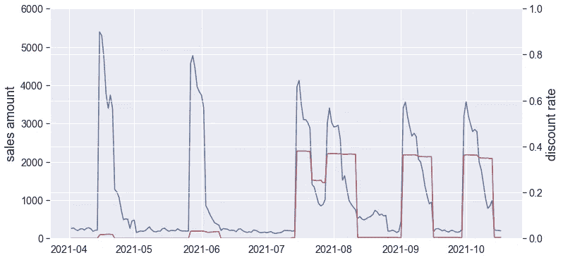
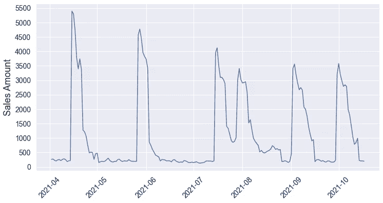
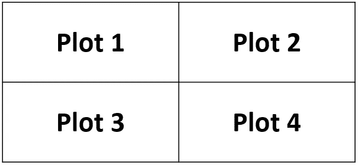
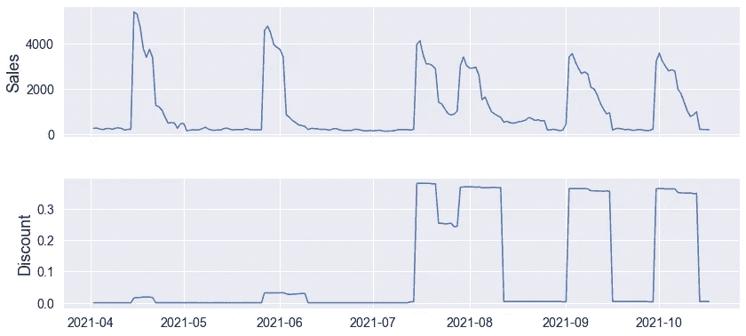

# Python Matplotlib 的 3 个特性使数据可视化更具吸引力和信息量

> 原文：<https://towardsdatascience.com/3-features-of-python-matplotlib-that-make-data-visualizations-more-appealing-and-informative-e326762dea85?source=collection_archive---------6----------------------->

## 你如何展示和你展示什么一样重要。


由[塞巴斯蒂安·斯文森](https://unsplash.com/@sebastiansvenson?utm_source=unsplash&utm_medium=referral&utm_content=creditCopyText)在 [Unsplash](https://unsplash.com/s/photos/simple?utm_source=unsplash&utm_medium=referral&utm_content=creditCopyText) 拍摄的照片

数据可视化是数据科学的重要组成部分。从探索性数据分析到交付结果，利用数据可视化势在必行。

仅仅向利益相关者展示简单的数字是很难说服他们的。他们通常更感兴趣的是借助数据可视化可以清晰显示的全局。

作为数据科学生态系统中的主流语言，Python 拥有非常强大的数据可视化库，Matplotlib 就是其中之一。

在本文中，我们将介绍 Matplotlib 的 3 个特性，这些特性允许定制您的绘图，使它们更具信息性和吸引力。

在一天结束的时候，你如何展示和你展示什么一样重要。

我创建了一个销售和折扣数据集样本，你可以从我的数据集 Github [repo](https://github.com/SonerYldrm/datasets) 下载。在这个回购中可以随意使用任何数据集，但在本文中我们将使用名为“sales_vs_discount.csv”的数据集。

让我们从导入库和读取数据集开始。我们将首先通过读取 csv 文件创建一个熊猫数据框。

```
import numpy as np
import pandas as pd
import matplotlib.pyplot as pltdf = pd.read_csv("sales_vs_discount.csv")df.head()
```



(图片由作者提供)

在分析时间序列数据时，我们几乎总是使用折线图。这是一个简单的线形图，显示了销售额随时间的变化。

```
df["date"] = df["date"].astype("datetime64[ns]")plt.figure(figsize=(12,6))
plt.plot(df["date"], df["sales_amount"])
```



(图片由作者提供)

***注*** *:绘制数量与时间关系图时，最好有适当数据类型的时间信息。在我们的文件中，日期列的数据类型是“对象”。在第一行中，我们将其更改为“datetime”。*

我们观察到每日销售额的峰值，并怀疑这些峰值可能是由于对此产品应用了一些折扣。

我们可以通过绘制销售额和折扣率来确认。如果它们重叠，我们可以确认折扣增加了销售额。

我们可以将它们绘制在下图中:

```
plt.figure(figsize=(12,6))
plt.plot(df["date"], df["sales_amount"])
plt.plot(df["date"], df["discount"])
```



(图片由作者提供)

我们将销售额和折扣放在同一个图上，但是这个可视化并没有告诉我们任何东西。原因是数值范围差别很大。

折扣在 0 和 1 之间变化，而销售额在数千的水平上。

我们可以通过增加一个副轴来解决这个问题。

# 1.添加辅助 y 轴

我们可以创建多个轴，并使用`twinx`功能添加辅助 y 轴。

```
fig, ax1 = plt.subplots(figsize=(12,6))
ax2 = ax1.twinx()ax1.plot(df["date"], df["sales_amount"])
ax2.plot(df["date"], df["discount"], color="r")ax1.set_ylabel("sales amount", fontsize=18)
ax1.set_ylim([0,6000])ax2.set_ylabel("discount rate", fontsize=18)
ax2.set_ylim([0,1])
```

让我们一行一行地检查这段代码，以理解每一步都做了什么。

第一行创建一个图形和轴对象。图形对象就像一个容器，把所有的东西放在一起。我们可以在一个图形中放置多个轴对象。

第二行创建带有辅助 y 轴的第二个轴对象。

第三和第四行在轴对象上创建线图。

代码的剩余部分为 y 轴创建标签并调整值的范围。



(图片由作者提供)

现在看起来好多了。我们可以清楚地看到折扣是如何对销售额产生积极影响的。

# 2.Xticks 和 yticks

这个特性是为了使可视化效果更吸引人。Matplotlib 允许更改 xticks 和 yticks 值以及它们的显示方式。

```
plt.figure(figsize=(12,6))plt.plot(df["date"], df["sales_amount"])plt.xticks(fontsize=14, rotation=45)
plt.yticks(ticks=np.arange(0,6000,500), fontsize=14)plt.ylabel("Sales Amount", fontsize=18)
```

在第一行中，我们创建一个人物对象。图形的大小由`figsize`参数指定。第二行创建线形图。

第三行更改 xticks 的字体大小，并旋转 45 度。在第四行中，我们还更改了刻度值。我们现在每 500 马克就有一个刻度，而以前只有 1000 马克才有。

最后一行为 y 轴添加了一个标签。这是由上面的代码片段创建的图。



(图片由作者提供)

***注意:*** *你可能已经注意到，我们在前面的例子中使用了* `*set_ylabel*` *函数。*

*在对图形对象进行操作时，这些功能不是以“设置”开始的，如* `*ylabel*` *、* `*xlabel*` *、* `*ylim*` *等等。*

*我们在对 Axes 对象进行调整的时候，都是从*`*set_ylabel*`*`*set_xlabel*`*`*set_ylim*`*等“set”开始的。***

# **3.创建子图网格**

**在某些情况下，我们创建包含多个图的可视化。每一个都携带不同的信息。**

**回想一下我们之前创建的在同一个图表上显示折扣率和销售额的图表。**

**该可视化的不同版本可以是在彼此之上的两个线图。它们共享同一个 x 轴，所以我们仍然可以看到折扣对销售额的影响。**

**支线剧情功能可以用来创建支线剧情网格。`nrows`和`ncols`参数决定了支线剧情的数量并进行排列。**

**例如，“nrows=2”和“ncols=2”创建的网格如下所示:**

****

**(图片由作者提供)**

**我们将有两个地块，并把它们放在对方的顶部。因此，我们需要设置“nrows=2”和“ncols=1”。**

```
**fig, (ax1, ax2) = plt.subplots(
   nrows=2, ncols=1, sharex=True, figsize=(12,6)
)fig.tight_layout(pad=2)ax1.plot(df["date"], df["sales_amount"])
ax2.plot(df["date"], df["discount"])ax1.set_ylabel("Sales", fontsize=18)
ax2.set_ylabel("Discount", fontsize=18)**
```

**如果 x 轴是公共的，我们可以将`sharex`参数设置为 true，这样 x 轴将只显示在底部。否则每个支线剧情下面都会有一个 x 轴。**

**`tight_layout`函数用于在子情节之间创建一些空间。这可以防止它们重叠。**

**这是我们的两个支线剧情的网格。**

****

**(图片由作者提供)**

*****注意:*** *在这个例子中，我们通过将支线剧情传入一个元组来显式定义它们的名称。***

*   ***(ax1，ax2)***

**我们也可以用下标来定义支线剧情。**

*   ***axs，axs[0]，axs[1]等等。***

***下面的代码创建了与上面相同的情节。***

```
**fig, axs = plt.subplots(
   nrows=2, ncols=1, sharex=True, figsize=(12,6)
)fig.tight_layout(pad=2)axs[0].plot(df["date"], df["sales_amount"])
axs[1].plot(df["date"], df["discount"])axs[0].set_ylabel("Sales", fontsize=18)
axs[1].set_ylabel("Discount", fontsize=18)**
```

# **结论**

**我们已经看到了 Matplotlib 的 3 个不同的特性，这些特性使得可视化更加吸引人，信息更加丰富。**

**在任务中创建和使用数据可视化是一回事。更重要的是让它们通俗易懂，简明扼要。我们在本文中所做的例子将帮助你创建这样的可视化。**

**最后但同样重要的是，如果你还不是[中级会员](https://sonery.medium.com/membership)并打算成为一名，我恳请你使用以下链接。我将收取你的一部分会员费，不增加你的额外费用。**

**<https://sonery.medium.com/membership> ** 

**感谢您的阅读。如果您有任何反馈，请告诉我。**