# Python 中的 3 个无限迭代器

> 原文：<https://towardsdatascience.com/3-infinite-iterators-in-python-98746f359d4b?source=collection_archive---------18----------------------->


由 [DeltaWorks](https://pixabay.com/users/deltaworks-37465/) 在 [Pixabay](https://pixabay.com/photos/flower-field-flowers-field-trees-250016/) 上拍摄的照片

## 5 个例子让你知道何时使用它们

毫无疑问，Python 内置模块 Itertools 相当强大。的确，几乎没有人能用一篇文章把它介绍得里里外外。因此，我选择了三个迭代器函数来帮助我们产生无限数量的元素。当然，格局是我们自己定义的。

*   数数
*   循环
*   重复

我将演示这些函数，以及我们可以使用它们的典型场景。通过这些例子，你会对它们的设计有更好的了解。如果你有更有创意的方法来使用它们，请不要犹豫让我知道！

让我们在任何演示之前导入它们。

```
from itertools import count, cycle, repeat
```

# 1.Itertools.count()


由[像素](https://pixabay.com/users/pexels-2286921/)在[像素上拍摄的照片](https://pixabay.com/photos/abacus-classroom-count-counter-1866497/)

每个人都会数数。如果不叫我们停下来，理论上我们可以一直数下去。在 Python 世界中，使用`range()`函数来生成数字序列是非常常见的。然而，我们必须让函数知道在哪个点上它需要停止。

但不用于`count()`功能。我们不需要告诉它什么时候停下来，只是不停地下一个，下一个，下一个。

```
iter_count = count(0)for i in range(10):
    print(next(iter_count))
```

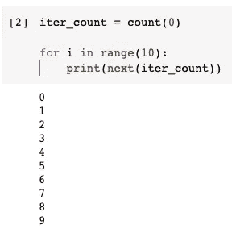

在上面的例子中，我们使用`count()`函数定义了一个迭代器。我们告诉它应该从 0 开始，但不需要告诉什么时候停止。然后，我们使用`next()`函数从中获取值。循环 10 次，迭代器会产生 10 个数字。

`count()`功能也接受定制步骤的第二个参数。如果未指定，默认步长为 1。

```
iter_count = count(0.5, 0.5)for i in range (10):
    print(next(iter_count))
```

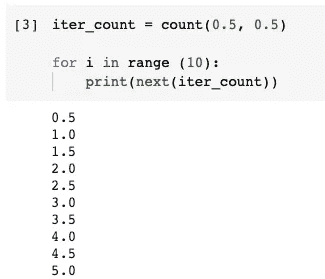

所以，每次我们得到下一个数字，就会加 0.5 而不是 1。

## 示例 1:获取偶数和奇数

我们可以很容易地使用`count()`函数来生成一个算术序列。例如，我们可以用它来生成奇数或偶数的列表。

```
iter_count_odd = count(1, 2)
iter_count_even = count(0, 2)odds = [next(iter_count_odd) for _ in range(10)]
evens = [next(iter_count_even) for _ in range(10)]print(odds)
print(evens)
```

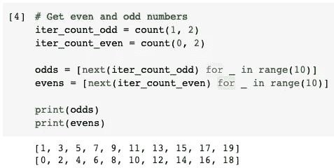

## 示例 2:在 zip 函数中使用 count

假设我们有一份学生名单。现在，我们想自动分配学生证给他们。学生证要从 150000 开始。我们可以使用`count()`函数非常方便地做到这一点。

让我们首先生成一个学生姓名的虚拟列表。

```
students = ['Alice', 'Bob', 'Chris', 'David', 'Eva']
```

然后，让我们生成学生 id。

```
for i in zip(count(150001), students):
    print(i)
```

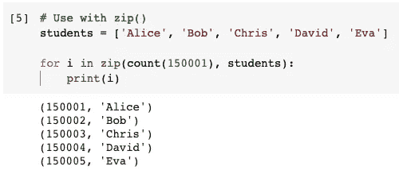

在这里，最重要的是，我们不必知道我们有多少学生。此外，如果需要，我们可以很容易地将结果转换成字典。

# 2.Itertools.cycle


由[像素](https://pixabay.com/users/pexels-2286921/)在[像素箱](https://pixabay.com/photos/stone-circles-mystery-cult-1853340/)上拍摄的照片

第二个无限迭代器工厂是`cycle()`函数。与一直朝一个方向计数的`count()`功能不同，`cycle()`功能会一遍又一遍地重复一个模式。

```
iter_cycle = cycle(['a', 'b', 'c'])for i in range(10):
    print(next(iter_cycle))
```

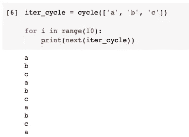

在上面的例子中，我们传入的列表有 3 个元素。由`cycle()`函数生成的迭代器将按顺序逐个填充它们。当所有的元素都被使用时，它会返回到开始处再次获取第一个元素。继续循环:)

## 示例 3:使用 cycle 生成每日轮换花名册

假设你在一个团队中，团队成员将轮流值班一天。为了公平起见，我们需要生成一个花名册。请注意，随机可能不够公平。还有，有可能有人会连续一天以上随叫随到，这绝对是我们需要避免的。

在这种情况下，`cycle()`功能会有所帮助。但在此之前，我们先生成一个日期列表。

```
from datetime import datetime, timedeltadates = [(datetime(2021, 1, 1) + timedelta(days=i)).strftime('%Y-%m-%d') for i in range(10)]
```

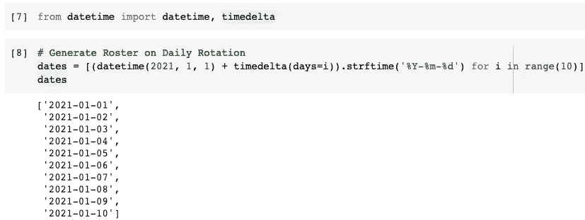

现在，我们可以使用带有循环迭代器的`zip()`函数来生成花名册。

```
iter_cycle = cycle(['Alice', 'Bob', 'Chris'])for i in zip(dates, iter_cycle):
    print(i)
```

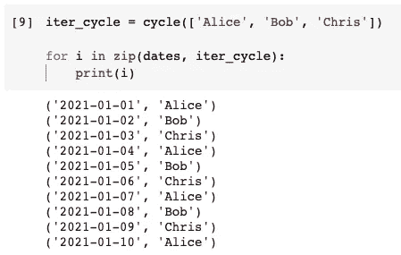

如果我们有一年的生成时间，不用担心，就用`cycle()`吧，因为它是无限的。

# 3.Itertools .重复


照片由 [stevepb](https://pixabay.com/users/stevepb-282134/) 在 [Pixabay](https://pixabay.com/photos/pawn-chess-pieces-strategy-chess-2430046/) 上拍摄

如果我们想永远重复某件事或者重复某段时间，那么`repeat()`函数总是 Python 中的最佳选择。首先，让我们生成一个无限迭代器，它重复地给我们同样的东西。

```
iter_repeat = repeat('Towards Data Science')for i in range(10):
    print(next(iter_repeat))
```

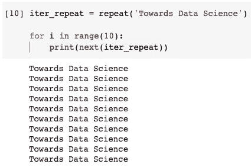

请注意,`repeat()`函数也采用可选的第二个参数来变得有限。

```
list(repeat('Towards Data Science', 5))
```

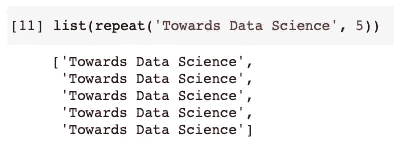

在上面的例子中，我们为 5 个副本生成了相同字符串的列表。

## 示例 4:比列表更快

有理由问我们为什么需要`repeat()`函数？例如，生成一个包含 5 个相同字符串的列表可以像下面这样简单。

```
['Towards Data Science'] * 5
```

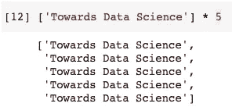

的确，就可读性而言，这要好得多。然而，重复迭代器将缓存结果，而列表乘法将在内存中生成 5 个不同的字符串。

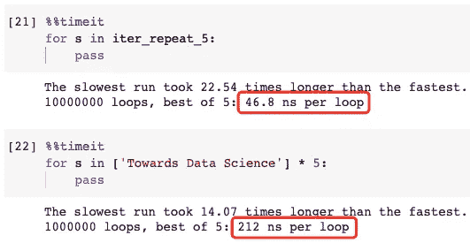

我们可以看到，在这种情况下，重复迭代器大约快了 4 倍。如果我们需要 5 倍以上，速度差会更大。

## 示例 5:循环比 range()更快

当我们想要循环某些东西的时候，使用`range()`是很常见的。比如`for i in range(10)`会循环 10 次。

然而，当我们不需要那个`i`，这意味着我们不关心循环次数，重复迭代器在性能方面将是一个更好的解决方案。

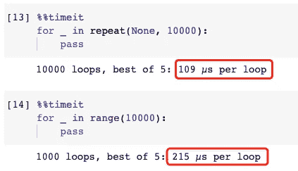

我们可以看到，使用`repeat()`功能比使用`range()`功能快 2 倍。前者胜出，因为它需要做的只是更新现有`None`对象的引用计数。后者失败了，因为`range()`或`xrange()`需要制造 10，000 个不同的整数对象。

# 摘要


由[塔纳乔纳](https://pixabay.com/users/tanajona-2899402/)在 [Pixabay](https://pixabay.com/photos/racket-padel-ball-padel-tennis-6308994/) 上拍摄的照片

在本文中，我介绍了 Python 的 Itertools 模块的 3 个无限迭代器。通过了解它们，有时可以在很大程度上提高我们的生产力。然而，我也建议平衡可读性和性能。不要总是用代码来炫耀，只在必要的时候才使用它们。

如果您对更多 Python 内置模块感兴趣，请查看这些相关文章。

[](https://medium.com/@qiuyujx/membership) [## 通过我的推荐链接加入 Medium 克里斯托弗·陶

### 作为一个媒体会员，你的会员费的一部分会给你阅读的作家，你可以完全接触到每一个故事…

medium.com](https://medium.com/@qiuyujx/membership) 

如果你觉得我的文章有帮助，请考虑加入 Medium 会员来支持我和成千上万的其他作者！(点击上面的链接)