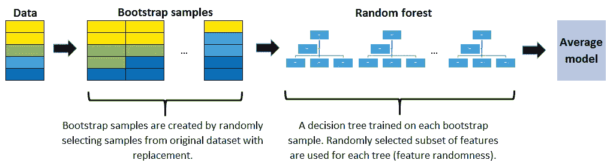

# 随机森林和 GBDT 的 3 个主要区别

> 原文：<https://towardsdatascience.com/3-key-differences-between-random-forests-and-gbdt-cfc48093200b?source=collection_archive---------11----------------------->

## 是什么让这两个最先进的模型如此不同

诺德伍德主题公司在 [Unsplash](https://unsplash.com/s/photos/comparison?utm_source=unsplash&utm_medium=referral&utm_content=creditCopyText) 上拍摄的照片

随机森林和梯度提升决策树(GBDT)是两种最常用的机器学习算法。两者都是集成模型，这意味着它们将许多弱学习者组合在一起，得到一个强学习者。

虽然随机森林和 GBDT 都使用相同的弱学习器，但它们是完全不同的算法。在本文中，我们将关注这些集成技术之间的 3 个关键差异。

决策树在两种算法中都被用作弱学习器。决策树建立在反复询问问题以划分数据的基础上。它在数据中寻找模式和结构，并基于它们分割数据点。

我们不会详细讨论决策树是如何工作的。相反，人们关注的是是什么让兰登森林和 GBDT 如此不同。因此，我假设你对这些算法有一个基本的理解。

## 装袋与增压

随机森林和 GBDT 的主要区别在于它们如何组合决策树。

随机森林是使用一种叫做**打包**的方法构建的，其中每棵决策树都被用作一个并行估计器。每个决策树适合从整个数据集中提取的子样本。

在分类任务的情况下，通过在所有决策树的结果中进行多数投票来确定总体结果。对于回归任务，通过取所有预测的平均值来计算总体结果。

GBDT 使用**增强**技术来创建一个集合学习器。决策树被顺序连接(即串联)以获得强学习器。GBDT 的决策树不适合整个数据集。

目标是最小化先前树的错误。因此，每棵树都符合前一棵树的残差。因此，模型的整体准确性和稳健性逐渐增加。

## 拔靴带

自举是统计学中的一个概念。它基本上意味着从数据中选择一个随机样本。每个样本称为一个引导样本。

在随机森林中，如果我们不使用自举，每个决策树都适合整个数据集。因此，我们将许多相同的算法应用于相同的数据集。这是没有意义的，因为我们会重复同样的事情，并期待更好的表现。

随机森林模型的成功高度依赖于使用不相关的决策树。如果我们使用相同或非常相似的决策树，总体结果与单个决策树的结果不会有很大不同。自举在创建不相关的决策树中起着关键作用。

GBDT 不使用也不需要自举。因为每个决策树都适合前一个的残差，所以我们不需要担心有相关的树。

通过添加新的树，整个模型逐渐得到改进。每棵树的侧重点都不一样。因此，不需要从数据集创建子样本。

## 过度拟合

过拟合是机器学习中的一个关键问题。不管你用什么算法，都有过度拟合的风险。因此，它可以被认为是机器学习中的一个普遍瓶颈。

当模型与训练数据拟合得太好时，就会发生过度拟合。因此，它会捕获训练数据中不必要的细节，并且无法推广到整个数据集。

由于随机森林和 GBDT 都是集合模型，模型中使用的决策树数量似乎是与过度拟合相关的关键参数。

但是，对于随机森林和 GBDT，此参数的效果有很大不同。增加随机森林中的树木数量不会导致过度适应。

在某个点之后，模型的准确性不会因为添加更多的树而增加。它也不会因为增加过多的树而受到负面影响。由于计算原因，您仍然不希望添加不必要数量的树，但是没有与随机森林中的树的数量相关联的过度拟合的风险。

然而，GBDT 的树木数量对过度种植至关重要。因为每一棵额外的树都符合前一棵的残差，所以新树的焦点在某个点之后变成了细节。

我们期望在某个时候有一个通用的模型。之后，每一次添加都覆盖了训练数据中的一个细节或噪声。因此，在 GBDT 增加太多的树木会导致过度拟合。

## 结论

随机森林和 GBDT 都是非常有效的算法。它们可用于解决分类和回归任务。最后，我想提供两个图表来总结这些算法是如何工作的。

(图片由作者提供)

(图片由作者提供)

感谢您的阅读。如果您有任何反馈，请告诉我。