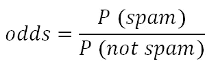
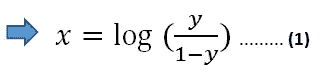

# 关于逻辑回归算法的 3 条关键信息

> 原文：<https://towardsdatascience.com/3-key-information-about-logistic-regression-algorithm-b2fbd9084b3c?source=collection_archive---------16----------------------->

## 这是一个简单但非常有效的算法

蒂埃拉·马洛卡在 [Unsplash](https://unsplash.com/s/photos/key?utm_source=unsplash&utm_medium=referral&utm_content=creditCopyText) 上拍摄的照片

机器学习生态系统涵盖了广泛的算法。这些算法中有些非常复杂，而有些相对简单。算法的性能不一定与其复杂度成正比。

逻辑回归是比较简单的一种。然而，它是非常有效的，并在许多应用程序中使用，如垃圾邮件检测，流失预测，等等。

逻辑回归是一种监督学习算法，主要用于二元分类任务。在本文中，我将分享我认为对理解逻辑回归算法如何工作很重要的 3 条关键信息。

## 对数赔率

对数概率最好通过概率概念来解释。事件的概率是该事件发生的可能性的度量。

假设一封电子邮件是垃圾邮件。如果电子邮件是垃圾邮件的概率是 0.9，那么该电子邮件不是垃圾邮件的概率是 0.1。术语“赔率”将这两个值联系起来。

(图片由作者提供)

在我们的例子中，几率是 9。赔率值越高，事件发生的可能性越大。

对数赔率是赔率的对数。请查看下表，了解我们为什么关注逻辑回归算法的对数概率。

(图片由作者提供)

假设我向你展示了一封邮件是垃圾邮件和不是垃圾邮件的概率。然后我请你预测这封邮件是否是垃圾邮件。如果成为垃圾邮件的概率高于 0.5，那么显而易见的答案是垃圾邮件。

概率值为 0.5 的对数赔率为 0。对于逻辑回归算法来说，这是一个重要的关系，我们将在本文的下一部分看到。

## Sigmoid 函数

sigmoid 函数是逻辑回归算法的核心。它接受任何实数值，并将其映射到 0 到 1 之间的值。

(图片由作者提供)

不管 x 的值是多少，y 取 0 到 1 之间的一个值。输出值在 0 和 1 之间很重要，因为我们不能有超出这个范围的概率值。

如果 x 是 0，y 变成 0.5，这是二进制分类的通用阈值。

## 回归与分类

虽然它的名称中包含“回归”一词，但逻辑回归是一种分类算法。通过使用 sigmoid 函数和一些对数技术，逻辑回归将分类问题转化为求解线性方程，就像我们在线性回归中所做的那样。

我们先重新排列一下 sigmoid 函数。

(图片由作者提供)

如果我们在最后一步取表达式两边的自然对数，我们得到如下结果:

(图片由作者提供)

对数表达式中的 y 用作肯定类别的概率(即电子邮件是垃圾邮件)。

*   如果 y = 0.5，那么 x = 0
*   如果 y > 0.5，则 x > 0
*   如果 y < 0.5，那么 x < 0

我们可以用一个线性方程代替方程 1 中的 x。

(图片由作者提供)

通过求解左手边的线性方程得到 0，我们可以找到使正类概率为 0.5 的参数。

函数的参数在训练阶段用最大似然估计算法确定。然后，对于任何给定的特征值(x1，… xn)，可以计算出正确类别的概率。

## 结论

逻辑回归是一个简单但非常强大的算法。虽然有许多复杂的算法可以解决分类任务，但逻辑回归因其效率而在许多应用中使用。

需要注意的是，我们不应该总是用 0.5 作为阈值来区分正负类。关于垃圾邮件的情况，为了将一封邮件归类为垃圾邮件，我们必须几乎确定。我们不希望用户错过重要的电子邮件。逻辑回归允许我们调整这类任务的阈值。

感谢您的阅读。如果您有任何反馈，请告诉我。