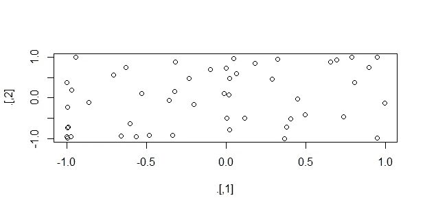
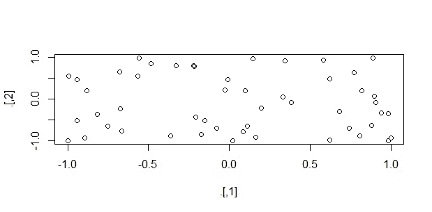

# Tidyverse 三家不太知名的管道运营商

> 原文：<https://towardsdatascience.com/3-lesser-known-pipe-operators-in-tidyverse-111d3411803a?source=collection_archive---------18----------------------->

## 用于干净代码编写的三通、展示和赋值管道操作符


照片由[马丁·亚当斯](https://unsplash.com/@martinadams?utm_source=medium&utm_medium=referral)在 [Unsplash](https://unsplash.com?utm_source=medium&utm_medium=referral) 拍摄

除了托管 Tidyverse 社区使用的主要管道操作符%>%之外，Tidyverse 中的 magrittr 包还托管了其他一些管道操作符。%>%管道广泛用于数据操作，并由 Tidyverse 自动加载。

管道运算符用于执行多个操作，这些操作需要前一个操作的输出作为输入参数。因此，执行从左边开始，将数据作为第一个参数传递给右边的函数，依此类推。这样，一系列数据操作可以在一个步骤中完成。

因此，这里我们将讨论 magrittr 包中的其他三个管道操作符。讨论主管操作员失败的领域以及这些功能如何补充它。

# 三通管

三通管操作符`%T>%`的工作方式几乎和`%>%`操作符一样，除了一系列操作中有一个操作没有返回值的情况。当我们在一系列操作中使用 print()或 plot()函数时，t 形管道操作符是很有用的，这些操作不一定在序列的末尾。由于 print()和 plot()函数不返回任何值，在这种情况下，我们可以使用`%T>%`操作符，在 print()/plot()操作之后使用最后一个要分配给该操作的参数值。让我们看一个例子，在这个例子中，我们使用主管操作符`%>%`编写了一系列操作。

```
# sequence of operations using main pipe operator
rnorm(100) %>% 
  matrix(ncol=2) %>% 
  sin() %>% 
  plot() %>% 
  colSums()# output
Error in colSums(.) : 'x' must be an array of at least two dimensions
```



作者图片

所以在上面的操作中，我们看到在执行 colSums()函数时出现了一个错误。这是因为 plot()函数不返回值。为了解决这个问题，我们将在 plot()函数之前使用 tee pipe 运算符。这样做的目的是将 sin()函数的值作为参数传递给 plot()和 colSums()函数，从而保持信息流。

用三通管道操作符重做上面的例子。

```
# using tee pipe operator
rnorm(100) %>% 
  matrix(ncol=2) %>% 
  sin() %T>% 
  plot() %>% 
  colSums()# output
[1]  2.372528 -4.902566
```



作者图片

从上面的例子中我们可以看到，使用 tee pipe 操作符可以执行完整的操作序列。

# 暴露管道

Exposition pipe 操作符`%$%`将左边数据框的变量名公开为右边函数中的匹配参数名。在 base R 中的一些函数中，没有`data =…`参数。所以要从数据框中引用一个变量，我们必须使用$操作符作为`dataframe$variable1`等等。因此，在这些情况下，我们要处理多个变量，然后我们必须重复使用$符号的过程，同时重复数据框名称。为了避免这种情况，我们可以使用 exposition 管道。让我们使用 cor()和 lm()函数来理解 exposition pipe 的用法。我们将使用来自 base R 的 mtcars 数据集。

**例 1 使用 lm()函数**

使用%>%运算符

```
mtcars %>% lm(formula = disp~mpg)# output
Call:
lm(formula = disp ~ mpg, data = .)

Coefficients:
(Intercept)          mpg  
     580.88       -17.43
```

使用%$%运算符

```
mtcars %$% lm(formula = disp~mpg)# output
Call:
lm(formula = disp ~ mpg, data = .)

Coefficients:
(Intercept)          mpg  
     580.88       -17.43
```

**例 2 使用 cor()函数**

使用%>%运算符(案例 1)

```
mtcars %>% cor(disp,mpg)# output
Error in cor(., disp, mpg) : invalid 'use' argument
In addition: Warning message:
In if (is.na(na.method)) stop("invalid 'use' argument") :
  the condition has length > 1 and only the first element will be used
```

使用%>%运算符(案例 2)

```
cor(mtcars$disp,mtcars$mpg)# output
[1] -0.8475514
```

使用%$%运算符

```
mtcars %$% cor(disp, mpg)# output
[1] -0.8475514
```

在示例 1 中，我们看到，无论使用哪种类型的管道操作符，使用两个不同管道的两个操作都工作得非常好。但是在示例 2 中，%>%操作符和%$%操作符的情况 2 是有效的。 ***这里的关键区别在于 lm()和 cor()函数的参数类型。***lm()函数有数据作为参数之一，但 cor()函数没有。因此，% > %和%$%管道操作符可以很好地使用 lm()函数。对于 cor()函数的情况，因为参数不是 x 就是 y(查看文档)。因此，我们必须通过将 x 和 y 参数定义为 mtcars$disp 和 mtcars$mpg 来明确告诉 x 和 y 值来自 mtcars 数据帧。因此，为了避免 mtcars 数据帧的重复，我们可以直接使用%$%管道操作符。

# 分配管道

最后一个鲜为人知的管道是赋值管道`%<>%`。当变量在经过某些操作后被赋值给自身时，使用管道。让我们看一个例子

```
a <- a %>% cos() %>% sin()# using assignment operator
a %<>% cos() %>% sin()
```

因此，通过使用赋值管道操作符，我们可以删除赋值操作符`<-`。

# 结论

我们探索了三个不太知名的管道操作符:tee、exposition 和 assignment 管道，来自 Tidyverse 的 magrittr package。此外，我们在不同的设置中实现了这些管道操作符，以了解它们如何补充主要管道操作符%>%的功能。

当一系列操作具有不返回值的函数时，三通管道%T>%非常有用。在 exposition pipe % $ %的情况下，它们对于没有数据作为参数的 base R 函数来说非常方便。而赋值管道% <> %，在一系列操作后将变量赋值给自身时，避免了重复。

感谢您的阅读。我希望你喜欢管道的功能。如果您有任何反馈，请告诉我。

## 参考资料:

1.  [https://magrittr.tidyverse.org/articles/magrittr.html](https://magrittr.tidyverse.org/articles/magrittr.html)
2.  https://r4ds.had.co.nz/pipes.html
3.  【https://magrittr.tidyverse.org/reference/exposition.html 

您可以在 [LinkedIn](https://www.linkedin.com/in/abhinav-malasi/) 和 [Twitter](https://twitter.com/malasi_abhinav) 上与我联系，跟随我的数据科学和数据可视化之旅。