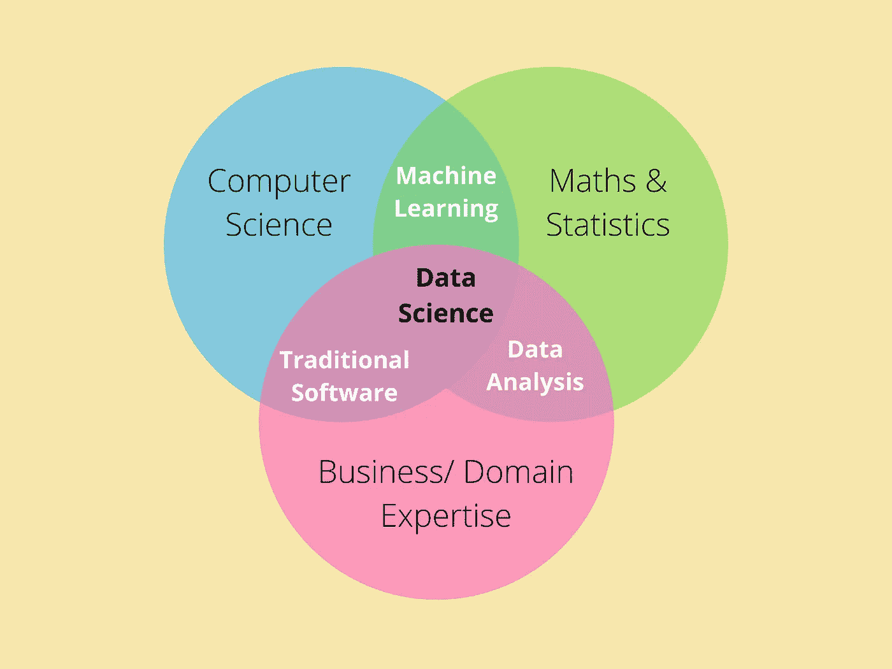

# 在我的数据科学生涯中，我学到的 3 个教训来得有点晚

> 原文：<https://towardsdatascience.com/3-lessons-i-learned-a-little-late-in-my-data-science-career-7aeb227292ce?source=collection_archive---------20----------------------->

## 尽早学习和应用这些宝石

职业经验 FTW！(照片由 Unsplash 上的 Brooke Cagle 拍摄)

有抱负的数据科学家经常问我，我是如何在如此年轻的时候成为高级数据科学家的，他们如何才能做到这一点。

加速你职业生涯的最可靠方法是向你的前辈学习。然后在你的职业生涯中应用这些知识。

我每天都在不断寻求学习新的东西。我并不羞于承认我已经不知道很多事情了。相反，我很想通过这些专家的经验、知识和错误来借用他们的智慧。

某些课程在每个人职业生涯的早期学习会更好，但事情并不总是按计划进行。

在这篇文章中，我将介绍我在职业生涯后期学到的三个重要经验。尽管如此，当你最早应用时，它有可能改变和加速你的数据科学职业轨迹。

# 1.领域知识和我们的技术技能一样重要

当我们开始学习数据科学时，我们大多专注于探索性数据分析、数据清洗、机器学习算法、统计学、线性代数和编程等技术技能。是的，这是一份全面的清单，但是我们遗漏了一些更重要的东西。

如果我们看一下数据科学维恩图，领域专业知识是它的一个重要组成部分。然而，我们忽略了它，因为它不存在。

数据科学维恩图(图片由作者提供)

我们无知背后的原因是，当我们处于学习阶段时，我们很少获得领域专业知识。除非我们开始工作，否则我们如何获得零售、金融或其他方面的专业知识？

在我开始第一份工作之前，我没有任何领域的专业知识。

在我的第一份工作中，我了解了 AI 在农业和畜牧业中的应用。我的老板甚至询问我是否可以处理涉及牛肉的数据(牛被视为神圣的动物，所以即使是食肉的印度教徒也不吃牛肉。)

当我开始工作时，我意识到从特定领域的研究科学家那里可以学到很多东西，这对模型的建立很有用。

从那以后，我在几个领域工作过，比如智能城市、水产养殖、零售。毫不夸张地说，每个项目都有一个巨大的领域学习曲线。

当我们在 Titanic 或 Iris 数据集上学习和构建模型时，我们永远无法获得这一点。有些事情肯定需要改变。

## 如何尽早做到这一点:

在我们学习旅程的初始阶段，我们可能没有在公司工作的奢侈。因此，我们必须找到不寻常的方法，通过互联网获得这些技能。我个人遵循的一些步骤:

*   选择任何你感兴趣的领域。(例如，医疗保健、金融、零售等。)
*   不要做普通的项目，而是专注于构建一个与特定领域的真实项目相似的项目。(例如，[使用糖尿病数据集来构建模拟真实世界场景的项目。](https://pub.towardsai.net/how-i-build-machine-learning-apps-in-hours-a1b1eaa642ed))
*   观看 YouTube 视频和阅读科学论文，了解行业中特定领域的术语和实践。

在我参与的一个水产养殖项目中，我无法接触到团队中的领域专家。我别无选择，只能通过观看 YouTube 视频(像这样的)和在互联网上冲浪来研究养鱼的做法。

我可能只获得了交付项目所需的最低限度的知识，但这没关系。努力在你可支配的资源中找到正确的平衡。

# 2.从多面手开始，最终成为专家

当我开始学习数据科学时，我看到的是大多数数据科学专家都专注于一两个领域，如 NLP、计算机视觉、时间序列、MLOps。有报道称，数据科学通才[不会在行业](https://www.kdnuggets.com/2018/12/why-shouldnt-data-science-generalist.html)生存太久。

所以作为一个初学者，我决定我需要专注于某个方面，尽管有许多问题没有答案。

*   我知道我想专攻什么吗？
*   作为一个数据科学初学者，我知道我的优势是什么吗？
*   从长远来看，我是否知道我选择的利基市场是否有足够的需求？

我是为了专精而挑了一个小众，并不那么意外；我毫无进展*。我突然明白了一些事情。*

**这些专家是在进入数据科学领域后立即成为专家的吗？**

作为初学者，没有必要成为专家。相比之下，我首先需要专注于成为多面手。在选定一个领域之前，我必须了解整个流程，并尝试不同的领域。所以我就这么做了。

我致力于将业务问题转化为机器学习解决方案蓝图，开发仪表板，展示见解，开发模型，创建 MLOps 管道，等等。基本上，我遇到的任何事情。

快进到现在，3 年过去了，我知道我擅长什么，并且在接下来的 2-3 年里我会专注于它。

## 如何应用:

*   在你职业生涯的早期，请对机会保持开放的心态。
*   从致力于端到端数据科学管道中的一切可能开始。
*   随着时间的推移(读，2-3 年)，你会对自己的实力和兴趣有一个直观的认识。
*   严格根据你的优势选择数据科学中的特定领域(例如，社交媒体的 NLP、零售的计算机视觉、生产就绪的 MLOps 等)。)
*   记住，这个领域是不断发展的；继续在你选择的领域发展高级技能。

当你遵循“通才到专家”的方法时，好处是双重的。首先，您了解整个生命周期，这在管理团队中的初级数据科学家时至关重要。第二，你已经在某个领域建立了专业技能，这将有助于你在这个行业长期生存。

# 3.当我们被期望去教书时，我们学得最好

这是我不断学习更好的秘诀。如果你想偷，请随意。

在本科学习的最后一年，我开始自学数据科学。我会浏览吴恩达在 Coursera 上的讲座并建立项目。我正在向最好的人学习，但是我没有正确方向的指导。

很可能你也有同样的感觉。你知道这些是[最受欢迎的课程](/programming-for-data-science-how-to-learn-just-enough-in-weeks-7e62f3aa9b8a)，但你不确定这一切是否会有回报。你希望有一个支持系统来一起学习和努力在数据科学领域做大。

在这段旅程的第一年，我一直有同样的感觉，直到我被邀请去举办一个关于结构化深度学习的研讨会。突然，我的学习有了目的:一帮同事将向我学习*。*一瞬间，我意识到了我学习过程中的不同之处——即使在今天，我也能举办同样的研讨会。我全都记得。

快进到现在，我已经举办了更多的研讨会，编写了关于简单和高级主题的教程。

现在我有了你们，每当我学到新东西时，你们都希望我去教。这给了我一个全新的目标去学得更好。

谢谢你，是的，你，阅读，互动，并成为我这次旅程背后的目的。

## 如何尽早做到这一点:

当你在你的学习旅程中前进时，事实上，你没什么可教的。我们都知道，所以你应该这样做:

*   从分享你的经验开始，比如你学到了什么，和你的朋友一起工作了什么，或者在 LinkedIn，YouTube，Medium 等平台上。
*   这些平台帮助你找到和你有同样问题的类似水平的爱好者。一小群和你有相同目标的同龄人会成为你的支持系统。
*   教你的朋友任何简单的话题(比如，线性回归。)
*   随着你慢慢获得专业知识，试着给一个小组做一个演示。如果你还在学习，那可能是为了你的班级；如果你正在工作，它可能是为你对数据科学感兴趣的同事准备的。
*   你知道这些机会总会出现——你需要准备好抓住它们。
*   获取反馈并改进。不像我，如果你早点开始，你的学习之旅会好 10 倍。

分享知识总是能巩固你对相同事物的理解。教学是让你学得最好的最好动力。

# 最后的想法

感谢您阅读至此。我真心希望这对你有用，尤其是如果你开始学习数据科学的话。

我在这个平台和 LinkedIn 上广泛地写了我在数据科学领域的学习和经验。当我开始的时候，社区给了我帮助，这是我回报的方式。

整个目的是帮助你加速你的数据科学事业。总而言之:

1.  获取领域知识与提高数据科学技能同样重要。
2.  在数据科学领域，从通才起步，最终成为专家。
3.  学数据科学教人。你和社区将受益匪浅。

闯入数据科学可能具有挑战性；没人说容易。但是每年都有很多人这么做。他们没什么特别的，我也是。我们所有人都向专家学习，并在旅途中应用。

现在，是什么阻止了你？

*要获得更多关于进入数据科学、令人兴奋的合作和指导的有用见解，请考虑* [***加入我的电子邮件好友私人列表*** *。*](https://friends.arunnthevapalan.com/)