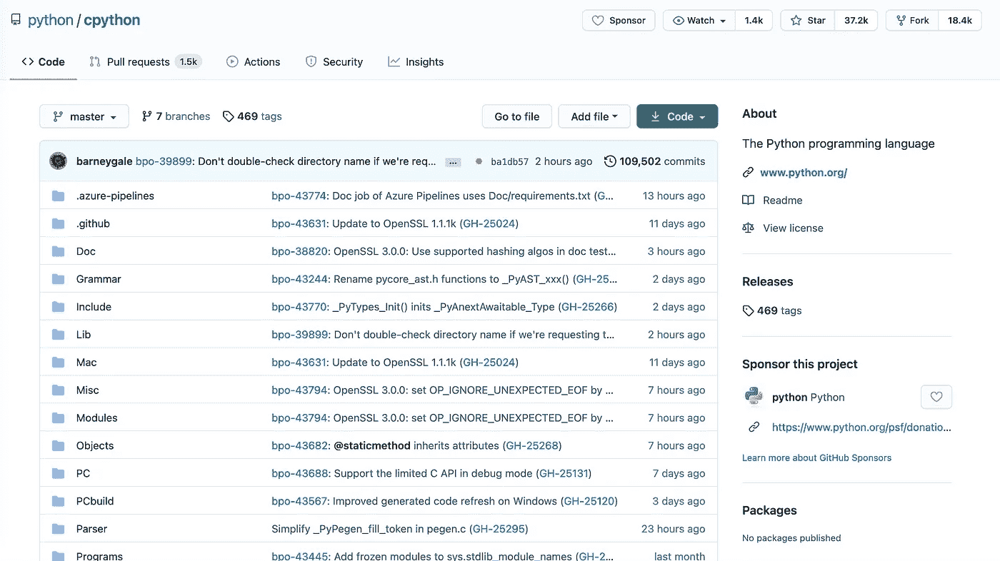
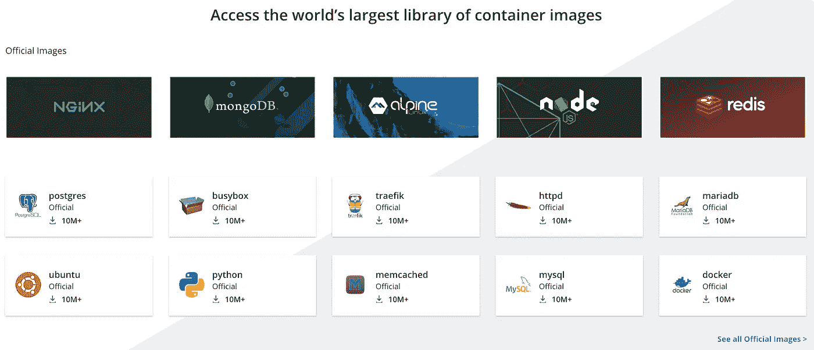

# 共享代码时的 3 个技术抽象层次

> 原文：<https://towardsdatascience.com/3-levels-of-technical-abstraction-when-sharing-your-code-50ddc6e73946?source=collection_archive---------46----------------------->

## 探索 GitHub、Docker 和 Heroku

paweczerwi ski 在 [Unsplash](https://unsplash.com?utm_source=medium&utm_medium=referral) 上的照片

我已经编程八年了，直到*几个月前*，我才能够回答我一直以来的一个问题:**“我如何与他人分享我的项目？”**

当我说“项目”时，我指的不是一个 R 脚本或一些 bash 命令——即使 22 岁的我也能理解复制和粘贴！我指的是一个有 ***几个文件*** 的项目，也许在 ***多语言*** ，有 ***外部依赖*** 。我是不是要把它们都扔进一个压缩文件夹里？我如何处理不向后兼容的新版本语言和软件包？如果和我分享的人根本不知道怎么编码呢？

分享你的项目的正确方式取决于你希望你的接收者看到多少代码，以及从[摘要](https://whatis.techtarget.com/definition/abstraction)中带走多少。本帖将涵盖三个抽象层次:[**GitHub**](https://guides.github.com/introduction/flow/)[**Docker**](https://docs.docker.com/get-started/overview/)[**Heroku**](https://www.heroku.com/what)。我们将从共享原始文件开始，以隐藏几乎所有内容结束。

# 第一级:GitHub

***收件人需要做的事情:*** *确保他们的计算机拥有适用于其操作系统的正确版本的适当语言和软件包；实际上知道执行什么代码来启动你的应用程序。*

[GitHub](https://guides.github.com/activities/hello-world/) 是托管您的代码、跟踪代码变更并与其他人共享代码的行业标准。通过向某人发送指向您的存储库的 URL，他们可以查看您的代码，查看更改的历史记录，将代码保存到他们的计算机上，并将更改提交给您进行审批。

通过 GitHub 共享代码是我们三个选项中最不抽象的一个—**你的接收者获得原始代码本身。**虽然这对于从另一个角度了解你的项目的内部运作很有帮助，但是对于使用你的代码的*来说，GitHub repo 本身实际上是非常简单的。如果没有详细的说明，您的收件人可能不知道您的代码应该做什么或如何实际运行它！*

比如看一下[Python](https://github.com/python/cpython)的 GitHub repo(没错，*Python*)。只看文件和文件夹，你有什么想法输入什么命令来安装 Python？(谢天谢地，他们的自述里有详细的说明！)

作者截图

除了如何启动项目的说明，列出*外部依赖*(例如 Python 库)及其版本也很重要。即使你在给某人发送 GitHub repo 时共享了原始代码，如果你的代码引用了你的接收者没有安装的库，你的项目*可能仍然不能在他们的计算机上运行*。

这就是为什么**提供如何在您的计算机上重建环境的说明至关重要。**事实上，基于 Python 的项目几乎总是从用户创建一个[虚拟环境](https://realpython.com/python-virtual-environments-a-primer/)并安装在`requirements.txt`文件中提供的库开始。

但是，如果你的项目涉及到多种语言和一个数据库，即使是详细的说明和一个`requirements.txt`文件也可能不够。例如，这个[计票 app](https://github.com/dockersamples/example-voting-app) 的回购示例涉及 Python、 [Node.js](https://nodejs.org/en/about/) 、 [Redis](https://aws.amazon.com/redis/) 、 [Postgres](https://www.postgresql.org/) 和[。网](https://dotnet.microsoft.com/learn/dotnet/what-is-dotnet)。如果你愿意隐藏一些代码来使你的应用程序更容易使用，那么转移到下一个抽象层次:Docker 可能是值得的。

# 第二级:码头工人

***你的收件人需要做的事情:*** *安装 Docker，拉相关图片，运行一个* [*Docker 撰写*](https://docs.docker.com/compose/) *。*

Docker 是一种集装箱服务。一个**容器**是一个隔离的软件环境，其中的库、程序、*甚至操作系统*都独立于你的计算机的其余部分。**把 Docker 容器想象成你电脑里面的一台微型电脑。** [1]

使用 Docker，您可以将项目的各个部分——例如机器学习模型、数据库和电子邮件提醒——隔离到独立的容器中，这些容器的环境完全符合该组件的需求。然后，您可以并行运行这些容器，就像它们在同一台计算机上一样。

容器来自 [Docker Hub](https://hub.docker.com/) 上公开可用的软件“快照”，或**图像**。例如，如果你的应用程序只运行在 Python2 上，与其让你的接收者头疼地去说服他们降级他们的 Python， [*不如让他们下载一个 Python2.7 的 Docker 镜像*](https://hub.docker.com/search?q=python2.7&type=image) 。

截至 2021 年 4 月，Docker Hub 上有*超过 580 万张图片*可以免费下载。而且实验是没有成本的:你下载的任何图像都被悄悄地从你的计算机的全局环境中隐藏起来，直到你调用它们来创建一个容器。

作者截图

更好的是，你可以*创建你自己的*图像。[2]下面的代码是为一个简单的 Flask 应用程序创建 Docker 映像所需的全部内容。步骤包括安装 [Ubuntu](https://en.wikipedia.org/wiki/Ubuntu) 操作系统、Python 和 Flask 将您的`app.py`文件复制到容器中；并使您的计算机内部网络可以访问该容器。

要将多个图像捆绑在一起，您需要运行一个 [Docker Compose](https://docs.docker.com/compose/) 。下面是将 Flask 应用程序与 Postgres 数据库捆绑在一起的合成文件的样子。

使用 Docker，我们可以简单地向我们的收件人发送一些 Docker 图像和一个 Docker 合成文件，告诉他们运行`docker compose up`，然后在他们的浏览器中导航到一个 URL(例如`http://localhost:5000`)。就是这样。用户可以查看 Compose 文件以了解正在使用哪些服务(例如，我们是否正在使用 Postgres vs. MySQL 数据库)，否则大多数代码都不会被使用。

# 第三级:Heroku

***你的收件人需要做的事情:*** *点击一个网址。*

对于我们最后的抽象层次，我们删除所有代码。没有 GitHub repos，没有命令行。当你在像 [Heroku](https://www.heroku.com/what) 、 [AWS](https://aws.amazon.com/what-is-aws/) 或 [DigitalOcean](https://www.cloudways.com/blog/what-is-digital-ocean/) 这样的服务上托管你的应用时，某个数据中心的服务器会负责运行你的应用。然后，你的用户只需要点击一个 URL，就可以把他们带到那个服务器。

在这个抽象层次中，**你的用户看到的只是你的应用的** [**前端**](https://frontendmasters.com/books/front-end-handbook/2018/what-is-a-FD.html)**——通常是一个图形界面。**【3】下面举例，是我写的一个垃圾邮件捕捉 app 的截图[。除了网页上的 HTML 和 CSS，你无法知道幕后发生了什么。(除非你去看 GitHub repo 或者阅读我写的博客系列。；-))](https://spam-catcher.herokuapp.com)

作者截图

如果你的应用程序的前端代码写得很好，即使是狡猾的用户也无法判断你的应用程序的后端是 100 行代码还是数百万行代码。事实上，这是大多数应用程序的工作方式:当你打开谷歌地图或 Slack 时，你看不到源代码——你只看到用户界面。

在商业环境中，只向用户展示你想让他们看到的东西，而不是透露你的应用程序的所有秘密，变得至关重要。例如，你不希望好奇的用户发现其他用户的私人数据，或者与世界分享你公司漂亮的聚类算法是如何工作的。在这种情况下，我们的最终抽象层对于共享您的项目是必要的。

# 结论

这篇文章旨在回答这个问题，“我如何与他人分享我的编码项目？”事实证明，答案取决于你希望你的用户如何进入杂草中！

最不抽象的方法是发送一个**GitHub**repo——原始代码。这是协作的理想选择，因为你的接收者可以清楚地看到你的应用程序是如何工作的。但是对他们来说，实际上*运行*你的项目可能很难，因为他们需要重新创建所有的库、语言，甚至可能是你正在使用的操作系统。

下一个抽象层次是 **Docker** ，在这里你可以创建其他人可以下载的软件“快照”。这消除了管理项目依赖关系的麻烦，并且大多数实际代码对用户是隐藏的。然而，他们仍然可以看到你的应用程序使用了哪些*服务*——确切的数据库风格，你的模型是使用 Python 还是 R，等等。

最后一层是用一个像 Heroku 这样的服务托管你的代码，并给你的接收者发送一个 URL。这对用户完全隐藏了任何后端代码，这在业务环境中是理想的。这种方法把你的接收者变成了你产品的消费者，而不是合作者，因为他们不知道幕后发生了什么。

正确的方法取决于你希望你的接收者如何与你的项目互动。但是你也不必只选择这些方式中的一种来共享代码！事实上，我建议与你的用户分享它们:Heroku 中的应用程序可以立即与之交互，GitHub repo 可以查看底层代码，Dockerfile 可以在本地运行。

编码快乐！

最好，
马特

# 脚注

## 1.第二级:码头工人

每当你谈论 Docker 时，你可能需要来自虚拟机的必要的歧义消除。虽然 Docker 容器与你的计算机的其余部分(以及其他 Docker 容器，除非你显式地链接它们)是隔离的，但是容器*确实*共享诸如 RAM 和 CPU 之类的主机资源，并且使用相同的主机[内核](https://en.wikipedia.org/wiki/Kernel_(operating_system))。如果不指定限制，一个容器可以愉快地吸走 CPU，降低周围所有容器的速度。另一方面，虚拟机有自己的 RAM 和 CPU，并且是真正隔离的。

顺便提一下，当您在 Windows 或 Mac 计算机上运行带有 Linux 操作系统的 Docker 容器时，Docker 实际上是在 Linux 虚拟机上运行容器[。](https://www.docker.com/blog/docker-for-mac-windows-beta/)

## 2.第二级:码头工人

从 GitHub 到 Docker 和 Heroku 的一个必要的飞跃是把你的项目变成一个 API，让其他软件(比如网络浏览器)和你的代码交流。你可以用 Python 中的 [Flask](https://flask.palletsprojects.com/en/1.1.x/) 或者 r 中的 [Plumber](https://www.rplumber.io/) 来做这件事。

## 3.第三级:Heroku

图形界面对于那些受众包括非程序员的应用程序来说是必不可少的。但是如果你的应用是面向开发者的(例如[谷歌地图 API](https://developers.google.com/maps) 而不是普通的谷歌地图)，那么“前端”可能只是你命令行中的一个小小的欢迎信息。无论哪种方式，后端代码仍然对您完全隐藏。