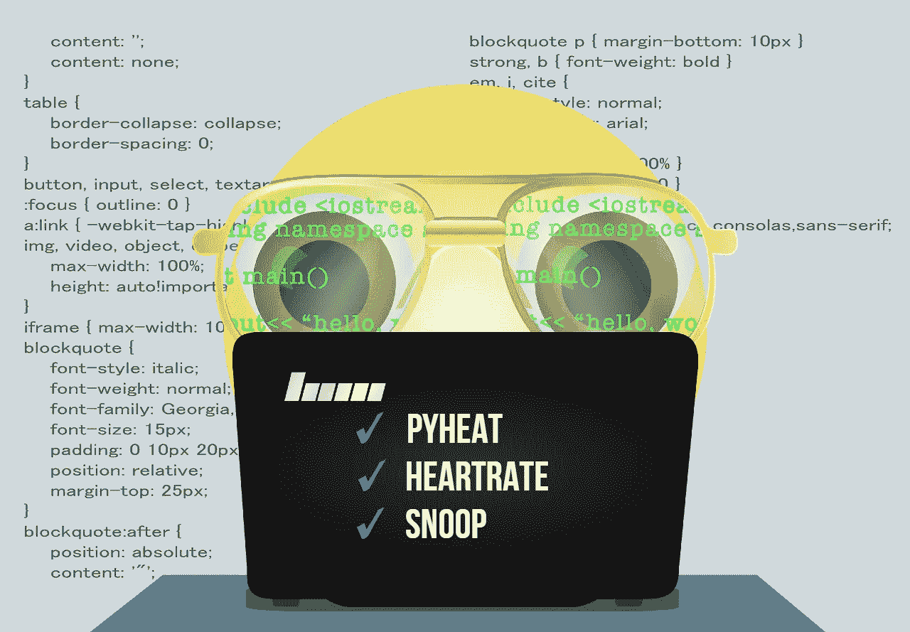
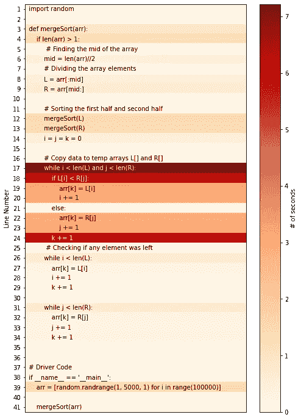
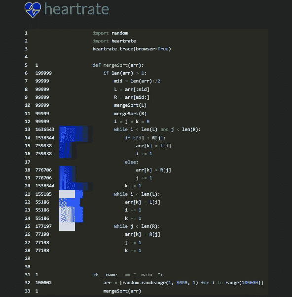

# 3 个库来实时可视化 Python 代码的执行

> 原文：<https://towardsdatascience.com/3-libraries-to-visualize-the-execution-of-your-python-code-in-real-time-cdbb5a46f216?source=collection_archive---------15----------------------->

## 通过可视化执行来了解性能瓶颈



图片来自 [Pixabay](https://pixabay.com/?utm_source=link-attribution&amp;utm_medium=referral&amp;utm_campaign=image&amp;utm_content=4005286) 的[妮娜·加曼](https://pixabay.com/users/billithecat-7996303/?utm_source=link-attribution&amp;utm_medium=referral&amp;utm_campaign=image&amp;utm_content=4005286)

Python 比其他语言慢，因为它的动态性和多功能性。有时复杂的计算或算法在 Python 中需要花费大量时间来执行。需要跟踪代码的执行流程，深入了解性能瓶颈。

Python 中的日志模块可用于跟踪代码事件，并可用于确定代码崩溃的原因。高效使用记录器还可以跟踪代码片段的时间复杂度。日志可能是有用的，但是它太技术性了，需要正确的实现。在本文中，我们将讨论 3 个这样的开源 Python 库，它们可以帮助开发人员只用几行代码就能可视化程序的执行。

# Pyheat:

Pyheat 是一个开源 Python 库，帮助开发人员获得代码执行的逐行时间分布。Pyheat 不是以表格形式呈现，而是用热图表示运行每行代码所需的时间。

## 安装:

Pyheat 可以从 PyPl 安装，使用

```
**pip install py-heat**
```

并使用`**from pyheat import PyHeat**`将其导入

## 用法:

Pyheat 可用于为 Python 模块的每一行代码生成时间编号的热图。将 Python 文件的路径作为参数传递给`**PyHeat**`函数。

```
**ph = PyHeat('merge_sort.py')
ph.create_heatmap()
ph.show_heatmap()**
```

上述代码生成一个热图，表示在`merge_sort.py`模块中运行每一行代码所需的时间(秒)。



(图片由作者提供)

通过观察上面的热图，第 17 行中的 while 循环花费了大部分时间(7 秒)来执行。热图有助于开发人员识别花费大部分时间执行的代码片段，这些代码片段可以进一步优化。

# 心率:

Heartrate 是一个开源的 Python 库，它提供了 Python 程序执行的实时可视化。它提供了执行的逐行可视化，其中的数字给出了每一行被执行的次数。它在浏览器的一个单独窗口中显示代码的执行情况。

## 安装:

心率库可以从 PyPl 安装，使用:

```
**pip install heartrate**
```

## 用法:

导入包`(import heartrate)`后，使用`heartrate.trace(browser=True)`功能将打开一个浏览器窗口，显示调用`trace()`的文件的可视化。

在执行代码时，如果您现在可以跟随 [http://localhost:9999](http://localhost:9999/file/?filename=heartrate_example.py) 来观察执行的输出可视化，那么您的浏览器中将会弹出一个窗口。



(图片由作者提供)

每行最左边的数字表示特定行被执行的次数。条形显示最近被点击的行，越长的条形表示点击越多，越浅的颜色表示越近。它还显示了一个实时堆栈跟踪。

# 窥探:

Snoop 是另一个可以用作调试工具的包。Snoop 帮助你识别局部变量的值并跟踪程序的执行。Snoop 主要用作调试工具，以找出为什么您的 Python 代码没有做您认为它应该做的事情。

所有这些都可以通过在您想要跟踪的函数之前使用一个 snoop 装饰器来实现。

## 安装:

Snoop 库可以从 PyPl 安装，使用:

```
**pip install snoop**
```

## 用法:

# 结论:

在本文中，我们转换了 3 个库，可以用来可视化 Python 代码的执行。这些库帮助开发人员深入挖掘代码，找到并理解性能瓶颈，只需添加几行代码。

# 参考资料:

[1]py heat GitHub:[https://github.com/csurfer/pyheat](https://github.com/csurfer/pyheat)

[2]心率 GitHub:[https://github.com/alexmojaki/heartrate](https://github.com/alexmojaki/heartrate)

[3]Snoop GitHub:[https://github.com/alexmojaki/snoop](https://github.com/alexmojaki/snoop)

> 感谢您的阅读