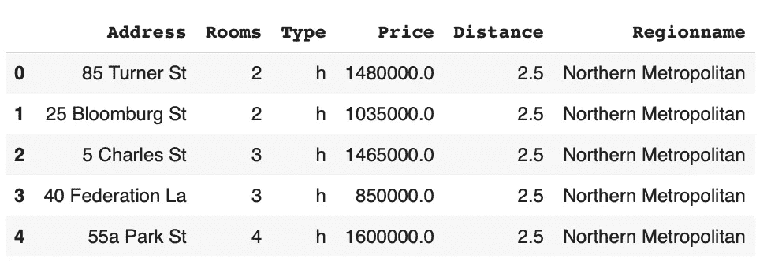
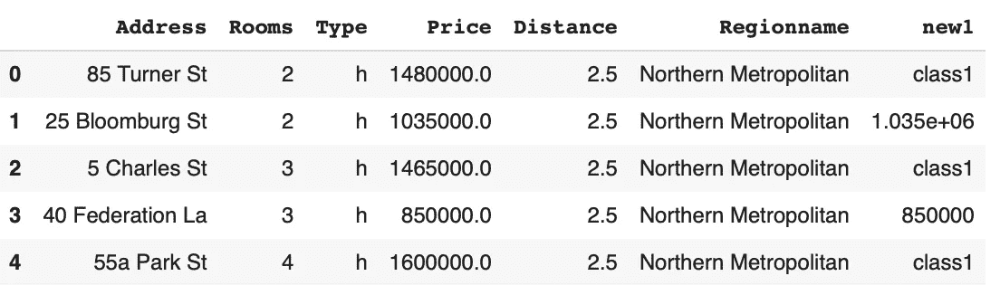
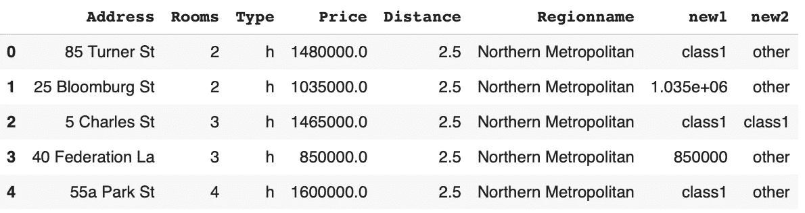
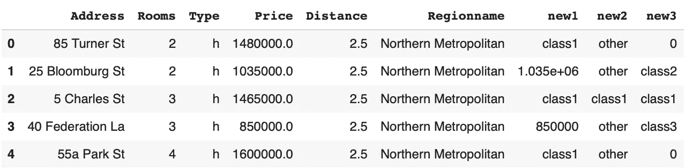
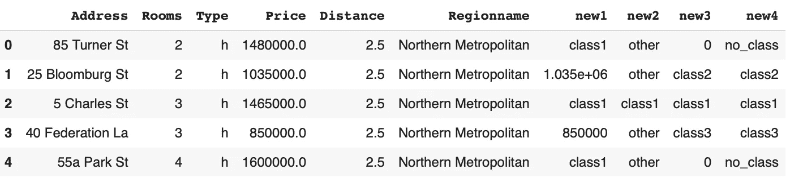

# 用 Python Pandas 和 Numpy 创建条件列的 3 种方法

> 原文：<https://towardsdatascience.com/3-methods-to-create-conditional-columns-with-python-pandas-and-numpy-a6cd4be9da53?source=collection_archive---------3----------------------->

## 扩展您的数据操作和特征工程技能。


在 [Unsplash](https://unsplash.com/s/photos/paint?utm_source=unsplash&utm_medium=referral&utm_content=creditCopyText) 上由 [Kelli Tungay](https://unsplash.com/@kellitungay?utm_source=unsplash&utm_medium=referral&utm_content=creditCopyText) 拍摄的照片

Python 可以说是数据科学生态系统中最流行的编程语言。如此受欢迎的原因之一是用于数据科学的 Python 库的丰富选择。

这些库为执行数据操作提供了快速、灵活和高效的方法。Pandas 和 Numpy 是两个流行的 Python 库，用于数据分析和操作任务。

基于数据集中的现有列派生新列是数据预处理中的典型任务。这也是特征工程的重要组成部分。在某些情况下，新列是根据其他列上的某些条件创建的。

在本文中，我们将介绍 3 种方法，它们可用于根据其他列的某些条件创建新列。正如我们将在示例中看到的，Pandas 和 Numpy 为执行这项任务提供了很大的灵活性。

让我们从导入库和创建样本数据框开始。以下数据框包含 Kaggle 上墨尔本住房[数据集](https://www.kaggle.com/dansbecker/melbourne-housing-snapshot)的一部分。

```
import numpy as np
import pandas as pdmelb = pd.read_csv("/content/melb_data.csv", usecols = ["Address", "Regionname", "Type", "Rooms", "Distance", "Price"])melb.head()
```



(图片由作者提供)

该数据集包含墨尔本一些房屋的特征及其价格。

## 1.熊猫在哪里起作用

第一种方法是熊猫的 where 功能。它允许根据以下规则或标准创建新列:

*   符合条件的值保持不变
*   不符合条件的值将被替换为给定值

例如，我们可以基于 price 列创建一个新列。如果价格高于 140 万，则新列的值为“class1”。否则，它将采用与 price 列中相同的值。

```
melb["new1"] = melb.Price.where(melb.Price < 1400000, "class1")melb.head()
```



(图片由作者提供)

where 函数的第一个参数指定条件。第二个是替换不符合条件的值的值。我们的条件是价格低于 140 万英镑。第一、第三和第五列不符合条件，因此新列采用这些行中的“class1”值。

## 2.Numpy where 函数

虽然名字相同，但熊猫和 Numpy 的 where 功能却大不相同。首先，Numpy 的 where 函数提供了更大的灵活性。它对待特定情况的方式也与熊猫不同。

Pandas where 函数只允许更新不满足给定条件的值。但是，Numpy 的 where 函数允许更新满足和不满足给定条件的值。

下面的代码块创建一个名为“new2”的列。where 函数中的第一个参数指定条件。第二个参数指示用于符合条件的行的值。第三个参数是不满足给定条件的行的值。

```
melb["new2"] = np.where(
   (melb.Rooms == 3) & (melb.Price > 1400000), 
   "class1", 
   "other"
)melb.head()
```



(图片由作者提供)

只有截图中的第三行符合给定的条件集，因此它取值“class1”。

## 3.数字选择功能

select 函数比前两种方法更强大。我们可以用它来给出一组条件和一组值。因此，我们能够为每个条件分配一个特定的值。

让我们首先定义条件和相关的值。

```
filters = [
   (melb.Rooms == 3) & (melb.Price > 1400000),
   (melb.Rooms == 2) & (melb.Price < 1400000),
   (melb.Price < 900000)
]values = ["class1", "class2", "class3"]
```

如果一栋房子有 3 个房间，其价格超过 140 万英镑，则新列的值为“class1”。如果一栋房子有 2 个房间，价格低于 140 万，则价值为“class2”，以此类推。类似于写一堆 if-else 语句。

我们可以使用 select 函数应用这些条件和值，如下所示:

```
melb["new3"] = np.select(filters, values)melb.head()
```



(图片由作者提供)

第一行和第五行不满足任何给定的条件。默认情况下，这些行的值为 0。但是，可以使用默认参数对其进行更改。

下面是演示默认参数用法的另一个示例。

```
melb["new4"] = np.select(filters, values, default="no_class")melb.head()
```



(图片由作者提供)

## 结论

我们已经介绍了在数据框中有条件地创建新列的 3 种不同方法。根据您需要的灵活性或任务的复杂程度，您可以选择最适合自己的方法。

永远记住，越简单越好。因此，选择简单的方法，除非你需要使用多个条件和值。

感谢您的阅读。如果您有任何反馈，请告诉我。