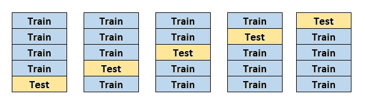
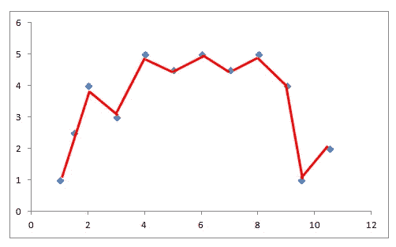
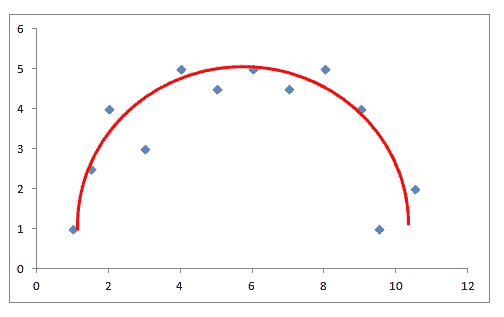

# 减少机器学习模型过度拟合的 3 种方法

> 原文：<https://towardsdatascience.com/3-methods-to-reduce-overfitting-of-machine-learning-models-4a7e2c1da9ef?source=collection_archive---------14----------------------->

## 过度拟合模型充满了惊喜，但不是好的。

米 PHAM 在 [Unsplash](https://unsplash.com/s/photos/happy?utm_source=unsplash&utm_medium=referral&utm_content=creditCopyText) 上的照片

我遇到过几种过度拟合的定义。它们都用不同的措辞表达相同的意思。我的定义是，过度拟合模型捕获了数据集中不必要的细节、噪音或过于具体的关系。

当模型不能很好地概括数据时，就会发生过度拟合。因此，过拟合模型不是很稳定，它通常表现得出乎意料。一般来说，过度拟合会导致以前看不到的数据性能不佳。

过拟合是机器学习中的一个严重问题。我们永远不能相信一个过度拟合的模型并将其投入生产。它充满了惊喜，但不是让你开心的那些。即使特征值有非常小的变化，预测也可能发生显著变化。

有一些强有力的迹象表明过度拟合。如果在训练集和测试集的精确度之间有很大的差异，我们可能会有一个过拟合模型。另一个指标是不同的测试集得到非常不同的结果。

在部署机器学习模型之前，我们需要减少或消除过度拟合。有几种技术可以减少过度拟合。在这篇文章中，我们将讨论 3 种常用的方法。

## 交互效度分析

减少过度拟合最可靠的方法是收集更多的数据。我们拥有的数据越多，就越容易对底层结构进行探索和建模。我们将在本文中讨论的方法是基于不可能收集更多数据的假设。

既然我们无法获得更多的数据，我们应该充分利用现有的数据。交叉验证就是这样做的一种方式。

在典型的机器学习工作流中，我们将数据分成训练和测试子集。在某些情况下，我们还将单独的一组放在一边进行验证。该模型在训练集上被训练。然后，在测试集上测量其性能。因此，我们根据以前未见过的数据来评估模型。

在这种情况下，我们不能使用数据集的一部分进行训练。我们有点浪费了。交叉验证允许使用训练集和测试集中的每个观察值。

五重交叉验证(图片由作者提供)

上图展示了一个五重交叉验证。数据集被分成 5 部分。在每次迭代中，4 个片段用于训练，剩下的一个用于测试。整个过程在 5 次迭代后完成。每一块都用于训练和测试。

从某种意义上说，交叉验证是增加训练数据量的一种方式。模型的精度是所有迭代的平均值。结果，我们得到了对我们的模型的性能的更健壮的评估。

## 正规化

如果模型在数据方面过于复杂，很可能会导致过度拟合。在下图中，模型用红线显示。蓝点代表数据点。

过度拟合模型(图片由作者提供)

该模型试图捕捉所有数据点的每一个细节。它不能很好地概括数据集中的趋势。

这个模型在数据方面太复杂了(蓝点)。因此，我们有一个过度拟合的问题。我们可以通过降低模型的复杂度来解决这个问题。

正则化是一种降低复杂度的方法。它通过增加对较高项的惩罚来控制模型的复杂性。通常，模型旨在根据给定的损失函数最小化损失。如果增加一个正则项，该模型试图将复杂度和损失都最小化。

两种常用的正则化技术是 L1 和 L2 正则化。在解释 L1 和 L2 是如何工作的之前，让我们先来谈谈是什么增加了模型的复杂性。

*   特征总数
*   特征的权重

L1 正则化处理由于特征总数而导致的复杂性。它的作用就像在每次迭代中从权重中减去一点点的力。因此，一些权重最终变为零。

L2 正则化处理由于特征权重的量级而导致的复杂性。它的作用就像在每次迭代中从权重中移除一小部分的力。因此，权重会减少，但永远不会变为零。

下面演示了一个更容易接受的数据集模型。

(图片由作者提供)

我们还可以通过调整超参数来降低模型的复杂性。每个算法都有自己的超参数。对于随机森林模型，树的深度对模型的复杂性有很大的影响。

## 集合模型

集成模型由许多小的(即弱的)学习器组成。整体模型往往比单个模型更稳健、更准确。当我们使用集合模型时，过度拟合的风险也降低了。

最常用的集成模型是随机森林和梯度提升决策树。它们是几个决策树的组合。

让我们把重点放在随机森林。它使用一种叫做 bagging 的技术将多个决策树放在一起。通过聚合各个决策树的预测来计算预测。

随机森林模型通过使用不相关的决策树来降低过度拟合的风险。它们是通过自举和特征随机性产生的。

Bootstrapping 意味着用替换从训练数据中随机选择样本(即数据点)。因此，每个决策树都在不同的数据集上进行训练。

特征随机性是通过为每个决策树随机选择特征子集来实现的。假设数据集包含 20 个特征，我们为每棵树随机选择 15 个特征。所选特征的数量可以由参数控制。

最后，我们有几个决策树，它们适用于可能与原始数据集不同的样本。我们防止整个模型过于关注某个特定的特性或一组值。因此，降低了过度拟合的风险。

## 结论

过拟合是机器学习中的一个严重问题。在推进我们的模型之前解决它是至关重要的。比起精度高的 overfit 模型，我更喜欢精度低的模型。

有几种技术可以减少过度拟合。我们已经介绍了 3 种常用的方法。

感谢您的阅读。如果您有任何反馈，请告诉我。