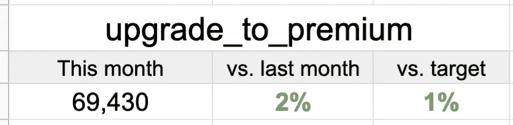
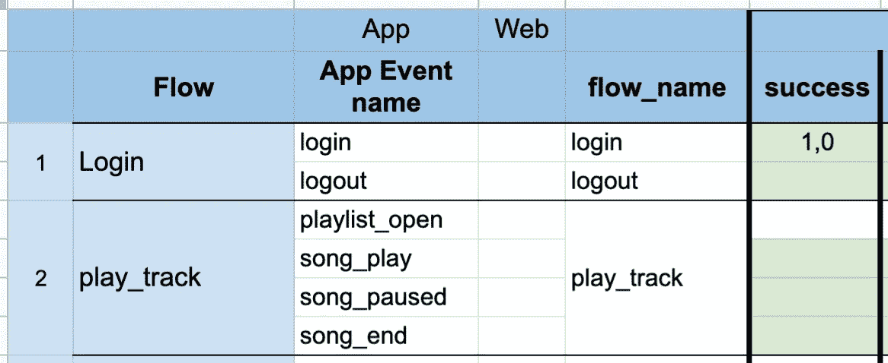
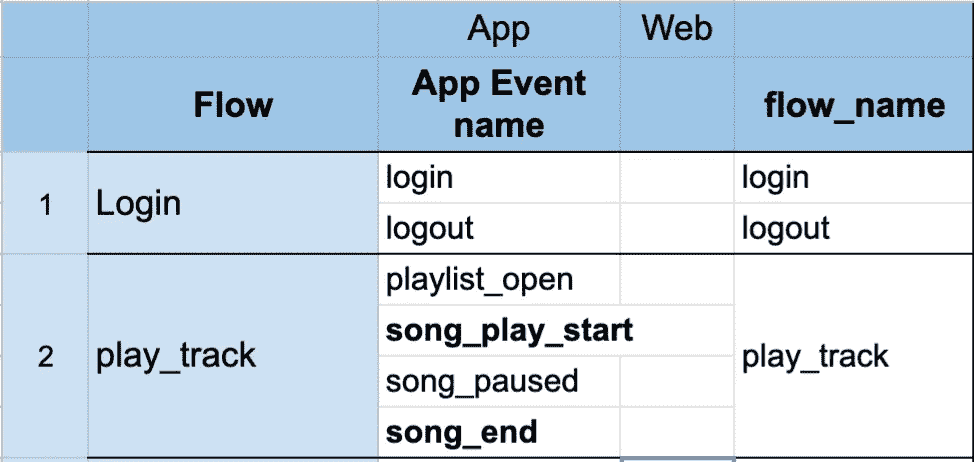

# 3 项指标，确保您的应用为用户提供最佳体验。

> 原文：<https://towardsdatascience.com/3-metrics-to-make-sure-your-app-is-delivering-the-best-experience-to-its-users-93adb248553e?source=collection_archive---------28----------------------->

## 通过定期遵循这 3 项指标来监控您的应用健康状态。

在 [Unsplash](https://unsplash.com?utm_source=medium&utm_medium=referral) 上由 [Austin Distel](https://unsplash.com/@austindistel?utm_source=medium&utm_medium=referral) 拍摄的照片

在我的[上一篇文章](/simplify-your-ga4-tracking-analysis-with-this-framework-spotify-app-as-an-example-6fb5327201b0)中，我介绍了一个简单的 4 步框架来组织你追踪应用的思维。在这篇文章中，我想与你分享我发现对产品团队监控应用健康状态有帮助的三个指标。

现在，让我们讨论一下指标..

**1-用途:**该指标用于回答有多少用户使用了应用程序流程/功能/事件。了解绝对数字是有益的，但将其与基准(如以前的时期或某些目标)进行比较，可以了解该数字是好是坏。即在 Spotify 应用程序示例中，您想要关注的一个事件是 **upgrade_to_premium** (有多少免费帐户用户升级到付费帐户)。该数字与目标值和以前的时间段相比如何。

监控这一指标的另一个好处是查看某些特性是否按预期使用。如果你的应用程序用户和你一样考虑这些功能，或者如果他们更重视其他不同于你的功能，使用趋势可能会显示给你。

***upgrade _ to _ premium***事件的使用趋势。

**2-成功率:**该指标是在没有技术问题的情况下，成功实现应用程序目标的用户百分比。也就是说，在没有技术问题的情况下成功**升级到高级版**的应用程序用户比例。我们希望这个百分比是 100%,但是你可能会惊讶，这通常不是事实，并且%的用户由于这样或那样的原因会出现技术错误。您可以通过收集跟踪事件的*成功*参数来跟踪这个指标。

成功作为事件参数被跟踪。

**3-完成率:**该指标用于衡量应用流程的流畅程度。它是完成流量的用户与开始流量的用户的比率。这应该能告诉我们用户从流量中掉得最多的是哪里。能够跟踪这一点的一个技巧是，在命名事件时要有一致的命名约定，其中事件名称中提到了事件在流中的位置。也就是说，任何带有 **_start** 的事件都是启动流程的事件，任何带有 **_end** 或 **_complete** 的事件都意味着它是流程中应该触发的最后一个事件。

_start & _end 后缀被添加到事件中。

## 摘要

在这篇文章中，我讨论了产品团队可以用来监控应用健康状态的 3 个指标。第一个是使用趋势，它旨在告诉你哪些功能受欢迎，哪些不受欢迎。

第二个指标是成功率，旨在告诉你用户在试图完成你的应用程序或数字产品中的任务时是否出现了任何错误。

我们讨论的最后一个指标是完成率，这个指标告诉你你的流程有多顺畅，以及用户是否会放弃。

感谢阅读！