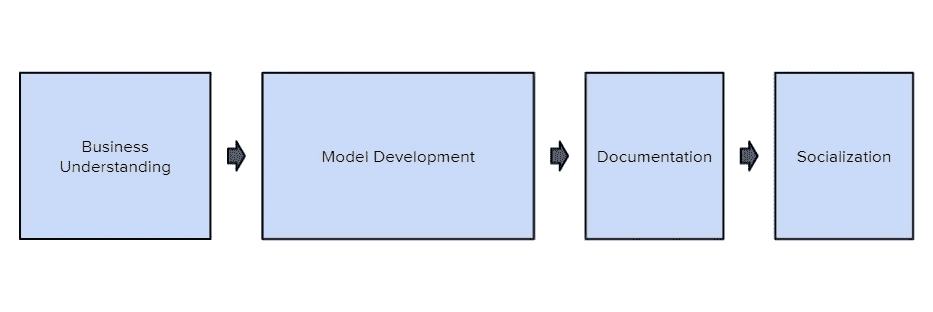

# 我从事数据科学工作 3 年来学到的 3 条最重要的经验

> 原文：<https://towardsdatascience.com/3-most-important-lessons-ive-learned-from-3-years-into-my-data-science-career-acdf783d889c?source=collection_archive---------16----------------------->

## 我的反思。

照片由 [Unsplash](https://unsplash.com/s/photos/journey?utm_source=unsplash&utm_medium=referral&utm_content=creditCopyText) 上的 [Mantas Hesthaven](https://unsplash.com/@mantashesthaven?utm_source=unsplash&utm_medium=referral&utm_content=creditCopyText) 拍摄

作为一名数据专家工作了 3 年后，我认为这是一个分享我学到的 3 个最重要的教训的好时机。

我相信这些课程非常重要，因为它们有助于获得成功的数据科学职业生涯。读完这篇文章后，你会意识到成为一名优秀的数据科学家不仅仅是构建复杂的模型。

话虽如此，以下是我在数据科学职业生涯中学到的 3 条最重要的经验！

> **如果您喜欢这篇文章，请务必订阅******，千万不要错过另一篇关于数据科学指南、技巧和提示、生活经验等的文章！****

# **1.很大一部分时间实际上是花在你的项目之间(之前和之后)。**

****

**作者创建的图像**

**我注意到的一件事是，几乎所有的数据科学课程和训练营都强调并阐述了项目生命周期的建模阶段，而实际上，这只是整个过程的一小部分。**

**如果你花了一个月的时间在工作中建立一个初步的机器学习模型，你可以预计花一个月的时间事先了解业务问题，然后记录和社交项目。**

**不仅建议您在构建模型之前和之后完成这些步骤，而且这对于您项目的成功至关重要。**

**让我们深入了解每一项的重要性:**

*   ****业务理解**:理解手头的业务问题对你的成功至关重要。例如，如果你正在建立一个机器学习模型，你应该知道模型应该预测什么，谁将使用它，它将如何被实际使用，你将使用什么指标来评估模型，等等。重要的是，你要花时间去理解**关于商业目标的一切**来创建一个适用的模型。**
*   ****文档**:虽然我同意文档没有浏览数据和构建模型那么令人兴奋，但是为您的代码、您构建的任何表以及模型是如何构建的，拥有清晰简明的文档是很重要的。这真的很重要，这样你或者其他人在使用你的模型或者修复它们的时候就可以很容易地参考这些资源。**
*   ****社会化**:社会化很少被提及，但是如果你的项目没有被企业所利用，它们就不会成功。将你的项目社会化需要向相关的利益相关者展示它们，解释它们的价值，以及如何使用它们。你能向越多的利益相关者推销你的想法，他们就越有可能采用你的数据产品，你的项目就越成功。**

**这三个步骤有什么共同点？它们都是**交流的一种形式。**事实上，我认为良好的沟通是数据科学家和高级数据科学家之间的区别。**

> ****如果你喜欢这篇文章，请务必** [**订阅**](https://terenceshin.medium.com/subscribe) **千万不要错过另一篇关于数据科学指南、技巧和提示、生活经验等的文章！****

# **2.基本面会让你达到 80%以上。**

**当我开始学习数据科学时，我试图在不学习基础知识的情况下学习最复杂的概念。**

**经过多年的经验，我意识到这些基础知识足以让你在职业生涯中走完 80%的路程。为什么？更简单的解决方案总是胜出。它们更容易理解，更容易实现，更容易维护。一旦一个简单的解决方案证明了它对公司的价值，只有那时你才能考虑更复杂的解决方案。**

**那么基本面到底是什么呢？**

## **A) SQL**

**经过 3 年的工作，我确信掌握 SQL 是事业成功的关键。SQL 不是一项很难学习的技能(例如，从哪里选择)，但它肯定是一项很难完善的技能。SQL 对于数据争论、数据探索、数据可视化(构建仪表板)、构建报告和构建数据管道是必不可少的。**

**如果你想掌握 SQL，看看我下面的指南:**

** [## 为期 15 周的完整课程，旨在掌握数据科学的 SQL

### 在 15 周内学习最重要的数据科学技能

towardsdatascience.com](/a-complete-15-week-curriculum-to-master-sql-for-data-science-999e690033e4) 

## b)描述性和推断性统计

很好地理解基本的描述性和推断性统计也是非常重要的。

**描述性统计**让你以一种简单的方式总结和理解你的数据。

**推断统计**让你根据有限的数据(样本)得出结论。这对于构建解释性模型和 A/B 测试是必不可少的。

## c)用于 EDA 和特征工程的 Python

Python 主要对执行 EDA 和特征工程很重要。也就是说，这两个步骤也可以使用 SQL 来完成，所以这一点要记住。我个人喜欢在我的技术堆栈中使用 Python，因为我发现在 Jupyter 笔记本中执行 EDA 比在 SQL 控制台或仪表板中更容易。

 [## 探索性数据分析的广泛逐步指南

### 我对任何数据集执行 EDA 的个人指南

towardsdatascience.com](/an-extensive-guide-to-exploratory-data-analysis-ddd99a03199e) 

# 3.迭代并构建一个模型的几个版本比花费大量时间构建一个最终模型要好。

> 构建、测试、迭代、重复。

一般来说，在一个模型上花费更少的时间来将初始版本投入生产并从那里迭代总是更好的。为什么？

1.  在初始模型上分配更少的时间会激励你提出更简单的解决方案。正如我在本文前面说过的，更简单的解决方案有几个好处。
2.  您提出 POC(概念验证)的速度越快，您就能越快地从其他人那里获得反馈以对其进行改进。
3.  业务需求不断变化，所以如果您能尽早部署您的项目，您就更有可能成功。

我想说的是**不是**催促你的项目，而是快速部署它们**，这样你就可以接收反馈，迭代和改进**你的项目。

# 感谢阅读！

我希望您发现这很有见地，并对您的数据科学事业有所帮助！如果你喜欢这个，一定要关注我的未来内容。一如既往，我祝你学习一切顺利！

**不确定接下来该读什么？我为你挑选了另一篇文章:**

 [## 2021 年数据科学家最需要的技能

### 来自 15，000 多个数据科学家职位发布的网络搜索结果

towardsdatascience.com](/the-most-in-demand-skills-for-data-scientists-in-2021-4b2a808f4005) 

**又一个！**

 [## 六分钟内解释所有概率分布

towardsdatascience.com](/all-probability-distributions-explained-in-six-minutes-fe57b1d49600) 

# 特伦斯·申

*   ***如果你喜欢这个，*** [***订阅我的媒介***](https://terenceshin.medium.com/subscribe) ***获取独家内容！***
*   ***同样，你也可以*** [***跟我上媒***](https://medium.com/@terenceshin)
*   ***有兴趣合作吗？让我们连线上***[***LinkedIn***](https://www.linkedin.com/in/terenceshin/)**