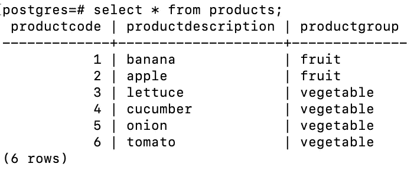
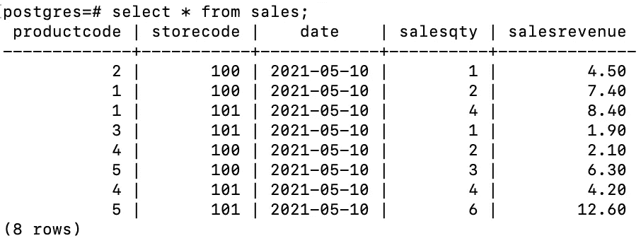
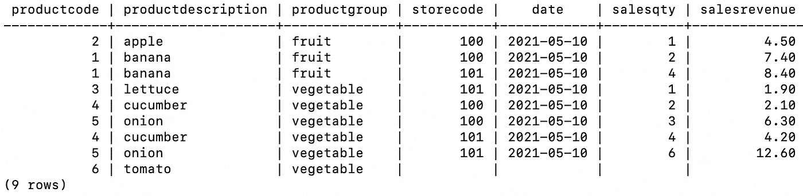
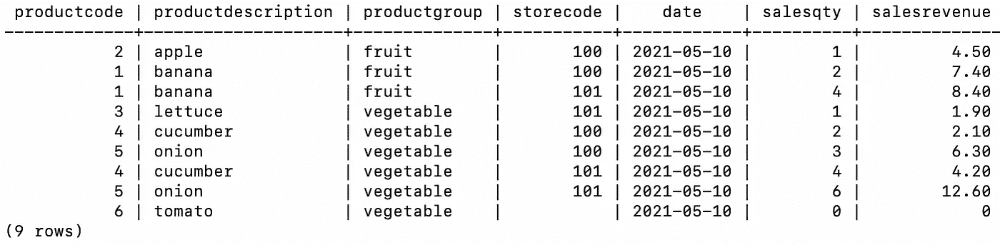
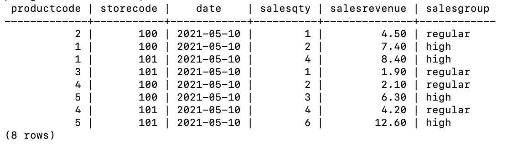
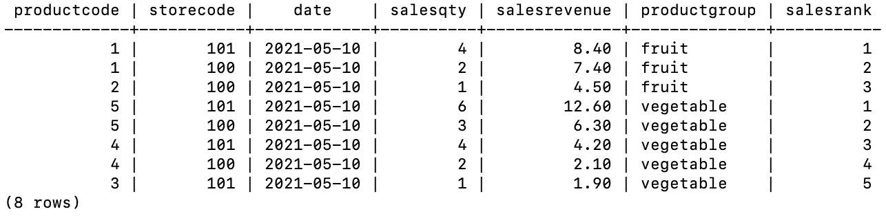

# 高效数据分析的 3 个必备 SQL 函数

> 原文：<https://towardsdatascience.com/3-must-know-sql-functions-for-efficient-data-analysis-b7e4ee820faf?source=collection_archive---------4----------------------->

用实际例子说明


卡尔·海尔达尔在 [Unsplash](https://unsplash.com/s/photos/efficient?utm_source=unsplash&utm_medium=referral&utm_content=creditCopyText) 上拍摄的照片

SQL 是关系数据库管理系统使用的一种编程语言。它提供了许多对存储在关系数据库中的数据进行操作的函数和方法。

SQL 不仅仅是一种查询语言。我们也可以用它来过滤、操作和分析数据。在本文中，我们将介绍 3 个对高效数据分析非常有用的 SQL 函数。

我们将涉及的功能有:

*   联合
*   什么情况下
*   行数

我创建了两个样本表，并用模拟数据填充它们。我们先来看看这些表。



产品表(作者图片)



销售表(作者图片)

这些表包含两个不同商店的销售和产品数据。

## 1.联合

考虑这样一种情况，我们需要将 sales 表左连接到 products 表。它们通过产品代码联系在一起，所以我们基于该列连接这些表。

```
SELECT P.*, S.storecode, s.date, s.salesqty, s.salesrevenue                                                                      FROM products P                                                                                                                             LEFT JOIN sales S                                                                                                                           ON P.productcode = S.productcode;
```



(图片由作者提供)

不是每个产品在给定日期都有销售。对于这些产品，sales 表中的列包含空值(在上面的屏幕截图中为空)。

我们可以使用 coalesce 函数来处理连接表后的空值。在我们的例子中，我们可以用零填充销售数量和销售收入列。日期列可以用其他行中的日期来填充。

```
SELECT 
   P.*, 
   S.storecode, 
   coalesce(s.date, '2021-05-10') as date,  
   coalesce(s.salesqty,0) as salesqty, 
   coalesce(s.salesrevenue, 0)as salesrevenue                                                                                                                             FROM Products P                                                                                                                             LEFT JOIN Sales S                                                                                                                           ON P.productcode = S.productcode;
```



(图片由 authot 提供)

空单元格用 coalesce 函数中的指定值填充。我已将商店代码留空。

## 2.什么情况下

函数允许根据给定条件更新值的情况。它类似于 Python 中的 if-else 语句。

假设我们希望从 sales 表中选择所有列，并根据销售收入创建一个附加列。如果收入高于 5，则该列取值“高”。否则就填“正规”。

我们可以用如下函数时的情况来完成这个操作:

```
SELECT 
   *,
   CASE WHEN salesrevenue > 5 THEN 'high' ELSE 'regular' END AS
   salesgroup
FROM Sales;
```



(图片由作者提供)

上述查询中的 case when 语句执行以下步骤:

*   创建名为“销售组”的列
*   当“销售收入”列中的值大于 5 时，将“高”分配给此列
*   否则(即 else)指定“常规”

## 3.行数

row_number 函数允许根据特定列中的值对行进行排序。通过与分区结合，我们可以使它更灵活或更有用。

回忆一下销售表:


销售表(作者图片)

假设我们需要根据销售收入分配一个等级。我们希望不同的产品组有不同的等级。因此，水果和蔬菜将在它们自己之内被排列。

第一步是从 products 表中获取 product group 列。然后，我们将使用 row_number 函数。

```
SELECT
   S.*, 
   P.productgroup, 
   ROW_NUMBER() OVER(PARTITION BY P.productgroup ORDER BY  
   salesrevenue DESC) AS salesrank
FROM sales S 
LEFT JOIN products P 
ON S.productcode = P.productcode;
```



(图片由作者提供)

在每个组中，第一个等级被分配给销售收入最高的行。然后，相应增加。

## 结论

SQL 是数据科学生态系统中的强大工具。绝对是数据科学家必备的技能。我们不仅应该使用 SQL 从数据库中检索数据，还应该使用 SQL 进行数据分析和操作。

SQL 能够执行几乎所有可以用流行的数据分析库(如 Python pandas 和 R data table)完成的操作。

感谢您的阅读。如果您有任何反馈，请告诉我。