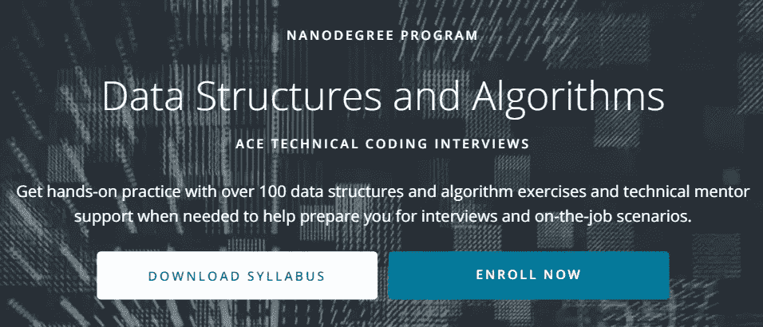
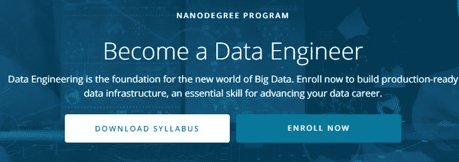
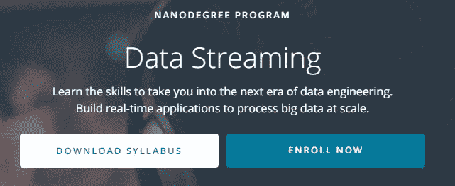

# 3 门数据工程课程，在 2023 年推进您的职业发展

> 原文：<https://towardsdatascience.com/3-nanodegrees-you-should-consider-to-advance-your-data-engineering-career-in-2021-baf597debc72?source=collection_archive---------8----------------------->

## [数据工程](https://towardsdatascience.com/tagged/data-engineering) | [职业](https://towardsdatascience.com/tagged/career) | [Python 编程](https://towardsdatascience.com/tagged/python-programming)

## 加入数据行业，改变角色或通过注册数据工程纳米学位来学习前沿技术。

由 [Marvin Meyer](https://unsplash.com/@marvelous?utm_source=medium&utm_medium=referral) 在 [Unsplash](https://unsplash.com?utm_source=medium&utm_medium=referral) 上拍摄

## 给我的读者一个提示:

*这篇文章包括附属链接，如果你购买的话，我可以免费(但实际上是打折)为你赚取一小笔佣金。*

**** * ****[***通过这个环节获得 70%***](https://imp.i115008.net/jWWEGv)**** * ****

*还不是中等会员？考虑与我的* [***推荐链接***](https://anbento4.medium.com/membership) *签约，以获得 Medium 必须提供的一切，费用低至每月 5 美元***！**

# ***你不再是你在大学里学的样子了***

*尽管听起来可能有争议，但你已经不是大学时的你了，随着你在职业生涯中的进步，公司将倾向于减少对你在 20 岁出头时参加的课程的关注，而更多地关注你在这一过程中获得的技能，以及一旦被聘用后你将带来的技能。*

> *你不再是你在大学时所学的样子，随着你在职业生涯中的进步，公司往往更关注你在 20 岁出头时参加的课程，而更关注你在这个过程中获得的技能。*

*不要误解我——从一所好大学毕业仍然是脱颖而出的一种非常有效的方式，尤其是在你人生旅程的起点。此外，对于更传统的角色(如*医生、律师、建筑师等……*)来说，正式学位仍然是开始成为专业人士的必要步骤。*

*然而，数据行业的情况并非如此。就拿我的背景来说吧:我有*金融经济学*学士学位和*数量金融学*硕士学位。在大学里，我从未上过真正的计算机科学课程，也很少使用 MATLAB 和 R 来完成一些带回家的统计作业。尽管如此，我是一名 BI 工程师。*

*</6-sql-window-functions-coding-problems-on-ranking-interview-countdown-p1-9be0ccf66453>  

通常，在聊完我的背景后，同事们会问我，我有金融背景，是如何找到数据方面的工作的。我告诉他们真相:当我认真对待这个职业时，我开始在网上参加按需编码课程，每天两个小时。就这样，我先自学了 SQL，然后是 Python，最近又自学了 Apache Spark。

我在网上学到的东西，结合我在工作场所获得的经验，塑造了我成为今天的专业人士。我是我的软技能、技术技能和商业知识的总和。

像许多其他人一样，仅仅是与我的日常训练保持一致，就允许我选择我热爱的职业。

# 为什么你应该考虑纳米学位

点播课程帮助了我，但随着我在数据工程学习道路上的进步，我注意到，尽管网上提供了大量的编码课程，但找到非常高质量的内容变得越来越具有挑战性。至少在我发现 [Udacity 的纳米学位](https://imp.i115008.net/NK9qo1)之前是这样。

纳米学位可以被定义为一个基于在线技能的教育项目。事实上，就像标准的大学学位一样，一旦你完成了纳米学位，你将获得一个证书，证明你掌握了一系列技能。

然而，与大学学位不同，纳米学位需要几个月而不是几年才能完成，而且更专注于你所选择领域的实际项目。通过这种方式，你将能够向你的雇主证明，你从第一天起就准备好了创造价值。

注册纳米学位的另一个好处是，你可以选择更广阔的职业道路(如 [***数据分析***](https://www.udacity.com/course/data-analyst-nanodegree--nd002)***t****p*程序)或更具体的专业领域(如 [***商业预测分析***](https://www.udacity.com/course/predictive-analytics-for-business-nanodegree--nd008t) 程序)。在这两种情况下，结构良好的学习路径都是为你建立的，并由有 FAANG 公司背景的教师传授给你。

下面是我本人参加的三个数据工程课程的真实描述和评论，我参加了由 Udacity 发起的 [**30 天免费使用**](https://imp.i115008.net/7maNx5) 促销活动:

> 尽管纳米学位还不能完全取代大学课程，但随着时间的推移，它们很可能会成为证明你在数据行业实践经验的标准认证。

# 2023 年的数据工程纳米学位

无论你的目标是第一次加入数据行业，从事更技术性的职业，还是仅仅试图跟上数据工程的最新趋势，我希望以下至少有一个纳米学位能为你提供一个在旅程中进步的机会:

## 1.[数据结构&算法(Python)纳米度](https://imp.i115008.net/kjjdnv)

纳米学位[主页](https://www.udacity.com/course/data-structures-and-algorithms-nanodegree--nd256)

**描述 *:*** 在本课程中，您将通过解决 80+道练习题来学习数据结构和算法。你将从学习解决与特定数据结构和算法相关的问题开始每门课程。在每个模块结束时，您将能够针对任何开放式问题评估不同的数据结构和算法，并根据您的设计选择实施解决方案。

[教学大纲](https://d20vrrgs8k4bvw.cloudfront.net/documents/en-US/Data%2BStructures%2Band%2BAlgorithms%2BSyllabus.pdf)分为三个主要部分:

*   ***简介* :** python 复习者，如何解题，理解时空复杂性。
*   ***数据结构:*** 其中集合数据结构(链表、数组、链表、队列、堆栈)、递归、树、映射和哈希。
*   ***基本算法:*** 二分搜索法，排序算法，除法&征服算法。
*   ***高级算法:*** *g* reedy 算法，图算法，动态&线性规划。

**预计持续时间:** 4 个月，每周学习 10 小时。

**定价:**如果提前支付，每月 279 英镑(4 个月 1116 英镑)。

如果你想为编码回合做好准备，这是一个极好的纳米学位。实际上，数据结构和算法问题是数据工程师、机器学习工程师和数据科学家每次技术面试的关键组成部分。

材料非常透彻，教得也很好，但如果你赶时间，这不是你应该参加的那种课程。相反，你应该提前计划，并承诺至少几个星期。

到目前为止，我的分数是 7.5/10，但仅仅是因为，在我看来，这个课程对于它所服务的主要目的来说有点太长了。

</10-algorithms-to-solve-before-your-python-coding-interview-feb74fb9bc27>  

## **2。** [**数据工程纳米学位**](https://imp.i115008.net/jWWEGv)

纳米学位[主页](https://www.udacity.com/course/data-engineer-nanodegree--nd027)

**描述:**在本课程中，您将学习设计数据模型、构建数据仓库和数据湖、自动化数据管道以及处理海量数据集。在课程结束时，您将通过完成一个顶点项目来结合您的新技能。[教学大纲](https://d20vrrgs8k4bvw.cloudfront.net/documents/en-US/Data%2BStructures%2Band%2BAlgorithms%2BSyllabus.pdf)分为四个主要部分:

*   ***数据建模:*** 数据模型、关系数据模型、NoSQL 数据模型简介。
*   ***云数据仓库:*** 数据仓库简介，用 AWS 介绍云，在 AWS 上实现数据仓库。
*   ***Spark &数据湖泊:***Spark 的力量，与 Spark 的数据角力，调试优化，数据湖泊入门。
*   ***带气流的数据管道:*** 数据管道，数据质量，生产数据管道。
*   ***顶点项目:*** 结合您在整个项目中学到的知识，构建您自己的数据工程组合项目。

**预计持续时间:** 5 个月，每周学习 5-10 小时

**定价:**每月 279，如果提前支付(5 个月 1395)。

**回顾:**这个项目是专门为你成为一名数据工程师而设计的，它可能是我在网上找到的最完整的教学大纲。数据工程领域预计将在未来几年继续快速增长，各行业对数据工程师的需求巨大。

在过去的 3 周里，我已经学习了太多关于气流、火花和数据湖的知识，所以我可能会购买剩下的 4 个月来完成 nanodegree。这种材料质量极高，价格完全合理。我此时的标记是 **9/10** 。

</3-ways-to-create-tables-with-apache-spark-32aed0f355ab> 

**描述:**在本课程中，您将学习如何通过在现代数据工程工具(如 Apache Spark、Kafka、Spark Streaming 和 Kafka Streaming)中构建流畅性来实时处理数据。

您将从理解数据流系统的组件开始。然后，您将构建一个实时分析应用程序。学生还将编译数据和运行分析，以及从流式控制台生成的报告中获取见解。教学大纲分为两个主要部分:

*   ***数据流和 SQL&Web 数据建模基础:*** 流处理简介，Apache Kafka，数据模式和 Apache Avro，Kafka Connect 和 REST 代理，流处理基础，流处理与 Faust，KSQL。
*   ***流式 API 开发与文档:*** 流式 DataFrames，joins 与 JSON，Redis，Base64 与 JSON。

**预计持续时间:** 2 个月，每周学习 5-10 小时

**定价:**如果提前支付，每月 279 英镑(2 个月 558 英镑)。

**回顾:**该计划旨在提高更有经验的软件工程师和数据工程师的技能，以学习数据处理的最新进展，持续发送数据记录以支持实时更新。

特别是，随着企业越来越依赖于实时生成和处理数据的应用程序，数据流是数据工程师越来越需要的技能。

我发现这是目前在线上结构最合理的数据流课程，因为它既教授*阿帕奇卡夫卡*和*阿帕奇火花*，这两种课程经常在工作场所的组合中使用。该计划包括先进的材料和相当的技术，所以我喜欢它至今。

我的分数暂时是 **9.5/10** ，特别是因为它物有所值，可以用较少的时间投入完成。

# 结论

在这篇文章中，我分享了关于 3 个工程在线项目的评论，我建议你考虑一下，以便在 2023 年推进你的职业生涯。

根据 2020 年对 Udacity 纳米学位项目毕业生的一项调查:
在打算继续职业生涯的毕业生中，73%的人表示职业前景良好。
·在有意提升自己职位的毕业生中，50%的人获得了加薪，平均增幅为+33%。

尽管纳米学位还不能完全取代大学课程，但随着时间的推移，它们很可能会成为证明你在数据行业实践经验的标准认证。

## 给我的读者一个提示

> 还不是中等会员？考虑注册我的推荐链接，以每月 5 美元的价格获得 Medium 提供的一切！
> 
> 这个帖子包括附属链接，如果你购买的话，我可以免费给你一点佣金。*