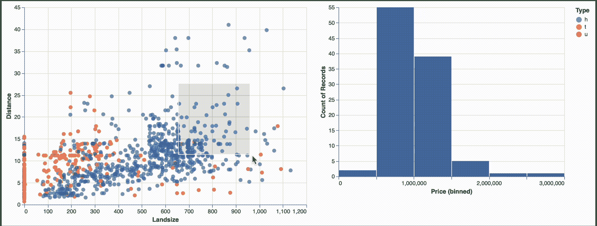
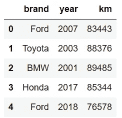
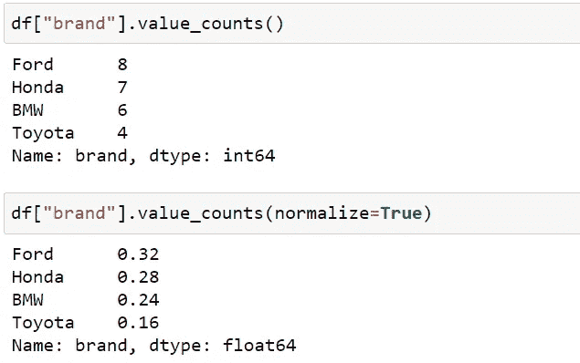
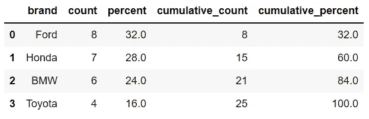

# 3 用于数据科学的不常见但功能强大的 Python 库

> 原文：<https://towardsdatascience.com/3-not-so-common-yet-functional-python-libraries-for-data-science-fa58bbf6b405?source=collection_archive---------16----------------------->

## 让你的生活更轻松。


萨曼莎·加德斯在 [Unsplash](https://unsplash.com/s/photos/simple?utm_source=unsplash&utm_medium=referral&utm_content=creditCopyText) 上的照片

Python 主宰数据科学的原因之一是它为用户提供了丰富的库选择。活跃的 Python 社区不断维护和改进这些库，这有助于 Python 保持领先地位。

一些最常用于数据科学的 Python 库是 Pandas、NumPy、Matplotlib、Seaborn、Scikit-learn、TensorFlow 和 PyTorch。它们可以被认为是 Python 库生态系统的一部分。

就像除了 FAANG 之外还有许多成功的公司一样，Python 还有其他在特定情况下派上用场的库。在这篇文章中，我将告诉你其中的三个。

# 阿尔泰尔

Altair 是 Python 的统计可视化库。它不如 Seaborn 或 Matplotlib 受欢迎，但我建议你也给 Altair 一个机会。

我最喜欢 Altair 的是过滤和数据转换操作。在创建可视化时，它提供了许多操作数据的选项。在这个意义上，Altair 可以被认为是一个更完整的探索性数据工具。

我们还可以用 Altair 创建交互式可视化。此外，可以将选择对象添加到可视化效果中，使您在一个图表上选择的内容在另一个图表上发生变化。很酷的功能！:)

下面的交互式可视化是用 Altair 创建的。右边的是一个直方图，显示了在左边图上选择的数据点的价格分布。



(作者 GIF)

我写过几篇解释如何使用 Altair 的文章。它们构成了一个实用的牛郎星教程，所以如果你想了解更多关于牛郎星的知识，我建议你访问它们。

*   第一部分:[简介](/altair-statistical-visualization-library-for-python-cfb63847c0c0)
*   第二部分:[过滤和转换数据](/altair-statistical-visualization-library-for-python-part-2-4c8ce134e743)
*   第 3 部分:[互动情节和动态过滤](/altair-statistical-visualization-library-for-python-part-3-c1e650a8411e)
*   第 4 部分:[定制可视化](/altair-statistical-visualization-library-for-python-part-4-9ec970fb12e8)
*   第 5 部分:[用 Altair 制作交互式可视化效果](/making-interactive-visualizations-with-python-altair-7880ab5cf894)

# 侧桌

Sidetable 是熊猫图书馆的一个附件。它是由克里斯·莫菲特创造的。

Pandas 有一些访问器来使用某些类型的方法。例如，使用 str 访问器可以访问操作字符串的方法。我给出这些信息的原因是 Sidetable 可以像 str 访问器一样用作数据帧的访问器。

它可以从终端或 jupyter 笔记本中安装。

```
#from terminal
$  python -m pip install -U sidetable#jupyter notebook
!pip install sidetable
```

为了享受 Sidetable 的乐趣，我们需要将它和熊猫一起导入。

```
import pandas as pd
import sidetable
```

Sidetable 的功能类似于熊猫的`value_counts`功能，但它提供了更多的洞察力。

当应用于分类变量时，`value_counts`函数给出了每个类别的观察值或百分比份额。另一方面，Sidetable 不仅给出了观察值的数量和百分比，还提供了累积值。

让我们做一个简单的例子来说明这种区别。假设我们有以下数据框。



df 前五行(图片由作者提供)

我们可以找出每个品牌的汽车数量如下。



value_counts 函数(图片由作者提供)

sidetable 返回一个信息更丰富的表格。



侧表(图片由作者提供)

这是一个只有 25 行的样本数据框。当您在现实生活中处理较大的数据框时，Sidetable 将更加实用和实用。

除了`freq`功能，Sidetable 还有`counts`、`missing`和`subtotal`功能，这些功能也很实用。

如果你想了解更多关于 Sidetable 的知识，这里有两篇文章，并附有几个例子。

*   [熊猫侧桌刚公布](/pandas-sidetable-just-announced-708e5f65938f)
*   [熊猫侧桌:更聪明地使用熊猫](/pandas-sidetable-a-smarter-way-of-using-pandas-96fa7c61e514)

# 缺少编号

[Missingno](https://github.com/ResidentMario/missingno) 顾名思义，是一个帮助处理数据框中缺失值的库。

Pandas 具有查找缺失值的数量或者用合适的值替换它们的功能。Missingno 所做的是创建可视化效果，提供缺失值分布的概述。

这肯定比仅仅知道缺失值的数量更能提供信息。这对于处理缺失值也是一个重要的见解。

例如，如果大多数丢失的值都在同一行，我们可以选择删除它们。但是，如果不同列中缺少的值碰巧在不同的行中，我们可能应该找到更好的方法。

缺失 no 让我们更容易探究缺失值的分布。

[](/visualize-missing-values-with-missingno-ad4d938b00a1) [## 可视化缺失值和缺失号

### 浏览数据集中缺失的值。

towardsdatascience.com](/visualize-missing-values-with-missingno-ad4d938b00a1) 

# 结论

Python 是数据科学中一个杰出的库是有原因的。有许多图书馆使你的生活更容易。非常感谢伟大的 Python 社区创建了如此优秀的库。

最后但同样重要的是，如果你还不是[中级会员](https://sonery.medium.com/membership)并打算成为其中一员，我恳请你使用以下链接。我将从你的会员费中收取一部分，不增加你的额外费用。

[](https://sonery.medium.com/membership) [## 通过我的推荐链接加入 Medium-Soner yl DRM

### 作为一个媒体会员，你的会员费的一部分会给你阅读的作家，你可以完全接触到每一个故事…

sonery.medium.com](https://sonery.medium.com/membership) 

感谢您的阅读。如果您有任何反馈，请告诉我。