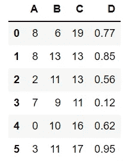
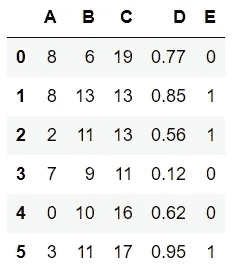
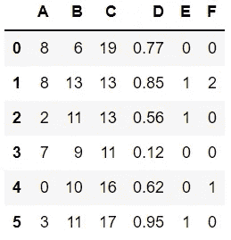
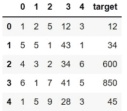
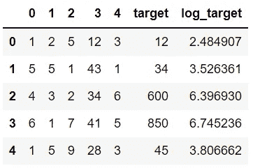

# 3 个 NumPy 函数，便于对熊猫进行数据分析

> 原文：<https://towardsdatascience.com/3-numpy-functions-to-facilitate-data-analysis-with-pandas-b1ad342a569?source=collection_archive---------22----------------------->

## 用 NumPy 提升你的熊猫代码


在 [Unsplash](https://unsplash.com/s/photos/help?utm_source=unsplash&utm_medium=referral&utm_content=creditCopyText) 上由 [Toa Heftiba](https://unsplash.com/@heftiba?utm_source=unsplash&utm_medium=referral&utm_content=creditCopyText) 拍摄的照片

Pandas 和 Numpy 是用于数据分析和操作的两个最流行的 Python 库。熊猫配备了许多实用和方便的功能。

Pandas 还允许使用一些 Numpy 函数，这使得 Pandas 的操作更加有效。在本文中，我们将介绍 3 个 Numpy 函数，它们在使用 Pandas 进行数据分析时非常有用。

让我们从导入库和创建样本数据框开始。

```
import numpy as np
import pandas as pddf = pd.DataFrame({
    "A": np.random.randint(10, size=6),
    "B": np.random.randint(20, size=6),
    "C": np.random.randint(10,20, size=6),
    "D": np.random.random(6).round(2)
})df
```



df(作者图片)

# 在哪里

我们感兴趣的第一个是 where 函数，它为创建条件列提供了一种方便的方法。

我们将一个条件传递给 where 函数，并为满足和不满足该条件的行确定一个单独的值。

例如，如果列“B”和“C”中的值都大于 10，我们可以创建一个值为 1 的列“E”。否则，“E”列中的值为 0。

```
df["E"] = np.where((df["B"] > 10) & (df["C"] > 10), 1, 0)df
```



df(作者图片)

我们可以使用逻辑运算符组合任意多的条件。

# 挑选

select 函数就像是 where 的升级版。我们能够应用多个条件来确定每个条件的单独值。

使用 where 函数，我们只能测试一个条件(或一组条件)并确定两个值。select 函数的作用是更进一步。我们可以测试多个条件(或多个条件集)，并为满足每个条件集的行分配一个单独的值。它还允许为不满足任何条件的行指定默认值。

举个例子会更清楚。

```
conditions = [
  (df["B"] >= 10) & (df["A"] == 0),
  (df["B"] >= 10) & (df["A"] == 8)
]values = [1, 2]df["F"] = np.select(conditions, values, default=0)df
```



df(作者图片)

# 原木

对数函数，顾名思义，是用来取一个值的对数的。

```
np.log10(100)
2.0np.log2(16)
4.0np.log(1000)
6.907755278982137
```

幸运的是，我们可以将 log 函数应用于数据框的整个列。在许多情况下，记录列的日志是一种有用的做法。例如，如果机器学习模型中的目标变量包含异常值，则最好使用模型中目标变量的日志。对数线性模型常用于机器学习。

我们有以下数据框:



df(作者图片)

与目标列中的其他值相比，值 600 和 850 相当大。让我们来看看这个专栏的日志有什么不同。

```
df["log_target"] = np.log(df["target"])df
```



df(作者图片)

由于对数函数，差异变得更小。

# 结论

熊猫和熊猫携手并进。事实上，Pandas 和其他一些 Python 库都是建立在 Numpy 之上的。

在大多数情况下，我们能够用熊猫功能完成任务。但是，在某些情况下使用 Numpy 函数可以提供额外的好处和功能。

感谢您的阅读。如果您有任何反馈，请告诉我。