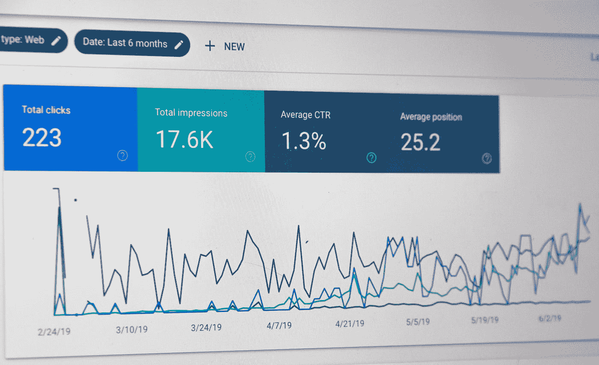

# 数据分析师的 3 个在职技巧

> 原文：<https://towardsdatascience.com/3-on-the-job-tips-for-data-analysts-95fd65ae9632?source=collection_archive---------22----------------------->

## 更好分析的简单步骤

你参加了成为数据分析师所需的所有课程。SQL？检查。Python？检查。你最近成为了一名数据分析师，或者你是一名有抱负的分析师。

毫无疑问，你的技术技能会让你在这个职位上走得更远，但是你怎样才能成为一名更强的分析师呢？

一年前，我从化学工程师专业毕业，在一家科技公司担任数据分析师。我不知道我在数据分析领域的第一个角色会是什么样的。

这里有一些我希望在成为数据分析师之前就知道的技巧，这样你就不用费劲去学习了。

不要犯我的错误！由[米哈尔·马特隆](https://unsplash.com/@michalmatlon?utm_source=medium&utm_medium=referral)在 [Unsplash](https://unsplash.com?utm_source=medium&utm_medium=referral) 上拍摄的照片

作为一名数据分析师，我用数据洞察力回答业务团队的问题。这听起来几乎微不足道——数据分析师只是简单地回答问题，对吗？

不完全是。细节决定成败。

> 分析师回答问题的方式决定了分析的质量。

这就是为什么我的三个建议是

*   了解问题类型，并恰当地回答。
*   了解问题的意图——不要成为一只提问的猴子。
*   讲数据故事。

在我开始之前，我将首先总结一下分析师是做什么的。

# 分析师的角色

通常，数据洞察最好通过数字或图表来传达。为了实现这一点，我使用了工具箱中的这些工具。

*   **SQL** 用于从云中提取数据(我的公司使用 BigQuery 和 PostgreSQL)
*   **Tableau、Google Data Studio 和 Metabase** 都是商业智能(BI)仪表板工具，供利益相关者进行交互。
*   **Python 和 R** 用于数据争论和可视化，尤其是在需要某些包的情况下。
*   **Google Sheets** **和 Excel** 对于呈现小型数据集是必不可少的。

BI 工具示例。斯蒂芬·菲利普斯-Hostreviews.co.uk 在 [Unsplash](https://unsplash.com?utm_source=medium&utm_medium=referral) 上拍摄的照片

下面是一个工作流程示例。

1.  业务涉众就一个可以用数据回答的问题联系分析师。
2.  数据分析师与利益相关者一起工作，以理解利益相关者的意图。
3.  分析师通过数据提供见解和建议，并运用恰当的数据讲述技巧。
4.  冲洗并重复。

现在，有了这些，我给在职的有抱负的新数据分析师一些建议。

# 1.了解问题类型，并恰当地回答。

知道问题是回答问题的第一步。西蒙·塞西在 [Unsplash](https://unsplash.com?utm_source=medium&utm_medium=referral) 上的照片

分析师回答的问题可能来自不同的团队(销售、产品、营销、运营、战略或工程)。这些问题可以分成六种不同的类型。

## 描述的

*   例如*谁是我们最活跃的用户？*
*   要求简短、快速的回答。

## 探索的

*   *例如，为什么某些用户不再活跃？*
*   需要探索多种可能的假设。

## 推理的

*   *例如，活跃用户* ***的减少是*** *Covid 的结果吗？*
*   需要深入研究一个假设，并找出不同数据集之间的相关性。

## 预言性的

*   *例如，哪个客户将来会成为活跃客户* ***？***
*   要求使用预测模型，可能以回归的形式。

## 原因的

*   *例如，应用内奖励* ***的引入是否会让更多用户变得活跃？***
*   要求对用户样本进行具有统计意义的实验(比如卡方检验)。

## 机械论的

*   *例如***应用内奖励如何让更多用户变得活跃？**
*   *需要探索和连接多个相关的数据集。*

*知道你在回答什么类型的问题为回答问题提供了一个框架。*

*要了解更多细节，请阅读罗杰·d·彭和伊丽莎白·松井的免费书籍《数据科学的艺术》。我推荐这是一本相对快速的读物。*

 ** 

# ***2。了解问题的意图——不要变成一只提问的猴子。***

*一个查询猴子根据请求提取数据，而不问*数据回答什么问题。*通常，数据请求的意图是隐藏的，只有通过一些探查才能发现。这就是为什么我喜欢把数据请求想象成冰山。*

**

*一个商业问题的冰山类比。作者插图。*

*您可能会感到惊讶——有时数据请求者甚至不知道他们真正需要数据的原因。*

*这就是为什么理解意图有助于分析师更好地回答请求者的问题。在我开始数据提取或探索之前，我确保我理解以下 5W1H*

***5W1H 的数据***

*   *谁是这些数据的最终用户？*
*   *这部作品的影响是什么？*
*   *相关时期是什么时候？*
*   *我能从哪里得到数据？*
*   *我们为什么需要这个？*
*   *将如何使用数据分析？*

*这让我们更清楚地了解到*需要什么样的*数据集来回答*需要什么样的*问题。我在这里详细介绍了我们如何理解数据请求的意图:*

*</data-science-reflections-lessons-from-5-months-as-an-analyst-c9843132ecf> * 

# ***讲述数据故事***

*数据叙事是一种使用叙事结构来传达数据见解的艺术。如果没有适当的数据叙述，不必要的细节和数据很容易淹没关键的见解。*

> *我在传达见解时喜欢使用的一个技巧是使用**“渐进揭示”。由 [Tableau](https://www.tableau.com/about/blog/2020/8/importance-data-storytelling-next-decade-data#:~:text=Data%20storytelling%20turns%20data%20from,better%20return%20on%20your%20investment.) 建议**，它将观众的注意力吸引到一个数据故事上。*

*想象一下这个过程:*

*   *首先，解释一下什么是轴。*
*   *接下来，显示一个样本数据点。*
*   *然后，揭示更多的数据点。*
*   *使用颜色来显示数据点的差异。*
*   *添加动画来显示随时间的变化。*

*我最喜欢的例子是汉斯·罗斯林的《200 个国家，200 年，4 分钟》。在这里，罗斯林一次构建一个数据故事，一路上吸引观众。*

*韩的《罗斯林的 200 个国家，200 年》，BBC 四台 4 分钟。*

*对于更多的数据讲故事技巧，我绝对推荐*

*要学习数据讲故事，这里有一些我推荐的资源:*

*   *Datacamp 的[用 R 的 tidyverse](https://www.datacamp.com/courses/effective-data-storytelling-using-the-tidyverse-free) 讲数据故事。*
*   *Cole Knafflic 的[用数据讲故事](https://www.storytellingwithdata.com/)。*

# *关闭*

*在理论上了解这些技巧和在日常工作中实践它们是不同的。将它们融入我的工作后，我发现我能够更好地回答最终用户的问题，他们也更好地理解了我的分析。*

*如果你喜欢这个，你可能也会喜欢:*

*</how-to-be-a-data-analyst-data-viz-with-google-data-studio-5cda4ad475f2>  </google-data-analytics-professional-certificate-a-review-a426b12a35>  

如果你需要学习数据科学的课程列表，这里是我的建议。

</how-to-teach-yourself-data-science-in-2020-f674ec036965>  

我经常在 Medium 和 LinkedIn 上发布内容，所以请随时在 Medium 和 LinkedIn 上关注我。

<https://www.linkedin.com/in/travistang/> *