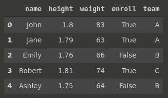
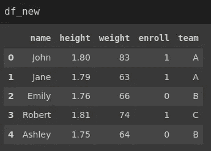
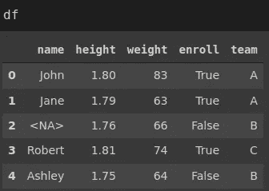
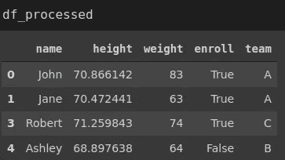
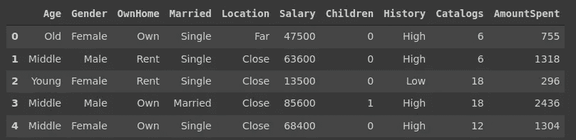
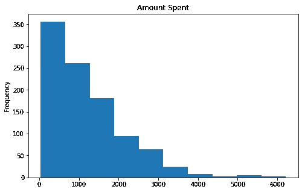

# 3 熊猫的功能会让你的生活更轻松

> 原文：<https://towardsdatascience.com/3-pandas-functions-that-will-make-your-life-easier-4d0ce57775a1?source=collection_archive---------5----------------------->

## 一个通过例子工作的实践指南


莎拉·多维勒在 [Unsplash](https://unsplash.com/s/photos/simple?utm_source=unsplash&utm_medium=referral&utm_content=creditCopyText) 上的照片

Pandas 是数据科学生态系统中流行的数据分析和操作。它提供了许多通用的函数和方法来执行有效的数据分析。

在本文中，我们将介绍 3 个 Pandas 函数，它们将加速和简化数据分析过程。

## 1.转换类型

对于有效的数据分析过程，对变量使用最合适的数据类型是至关重要的。

为了使用某些函数，必须有特定的数据类型。例如，我们不能对数据类型为 object 的变量进行任何数学运算。在某些情况下，字符串数据类型优于对象数据类型，以增强某些操作。

Pandas 提供了许多选项来处理数据类型转换。convert_dtypes 函数将列转换为可能的最佳数据类型。显然，单独转换每一列更为实用。

让我们创建一个包含 object 数据类型的列的示例 dataframe。

```
import numpy as np
import pandas as pdname = pd.Series(['John','Jane','Emily','Robert','Ashley'])
height = pd.Series([1.80, 1.79, 1.76, 1.81, 1.75], dtype='object')
weight = pd.Series([83, 63, 66, 74, 64], dtype='object')
enroll = pd.Series([True, True, False, True, False], dtype='object')
team = pd.Series(['A','A','B','C','B'])df = pd.DataFrame({
    'name':name,
    'height':height,
    'weight':weight,
    'enroll':enroll,
    'team':team
})
```



df(作者图片)

所有列的数据类型都是 object，这不是最佳选择。

```
df.dtypes
name      object
height    object
weight    object
enroll    object
team      object
dtype: object
```

我们可以使用 convert_dtypes 函数，如下所示:

```
df_new = df.convert_dtypes()df_new.dtypes
name       string
height    float64
weight      Int64
enroll    boolean
team       string
dtype: object
```

数据类型被转换成可能的最佳选项。convert_dtypes 函数的一个有用特性是，我们可以将布尔值转换为 1 和 0。更适合数据分析。

我们只需要将 convert_boolean 设置为 False。

```
df_new = df.convert_dtypes(convert_boolean=False)
```



(图片由作者提供)

## 2.管

管道功能允许以链状方式组合许多操作。它将函数作为输入。这些函数需要将一个数据帧作为输入并返回一个数据帧。

考虑以下数据帧:



(图片由作者提供)

我们想做三个操作作为数据预处理步骤。

*   将高度从米转换为英寸
*   删除至少有一个缺失值的行
*   如果合适，将字符串列更改为类别

**注意**:如果类别的数量与总数值相比非常少，最好使用类别数据类型，而不是对象或字符串。根据数据大小，它可以节省大量内存。

我们现在将为每个操作定义一个函数。

```
def m_to_inc(dataf, column_name):
   dataf[column_name] = dataf[column_name] / 0.0254
   return dataf def drop_missing(dataf):
   dataf.dropna(axis=0, how='any', inplace=True)
   return dataf def to_category(dataf):
   cols = dataf.select_dtypes(include='string').columns
   for col in cols:
      ratio = len(dataf[col].value_counts()) / len(dataf)
      if ratio < 0.05:
         dataf[col] = dataf[col].astype('category')
   return dataf
```

你可能会说，如果我们需要定义函数，这有什么意义。这看起来不像是简化工作流程。你对一个特定的任务是正确的，但我们需要更普遍地思考。考虑你正在多次做同样的操作。在这种情况下，创建一个管道会使这个过程变得更容易，并且提供更干净的代码。

下面是一个 pandas 管道，它结合了我们定义的三个操作:

```
df_processed = (df.
                 pipe(m_to_inc, 'height').
                 pipe(drop_missing).
                 pipe(to_category))
```



(图片由作者提供)

看起来整洁干净。我们可以根据需要添加任意多的步骤。唯一的标准是管道中的函数应该将数据帧作为参数并返回数据帧。

**注意**:需要提到的一点很重要，管道函数修改了原始数据帧。如果可能的话，我们应该避免改变原始数据集。为了克服这个问题，我们可以在管道中使用原始数据帧的副本。

## 3.情节

Pandas 不是一个数据可视化库，但是可以用 Pandas 创建许多基本的绘图类型。

用熊猫创建剧情的好处是，我们可以快速生成信息丰富的剧情。与数据可视化库相比，语法也相当简单。

考虑以下包含营销活动数据的数据帧。



营销数据框架(图片由作者提供)

我们可以很容易地创建一个直方图来查看“花费金额”列的分布。

```
marketing.AmountSpent.plot(kind='hist', title='Amount Spent', figsize=(8,5))
```



(图片由作者提供)

我们还可以创建一个散点图来直观显示薪水和花费金额列之间的关系。

```
marketing.plot(x='Salary', y='AmountSpent', kind='scatter',
               title='Salary vs Amount Spent',
               figsize = (8,5))
```


(图片由作者提供)

通过在 dataframe 或 pandas 系列上应用 plot 函数，我们可以很容易地生成许多其他图。事实上，Pandas 足以涵盖典型数据分析过程中所需的大部分数据可视化。

然而，如果你需要更高级或交互式的可视化，熊猫将不是最佳选择。

## 结论

我们已经讲述了熊猫的三个重要功能。所有这些都有助于在某种程度上简化数据分析和处理过程。

当然，Pandas 提供了更多的功能和操作，这使得它成为最常用的数据分析库之一。

感谢您的阅读。如果您有任何反馈，请告诉我。