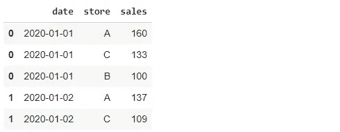
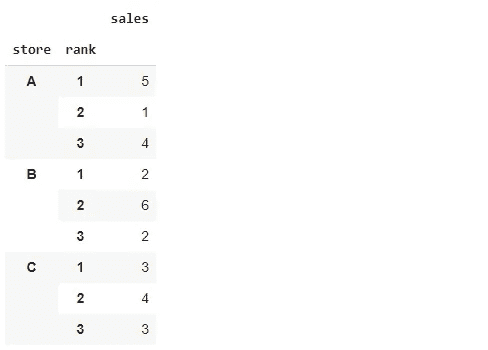
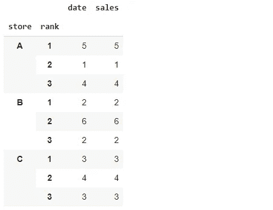
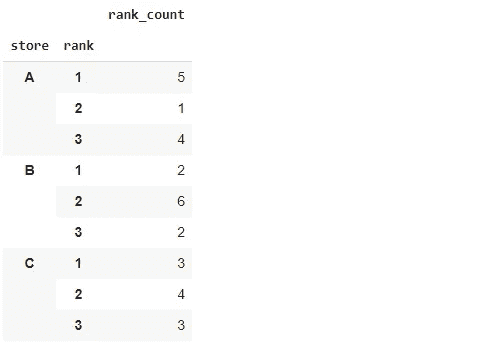
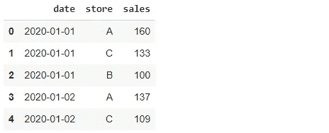
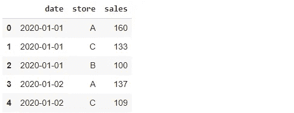

# 3 Python Pandas 高效数据分析技巧

> 原文：<https://towardsdatascience.com/3-python-pandas-tricks-for-efficient-data-analysis-6324d013ef39?source=collection_archive---------6----------------------->

## 举例说明。


照片由 [Unsplash](https://unsplash.com/s/photos/trick?utm_source=unsplash&utm_medium=referral&utm_content=creditCopyText) 上的[刻痕](https://unsplash.com/@jannerboy62?utm_source=unsplash&utm_medium=referral&utm_content=creditCopyText)拍摄

Pandas 是数据科学家高度赞赏的主要数据分析工具之一。它提供了许多灵活多样的功能来执行高效的数据分析。

在这篇文章中，我们将回顾三个熊猫的小技巧，我认为它们会让你成为一个更快乐的熊猫用户。最好用一些例子来解释这些技巧。因此，我们首先创建一个数据框。

数据框包含 3 个不同商店的日销售量。我们首先使用 pandas 的`date_range`功能创建一个 10 天的时间段。

```
import numpy as np
import pandas as pddays = pd.date_range("2020-01-01", periods=10, freq="D")
```

days 变量将被用作一列。我们还需要一个销售数量列，它可以由 numpy 的`randint`函数生成。然后，我们为每个商店创建一个包含 3 列的数据框。

```
A = pd.DataFrame({"date": days,
                  "store": "A",
                  "sales": np.random.randint(100, 200, size=10)})B = pd.DataFrame({"date": days,
                  "store": "B",
                  "sales": np.random.randint(100, 200, size=10)})C = pd.DataFrame({"date": days,
                  "store": "C",
                  "sales": np.random.randint(100, 200, size=10)})
```

我们现在用`concat`函数组合这 3 个数据帧。最好也根据日期对行进行排序，因为我们对日销售量感兴趣。

```
df = pd.concat([A, B, C]).sort_values(by="date")df.head()
```



(图片由作者提供)

## 1.等级函数

第一招是关于`rank`功能的。假设我们需要找到每天销售额最高的商店。该任务可以使用`groupby`和`max`功能完成。

如果我们需要根据每天的销售额对商店进行排序，该怎么办？请看上面的截图。对于日期 2020–01–01，A 是第一，C 是第二，B 是第三。

我们可以使用 rank 函数对每个日期应用这样的顺序。

```
df["rank"] = df.groupby("date)["sales"]\
               .rank(ascending=False).astype("int")df.head(6)
```


(图片由作者提供)

我们首先按日期将数据点(即行)分组，然后应用排名函数。将生成的等级分配给新列。默认情况下，rank 函数按升序对值进行排序，但可以使用 ascending 参数进行更改。

等级信息可用于在商店之间进行比较。我们来搞清楚各个店铺的排名分布。

```
df.groupby(["store","rank"]).count()[["sales"]]
```



(图片由作者提供)

商店 A 具有最高数量的第一等级。商店 B 通常是第二家商店，而 C 的排名是均匀分布的。

## 2.命名聚合

当我们在前面的示例中找到等级分布时，我们在完成聚合后选择了一个列。原因是计数聚合应用于分组中未使用的所有列。如果我们使用 mean 进行聚合，它将应用于分组中未使用的所有数字列。

下面是没有选择列时的结果。

```
df.groupby(["store","rank"]).count()
```



(图片由作者提供)

如果我们使用 mean 进行聚合，它将应用于分组中未使用的所有数字列。

这种方法的另一个缺点是聚合列名不能提供它所代表的信息。如果看不到代码，我们就无法真正判断 sales 列告诉我们什么。我们总是可以重命名列，但是有一个更实际的方法。

这两个问题的解决方案是使用带有`agg`函数的命名聚合。我们需要指定列名和聚合函数，如下所示:

```
df.groupby(["store","rank"]).agg(rank_count = ("rank", "count"))
```



(图片由作者提供)

我们只看到聚合的列名，因此不必在聚合后选择列。它还允许我们为聚合列指定任何名称。

## 3.忽略索引

回想一下第一张截图。


(图片由作者提供)

我们合并了 3 个数据帧，但是索引没有更新。它们代表每个单独数据框的索引。

索引是数据框的重要组成部分，因此需要准确。一种选择是在连接后重置索引。

```
df = pd.concat([A, B, C])\
       .sort_values(by="date").reset_index(drop=True)df.head()
```



(图片由作者提供)

我们现在有了一个更准确的指数。如果我们不将`reset_index`函数的`drop`参数设置为真，那么先前的索引将作为一列保存在数据框中。

这里的诀窍是`ignore_index`参数。它让我们不必使用`reset_index`功能。`concat`和`sort_values`功能都有这个参数。设置为 true 时，它会忽略单个数据帧的索引，并分配一个新的整数索引。

```
df = pd.concat([A, B, C]).sort_values(by="date", ignore_index=True)df.head()
```



(图片由作者提供)

这并不是很大的增益，但是我们用一个更少的函数获得了相同的结果。

## 结论

我们已经介绍了 3 个熊猫的小技巧，它们看起来很简单，但在某些情况下会派上用场。它们还简化了语法和操作。

Pandas 是一个很棒的库，具有易于理解和直观的语法。因此，通过一些练习，你可以很容易地学会基本操作。在基础知识之后，我建议专注于一些技巧和提高效率的详细技术。

感谢您的阅读。如果您有任何反馈，请告诉我。