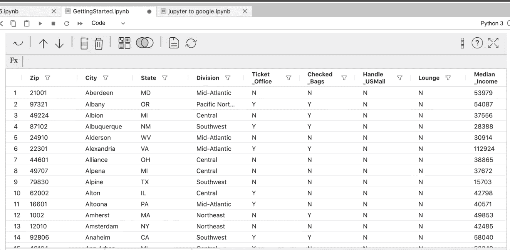
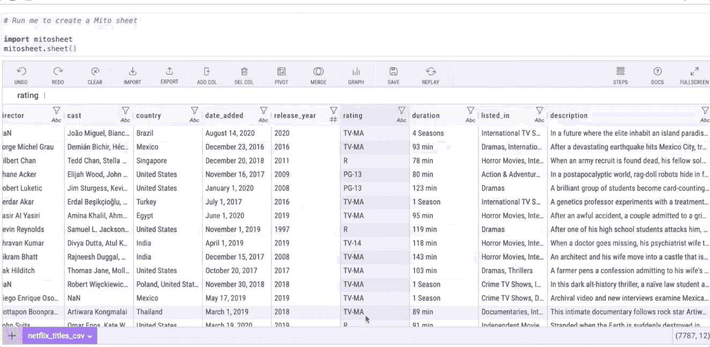

# 3 个 Python 项目将帮助您实现生活自动化

> 原文：<https://towardsdatascience.com/3-python-projects-that-will-help-automate-your-life-b6d48a4c1fa2?source=collection_archive---------0----------------------->

## 初级和高级项目，用 Python 自动化您的生活。


汉弗莱·穆莱巴在 [Unsplash](https://unsplash.com?utm_source=medium&utm_medium=referral) 上的照片

大多数工作都有一些对我们的职业没有什么价值的任务。做一次这样的任务没什么大不了的，但是当它们变得重复和耗时时，它们就必须自动化。

通过自动化任务，你将不再浪费时间做平凡的任务，而是专注于对你来说最重要的事情。最重要的是，你将把你所有的 Python 知识付诸实践，甚至学习新的东西。

在本指南中，我将向您展示 3 个 Python 项目，它们帮助我实现了一些日常工作任务的自动化，希望对您也有所帮助。

# 1.自动化 Excel 报告

想一想制作 Excel 报表需要做的所有事情——使用 Excel 公式、创建数据透视表、制作图表以及设置工作表格式。

做一次很容易，但是当你要做很多次时，事情就变得复杂了。幸运的是，Python 可以帮助您自动完成这些任务，所以下次您需要制作 Excel 报表时，只需点击几次鼠标。

## 如何解决这个项目

在 Python 中，我们可以使用 openpyxl 和 Pandas 来自动化您的 Excel 报告。[这是我用 Python](/a-simple-guide-to-automate-your-excel-reporting-with-python-9d35f143ef7) 制作的自动化 Excel 报表的指南。这两个都是很棒的 Python 库，但缺点是初学者可能需要一些时间来学习 openpyxl，并且它没有 Excel 以外的应用程序。

不过，有一种更简单的方法来自动化您的 Excel 报告。你只需要安装一个名为 [mitosheet](https://docs.trymito.io/getting-started/installing-mito) (又名米托)的 Python 库。这个库允许我们使用一个直观的类似 Excel 的界面来分组数据和计算汇总统计数据。最好的部分是米托为每个编辑生成代码，所以我们将能够看到对应于每个编辑的 Python 代码。

在下面的例子中，你可以看到我是如何使用 mitosheet 的接口来创建数据透视表的。做好数据透视表后，代码就自动生成了，是不是很棒？



创建数据透视表(作者图片)

要实现数据透视表和更多 Excel 任务的自动化，您需要安装 mitosheet 库。要安装它，首先，打开一个新的终端或命令提示符，然后使用以下命令下载米托安装程序:

```
python -m pip install mitoinstaller
```

然后，运行安装程序(该命令可能需要一些时间来运行)

```
python -m mitoinstaller install
```

就是这样！查看此[链接](https://docs.trymito.io/how-to/pivot-tables)了解如何使用 mitosheet 创建您的第一个数据透视表。

# 2.自动化数据可视化

大多数数据分析项目都以包含大量图表的演示结束。在我以前的工作中，我会更新我的 Excel 报告，然后手动制作可视化效果，如条形图、饼状图、箱线图等等。

这非常耗时，所以我在 Python 中寻找一种替代方法。我找到了几个可以帮助我自动绘制可视化图形的库。我只需要用 Python 阅读我更新的 Excel 报告，通过运行一个脚本，所有的可视化都将被创建。

## 如何解决这个项目

为了自动化数据可视化，首先，我们需要编写代码来创建我们想要的图形(最好是在 Jupiter 笔记本文件中)。然后写下输入数据(Excel 文件)应该是什么样子，这样可以确保列名、数据形状、数据类型和其他重要特性在下次更新时保持不变。

现在你可能想知道“我如何用 Python 制作可视化？”嗯，Python 提供了不同的选项来制作标准的以及交互式的可视化。[这是用 Matplotlib/Seaborn](/a-simple-guide-to-beautiful-visualizations-in-python-f564e6b9d392) 和[制作可视化效果的指南，这是另一个用 Pandas/Plotly](/the-easiest-way-to-make-beautiful-interactive-visualizations-with-pandas-cdf6d5e91757) 制作交互式可视化效果的指南。

也就是说，学习这样的库可能会花费你很多时间。在这方面，米托也可以提供帮助。[在生成相应的 Python 代码时，您可以使用米托通过几次点击](https://docs.trymito.io/how-to/graphing)来实现数据可视化。该代码可用于自动创建未来数据的数据可视化。

让我们来看看它是如何工作的。



使数据可视化(图片由作者提供)

在上面的 gif 中，我使用 mitosheet 库创建了一个网飞数据集的柱状图，只需点击几下鼠标。我只需要选择一列，点击图形按钮，然后*瞧*！图形被创建，代码被自动生成。

# 3.网络自动化

作为一名初级数据分析师，我不得不做的无聊任务之一是每天将文件上传到客户的网站上。步骤非常简单:进入网站“X”，点击这个按钮，从下拉列表中选择一个选项，然后点击上传。

这样做可能需要 2 分钟左右，但我不得不在一周内重复这些步骤数百次。这就是为什么我决定用 Selenium 来自动化这个任务。这是一个通过 Python 控制 Chrome 之类的 web 浏览器的工具。

## 如何解决这个项目

要用 Python 实现任何网站的自动化，首先要考虑在网站上完成一项任务通常要遵循的所有步骤。您的任务可能包括点击按钮、选择下拉列表中的元素、引入文本、上下滚动、登录页面等。

一旦枚举了所有任务，就使用 Selenium 复制 Python 中的所有步骤。下面是我在 YouTube 和[上为初学者准备的](https://medium.com/swlh/web-scraping-basics-scraping-a-betting-site-in-10-minutes-8e0529509848) [Python Selenium 教程。两者都将帮助你在 Selenium 中创建一个机器人，它将执行网站上的几乎任何任务，就像你自己在控制它一样。](https://youtu.be/UOsRrxMKJYk)

**奖励**:如果你达到了这一点，这意味着你进入了自动化，[这里是你可以用 Python](https://medium.com/geekculture/4-web-scraping-projects-that-will-help-automate-your-life-6c6d43aefeb5) 完成的另外 4 个自动化项目，[这里是你甚至不用写一行代码就可以完成的另外 4 个项目](https://medium.com/geekculture/4-web-scraping-projects-you-can-finish-in-a-weekend-1ee03b0b50d5)。

[](https://medium.datadriveninvestor.com/3-python-books-i-read-to-automate-some-boring-data-science-tasks-2a946601a827) [## 我阅读了 3 本 Python 书籍来自动化一些枯燥的数据科学任务

### 用于数据收集、数据争论等的 Python 自动化！

medium.datadriveninvestor.com](https://medium.datadriveninvestor.com/3-python-books-i-read-to-automate-some-boring-data-science-tasks-2a946601a827) 

[**与 3k 以上的人一起加入我的电子邮件列表，获取我在所有教程中使用的 Python for Data Science 备忘单(免费 PDF)**](https://frankandrade.ck.page/bd063ff2d3)

如果你喜欢阅读这样的故事，并想支持我成为一名作家，可以考虑报名成为一名媒体成员。每月 5 美元，让您可以无限制地访问数以千计的 Python 指南和数据科学文章。如果你用[我的链接](https://frank-andrade.medium.com/membership)注册，我会赚一小笔佣金，不需要你额外付费。

[](https://frank-andrade.medium.com/membership) [## 通过我的推荐链接加入媒体——弗兰克·安德拉德

### 作为一个媒体会员，你的会员费的一部分会给你阅读的作家，你可以完全接触到每一个故事…

frank-andrade.medium.com](https://frank-andrade.medium.com/membership)